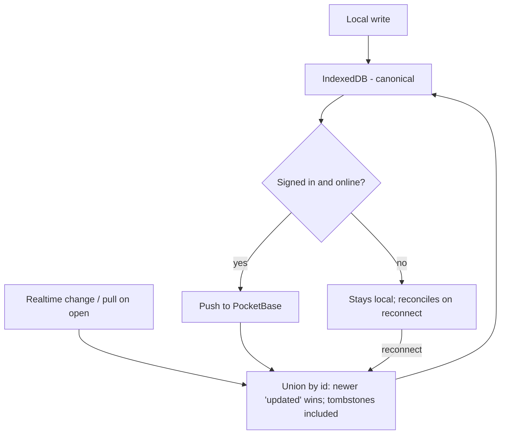

# Architecture

Tablemarks is a client-only React SPA with an optional PocketBase backend. Its defining choice is **local-first**: the browser's IndexedDB is the canonical store, and the cloud is a mirror you switch on by signing in.

## Layers

Code is organized so the local-first guarantees can't be accidentally broken:

```
UI / features (src/features/, src/App.tsx)
        │  reads & writes through
        ▼
Repository (src/data/)  ──►  IndexedDB
        │  emits change events
        ▼
Sync engine (src/sync/)  ◄──►  PocketBase (optional)
```

- **Feature/UI code** never touches IndexedDB directly and never imports the sync layer. It calls the repository and reacts to change events. This is why the app behaves identically with or without an account.
- **The repository** (`src/data/`) owns all local reads/writes and stamps the sync fields (`id`, `updated`, `deleted`).
- **The sync engine** (`src/sync/`) is the only code that talks to PocketBase.

## Local-first and accounts

There is no "local vs cloud" mode toggle. Everyone starts local with no account. Signing in with Google is framed as *back up + sync across devices* — its first action is a one-time **union reconcile** that merges existing local data with the account. Signing out stops syncing and leaves local data intact.

Because every write lands in IndexedDB first, the local store also serves as the **durable sync outbox**: an offline write survives a page reload and is flushed to the cloud on the next connection. There is no separate queue to lose.

## Sync and reconciliation

Multi-device changes reconcile per-record by **last-write-wins** on the `updated` timestamp, keyed by the stable record `id`:



Key properties:

- **Tombstones propagate.** Deletes set a `deleted` flag with a fresh `updated` rather than removing the row, so a delete wins by recency and a stale peer can't resurrect it.
- **Sign-in is a union, not a batch-create.** Because the client `id` is reused as the PocketBase record id, the same record merges across devices instead of duplicating.
- **The rollup is local-derived.** Each restaurant caches `latestVerdict` / `latestVisitDate` / `visitCount`, recomputed on each device from its own visits — it is never the sync source of truth, and pulled visits trigger a local recompute.

The reconcile logic (`src/sync/reconcile.ts`) is pure and heavily unit-tested; the live PocketBase round-trip is verified at runtime.

## Change events

`src/data/events.ts` exposes two channels so sync and the UI react correctly without looping:

- `emitLocalChange()` — fires on user-driven writes; the sync controller listens here to push.
- `emitStoreChange()` — fires on any write, including sync-pulled ones; the UI listens here to refresh.

Raw sync writes use store-change only, so a pulled record refreshes the UI without re-triggering a push.

## Offline

The data layer works offline by construction. Map tiles and an installable PWA shell are planned in a later layer (see `docs/plans/`); today the map needs a connection to load tiles, while all data remains usable offline.

## Scope built so far

The storage/sync core, Google auth, paste-a-URL capture (with geocoding fallback and short-link resolution), and the visit-log/verdict UI. Deferred to later layers: the decision mode, faceted cuisine filtering, export/import + PWA, and a visible sync-status indicator.
