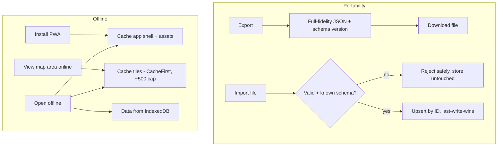

# Data Portability and Offline

## Summary

Two halves of data ownership. Export writes one full-fidelity JSON file — restaurants, their visits, facets, and sync IDs — that the user downloads as a backup; import reads it back, upserting by stable ID with last-write-wins so it merges non-destructively and a re-import is a no-op. Separately, the app is an installable PWA whose shell and data work offline, and OSM map tiles the user views are progressively cached so browsed areas render without a connection.

## Problem Frame

The prior-art lesson is sharp: Google Maps saved lists lock data in with no export, and that lock-in is exactly what stops people committing to a tool long enough to build a multi-year collection. For a personal app, knowing you can leave with everything — and that it works on a plane or a subway platform — is a precondition for trust, not a power-user nicety.

The data already lives locally (R2's IndexedDB store), so both halves are mostly about surfacing what's already true: make the local data exportable as a portable file, and make the already-offline-capable app installable with a map that degrades gracefully without a connection. The work is in getting the export schema durable and the offline boundaries honest, not in new infrastructure.

## Key Decisions

- **Export is full-fidelity JSON.** One file carries restaurants, their visit records, facets, and the R2 sync IDs — lossless and round-trippable. GeoJSON and other interop formats are out.
- **Import upserts by stable ID with last-write-wins.** Imported records merge into the store keyed by their stable ID; the newer version wins per record and unseen records are added. Nothing is deleted, and re-importing the same file changes nothing. Import is effectively another R2 reconcile source.
- **Export schema is versioned.** The file carries a schema version so future imports can keep reading older exports as the data model evolves. This is a deliberate compatibility contract.
- **Installable PWA with offline data.** `vite-plugin-pwa` makes the app installable; the app shell and all data (via R2) work with no connection. Asset caching is configured broadly so images and fonts are available offline, not just code.
- **Progressive tile caching, no prefetch.** Map tiles are cached as they are viewed (Workbox CacheFirst, ~500-tile cap with expiry), so areas the user has browsed render offline. There is no upfront neighborhood download; an unbrowsed area is blank offline.

## Requirements

**Export**

- R1. The user can export the entire collection as a single JSON file in one action.
- R2. The export is full-fidelity: restaurants, their visits, facets/cuisine, and the R2 sync identifiers, sufficient to reconstruct the collection.
- R3. The export file carries a schema version identifying its format.

**Import**

- R4. The user can import a previously exported JSON file.
- R5. Import upserts by stable record ID with last-write-wins: newer records win, unseen records are added, nothing is deleted.
- R6. Re-importing the same unchanged file results in no changes.
- R7. Import validates the file and its schema version, handling a malformed or unrecognized file without corrupting the store.

**PWA and offline**

- R8. The app is installable as a PWA and launches standalone.
- R9. The app shell, assets (including images and fonts), and all stored data are usable with no network connection.
- R10. Map tiles viewed while online are cached and re-served offline, up to a bounded cache size; unviewed areas render blank offline rather than failing.
- R11. App updates are picked up automatically, with the user told when a newer version is ready to load.

## Key Flow

## Acceptance Examples

- AE1. **Covers R1, R2, R3.** **Given** a collection with restaurants and visits, **when** the user exports, **then** a single versioned JSON file downloads that contains every restaurant, its visits, and its facets.
- AE2. **Covers R5, R6.** **Given** an export file, **when** it is imported into the same store it came from, **then** nothing changes; **when** imported into a store missing some of those records, **then** the missing records are added and existing ones reconcile by last-write-wins.
- AE3. **Covers R7.** **Given** a truncated or non-Tablemarks JSON file, **when** the user imports it, **then** the app reports the problem and leaves the store unchanged.
- AE4. **Covers R9, R10.** **Given** the installed PWA and a previously browsed map area, **when** the device is offline, **then** the user can view, add, and edit places and the browsed area's tiles render.
- AE5. **Covers R10.** **Given** an area never viewed online, **when** the user pans to it offline, **then** tiles render blank while the rest of the app stays functional.

## Scope Boundaries

**Deferred for later**

- GeoJSON or other interop export formats.
- A replace-all ("restore exactly this snapshot") import mode.
- One-time neighborhood tile prefetch on install.
- Encryption of the export file.
- Automated or scheduled backups.

**Outside this product's identity**

- Acting as a sync transport between users via exported files. Export is for personal backup and portability; cross-user sharing is not a goal.

## Dependencies / Assumptions

- R2 supplies the IndexedDB store, stable IDs, and the upsert/last-write-wins path that import reuses rather than reimplementing.
- R3's visit records and R5's facets are part of what a full-fidelity export must include.
- `vite-plugin-pwa` and Workbox are available on the Vite 7 stack; OSM tile URLs follow a cacheable `{z}/{x}/{y}` pattern, and OSM's tile usage policy is respected by the progressive (not bulk) caching approach.

## Outstanding Questions

**Deferred to planning**

- The concrete JSON schema and how schema-version migrations are applied on import of an older file.
- Tile cache cap and expiry values, and how cache size is surfaced or capped against device storage limits.
- Service-worker update UX — silent auto-reload vs an explicit "update available" prompt.
