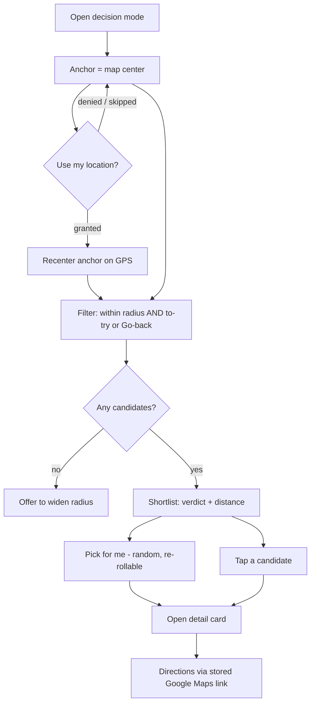

# Where Do I Eat Tonight — Decision Mode

## Summary

A dedicated mode turns the saved collection into a decision. It filters places near a point on the map — unvisited to-try places and visited favorites with a "Go back" verdict — and presents them as a short browsable list showing verdict and distance, with a one-tap "pick for me" that chooses randomly. "Near" is anchored to the map center, movable and recenterable on the user's GPS position, so the mode works with no location permission and for any area the user is heading to.

## Problem Frame

A saved-restaurant collection has an unspoken job: eventually, you decide where to go. The catalog apps this draws from — pins on a map, named lists — are good at storing and bad at deciding. Standing on a sidewalk at 7pm, a map of eighty pins is a worse tool than three nearby candidates you already vetted.

The to-try list especially rots without a decision step: places go in and never come out. A mode that filters to what's nearby and worth eating — and offers to just pick one — closes that loop. It also shifts the product's success signal from "saved a place" to "picked a place," which is the behavior that makes the app worth opening on a Friday night.

## Key Decisions

- **Candidate pool is to-try plus go-back favorites.** The mode includes unvisited places and visited places whose rolled-up verdict is "Go back" — so it answers both "try something new" and "return to a known-good spot." Lower verdicts and already-decided places are excluded by default.
- **Shortlist with a random pick.** The mode shows filtered candidates as a short browsable list (verdict + distance) and offers a one-tap "pick for me" that chooses one at random, re-rollable. Compare when you want; decide instantly when you don't.
- **Anchored to the map center, not GPS.** "Near" is measured from wherever the map is centered; a locate control recenters on the user's GPS position. The mode never depends on a location-permission grant and can be aimed at a destination area.
- **Proximity and verdict/status filtering are native; cuisine is borrowed.** The mode filters by radius and by verdict/status on its own. Cuisine filtering depends on R5's facet system and is absent until that exists.

## Requirements

**Candidate selection**

- R1. The mode's default candidate pool is places that are either to-try (zero visits) or visited with a rolled-up "Go back" verdict.
- R2. Candidates are restricted to those within a selected radius of the anchor point.
- R3. The user can choose among radius presets (a near / medium / wide set, e.g. 0.5 / 1 / 5 km).
- R4. When no candidates match, the mode says so and offers to widen the radius.

**Anchor and location**

- R5. Proximity is measured from the current map center, which the user can pan to any area.
- R6. A locate control recenters the anchor on the user's GPS position when permission is granted.
- R7. The mode is fully usable with no location permission; denial degrades to map-center anchoring, not a dead end.

**Presentation and decision**

- R8. Candidates render as a short list, each showing its rolled-up verdict and distance from the anchor, ordered by distance.
- R9. A one-tap "pick for me" selects one candidate at random from the current filtered set and can be re-rolled.
- R10. Selecting a candidate (picked or tapped) opens its detail card; getting directions hands off to the place's stored Google Maps link rather than routing in-app.

**Filtering**

- R11. The mode filters natively by radius and by verdict/status.
- R12. Cuisine filtering is applied only when R5's facet system is present; until then the mode operates on proximity and verdict/status alone.

## Key Flow

## Acceptance Examples

- AE1. **Covers R1, R2, R8.** **Given** a collection with nearby to-try places, a nearby "Go back" favorite, and a nearby "Once was enough" place, **when** the mode opens, **then** the shortlist contains the to-try places and the favorite but not the "Once was enough" place, each with verdict and distance.
- AE2. **Covers R5, R7.** **Given** a user who has denied location permission, **when** they open the mode, **then** it filters around the current map center and remains fully usable.
- AE3. **Covers R6.** **Given** location permission granted, **when** the user taps locate, **then** the anchor recenters on their GPS position and the shortlist re-filters.
- AE4. **Covers R4.** **Given** no candidates within the selected radius, **when** the mode filters, **then** it reports none found and offers to widen the radius.
- AE5. **Covers R9.** **Given** a shortlist of several candidates, **when** the user taps "pick for me", **then** one is chosen at random and can be re-rolled to a different one.

## Scope Boundaries

**Deferred for later**

- "Open now" / opening-hours filtering — no hours data exists on the free stack.
- In-app routing or navigation beyond opening a place's stored Google Maps link.
- A spin-the-wheel-only or swipe-deck interaction — the shortlist-plus-pick mechanic was chosen instead.
- Group or shared deciding across people — this is a single-user mode.

**Outside this product's identity**

- Recommending places the user has not saved. The mode decides among the user's own vetted collection, not a discovery engine over external listings.

## Dependencies / Assumptions

- R3 supplies derived status (to-try vs visited) and the rolled-up "Go back" verdict the pool depends on.
- R1/R2 supply each place's coordinates and stored Google Maps link.
- R5 (faceting) supplies cuisine filtering; until R5 exists, cuisine filtering is simply absent here (R12).
- The browser Geolocation API and Leaflet's locate capability are available and free; no paid maps quota is used.

## Outstanding Questions

**Deferred to planning**

- Exact radius presets and the default selection, including whether they adapt to candidate density.
- Whether "pick for me" weights the random choice (e.g. favoring to-try over already-loved favorites) or is uniform.
- How the mode surfaces as navigation — a distinct screen, a map overlay, or a filter state on the main map.
