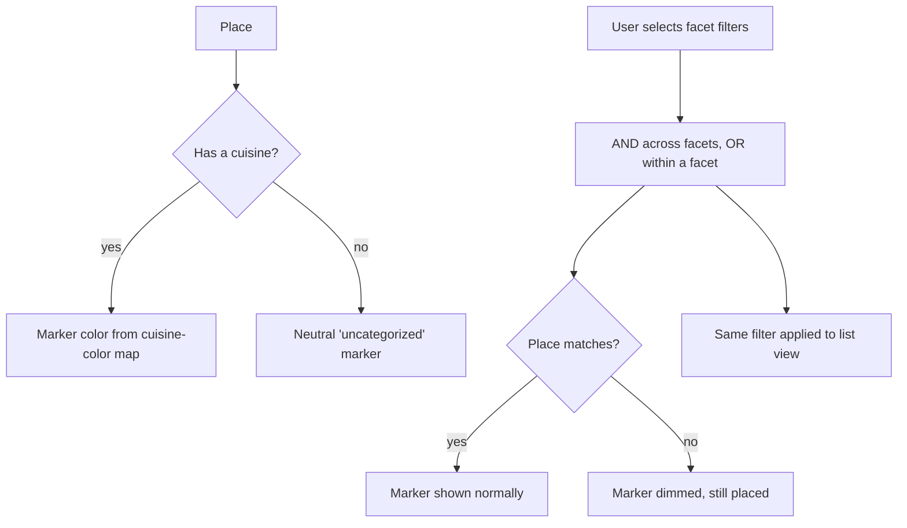

# Faceted Classification and Filtering

## Summary

Each place carries a single cuisine drawn from a curated list the user can extend with their own, plus the status and verdict that R3 already derives. The map and list filter by any combination of cuisine, status, and verdict. One color source drives both a place's marker and its cuisine filter chip, and when a filter is active, non-matching markers dim rather than disappear so spatial context is preserved.

## Problem Frame

A single fixed "category" forces false choices and rots as a collection grows — but the opposite extreme, free-form tags, produces inconsistent colors and near-duplicate labels that undermine an at-a-glance map. A personal tool also can't carry many speculative dimensions without them sitting empty and adding filter noise.

The useful middle is a small set of facets that earn their place: cuisine (the thing you actually filter on), and the status and verdict the visit log already produces for free. Keeping cuisine a curated-but-extensible vocabulary keeps marker colors and filter chips coherent, while filtering by combinations is what keeps a growing collection queryable instead of a flat pile of pins.

## Key Decisions

- **Cuisine is curated-plus-custom.** A predefined cuisine list ships with assigned colors; the user can add custom cuisines, which receive a color automatically. This keeps the color contract coherent while never blocking an unlisted cuisine.
- **One cuisine per place.** A place has at most one cuisine, which gives it exactly one marker color. Fusion places pick their dominant cuisine. Multiple cuisines per place are out.
- **v1 facets are cuisine, status, and verdict.** Status (to-try / visited) and verdict come from R3 at no extra modeling cost. No other facets ship in v1.
- **Color is a single source of truth.** One cuisine-to-color mapping drives both the map marker and the cuisine filter chip, so the two never drift as cuisines are added.
- **Active filters dim, not hide.** When a filter is applied, non-matching markers fade rather than vanish, preserving the spatial picture. Filtering is consistent across the map and any list view.
- **Cuisine is optional.** A place may have no cuisine; it filters and renders as a neutral "uncategorized" rather than being forced to pick one at capture time.

## Requirements

**Cuisine vocabulary**

- R1. A curated set of cuisines ships with the app, each with an assigned color.
- R2. A user can add a custom cuisine, which is automatically assigned a color from the palette.
- R3. A place has at most one cuisine and may have none; an uncategorized place renders and filters under a neutral "uncategorized" treatment.

**Facets and filtering**

- R4. The collection can be filtered by cuisine, by status (to-try / visited), and by verdict.
- R5. Filters across different facets combine as AND (e.g. Indian and to-try); multiple selections within one facet combine as OR (e.g. Indian or Thai).
- R6. The same filter state applies consistently to both the map and any list view.
- R7. Active filters are shown as clearable chips, and clearing returns to the full set.

**Color and markers**

- R8. A single cuisine-to-color mapping is the source for both a place's marker color and its cuisine filter chip.
- R9. When a filter is active, places that do not match dim rather than disappear from the map.

## Key Flow

## Acceptance Examples

- AE1. **Covers R1, R8.** **Given** the curated cuisine list, **when** places are shown on the map, **then** each cuisine's marker and its filter chip use the same color.
- AE2. **Covers R2.** **Given** a cuisine not on the list, **when** the user adds it as a custom cuisine, **then** it gains a color and behaves like any curated cuisine.
- AE3. **Covers R4, R5.** **Given** a filter of cuisine = Indian or Thai AND status = to-try, **when** applied, **then** only to-try Indian and Thai places match.
- AE4. **Covers R9.** **Given** an active cuisine filter, **when** the map renders, **then** non-matching places remain visible but dimmed.
- AE5. **Covers R3.** **Given** a place saved with no cuisine, **when** the map and filters render, **then** it appears under the neutral "uncategorized" treatment and is not forced to adopt a cuisine.

## Scope Boundaries

**Deferred for later**

- A free-form tag facet for arbitrary labels (outdoor, cheap, etc.).
- A fixed "occasion" facet (date-night / quick-lunch / group) — the speculative dimension; revisit if real usage wants it.
- Multiple cuisines per place.
- Saved filter presets or smart lists.
- User recoloring of cuisines beyond the automatic assignment.

**Outside this product's identity**

- A price or rating-source dimension imported from external listings — facets describe the user's own classification, not third-party metadata.

## Dependencies / Assumptions

- R3 supplies derived status and verdict, which are exposed here as filterable facets at no extra modeling cost.
- R1 left the category field optional at capture; this brief defines that field as the single optional cuisine and supplies the uncategorized fallback.
- R4's decision mode consumes this cuisine filter once it exists (R4 R12); shipping R5 closes that dependency with no further work in R4.
- Leaflet `DivIcon` markers can be colored per cuisine; the specific marker styling is a planning/design detail.

## Outstanding Questions

**Deferred to planning**

- The initial curated cuisine list and its color palette, and how colors are assigned to custom cuisines without collisions.
- Whether the "uncategorized" treatment is a reserved palette slot or a distinct visual style.
- Where filter controls live (a chip bar, a sidebar, a sheet) and how they behave on small screens.
