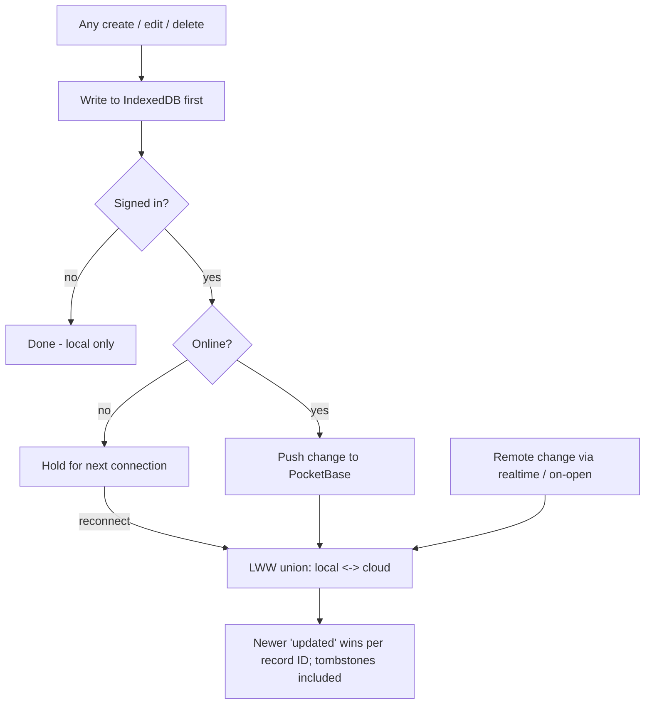

# Local-First Canonical Architecture

## Summary

Each device's IndexedDB store is the canonical copy of a user's restaurants — always written first and fully usable with no account. PocketBase is a shared mirror that a user turns on by signing in; sign-in backs up and syncs across devices, sign-out reverts to local-only with data intact. Changes from multiple devices reconcile per-record by last-write-wins on an `updated` timestamp.

## Problem Frame

Tablemarks has two hard requirements that usually pull apart: work with no account at all, and sync across devices for signed-in users. Building these as two modes — a local mode and a cloud mode the user picks between — doubles the code paths and forces an onboarding decision before the user has any data to care about. It also creates a scary one-way door at the "switch to cloud" moment.

Treating local storage as canonical and the cloud as an optional mirror collapses the two requirements into one path: there is only ever local data, and sync is a capability layered on top. The cost moves from "maintain two modes" to "get one reconciliation rule right" — which is the real work this architecture has to nail, because every feature reads and writes through this layer.

## Key Decisions

- **IndexedDB is the canonical local store.** Every write lands in IndexedDB first; the app is fully functional against it with no account and no network. Chosen over localStorage from the start to retire the ~5 MB ceiling on the layer all features depend on.
- **No mode toggle.** The user never picks "local" vs "cloud." Everyone starts local with no account; signing in is framed as "back up and sync across devices," and signing out reverts to local-only.
- **PocketBase is a mirror, not the master.** When signed in, the cloud is a shared sync point between a user's devices — not the source of truth. The device's local store stays canonical.
- **Per-record last-write-wins.** Records reconcile individually by an `updated` timestamp; the newer version wins, both directions. Chosen over field-level merge for near-zero single-user conflict and far lower complexity.
- **Stable client-generated IDs.** Each record's ID is generated locally at creation and reused as its PocketBase record ID, so reconciliation merges rather than duplicates. Sign-in is therefore a reconcile (LWW union of local and cloud), not a blind batch-create.
- **Soft-delete tombstones.** Deletion sets a `deleted` flag with an `updated` timestamp rather than removing the row, so a delete wins by recency and does not resurrect on the next union sync. Every record carries the `deleted` field.
- **Sign-out preserves local data.** Signing out stops syncing and leaves the device's store intact, returning the user to no-account local mode. The cloud copy remains for other devices.

## Requirements

**Local canonical store**

- R1. All reads and writes go to a per-device IndexedDB store; the app is fully functional against it with no account and no network.
- R2. Every record carries a stable ID generated locally at creation, an `updated` timestamp set on every change, and a `deleted` flag.
- R3. Deleting a record sets its `deleted` flag and updates its timestamp rather than removing it from the store.

**Account and mode**

- R4. A user can use the app fully without ever creating an account; no mode selection is presented.
- R5. Signing in (Google SSO) enables backup and cross-device sync without changing how local reads and writes behave.
- R6. Signing out stops syncing and leaves the device's local store intact, returning the user to local-only mode.

**Sync and reconciliation**

- R7. When signed in and online, local changes are pushed to PocketBase and remote changes are pulled into the local store.
- R8. Records reconcile per-record by last-write-wins on the `updated` timestamp, in both directions, keyed by the stable record ID.
- R9. A tombstoned (`deleted`) record wins by recency like any other change and is not resurrected by a peer's older copy during sync.
- R10. First sign-in reconciles the device's existing local records with any data already in the account by the same LWW union — never creating duplicates of records that already exist in the cloud.
- R11. Sync never blocks local use; when offline, local writes proceed and reconcile on the next connection.

## Key Flow

## Acceptance Examples

- AE1. **Covers R1, R4, R11.** **Given** a user with no account and no network, **when** they add and edit restaurants, **then** everything is saved and readable from the local store with no degradation.
- AE2. **Covers R7, R8.** **Given** the same account signed in on two devices, **when** device A edits a record's rating and device B is offline, **then** on B's reconnect the newer of the two versions wins per the `updated` timestamp on both devices.
- AE3. **Covers R3, R9.** **Given** a record deleted on device A while device B still holds an older copy, **when** the two reconcile, **then** the deletion wins by recency and the record does not reappear.
- AE4. **Covers R5, R10.** **Given** a user with local-only data who signs in to an account that already holds records, **when** the first sync runs, **then** local and cloud merge by LWW with no duplicated records.
- AE5. **Covers R6.** **Given** a signed-in user with synced data, **when** they sign out, **then** the device retains all of its data in local-only mode and the cloud copy is untouched.

## Scope Boundaries

**Deferred for later**

- Sync-state UX — the unsynced badge, offline write queue, and conflict surfacing — belongs to R7 (Sync trust layer). R2 defines the reconciliation rule; R7 makes its state legible.
- Photo and attachment storage. IndexedDB keeps this possible later without re-architecting the store.
- At-rest encryption of the local store.

**Outside this product's identity**

- A custom backend or sync engine beyond PocketBase. The point of this layer is to lean on PocketBase as a thin mirror, not to build sync infrastructure.

## Dependencies / Assumptions

- PocketBase v0.39 with Google OAuth2 configured; the `users` collection backs sign-in.
- A restaurants collection in PocketBase whose schema includes the stable ID, `updated`, and `deleted` fields so the cloud mirror can carry the same reconciliation keys as the local store.
- A thin IndexedDB access layer (e.g. an `idb`-style wrapper) rather than raw IndexedDB calls; the specific library is a planning choice.
- Single-user-per-account model — the LWW conflict rate is assumed near-zero, which is why per-record (not field-level) reconciliation is sufficient.

## Outstanding Questions

**Deferred to planning**

- Pull mechanism when online: PocketBase realtime `subscribe` vs a pull on app-open vs both, and how the initial full reconcile is paginated for large accounts.
- Clock-skew handling for the `updated` timestamp across devices — whether to trust device clocks or stamp on the server during push.
- Whether tombstones are ever garbage-collected, and after what retention.
