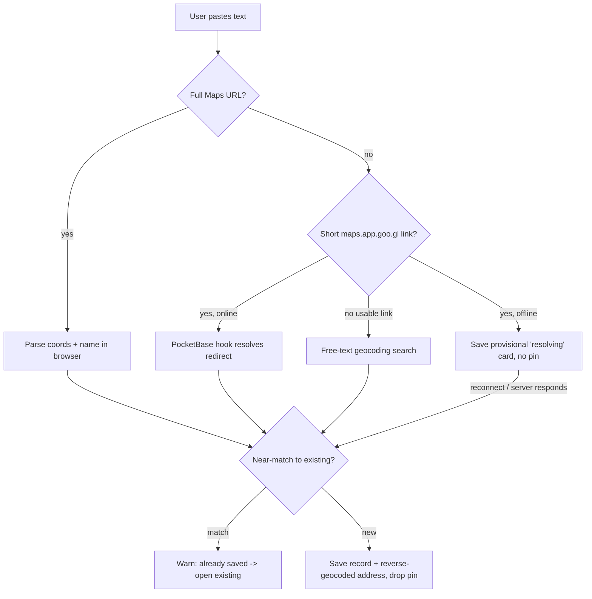

# Paste-a-URL Capture

## Summary

Adding a restaurant to Tablemarks starts from a pasted Google Maps link: coordinates and the place name come from the link itself, and a record is saved in seconds. When there is no usable link, capture falls back to a free-text name/address search. Records save sparse — category, rating, and visit date are optional and added later or never.

## Problem Frame

The dominant moment a person wants to save a restaurant is right after seeing it on Google Maps — on a phone, mid-conversation, about to lose the thought. A multi-field form at that moment is where the save dies: the friction outlasts the intent. The capture path has to collapse "I want to remember this place" into a single paste that produces a pin, or the collection never grows enough to be worth opening. Everything else about a record can wait; getting the place in cannot.

## Key Decisions

- **Paste-first, search-fallback.** A pasted Maps link is the primary path; a free-text geocoding search is the fallback when no link is available or parseable. There is no manual map-tap pin-drop.
- **Short links resolve server-side.** Full Maps URLs are parsed in the browser; `maps.app.goo.gl` short links are resolved by a PocketBase server hook, because the browser cannot follow the cross-origin redirect.
- **Provisional card over optimistic pin.** A link awaiting resolution saves as a "resolving" entry with no pin, rather than dropping a pin at a guessed location. This is honest about an unknown position and keeps capture working offline.
- **Sparse records.** Only a location (resolved or pending) is required to save. Category, rating, and visit date are optional.
- **Near-match de-duplication.** Before creating a record, a resolved location is checked against existing ones; a match warns and offers the existing record instead of creating a second pin.
- **Reverse-geocoded address.** A resolved record stores a human-readable address derived from its coordinates, reusing the geocoding dependency the fallback already requires.

## Requirements

**Paste capture**

- R1. Pasting a full Google Maps URL extracts coordinates and the place name with no network call.
- R2. Pasting a `maps.app.goo.gl` short link triggers server-side resolution that returns coordinates, and the place name when available.
- R3. A successful paste saves a record immediately; the map pin appears as soon as coordinates are known.

**Fallback capture**

- R4. When a paste yields no usable coordinates — non-Maps text, a coordinate-less link, or a short link while offline — the user can capture via a free-text name/address search backed by a free geocoding service.
- R5. The search presents candidate places the user picks from to set the location.

**Pending and offline resolution**

- R6. A short link awaiting resolution saves as a provisional "resolving" entry holding the raw link and any known name, with no map pin.
- R7. A provisional entry resolves automatically when the server responds or connectivity returns, gaining its pin and address without further user action.
- R8. Capture is never blocked by being offline.

**Duplicate handling**

- R9. Before a record is created, its resolved location is checked against existing records by matching the same Maps link or coordinates within a near-match radius (~50 m starting point).
- R10. On a near-match, the user is told the place is already saved and offered to open the existing record instead of creating a duplicate.

**Record shape**

- R11. A record requires only a location (resolved or pending); category, rating, and visit date are optional and addable later.
- R12. A resolved record stores a human-readable address reverse-geocoded from its coordinates.
- R13. Capture behaves identically in local-only and signed-in modes, writes to local storage, and never depends on a paid maps API.

## Key Flow

## Acceptance Examples

- AE1. **Covers R1, R3.** **Given** a full Google Maps URL with `@lat,lng`, **when** the user pastes it, **then** a record is saved and a pin appears with no network round-trip.
- AE2. **Covers R2, R6, R7.** **Given** a `maps.app.goo.gl` link and an online connection, **when** the user pastes it, **then** a provisional "resolving" entry appears immediately and gains its pin once the server resolves the redirect.
- AE3. **Covers R6, R7, R8.** **Given** a short link pasted while offline, **when** the user saves, **then** the provisional entry persists with no pin and resolves automatically on reconnect.
- AE4. **Covers R4, R5.** **Given** pasted text that is not a usable Maps link, **when** capture runs, **then** the user is offered a name/address search and picks a candidate to set the location.
- AE5. **Covers R9, R10.** **Given** a paste that resolves to a place already saved (same link or within ~50 m), **when** the location is checked, **then** the user is told it exists and offered the existing record instead of a duplicate.

## Scope Boundaries

**Deferred for later**

- Photos and free-text notes on a record.
- Auto-categorizing a place from its name.
- Bulk import of many places at once (belongs with export/import).
- The categorization taxonomy and the "where do I eat" decision flow (separate ideas).

**Outside this product's identity**

- Pulling ratings, photos, or opening hours from a paid Google Places API. The free-stack, no-quota constraint rules this out; enrichment stays user-entered.

## Dependencies / Assumptions

- A free geocoding service (Photon or Nominatim) backs both the search fallback and reverse-geocoding; its per-second rate limit is respected via debounced input and request throttling.
- The short-link resolver is a PocketBase server route exposed publicly (callable without an account), so short-link capture works in local-only mode whenever the device is online.
- Google Maps URL formats stay parseable. A format change degrades gracefully to the search fallback rather than failing the capture.

## Outstanding Questions

**Deferred to planning**

- Final near-match radius and whether it varies by urban vs rural density (~50 m is the starting value).
- Geocoding provider choice (Photon vs Nominatim vs Geoapify) and the concrete rate-limit / fallback strategy.
- Whether unresolved provisional entries get a retry cap or expiry, and how a permanently-unresolvable link is surfaced.
