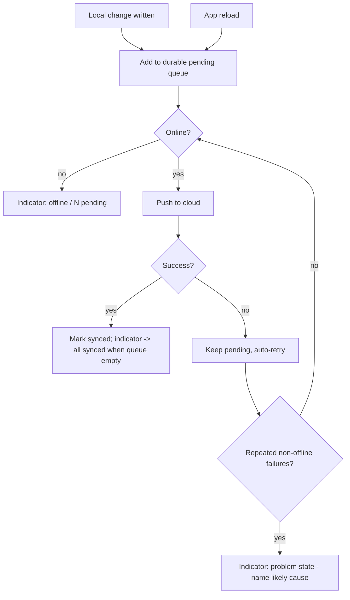

# Sync Trust Layer

## Summary

A single global indicator tells the user whether their data is backed up — all synced, N pending, or offline — backed by an offline write queue that holds changes when there is no connection and auto-flushes on reconnect, surviving app reloads. Last-write-wins discards stay silent. Pushes that keep failing for a non-offline reason escalate the indicator to a clear problem state so a stuck account never hides behind normal "pending."

## Problem Frame

R2 makes sync work; this makes it trustworthy. Sync that happens invisibly has a failure mode worse than no sync: a place saved on a phone with spotty signal looks saved, the user switches to a laptop, and it isn't there. One experience like that and the user stops trusting the cloud and retreats to local-only, defeating the whole feature.

The fix is legibility, not more machinery. A single honest answer to "is everything backed up?" plus a queue that never silently loses an offline write covers the real anxiety. Conflicts are a different story — for a single user across their own devices they are near-zero, so surfacing them is deferred rather than built speculatively. The discipline here is to add exactly enough visibility to earn trust and no more.

## Key Decisions

- **One global sync indicator.** A single app-level status shows all synced / N pending / offline. No per-record sync markers — the question users actually have is "is all my stuff backed up?", answered once.
- **Offline write queue with auto-flush.** Changes made offline queue locally and flush automatically when connectivity returns; the user never triggers sync manually for the normal case.
- **Durable queue.** The pending queue persists across app reloads and restarts, so a refresh while offline never drops unsynced writes.
- **Conflicts stay silent in v1.** Last-write-wins discards (R2's reconciliation) are not surfaced. Single-user multi-device conflicts are near-zero; the undo-able conflict ribbon is deferred until conflicts prove real.
- **Auto-retry with escalation.** A failed push stays pending and retries automatically; after repeated failures for a non-offline reason (server unreachable, expired auth), the indicator escalates to a clear problem state rather than appearing as normal pending forever.

## Requirements

**Status indicator**

- R1. A single global indicator shows one of: all synced, N pending, or offline.
- R2. The indicator reflects the count of records not yet pushed to the cloud, derived from R2's per-record synced state.
- R3. There are no per-record sync indicators.

**Offline queue**

- R4. Changes made while offline are queued locally and the app remains fully usable.
- R5. The queue flushes automatically when connectivity returns, with no manual action required.
- R6. The queue persists across app reloads and restarts; pending writes are never lost to a refresh.

**Failures and conflicts**

- R7. A push that fails stays pending and is retried automatically.
- R8. After repeated push failures for a non-offline reason, the indicator escalates to a distinct problem state that names the likely cause (e.g. cannot reach the server, sign-in needed).
- R9. Last-write-wins discards are not surfaced to the user in this version.

## Key Flow

## Acceptance Examples

- AE1. **Covers R1, R5.** **Given** pending changes and a restored connection, **when** the queue flushes, **then** the indicator moves from "N pending" to "all synced".
- AE2. **Covers R4, R6.** **Given** changes made offline, **when** the app is reloaded while still offline, **then** the pending changes are still queued and the indicator still shows them pending.
- AE3. **Covers R1.** **Given** a signed-in user offline, **when** they view the indicator, **then** it reads "offline" and reflects the pending count.
- AE4. **Covers R7, R8.** **Given** a push that fails repeatedly because auth has expired, **when** retries keep failing, **then** the indicator escalates to a problem state telling the user to sign in again, rather than showing normal "pending".
- AE5. **Covers R9.** **Given** the same record edited on two devices, **when** last-write-wins keeps the newer edit, **then** the discard happens with no conflict prompt to the user.

## Scope Boundaries

**Deferred for later**

- An undo-able conflict ribbon surfacing last-write-wins discards.
- Per-record sync status indicators.
- A manual "sync now" control and per-record retry actions.
- A sync history or activity log.

**Outside this product's identity**

- Real-time presence or multi-user co-editing indicators. This layer reports a single user's backup state, not collaboration.

## Dependencies / Assumptions

- R2 owns reconciliation (per-record last-write-wins) and the per-record synced state; R7 only reads and surfaces it, and never changes how conflicts are resolved.
- The durable queue rides on R2's IndexedDB store so pending state shares the same persistence as the data itself.
- For a single-user-per-account model the conflict rate is low enough that deferring conflict surfacing is safe; this assumption is revisited if real usage shows otherwise.

## Outstanding Questions

**Deferred to planning**

- The failure count / time window that triggers escalation, and the exact problem-state messages per cause.
- Whether tapping the indicator forces an immediate retry or opens a small detail view.
- Retry backoff strategy for the auto-retry loop.
