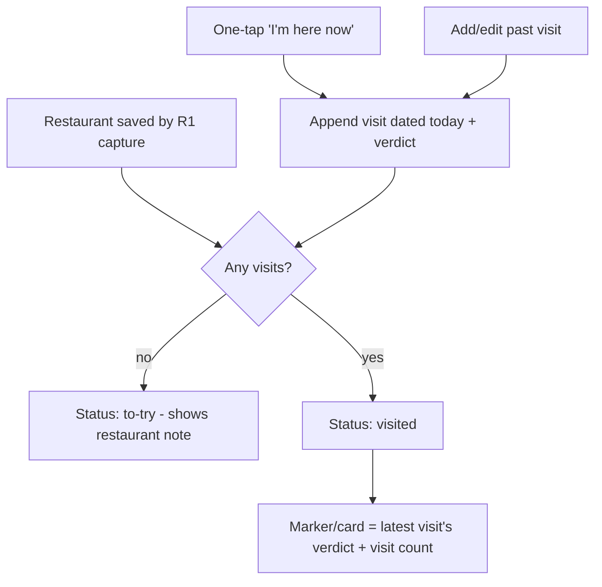

# Visit Log and Returnability Verdict

## Summary

A restaurant is a parent record; each visit is a separate linked record carrying a date, a returnability verdict, and an optional note. Whether a place is "to-try" or "visited" is derived from how many visits it has, not a stored flag. The card and map marker show the latest visit's verdict and a visit count, and a one-tap "I'm here now" appends a today-dated visit. The rating is the four-level verdict only — no number.

## Problem Frame

A flat record with a single `visit_date` and a 1–5 star throws away the two things that actually accumulate value in a personal restaurant tracker: the history of when you went, and how your opinion moved. "Great in 2024, then they changed the chef" has nowhere to live; the second visit overwrites the first, and a star number forces a fussy decision that gets skipped or regretted.

Modeling each visit as its own record turns the collection into a dining memory rather than a list, and replacing the number with a returnability verdict answers the only question the rating is ever used for — would I go back? The cost is more schema and a rollup rule for which verdict represents a multi-visit place; that is the work this brief settles.

## Key Decisions

- **Visit is a first-class record.** A restaurant has zero or more visits, each a separate record linked to it, with its own stable ID, `updated`, and `deleted` fields. This lets each visit reconcile independently under R2's per-record last-write-wins, so concurrent visits on two devices both survive.
- **Status is derived, not stored.** "To-try" means zero visits; "visited" means one or more. No status flag is stored on the restaurant — it is computed from the visit count.
- **Verdict per visit, latest wins for display.** Each visit carries a returnability verdict. The restaurant's card and marker show the verdict of its most recent visit, answering "is it still worth going back?" rather than its historical peak.
- **Four-level returnability scale, no number.** The verdict is one of: Go back, Worth a detour, Once was enough, Never again. There is no numeric rating; the scale is ordered for sorting and filtering.
- **Optional notes at both levels.** Each visit can carry a free-text note. A restaurant also carries its own optional note — the reason a to-try place was saved — independent of any visit, so unvisited places are not note-less.
- **One-tap visit capture.** Marking a visit appends a record dated today in one action; adding or editing a past-dated visit is a secondary path.

## Requirements

**Record shape**

- R1. A restaurant record carries a name, a location, an optional note, and the R2 sync fields (stable ID, `updated`, `deleted`).
- R2. A visit record carries a link to its restaurant, a date, a verdict, an optional note, and the R2 sync fields.
- R3. A restaurant has zero or more visits; deleting a restaurant also tombstones its visits.

**Status and verdict**

- R4. A restaurant's status is derived: zero visits is "to-try", one or more is "visited". No status flag is stored.
- R5. A visit's verdict is exactly one of: Go back, Worth a detour, Once was enough, Never again.
- R6. The verdict shown for a restaurant on its card and map marker is the verdict of its most recent visit by date.
- R7. A restaurant displays its visit count alongside the rolled-up verdict.
- R8. Verdicts are ordered (Go back > Worth a detour > Once was enough > Never again) so the collection can sort and filter by verdict.

**Capture and editing**

- R9. A one-tap "I'm here now" action appends a visit dated today, prompting for a verdict.
- R10. A user can add a visit with a past date and can edit or delete an existing visit's date, verdict, and note.

## Key Flow

## Acceptance Examples

- AE1. **Covers R4.** **Given** a restaurant saved by capture with no visits, **when** it is displayed, **then** it reads as "to-try" and shows its restaurant-level note if one exists.
- AE2. **Covers R6, R7.** **Given** a restaurant with a 2024 "Go back" visit and a 2026 "Once was enough" visit, **when** it is displayed, **then** the marker shows "Once was enough" and a visit count of 2.
- AE3. **Covers R2, R9.** **Given** a to-try restaurant, **when** the user taps "I'm here now" and picks a verdict, **then** a visit dated today is created and the place becomes "visited".
- AE4. **Covers R10.** **Given** a visited restaurant, **when** the user adds a forgotten past-dated visit, **then** it is inserted into the history and the latest-by-date verdict is recomputed for display.
- AE5. **Covers R3.** **Given** a restaurant with several visits, **when** the restaurant is deleted, **then** the restaurant and all its visits are tombstoned per R2's soft-delete.

## Scope Boundaries

**Deferred for later**

- Numeric ratings of any kind — the verdict is the whole score.
- Per-visit photos and a prominent "best dish" field — a generic note covers the need for now; richer visit content is later work.
- Derived-history features: year-in-review summaries, visit heatmaps over time, and revisit-cadence nudges. The visit log makes all of these possible without re-modeling.

**Outside this product's identity**

- Aggregating verdicts into a computed score or average. The verdict is a human judgment per visit, surfaced by recency, not a metric to average.

## Dependencies / Assumptions

- R2's local-first store and per-record reconciliation — visits depend on being independent records with their own sync fields, which is why the embedded-array shape was rejected.
- R1 capture creates the parent restaurant record (with zero visits); this brief defines what accumulates on it afterward.
- Single-user-per-account, so two devices appending visits to the same restaurant is rare; separate visit records make it lossless when it does happen.

## Outstanding Questions

**Deferred to planning**

- Whether the restaurant↔visit link is a PocketBase relation field or a stored restaurant ID on the visit, and how the local IndexedDB store indexes visits by restaurant.
- How "most recent visit" is computed efficiently for the map when many restaurants are rendered — cached rollup on the restaurant vs computed on read.
- Verdict labels and ordering are settled; their on-screen affordance (icons, colors, marker treatment) is a design decision for planning.
