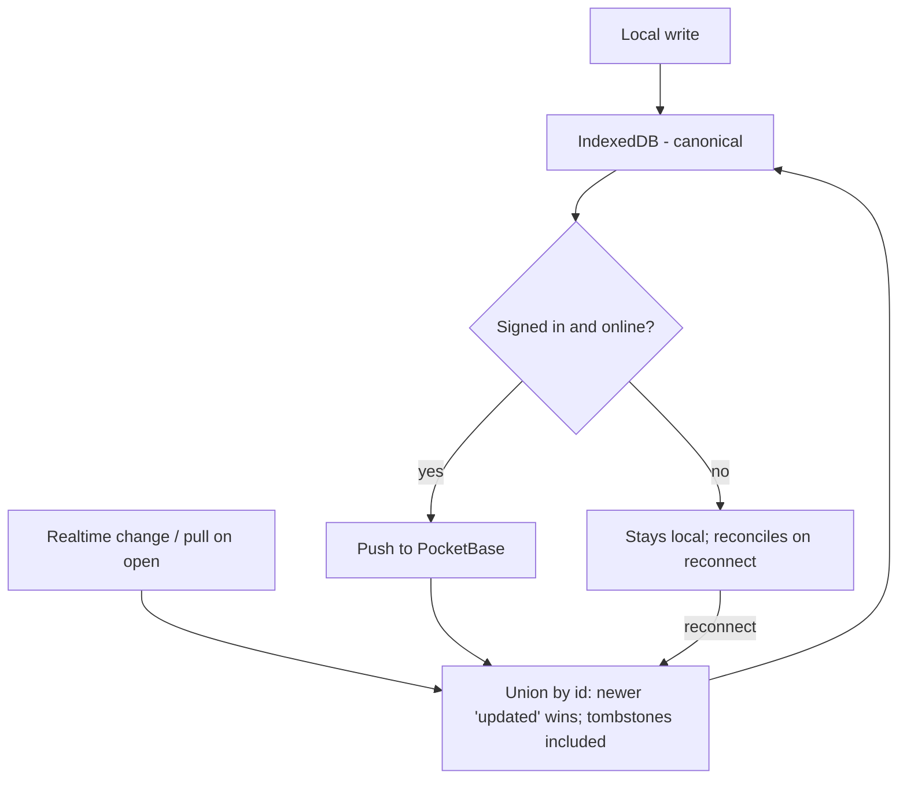

# Architecture

Tablemarks is a client-only React SPA with an optional PocketBase backend. Its defining choice is **local-first**: the browser's IndexedDB is the canonical store, and the cloud is a mirror you switch on by signing in.

"Optional" is literal, and it is data rather than a build flag: the app fetches a served `config.json` at startup and reads a backend URL out of it. An empty URL means _this deployment has no backend_, and the app renders accordingly.

## Two deployment targets, one build

One source tree produces two deployments: a private Docker stack with PocketBase behind it, and a public GitHub Pages demo with no backend at all. Both run the same code.

That is possible because the backend location is read at **runtime**, not baked in at build time. A build-time variable would inline the private hostname into every artifact the build produces — container image layers and public build logs among them — and would force the demo to carry a default backend it does not have. Reading a served file instead lets the image carry no hostname and lets the demo express "no backend" as an empty string. The full reasoning, including what runtime configuration does _not_ protect, is in [ADR-0001](../journal/decisions/0001-read-the-backend-location-at-runtime.md).

**Presence and reachability are two signals, not one.** "Is a backend configured?" settles immediately from the local file; "is it answering?" settles later, from a health check, or never. Collapsing them into one boolean would make a private instance that is merely down indistinguishable from the demo, so a user whose server was down would see the app quietly present itself as a backend-free build. Resolution has three outcomes — configured, absent, unavailable — and _unavailable_ maps to configured-but-unreachable, never to absent. See [ADR-0002](../journal/decisions/0002-separate-backend-presence-from-reachability.md).

_Unavailable_ is also the only one of the three that recovers. _Absent_ is an answer — the file was read and declares no backend — so there is nothing to retry; _unavailable_ means the file could not be read, and a tab that failed once re-reads it when connectivity returns, then starts the same controllers a clean startup would have. Until it does, the app says the server is unreachable rather than claiming everything is backed up.

One feature is genuinely unavailable without a backend rather than merely degraded: **short Google Maps links**. Resolving a `maps.app.goo.gl` link means following a cross-origin redirect, which a browser cannot do, so it needs a server. With no backend the app refuses the paste on the capture surface and names the two paths that still work — type the place name, or paste the full Maps URL. The server-side mechanism, and why it shells out to `curl` rather than using PocketBase's own HTTP client, is in [this journal entry](../journal/solutions/database-issues/pocketbase-hook-handlers-cannot-see-file-level-scope.md).

Operating the private stack — the ordered PocketBase console sequence, upgrades, rollback and recovery — is in [`../how-to/deployment.md`](../how-to/deployment.md).

## Layers

Code is organized so the local-first guarantees can't be accidentally broken:

```
UI / features (src/features/, src/App.tsx)
        │  reads & writes through
        ▼
Repository (src/data/)  ──►  IndexedDB
        │  emits change events
        ▼
Sync engine (src/sync/)  ◄──►  PocketBase (optional)
```

- **Feature/UI code** never touches IndexedDB directly and never imports the sync layer. It calls the repository and reacts to change events. This is why the app behaves identically with or without an account.
- **The repository** (`src/data/`) owns all local reads/writes and stamps the sync fields (`id`, `updated`, `deleted`).
- **The sync engine** (`src/sync/`) is the only code that talks to PocketBase.

## Local-first and accounts

There is no "local vs cloud" mode toggle. Everyone starts local with no account. Signing in with Google is framed as _back up + sync across devices_ — its first action is a one-time **union reconcile** that merges existing local data with the account. Signing out stops syncing and leaves local data intact.

Because every write lands in IndexedDB first, the local store also serves as the **durable sync outbox**: an offline write survives a page reload and is flushed to the cloud on the next connection. There is no separate queue to lose.

## Sync and reconciliation

Multi-device changes reconcile per-record by **last-write-wins** on the `updated` timestamp, keyed by the stable record `id`:



Key properties:

- **Tombstones propagate.** Deletes set a `deleted` flag with a fresh `updated` rather than removing the row, so a delete wins by recency and a stale peer can't resurrect it.
- **Sign-in is a union, not a batch-create.** Because the client `id` is reused as the PocketBase record id, the same record merges across devices instead of duplicating.
- **The rollup is local-derived.** Each restaurant caches `latestVerdict` / `latestVisitDate` / `visitCount`, recomputed on each device from its own visits — it is never the sync source of truth, and pulled visits trigger a local recompute.

The reconcile logic (`src/sync/reconcile.ts`) is pure and heavily unit-tested; the live PocketBase round-trip is verified at runtime.

## Change events

`src/data/events.ts` exposes two channels so sync and the UI react correctly without looping:

- `emitLocalChange()` — fires on user-driven writes; the sync controller listens here to push.
- `emitStoreChange()` — fires on any write, including sync-pulled ones; the UI listens here to refresh.

Raw sync writes use store-change only, so a pulled record refreshes the UI without re-triggering a push.

## Offline

The data layer works offline by construction. The app is an installable PWA: the shell and assets are precached, and map tiles viewed online are progressively cached (bounded, re-served offline) while never-browsed areas render blank. A new app version surfaces an explicit reload prompt rather than reloading silently. All data remains usable offline regardless.

## Scope built so far

The storage/sync core, Google auth, paste-a-URL capture (with geocoding fallback and short-link resolution), the visit-log/verdict UI, the decision mode, faceted cuisine filtering, data export/import, the installable PWA with offline tiles, the header account menu's sync-status indicator, and the two deployment targets described above.
