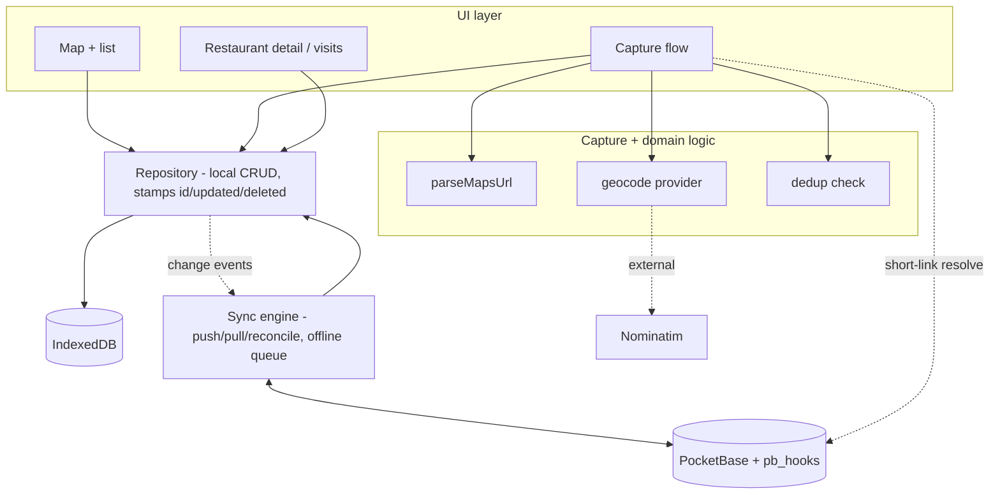
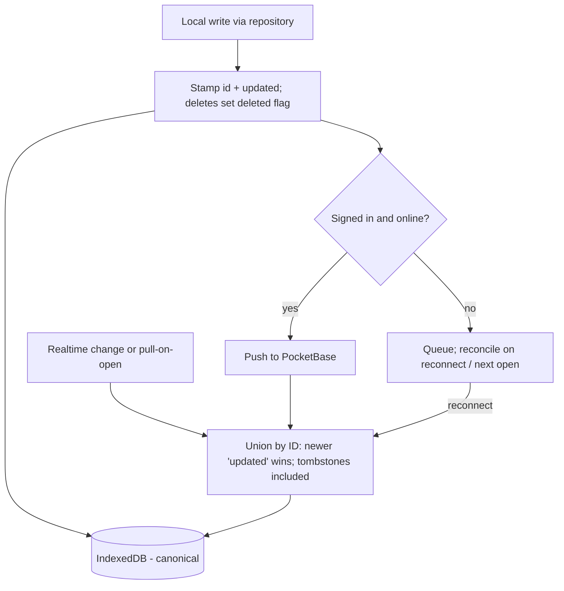

# feat: Tablemarks local-first foundation

## Summary

Scaffold the Tablemarks app and build its data foundation: an IndexedDB-canonical store with last-write-wins sync to PocketBase and Google SSO, paste-a-Google-Maps-URL capture with a geocoding-search fallback, and restaurants that accumulate separate timestamped visits carrying returnability verdicts. A minimal map + list + add/edit UI exercises these features end to end. The decision mode, faceted filtering, and visible sync-status UI are out of scope.

## Problem Frame

Tablemarks is an empty repo with only requirements docs committed. Three brainstorm briefs — local-first architecture (R2), paste-URL capture (R1), and the visit log with verdicts (R3) — share one data model and one storage layer, so they are planned and built together; planning them apart would force the schema and sync engine to be invented twice.

The hard part is not the UI. It is getting one reconciliation rule right: a local-canonical store that works with no account, syncs across a single user's devices when signed in, and never loses or resurrects a record. Every later layer (decision mode, faceting, export, sync-trust UI) reads and writes through this foundation, so its data contract and sync engine are the load-bearing work here. The UI in this plan exists to prove the foundation, not to be finished product.

## Requirements

Plan R-IDs trace to the origin briefs; "origin" citations name the source doc and its requirement.

**Scaffolding**

- R1. The repo is a runnable Vite 7 + React 19 + TypeScript + Tailwind v4 app with a test runner configured.

**Local-first storage (origin: local-first-architecture R1-R3)**

- R2. All reads and writes go to a per-device IndexedDB store; the app is fully functional with no account and no network.
- R3. Every record carries a stable client-generated ID, an `updated` timestamp set on every change, and a `deleted` flag; deletion sets the flag rather than removing the row.

**Sync and account (origin: local-first-architecture R4-R11)**

- R4. A user can use the app fully without an account; no local-vs-cloud mode is presented.
- R5. Signing in with Google enables backup and cross-device sync without changing local read/write behavior; signing out stops syncing and leaves local data intact.
- R6. When signed in and online, local changes push to PocketBase and remote changes pull into the local store; records reconcile per-record by last-write-wins on `updated`, keyed by stable ID, with tombstones winning by recency.
- R7. First sign-in reconciles existing local records with any account data by the same union — never duplicating records that already exist in the cloud.
- R8. Sync never blocks local use; offline writes proceed and reconcile on the next connection.

**Capture (origin: paste-url-capture R1-R13)**

- R9. Pasting a full Google Maps URL extracts coordinates and place name with no network call; a successful paste saves a record and drops a pin once coordinates are known.
- R10. Pasting a `maps.app.goo.gl` short link resolves coordinates via a PocketBase server route; while unresolved (or offline) the record saves as a provisional "resolving" entry with no pin and resolves automatically later.
- R11. When a paste yields no usable coordinates, capture falls back to a free-text name/address search backed by a free geocoding service; a resolved record stores a reverse-geocoded address.
- R12. Before creating a record, its location is checked against existing records by same Maps link or coordinates within a near-match radius; a near-match offers the existing record instead of a duplicate.
- R13. A record requires only a location (resolved or pending); category/cuisine, rating, and visit date are optional. Cuisine is stored when given but not yet used for filtering.

**Visit log and verdict (origin: visit-log-and-verdict R1-R10)**

- R14. A restaurant has zero or more visit records, each its own synced record linked to the restaurant, carrying a date, a four-level returnability verdict (Go back / Worth a detour / Once was enough / Never again), and an optional note.
- R15. Status is derived — zero visits is "to-try", one or more is "visited"; no status flag is stored.
- R16. The card and marker show the verdict of the most recent visit plus a visit count.
- R17. A one-tap "I'm here now" appends a visit dated today; past visits can be added and existing visits edited or deleted.

---

## Key Technical Decisions

- **IndexedDB via the `idb` wrapper.** A thin promise-based wrapper over IndexedDB rather than raw IndexedDB or a heavier ORM (Dexie). Keeps the store dependency-light while avoiding raw-IndexedDB callback ergonomics. All feature code goes through a repository module, never `idb` directly.
- **Repository + sync-engine split.** A repository layer owns local CRUD over IndexedDB and stamps `id`/`updated`/`deleted`. A separate sync engine owns push/pull/reconcile and is the only module that talks to PocketBase. Features depend on the repository, never the sync engine — so the app is identical with or without an account.
- **Last-write-wins union, keyed by stable client ID.** Reconciliation matches records by their client-generated ID (reused as the PocketBase record ID) and keeps the newer `updated`, both directions; tombstones (`deleted: true`) participate like any record. Sign-in is a union reconcile, not a batch-create — this is what prevents duplicates and resurrected deletes.
- **Pull via realtime subscribe + pull-on-open.** When online and signed in, the engine subscribes to PocketBase realtime for live remote changes and runs a full reconcile pull on app open / sign-in. Avoids a polling loop while still catching changes made while the app was closed.
- **Restaurant↔visit as a relation + denormalized rollup.** Visits link to a restaurant by stored restaurant ID (a PocketBase relation in the cloud, an indexed field locally). The restaurant record caches `latestVerdict` and `visitCount`, recomputed whenever its visits change, so the map can render markers without loading every visit.
- **Short-link resolution as a PocketBase JS hook.** A public custom route (`pb_hooks`, JavaScript) follows the `maps.app.goo.gl` redirect server-side and returns coordinates. JS hooks ship in-repo and need no custom Go binary; the route is callable without auth so it works in no-account mode.
- **Geocoding behind a provider module, default Nominatim.** A single `geocode` module exposes `search` and `reverse`, defaulting to Nominatim (no key, covers both) with debounced requests and a `User-Agent`. Provider is swappable to Photon/Geoapify without touching callers.
- **Optimistic marker add via React 19 `useOptimistic`.** A pasted/added place renders its pin (or provisional card) immediately; the write resolves behind it.
- **Vitest + React Testing Library.** The data-access, reconcile, parse, and dedup modules are pure-logic and carry the heaviest test weight; component tests cover the capture and visit flows.

---

## High-Level Technical Design

Layered architecture — features never reach past the repository, and only the sync engine talks to the cloud:



Sync reconcile (the load-bearing path):



---

## Output Structure

```
tablemarks/
├── index.html
├── package.json
├── vite.config.ts
├── tsconfig.json
├── vitest.config.ts
├── src/
│   ├── main.tsx
│   ├── App.tsx
│   ├── index.css                 # @import "tailwindcss"
│   ├── types/models.ts           # Restaurant, Visit, Verdict, sync fields
│   ├── data/
│   │   ├── db.ts                  # idb store + indexes
│   │   ├── restaurants.ts         # repository CRUD
│   │   ├── visits.ts
│   │   └── rollup.ts              # latestVerdict / visitCount recompute
│   ├── sync/
│   │   ├── pocketbase.ts          # PB client + auth store
│   │   ├── reconcile.ts           # LWW union logic (pure)
│   │   └── syncEngine.ts          # push/pull/subscribe/queue
│   ├── auth/auth.ts               # Google SSO, sign-in migration
│   ├── capture/
│   │   ├── parseMapsUrl.ts
│   │   ├── geocode.ts             # provider module (Nominatim default)
│   │   └── dedup.ts
│   ├── features/
│   │   ├── map/MapView.tsx
│   │   ├── map/markers.tsx
│   │   ├── capture/AddPlace.tsx
│   │   └── visits/RestaurantDetail.tsx
│   └── ui/                        # app shell, list panel
├── pocketbase/
│   ├── pb_hooks/resolveShortLink.pb.js
│   └── pb_migrations/             # users / restaurants / visits collections
└── docs/                          # existing
```

The tree is a scope declaration; per-unit `Files` are authoritative and the implementer may adjust layout.

---

## Implementation Units

Two phases: **Phase A — foundation (U1-U5)** then **Phase B — features (U6-U8)**.

### U1. Project scaffolding

- **Goal:** A runnable Vite 7 + React 19 + TS app with Tailwind v4 and Vitest.
- **Requirements:** R1
- **Dependencies:** none
- **Files:** `package.json`, `vite.config.ts`, `tsconfig.json`, `vitest.config.ts`, `index.html`, `src/main.tsx`, `src/App.tsx`, `src/index.css`
- **Approach:** Scaffold `react-ts`; add Tailwind v4 via `@tailwindcss/vite` with `@import "tailwindcss"` in `index.css` (no `tailwind.config.js`, no PostCSS config). Configure Vitest + React Testing Library + jsdom. Confirm Node ≥ 20.19 for Vite 7.
- **Patterns to follow:** Tailwind v4 config-less setup; Vite `react-ts` template defaults (strict TS on).
- **Test scenarios:** Test expectation: none — scaffolding. Verify the dev server boots and the test runner executes a trivial smoke test.
- **Verification:** `App` renders; one smoke test passes; production build succeeds.

### U2. Data model and IndexedDB repository

- **Goal:** Typed models and a repository that performs all local CRUD, stamping sync fields.
- **Requirements:** R2, R3, R13, R14, R15
- **Dependencies:** U1
- **Files:** `src/types/models.ts`, `src/data/db.ts`, `src/data/restaurants.ts`, `src/data/visits.ts`, `src/data/rollup.ts`, `src/data/restaurants.test.ts`, `src/data/visits.test.ts`, `src/data/rollup.test.ts`
- **Approach:** `Restaurant` (id, name, location, address?, cuisine?, note?, latestVerdict?, visitCount, updated, deleted) and `Visit` (id, restaurantId, date, verdict, note?, updated, deleted). `idb` stores with an index on `visits.restaurantId`. Repository generates a stable client ID on create, sets `updated` on every write, and soft-deletes. `rollup` recomputes `latestVerdict`/`visitCount` from a restaurant's visits. Status is derived (visitCount === 0 → to-try), never stored.
- **Patterns to follow:** Repository pattern — features call this module, never `idb` directly.
- **Test scenarios:**
  - Happy: create stamps a stable id + `updated`; read returns it; update bumps `updated`.
  - Edge: a restaurant with zero visits derives "to-try"; with visits derives "visited".
  - Edge: rollup picks the latest-by-date visit's verdict and the correct count across out-of-order visit dates.
  - Error/soft-delete: deleting sets `deleted: true` and the row is excluded from normal reads but still present for sync.
  - Integration: deleting a restaurant tombstones its visits.
- **Verification:** Repository tests pass; no feature code imports `idb` directly.

### U3. PocketBase setup and short-link resolver hook

- **Goal:** PocketBase collections, Google OAuth2, and the short-link resolution route.
- **Requirements:** R5 (auth backing), R6 (cloud schema parity), R10 (short-link resolve)
- **Dependencies:** U1
- **Files:** `pocketbase/pb_migrations/` (users config + `restaurants` + `visits` collections), `pocketbase/pb_hooks/resolveShortLink.pb.js`, `src/sync/pocketbase.ts`
- **Approach:** Define `restaurants` and `visits` collections whose fields mirror the local schema including `id` (client-supplied), `updated`, `deleted`, and the `visits→restaurants` relation. Enable Google OAuth2 on `users`. Add a public JS hook route that accepts a short link, follows the redirect server-side, parses coordinates, and returns them. `src/sync/pocketbase.ts` constructs the client and exposes the resolve call.
- **Patterns to follow:** PocketBase `authWithOAuth2`; `pb_hooks` `routerAdd` for the public route.
- **Test scenarios:**
  - Happy: resolver route returns coordinates for a known short link (mock the redirect target).
  - Error: resolver returns a clean error for a non-resolvable / non-Maps link without crashing.
  - Edge: the resolve route is reachable without authentication (no-account mode).
- **Verification:** Collections accept client-supplied IDs; OAuth2 round-trip populates `authStore`; resolve route returns coordinates for a sample link.

### U4. Sync engine (push / pull / reconcile / offline queue)

- **Goal:** The last-write-wins union sync between the local store and PocketBase.
- **Requirements:** R6, R7, R8
- **Dependencies:** U2, U3
- **Files:** `src/sync/reconcile.ts`, `src/sync/syncEngine.ts`, `src/sync/reconcile.test.ts`, `src/sync/syncEngine.test.ts`
- **Approach:** `reconcile.ts` is pure: given a local record and a remote record sharing an ID, return the winner by `updated` (tombstones included). `syncEngine.ts` subscribes to the repository's change events, pushes when online, holds a queue when offline and flushes on reconnect, subscribes to PocketBase realtime, and runs a full pull-and-reconcile on start/sign-in. The queue persists in IndexedDB so a reload mid-pending does not drop writes.
- **Execution note:** Implement `reconcile.ts` test-first — it is the correctness core.
- **Patterns to follow:** repository change events as the push trigger; reconcile keyed on stable ID.
- **Test scenarios:**
  - Covers AE2 (origin local-first). Happy: two records same ID, newer `updated` wins both directions.
  - Covers AE3. Edge: a tombstone with a newer `updated` beats an older live copy and is not resurrected.
  - Covers AE4. Integration: first sign-in unions local-only records with existing cloud records, no duplicates (same IDs merge).
  - Error/offline: writes made offline queue, survive a simulated reload, and flush on reconnect.
  - Edge: a push failure leaves the record pending and retried, not dropped.
- **Verification:** Reconcile unit tests pass; an offline-write-then-reconnect integration test ends with both stores consistent.

### U5. Auth and account mode

- **Goal:** Google sign-in/out wired to the local-canonical model with sign-in migration.
- **Requirements:** R4, R5, R7
- **Dependencies:** U3, U4
- **Files:** `src/auth/auth.ts`, `src/auth/auth.test.ts`, integration into `src/App.tsx`
- **Approach:** Sign-in triggers the sync engine's union reconcile (migration), then ongoing sync. No mode toggle is shown — the app runs against the repository regardless of auth. Sign-out stops the engine and leaves IndexedDB intact.
- **Patterns to follow:** PocketBase `authStore` persistence; engine start/stop on auth change.
- **Test scenarios:**
  - Covers AE1. Happy: no-account use reads/writes locally with the engine stopped.
  - Covers AE4. Integration: sign-in with existing local data runs the union migration once, no duplicates.
  - Covers AE5. Edge: sign-out retains all local data and leaves the cloud copy untouched.
- **Verification:** Auth state changes start/stop sync without altering local reads; migration runs exactly once per first sign-in.

### U6. Map, list, and app shell

- **Goal:** A minimal map + list UI rendering restaurants from the repository.
- **Requirements:** R9 (pin display), R16 (marker shows latest verdict + count)
- **Dependencies:** U1, U2
- **Files:** `src/features/map/MapView.tsx`, `src/features/map/markers.tsx`, `src/ui/` (shell + list panel), `src/features/map/MapView.test.tsx`
- **Approach:** `react-leaflet` v5 with OSM tiles (no key), `import 'leaflet/dist/leaflet.css'`. Render restaurants as `DivIcon` markers; a marker/list item shows the rolled-up latest verdict and visit count. A provisional ("resolving") record appears in the list without a pin. Markers are uniform for now — cuisine coloring is deferred to R5.
- **Patterns to follow:** react-leaflet v5 + React 19; `DivIcon` for custom markers.
- **Test scenarios:**
  - Happy: restaurants from the repository render as markers and list rows with verdict + count.
  - Edge: a provisional record shows in the list with no pin.
  - Edge: a to-try place (zero visits) renders distinctly from a visited one.
- **Verification:** Map renders saved places; list and markers reflect repository state.

### U7. Capture flow

- **Goal:** Paste-URL capture with short-link resolve, geocoding fallback, dedup, and optimistic add.
- **Requirements:** R9, R10, R11, R12, R13
- **Dependencies:** U2, U6, U3 (resolve route)
- **Files:** `src/capture/parseMapsUrl.ts`, `src/capture/geocode.ts`, `src/capture/dedup.ts`, `src/features/capture/AddPlace.tsx`, plus `*.test.ts(x)` for each
- **Approach:** `parseMapsUrl` extracts coordinates from `@lat,lng` and the name from `/maps/place/Name/`. Full URLs resolve client-side; short links call the resolve route, saving a provisional record meanwhile. No usable link → debounced `geocode.search`. On a resolved location, `dedup` checks same-link or within the near-match radius and offers the existing record. New records reverse-geocode an address. The marker/provisional card appears optimistically via `useOptimistic`.
- **Patterns to follow:** geocode provider module; `useOptimistic` for instant add; repository for the write.
- **Test scenarios:**
  - Covers AE1 (origin capture). Happy: full URL paste parses coordinates + name with no network and saves a pinned record.
  - Covers AE2/AE3. Integration: short-link paste saves a provisional entry, then gains its pin when the resolve route returns (and resolves on reconnect when offline).
  - Covers AE4. Edge: non-Maps text routes to the geocoding search and a picked candidate sets the location.
  - Covers AE5. Edge: a paste matching an existing place (same link or within radius) offers the existing record instead of duplicating.
  - Error: a malformed URL and a failed geocode surface a recoverable error, no broken record.
- **Verification:** Each capture path produces a correct record; dedup prevents a second pin for a known place.

### U8. Visit log and verdict UI

- **Goal:** Restaurant detail with visits, one-tap visit capture, and verdicts.
- **Requirements:** R14, R15, R16, R17
- **Dependencies:** U2, U6
- **Files:** `src/features/visits/RestaurantDetail.tsx`, `src/features/visits/RestaurantDetail.test.tsx`
- **Approach:** Detail view lists a restaurant's visits and its derived status. "I'm here now" appends a visit dated today and prompts for a verdict; past visits can be added and visits edited/deleted. Saving a visit triggers the rollup recompute so the marker/card updates.
- **Patterns to follow:** repository visit CRUD; rollup recompute on visit change.
- **Test scenarios:**
  - Covers AE2 (origin visit-log). Happy: a place with a 2024 "Go back" and a 2026 "Once was enough" visit shows "Once was enough" and count 2.
  - Covers AE3. Integration: "I'm here now" on a to-try place creates a today-dated visit and flips it to visited.
  - Covers AE4. Edge: adding a forgotten past visit recomputes the latest-by-date verdict.
  - Edge: editing/deleting a visit updates the rollup; deleting the last visit returns the place to to-try.
- **Verification:** Visit actions persist through the repository and the marker/card rollup stays correct.

---

## Scope Boundaries

**Deferred for later** (separate plans, already specced)

- Decision mode — "where do I eat tonight" (origin: decision-engine).
- Faceted cuisine filtering and category-colored markers (origin: faceted-classification). Cuisine is stored now (R13) but not filtered.
- Export/import and PWA offline (origin: data-portability-and-offline).
- Visible sync-trust UI — pending badge, offline indicator, failure escalation (origin: sync-trust-layer). The offline queue and reconcile are built here; surfacing their state is deferred.

**Outside this product's identity**

- A custom sync backend or CRDT engine. The foundation leans on PocketBase as a thin mirror.
- Paid Google Places / Maps API enrichment. The free, no-quota constraint holds.

**Deferred to Follow-Up Work**

- Map tile caching and offline tiles (rides with the PWA plan).
- Field-level conflict merge — per-record LWW is sufficient for single-user.

---

## Open Questions

**Deferred to implementation**

- Near-match dedup radius — start at ~50 m; tune against real data.
- `updated` clock-skew across devices — trust device clocks vs stamp server-side on push.
- Tombstone garbage collection and retention.
- Provisional-entry retry cap / expiry and how a permanently-unresolvable link is surfaced.
- Realtime-subscribe vs pull-on-open balance and initial-reconcile pagination for large accounts.

---

## System-Wide Impact

This plan defines the contracts every later layer depends on:

- **Record schema** — `id` / `updated` / `deleted` on every record, the restaurant↔visit relation, and the denormalized `latestVerdict` / `visitCount` rollup. R4-R7 (faceting, decision mode, export, sync-trust) all read this shape.
- **Repository API** — the single local-data entry point features use; changing it later ripples through every feature.
- **Sync engine** — the reconcile rule and offline queue that the sync-trust UI (R7) will surface and that export/import (R6) reuses as another reconcile source.

Getting these right now is why R1-R3 are planned together; a later layer cannot cheaply change them.

---

## Risks & Dependencies

- **Google OAuth2 setup** — requires a Google Cloud client ID/secret and a configured redirect URI; a blocker for the signed-in path (the no-account path is unaffected).
- **OSM tile usage policy** — the app uses public OSM tiles; respect the tile usage policy (attribution, no bulk fetching). Progressive caching is deferred to the PWA plan.
- **Nominatim rate limits** — 1 req/s and a required `User-Agent`; mitigated by debounced search. Provider is swappable if limits bite.
- **Google Maps URL format drift** — client parsing depends on the `@lat,lng` and `/maps/place/Name/` shapes; a format change degrades to the geocoding fallback rather than failing capture.
- **PocketBase hook deployment** — the short-link resolver is a `pb_hooks` JS route; it must ship with the PocketBase instance and be reachable publicly.
- **IndexedDB quota** — ample for text records; revisit if photos are added later.

---

## Sources & Research

- Origin briefs: `docs/brainstorms/2026-06-12-local-first-architecture-requirements.md`, `docs/brainstorms/2026-06-12-paste-url-capture-requirements.md`, `docs/brainstorms/2026-06-12-visit-log-and-verdict-requirements.md`.
- Ideation context and ranking: `docs/ideation/2026-06-12-tablemarks-ideation.html`.
- External grounding (gathered during ideation, 2026): react-leaflet v5 requires React 19 and bundles TS types; Tailwind v4 is config-less via `@tailwindcss/vite` with `@import "tailwindcss"`; Vite 7 needs Node ≥ 20.19; PocketBase v0.39 `authWithOAuth2({provider:'google'})` and `pb_hooks` JS routes; the Maps URL coordinate pattern `@lat,lng` and `/maps/place/Name/` segment, with `maps.app.goo.gl` short links requiring a server-side redirect resolve; Nominatim/Photon as no-key geocoders; the `idb` wrapper for IndexedDB.
