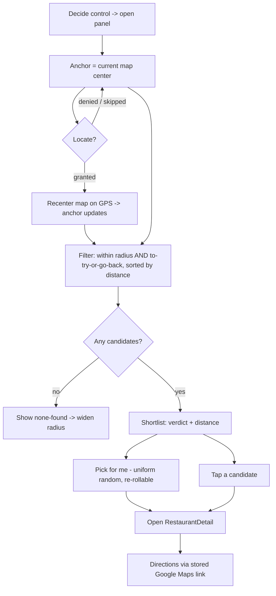

# feat: Where-do-I-eat-tonight decision mode

## Summary

Add a "decide where to eat" mode over the existing map: filter saved places near a movable anchor down to to-try places and go-back favorites within a radius, and present a short verdict + distance list with a one-tap random "pick for me". It reuses the foundation — the repository data, the R3 verdict/status rollup, the existing distance helper, and the modal/panel UI pattern — and adds no data layer.

## Problem Frame

A saved-restaurant collection has an unspoken job: eventually deciding where to go. The foundation can store and show places but not help choose — and the to-try list rots when places go in and never come out. Standing somewhere hungry, a map of every pin is a worse tool than three nearby candidates already vetted. This mode closes that loop and shifts the felt value from "saved a place" to "picked a place." It is a read-only consumer of existing data; the risk is entirely in the filter/anchor UX, not in new persistence.

## Requirements

Plan R-IDs trace to the origin (`docs/brainstorms/2026-06-12-decision-engine-requirements.md`).

**Candidate selection**

- R1. The default candidate pool is places that are to-try (zero visits) or visited with a rolled-up "Go back" verdict (origin R1).
- R2. Candidates are restricted to those within a selected radius of the anchor point (origin R2).
- R3. The user can pick among radius presets (origin R3).
- R4. When no candidates match, the mode says so and offers to widen the radius (origin R4).

**Anchor and location**

- R5. Proximity is measured from the current map center, pannable to any area (origin R5).
- R6. A locate control recenters the anchor on the user's GPS position when permission is granted (origin R6).
- R7. The mode is fully usable with no location permission; denial degrades to map-center anchoring, never a dead end (origin R7).

**Presentation and decision**

- R8. Candidates render as a short list showing rolled-up verdict and distance from the anchor, ordered by distance (origin R8).
- R9. A one-tap "pick for me" selects one candidate at random from the current filtered set and can be re-rolled (origin R9).
- R10. Selecting a candidate opens its detail; directions hand off to the place's stored Google Maps link, not in-app routing (origin R10).

**Filtering**

- R11. The mode filters natively by radius and by verdict/status; cuisine filtering is absent until R5/faceting exists (origin R11, R12).

---

## Key Technical Decisions

- **Surface as a map overlay panel, not a route.** A "Decide" control in the shell opens a panel over the existing map (reusing the `AddPlace`/`RestaurantDetail` modal pattern). Resolves the origin's open question on how the mode surfaces; avoids routing infrastructure the app doesn't have.
- **Radius presets 0.5 / 1 / 5 km, default 1 km.** Matches the brainstorm's example values; the preset set and default are easy to tune later. Resolves an origin open question.
- **"Pick for me" is uniform random** over the filtered set for v1 — no weighting toward to-try. Resolves an origin open question; weighting is a deferred follow-up.
- **Reuse `haversineMeters` from `src/capture/dedup.ts`** for distance rather than duplicating the formula. If both this mode and dedup need it, promote it to a small shared geo util; otherwise import in place.
- **Anchor is the live map center.** `MapView` reports its center on move; the panel reads that as the anchor. The locate control recenters the map (which updates the anchor) via the browser Geolocation API; permission denial leaves the center unchanged. No anchor state is persisted.
- **Pool predicate from R3-derived fields:** to-try is `visitCount === 0`; go-back favorite is `latestVerdict === 'go_back'`. Read straight off the restaurant rollup — no visit loads.

---

## High-Level Technical Design

---

## Implementation Units

### U1. Candidate selection logic

- **Goal:** A pure module that filters the pool, restricts by radius, sorts by distance, and picks one at random.
- **Requirements:** R1, R2, R4, R8, R9, R11
- **Dependencies:** none
- **Files:** `src/features/decide/candidates.ts`, `src/features/decide/candidates.test.ts`
- **Approach:** Export `decideCandidates(restaurants, anchor, radiusM)` returning matches sorted by ascending distance, each annotated with its distance. Pool predicate: `visitCount === 0 || latestVerdict === 'go_back'`, excluding records without coordinates and provisional ones. Distance via the existing `haversineMeters` (import from `src/capture/dedup.ts`, or a shared geo util if promoted). Export `pickForMe(candidates)` returning a uniform-random member (undefined for an empty set).
- **Patterns to follow:** the pure-logic + unit-test shape of `src/capture/dedup.ts` and `src/sync/reconcile.ts`; reuse `haversineMeters`.
- **Test scenarios:**
  - Covers AE1. Happy: pool includes to-try and "Go back" places within radius; excludes "Once was enough"/"Never again"/non-go-back visited; each result carries verdict + distance.
  - Edge: results sorted by ascending distance; a place exactly at the radius boundary is included, just beyond is excluded.
  - Edge: provisional records and ones with null coordinates are excluded.
  - Covers AE4. Edge: empty pool / nothing in radius returns `[]`.
  - Covers AE5. `pickForMe` returns a member of the set; on an empty set returns undefined. (Assert membership, not a specific element.)
- **Verification:** candidate and pick logic pass unit tests; no visit records are loaded (operates on rollup fields only).

### U2. Map anchor reporting and locate control

- **Goal:** `MapView` reports its current center, and a locate control recenters on the user's GPS position.
- **Requirements:** R5, R6, R7
- **Dependencies:** none
- **Files:** `src/features/map/MapView.tsx`, `src/features/decide/geolocate.ts`, `src/features/decide/geolocate.test.ts`
- **Approach:** `MapView` accepts an `onCenterChange?(center)` callback fired from a child using react-leaflet map events (`moveend`), and renders a locate button. `geolocate.ts` wraps `navigator.geolocation.getCurrentPosition` as a promise with a timeout; the locate button calls it and, on success, `map.setView` to the position (which fires `onCenterChange`). On denial/error/timeout it leaves the map where it is and surfaces a non-blocking notice. No permission prompt is forced on mode open.
- **Patterns to follow:** the existing `Recenter` child in `MapView.tsx` (uses `useMap`); keep the App test's `react-leaflet` mock updated (add `useMapEvents` if used).
- **Test scenarios:**
  - Covers AE3. Happy: `geolocate()` resolves to coordinates when `getCurrentPosition` succeeds (mock `navigator.geolocation`).
  - Covers AE2, AE7. Error: denial/timeout rejects (or resolves to null) and the caller leaves the anchor unchanged — no throw to the UI.
  - Edge: `navigator.geolocation` absent (unsupported) is handled as a clean "unavailable", not a crash.
- **Verification:** center changes propagate to the consumer; locate recenters on success and no-ops safely on denial.

### U3. Decide panel and shell wiring

- **Goal:** The decision-mode UI — radius presets, the candidate shortlist, pick-for-me, empty-state, and selection handoff — opened from a shell control.
- **Requirements:** R3, R4, R8, R9, R10, R11
- **Dependencies:** U1, U2
- **Files:** `src/features/decide/DecidePanel.tsx`, `src/features/decide/DecidePanel.test.tsx`, `src/App.tsx`
- **Approach:** A "Decide" control in the shell opens `DecidePanel` (overlay, reusing the modal pattern). The panel reads the live anchor (map center from U2) and `useRestaurants`, runs `decideCandidates` for the selected radius preset, and renders the sorted shortlist (name, rolled-up verdict via `rollupLabel`, distance). A "pick for me" button selects via `pickForMe` and highlights/opens the choice; re-roll repeats. Empty result shows a "nothing nearby — widen radius" affordance that bumps to the next preset. Selecting a candidate opens `RestaurantDetail` (existing); a "Directions" affordance opens the stored `mapsUrl` in a new tab. No cuisine filter control (deferred to R5).
- **Patterns to follow:** `AddPlace.tsx`/`RestaurantDetail.tsx` panel structure; `rollupLabel`/`statusLabel` from `src/features/display.ts`; `RestaurantList` row shape.
- **Test scenarios:**
  - Covers AE1, AE8. Happy: with a seeded set and anchor, the panel lists the to-try + go-back candidates with verdict and distance, nearest first.
  - Covers AE5. "Pick for me" selects a candidate from the list and surfaces it; re-roll can change it.
  - Covers AE4. Empty: no nearby candidates shows the widen-radius affordance; widening re-filters at the larger preset.
  - Covers AE10. Selecting a candidate opens its detail; the directions affordance targets the stored Maps link.
  - Edge: changing the radius preset re-filters the list.
- **Verification:** the full open → filter → pick/select loop works against seeded data; no cuisine control is present.

---

## Scope Boundaries

**Deferred for later** (origin scope boundaries)

- "Open now" / opening-hours filtering — no hours data on the free stack.
- In-app routing/navigation beyond opening the stored Google Maps link.
- A spin-the-wheel-only or swipe-deck interaction — the shortlist-plus-pick mechanic is chosen.
- Group/shared deciding — single-user mode.

**Outside this product's identity** (origin)

- Recommending places the user has not saved — the mode decides among the user's own vetted collection, not a discovery engine over external listings.

**Deferred to Follow-Up Work**

- Cuisine filtering inside the mode — arrives with R5 (faceted classification); the panel adds the control then.
- Weighting "pick for me" (e.g. favoring to-try over already-loved favorites) — uniform for v1.

---

## Open Questions

**Deferred to implementation**

- Whether `haversineMeters` is promoted to a shared `src/features/geo` util or imported from `src/capture/dedup.ts` in place — decide when wiring U1 (promote only if it reads cleaner).
- Exact radius-preset affordance (segmented control vs. cycling button) and where the locate control sits on the map — visual/layout calls for U2/U3.
- Whether the chosen "pick for me" result pans the map to the choice or only highlights the row.

---

## System-Wide Impact

Read-only over existing data — no schema, repository, or sync changes. The one shared-code touch is `MapView` gaining a center-change callback and locate control (U2), which the existing map render must keep working; the App test's `react-leaflet` mock needs the new hooks. `haversineMeters` may become shared between capture-dedup and decide.

---

## Risks & Dependencies

- **Geolocation permission UX** — the prompt is browser-controlled; the mode must stay fully usable on denial (R7). Covered by U2's no-op-on-denial path.
- **Leaflet center-change wiring** — `moveend` can fire frequently; debounce or read on demand to avoid excessive re-filters. Note for U2/U3.
- **Depends on R3 rollup fields** (`latestVerdict`, `visitCount`) being current — already maintained by the foundation, including after sync pulls.

---

## Sources & Research

- Origin: `docs/brainstorms/2026-06-12-decision-engine-requirements.md`.
- Foundation code reused: `src/features/useRestaurants.ts`, `src/features/display.ts` (rollupLabel/statusLabel), `src/capture/dedup.ts` (`haversineMeters`), `src/features/map/MapView.tsx` (`Recenter`/`useMap`), `src/features/visits/RestaurantDetail.tsx`, `src/features/capture/AddPlace.tsx` (panel pattern), `src/types/models.ts` (`Verdict`, `statusOf`).
- Domain terms per `CONCEPTS.md`: Verdict, Status (to-try/visited), Rollup.
