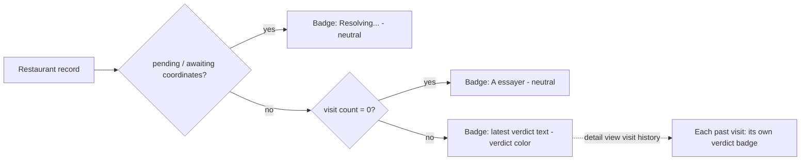

# Design Refresh - Plan

## Goal Capsule

- **Objective:** Someone opening Tablemarks — on desktop or on a phone, at home planning a visit or standing at a restaurant deciding where to eat — reads it as a distinctive, personal app ("Carnet culinaire") rather than a generic UI template, and can tell a place's cuisine apart from its status/verdict at a glance in the list, the detail view, and the map. On a phone, every primary use (browsing, deciding, logging a visit, adding a place) stays comfortable one-handed.
- **Means:** Build the Carnet culinaire identity, the mobile Liste/Carte toggle, and the fused status/verdict badge described below. Reuse branch `feat/ui-polish`'s already-built structural mechanics — sticky header, unified modal shell, mobile pane-switch, marker shapes, button/chip shapes — as an implementation starting point, retokenized to the new palette and type rather than kept in that branch's original stone-neutral styling (KTD1).
- **Product authority:** This Product Contract is authoritative on product/visual behavior; the Planning Contract below is authoritative on mechanism (exact colors, tokens, component structure). Solo personal project — the requester is the sole user and decision-maker.
- **Execution profile:** Standard software feature work; no autonomous/long-running optimization loop.
- **Stop conditions:** None beyond satisfying the Definition of Done below.
- **Open blockers:** None. Ready for implementation.

---

## Product Contract

**Product Contract preservation:** unchanged for R1-R16 and Key Decisions. One Scope Boundary bullet added (mobile back-gesture modal dismissal, surfaced during planning). The three original Outstanding Questions (exact breakpoint, exact palette/typefaces, how much of `feat/ui-polish`'s structure to reuse) are now resolved — see Planning Contract KTD1, KTD2, and Implementation Unit U2 — and the section is removed since no blocking question remains. Two Acceptance Examples were corrected for internal consistency after document review: AE3 no longer implies the fused badge retains visit-count text (it doesn't, per R9), and AE5 now names the exact breakpoint (document review findings below).

### Summary

Give Tablemarks one distinctive visual identity — "Carnet culinaire": warm, editorial, terracotta + deep-teal — applied consistently across every screen, replace the always-side-by-side desktop layout with a persistent Liste/Carte toggle on mobile, and make cuisine and a fused status/verdict badge each legible at a glance in the list, the detail view, and the map.

### Problem Frame

The app today renders in Tailwind's default styling — a flat gray/orange palette (`--color-brand: #d4561f`), system-font typography, no responsive breakpoints anywhere in `src/App.tsx` — with a fixed `w-80` list sidebar always shown beside the map. That side-by-side layout does not adapt below desktop width, and mobile is where the pain concentrates: deciding where to eat nearby, logging a visit on site, and casual browsing are the three real phone-use contexts, and none of them are served by an unconditionally split screen. Separately, the restaurant list shows only plain text — a status word and a verdict/visit-count rollup string; cuisine color-coding already exists for map markers, filter chips, and the detail view, but not in the list itself, and status/verdict are two separate signals rather than one legible facet. Modals (Add a place, the decide panel, restaurant detail, export/import) share the same generic centered-dialog chrome on every screen size, with no mobile-appropriate presentation and no tap-outside-to-close. Map markers are plain circles with no visual distinction for the selected place.

### Requirements

**Identité visuelle**

- R1. The app adopts one distinctive visual identity ("Carnet culinaire": warm, editorial tone; paper-like background; serif display type) in place of the current default Tailwind look, expressed through a saturated terracotta primary accent and a deep teal/blue-green secondary accent. Exact color values, typefaces, and spacing are a planning decision (resolved: KTD1).
- R2. This identity is applied consistently across every screen: the main list/map screen, the restaurant detail view, the add-a-place flow, the "Où manger ?" decide panel, the export/import panel, the sync status indicator, and the app-update banner.
- R3. Personalization means a bespoke, built-in identity for the app itself. It does not include user-facing customization such as a choice of theme or accent color, or personal usage statistics/greetings.

**Header**

- R4. The header stays visible while scrolling, with a translucent, blurred background in the Carnet culinaire identity, a small logo mark next to the app name, and a tagline visible on wider screens.

**Responsive mobile**

- R5. Below a width where the current side-by-side list+map layout stops being usable (resolved: `md`, 768px — see U2), the layout switches to a single-pane view with a persistent Liste/Carte toggle fixed at the bottom of the screen; adding a place stays reachable from either pane (a floating "+" button over the map when Carte is active).
- R6. The desktop/wide-screen layout keeps its current side-by-side list+map structure; only its visual styling changes there, not its structure.
- R7. Every primary flow — browsing the list/map, opening "Où manger ?" to decide, logging a visit, and adding a new place — remains fully usable in the narrow single-pane mobile layout; switching panes preserves the active filters and each pane's own scroll/pan position.

**Lisibilité des catégories (cuisine / statut / verdict)**

- R8. Cuisine is visually indicated on every restaurant row in the main list (not only in the filter bar, map markers, and detail view as today), using the same cuisine-to-color mapping already used elsewhere in the app.
- R9. A restaurant's status and verdict are combined into a single colored badge per row, not two separate elements: an unvisited ("to try") place shows a neutral "À essayer" badge; a visited place's badge shows its latest verdict (e.g. "On y retourne") in place of a generic "Visité" label.
- R10. A provisional restaurant awaiting coordinate resolution (`CONCEPTS.md`'s Provisional record) keeps a distinct, visually neutral "Resolving…" badge state, never the verdict-colored treatment, regardless of visit count.
- R11. Wherever a verdict is shown as text outside the list rollup — including each entry in the restaurant detail panel's visit history — it gets the same colored-badge treatment; each past visit shows its own verdict badge for that entry, distinct from the row-level fused badge which shows only the latest.
- R12. The empty list state (no places saved yet) shows a supporting icon, a short title, and one line of guidance, instead of a single plain sentence.
- R13. Filter chips (cuisine, status, verdict) adopt the same category-distinction visual language as the list and detail badges, sized and spaced for easier tapping, with the active state visually stronger — shadow plus a more saturated fill — than today's plain outline.

**Map markers**

- R14. Map markers render as a pin shape rather than a plain circle, continuing to encode cuisine by color per the existing mapping; the selected marker is visually larger and carries a glow/halo in its own color so the selection is unambiguous. Map internals (tile provider, clustering, the Leaflet library itself) are unchanged.

**Modals**

- R15. Every modal-style panel (Add a place, Où manger ?, Restaurant detail, Export/Import) shares one shell: on a phone-width screen it rises from the bottom of the screen with rounded top corners and a small drag-indicator bar; on a wider screen it stays centered. Clicking outside the panel closes it, and the darkened backdrop is opaque enough to read as a clear foreground/background separation.

**Buttons**

- R16. Primary action buttons (Add a place, Où manger ?, Pick for me, I'm here now) use a strongly rounded shape with a subtle shadow and a visible hover transition.

### Key Decisions

- **"Carnet culinaire" (warm, editorial; terracotta + deep-teal) as the app's visual identity** (session-settled: user-directed — chosen over reusing the already-shipped `feat/ui-polish` branch's stone-neutral ramp and Fraunces/Inter pairing as-is when reconciling two independently-produced plans for the same redesign; the identity itself was chosen through sketch comparison against a clean-minimal and a dark/bold direction). Governs R1.
- **Personalization means a built-in app identity, not user-facing customization** (session-settled: user-directed — chosen over "personalized for the user" and "both," keeping scope to a visual refresh rather than a new preferences feature). Governs R3.
- **Whole app in scope now, including the surfaces `feat/ui-polish` did not touch** (session-settled: user-directed — chosen over doing only the main screen and deferring the rest, and over limiting the remaining surfaces to only Export/Import). Governs R2.
- **Status and verdict fused into one badge, over keeping a separate status pill plus a distinct verdict badge** (session-settled: user-directed — chosen over the other plan's three-element row of cuisine dot, status pill, and separate verdict badge when reconciling the two plans; itself a deliberate mix across two of three sketched directions, borrowing the rejected dark/bold direction's chip treatment). Governs R9, R10, R11.
- **Mobile navigation: a bottom Liste/Carte toggle, over a map-with-draggable-list-drawer and a stacked single-page layout** (session-settled: user-directed — chosen among three concrete alternatives). Governs R5.
- **Desktop keeps its current side-by-side structure; only mobile gets the new toggle** (session-settled: user-approved — proposed during scope confirmation and accepted, matching that the request named "responsive for mobile" as distinct from "modern look"). Governs R6.

### Key Flows

- F1. Mobile list/map navigation
  - **Trigger:** The viewport renders below the desktop breakpoint.
  - **Steps:** The screen shows one pane (Liste or Carte) at a time, with a toggle fixed at the bottom of the screen; switching panes preserves the active filters and each pane's own scroll/pan position. When Carte is active, a floating "+" button over the map lets the user add a place.
  - **Outcome:** Only one of Liste/Carte is visible at a time on mobile; both remain visible side by side, structurally unchanged, on a wider screen, where the toggle itself is hidden.
  - **Covers:** R5, R6, R7.

```mermaid
flowchart TB
  H[Header: app name + sync status] --> C[Filter chips: cuisine / status / verdict]
  C --> P{Liste/Carte toggle state}
  P -->|Liste| L[Restaurant list: cuisine tag + fused status/verdict badge per row]
  P -->|Carte| M[Map: cuisine-colored pins, floating + button]
  L --> N[Bottom toggle: Liste | Carte]
  M --> N
```

- Restaurant badge state (covers R9, R10, R11):



### Acceptance Examples

- AE1. **Covers R9, R10.**
  - Given a restaurant with zero visits, When rendered in the list or detail view, Then its badge reads "À essayer" in the neutral to-try color, with no separate status pill.
  - Given a restaurant with one or more visits, When rendered, Then its badge reads the latest visit's verdict (e.g. "On y retourne") instead of a generic "Visité" label.
  - Given a provisional restaurant awaiting coordinate resolution, When rendered, Then its badge reads "Resolving…" in a neutral, non-verdict color regardless of visit count.
- AE2. **Covers R8, R9.** Given a restaurant with zero visits, when it appears in the list, then it shows the cuisine dot and the neutral "À essayer" badge — there is no visit to rate yet.
- AE3. **Covers R11.** Given a restaurant with two visits carrying different verdicts, when it appears in the list, then only the latest visit's verdict shows as the row-level fused badge, as text only — today's rollup visit count is dropped, not carried into the badge; in the detail panel's visit history, each past visit shows its own verdict badge for that entry.
- AE4. **Covers R5, R6, R7.**
  - Given the viewport is at or above the desktop breakpoint, When the app renders, Then list and map remain visible side-by-side as today.
  - Given the viewport is below the desktop breakpoint, When the app renders, Then only one of Liste/Carte is visible at a time with a persistent toggle, and every primary flow (browse, Où manger ?, log a visit, add a place) stays reachable and usable in that narrow layout.
- AE5. **Covers R15.** Given a screen at or above the `md` (768px) breakpoint — the same one R5 uses — when any modal-style panel opens (Add a place, Où manger ?, Restaurant detail, Export/Import), then it appears centered rather than as a bottom sheet.

### Success Criteria

- The redesign reads as one coherent, distinctive style across every screen — no screen still looks like the old default-Tailwind chrome.
- On a phone, a user can complete each of the three real usage contexts (deciding where to eat, logging a visit, casual browsing) one-handed, without horizontal scrolling or cramped side-by-side panels.
- Without reading any text, a user can distinguish a place's cuisine (by color) from its status/verdict (by the fused badge) at a glance.

### Scope Boundaries

- Dark mode is out of scope; the palette is designed for a light background only.
- No numeric star rating is introduced — Verdict stays a returnability judgment (per `CONCEPTS.md`), never a number; the fused badge is a color/label treatment of the existing four Verdict values, not a new rating scale.
- User-facing personalization (choice of theme/accent color, personal usage stats, or a tailored greeting) is explicitly out of scope — the ask is a bespoke built-in identity, not a user setting.
- Map internals (tile provider, clustering behavior, the Leaflet library itself) are unchanged; only marker/pin visual styling is refreshed (R14).
- No new data fields, verdicts, or domain behavior are introduced — this redesigns how existing data (cuisine, status, verdict) is presented, not what data exists.
- Mobile back-gesture/swipe dismissal of modals is out of scope; tap-outside and the explicit close control remain the only dismiss paths (no browser history/routing plumbing is added).

### Dependencies / Assumptions

- Assumes Tailwind v4's `@theme` block in `src/index.css` remains the styling mechanism; new design tokens (colors, and any font import) are added there rather than via a separate config file. Today it holds only `--color-brand` and `--color-brand-soft`.
- Assumes the existing cuisine→color mapping (`colorForCuisine` in `src/features/facets/cuisines.ts`) is reused rather than replaced, since the filter bar, map markers, and detail view already depend on it.
- Branch `feat/ui-polish` (commit `d73d93d`, unmerged into `main`) already implements the structural work this plan reuses — the responsive breakpoint/pane-switch mechanics, the sticky/blurred header, teardrop map markers, and rounded/shadowed buttons/chips in `index.html`, `src/index.css`, `src/App.tsx`, `src/features/RestaurantList.tsx`, `src/features/facets/FilterBar.tsx`, `src/features/map/MapView.tsx`, `src/features/capture/AddPlace.tsx`, `src/features/decide/DecidePanel.tsx`, `src/features/visits/RestaurantDetail.tsx` — but only 9 files; it does **not** touch `src/features/map/markers.ts` (pure marker-data logic, unaffected either way) or `src/features/portability/PortabilityPanel.tsx` (still on the old modal chrome). Its color/typography tokens are superseded by KTD1; the structural mechanics are ported unchanged.
- `src/features/sync/SyncStatusIndicator.tsx` and `src/features/pwa/ReloadPrompt.tsx` are unmodified by `feat/ui-polish` and still carry the prior look (R2).
- `feat/ui-polish`'s `RestaurantList.tsx` diff adds a status pill and a cuisine dot but does **not** fuse status+verdict into one badge — it keeps `rollupLabel()` as separate subtitle text. The fused badge is net-new (KTD3).

---

## Planning Contract

### Key Technical Decisions

- KTD1. **Retokenize `feat/ui-polish`'s design tokens; port its structural mechanics unchanged.** Research confirmed the branch's structure (pane-switch, header, marker rendering, button/chip classes) is cleanly separable from its palette/type. Replace its Google Fonts wiring and warm-stone gray-ramp override in `src/index.css`/`index.html` with: `--font-display: "Playfair Display"` (serif; fallback `Georgia, "Times New Roman", serif`), `--font-sans: "Work Sans"` (fallback `system-ui, sans-serif`), a new `--color-teal: #1F6F68` secondary accent (`--color-teal-strong: #154D48` for hover/active), and a new warm sepia-tinted `--color-gray-*` ramp (distinct hex stops from `feat/ui-polish`'s stone ramp) for paper-editorial neutrals. Keep the existing `--color-brand: #d4561f` and `feat/ui-polish`'s `--color-brand-strong: #b8431a` as the terracotta primary, and its `#fdfaf6` body background as the paper tone — both already satisfy the identity without inventing new values (session-settled: user-directed — chosen over inventing new terracotta/paper values from scratch, since the existing tokens already satisfy the Product Contract's identity Key Decision). Governs R1.
- KTD2. **Extract a shared `Modal` component instead of retokenizing three copy-pasted blocks.** No shared modal exists on `main` or `feat/ui-polish` — `AddPlace.tsx`, `DecidePanel.tsx`, and `RestaurantDetail.tsx` each repeat the same bottom-sheet/centered JSX with only z-index/padding deltas, and `PortabilityPanel.tsx` was never touched by `feat/ui-polish` at all. Build one component from that repeated pattern and apply it to all four, sizing `PortabilityPanel`'s work as new build rather than retokenize. Governs R15.
- KTD3. **Build the fused badge and a verdict-color token set from scratch.** Neither `main` nor `feat/ui-polish` has a fused status+verdict badge to lift. The cuisine dot calls the existing exported `colorForCuisine(r.cuisine)` directly — the same function `feat/ui-polish`'s cuisine dot and `MapView.tsx`'s marker coloring already call. There is no single shared, exported key spanning filter matching and marker color today (`cuisineKey` in `filter.ts` is private to that file's `matches()` predicate) for the badge/dot to reuse instead. The six badge states get their own fixed tokens, distinct from the cuisine palette: `--color-verdict-go-back: #1F6F68` (reuses the identity's teal), `--color-verdict-detour: #A66A2E`, `--color-verdict-once: #7A8B3F`, `--color-verdict-never: #8B3A3A`, and `--color-verdict-neutral: #8A7A68` (shared by "À essayer" and "Resolving…", distinguished by label text, not color). Badge label text keeps at least WCAG AA 4.5:1 contrast against its fill. Governs R9, R10, R11.
- KTD4. **Reserve a fixed mobile toggle-bar height token; dock the map FAB and `ReloadPrompt` above it.** Today both float independently (`ReloadPrompt` at `bottom-4`, the FAB at `bottom-5`) with no reconciliation, even in `feat/ui-polish`; the new persistent Liste/Carte toggle from R5 must not collide with either. The toggle bar also adds `padding-bottom: env(safe-area-inset-bottom)` so it clears the home-indicator area on notched iOS devices, since `index.html` already sets `viewport-fit=cover`. Governs R2, R5.
- KTD5. **Keep today's behavior for two edge cases as explicit accepted defaults, not new domain behavior:** a restaurant that stops matching an active filter after a visit is logged disappears from the filtered list/map instantly when its modal closes (no new transition or grace period), and pane selection, filters, scroll position, and map pan reset to defaults on a full reload or PWA relaunch (no new persistence layer). Both match current and `feat/ui-polish` behavior.

### Assumptions

- Badge color hues may occasionally coincide with a cuisine color (roughly 20 cuisine colors vs. 6 badge states in the same row); the badge's shape and label text — not hue-uniqueness — are the intended disambiguator from the cuisine dot.
- `FilterBar.tsx`'s three independent chip groups (cuisine, status, verdict) stay structurally separate; R13 restyles their visual language but does not merge the status and verdict chip rows the way R9 fuses the row-level display badge.
- Mobile back-gesture/swipe dismissal of modals is out of scope for this pass (see Scope Boundaries) — no history/routing plumbing is added to any modal.

### Sequencing

U1 is a prerequisite for every other unit. U2 through U6 can proceed in any order after U1.

---

## Implementation Units

### U1. Carnet culinaire design tokens

- **Goal:** Define the new identity's tokens as the foundation every other unit builds on.
- **Requirements:** R1, R2 (KTD1)
- **Dependencies:** none
- **Files:** `src/index.css`, `index.html`
- **Approach:**
  1. Replace `feat/ui-polish`'s Google Fonts `<link>`s (Fraunces/Inter) with Playfair Display + Work Sans, preserving the existing preconnect and offline CSS-fallback-stack pattern.
  2. Replace the stone-neutral `--color-gray-*` override with the new sepia-tinted ramp; keep `--color-brand`/`--color-brand-strong`; add `--color-teal`/`--color-teal-strong`; keep the `#fdfaf6` paper background.
  3. Update the `theme-color` meta tag in `index.html` to the terracotta value.
- **Test scenarios:** Test expectation: none -- pure CSS/token definitions, no runtime logic.
- **Verification:** `npm run build` succeeds; the running app shows the new fonts/colors; the offline fallback stack (system sans, Georgia serif) still renders sensibly with fonts blocked.

### U2. Responsive mobile layout: header, Liste/Carte toggle, FAB, and update-banner docking

- **Goal:** Port `feat/ui-polish`'s responsive pane-switch and header, retokenized, and resolve the FAB/banner stacking gap.
- **Requirements:** R4, R5, R6, R7 (KTD4)
- **Dependencies:** U1
- **Files:** `src/App.tsx`, `src/App.test.tsx`, `src/features/pwa/ReloadPrompt.tsx`
- **Approach:**
  1. Port the `view: 'list' | 'map'` state and pane visibility from `feat/ui-polish`'s `App.tsx` diff at Tailwind's `md` breakpoint (768px, matching that branch's precedent), retokenized to the new fonts/colors. Reposition the toggle itself: `feat/ui-polish` renders it in-flow below the header, but R5 requires it fixed to the viewport bottom — pin it there and give the list/map pane containers bottom padding equal to the toggle-bar height token (KTD4) so scrolled content isn't hidden behind it.
  2. Port the sticky/blurred header, retokenizing its logo mark and copy for the Carnet culinaire identity.
  3. Introduce the toggle-bar height token from KTD4 (including its safe-area padding); anchor the floating "+" FAB and `ReloadPrompt` relative to it so neither overlaps the toggle or each other. `ReloadPrompt`'s color/typography retokenizing is U6's job — this unit only repositions it.
  4. Preserve today's reset-on-reload behavior for `view`, filters, scroll, and map pan (KTD5) — no new persistence.
- **Patterns to follow:** `feat/ui-polish`'s `App.tsx` diff for the pane-switch and FAB structure.
- **Test scenarios:**
  - Happy path: below the desktop breakpoint, only one of List/Map renders at a time, with the toggle visible; at or above it, both render side by side and the toggle is hidden. Covers AE4.
  - Happy path: on mobile, tapping the Map tab shows the floating "+" button; tapping List hides it.
  - Edge case: `ReloadPrompt` visible while on the mobile Map view — banner and FAB do not visually overlap.
  - Integration: switching from List to Map and back preserves each pane's own scroll/pan position within the same session (not across reload, per KTD5).
- **Verification:** manual resize check across the breakpoint in a running dev server; `npm test` passes for `App.test.tsx`.

### U3. Fused status+verdict badge, cuisine dot, empty list state, filter chips

- **Goal:** Replace the two separate status/rollup text lines with the fused badge, add the cuisine dot to the list, improve the empty-list state, and restyle filter chips to match.
- **Requirements:** R8, R9, R10, R11, R12, R13 (KTD3)
- **Dependencies:** U1
- **Files:** `src/features/RestaurantList.tsx`, `src/features/RestaurantList.test.tsx`, `src/features/visits/RestaurantDetail.tsx`, `src/features/decide/DecidePanel.tsx`, `src/features/display.ts` (or a new colocated badge module), `src/features/facets/FilterBar.tsx`
- **Approach:**
  1. Build a fused-badge component that reads `r.pending`, visit count, and latest verdict to render "Resolving…" (neutral), "À essayer" (neutral), or the latest verdict text in its KTD3 color — one component, not `statusLabel()` + `rollupLabel()` composed separately.
  2. Add the cuisine dot to each list row, reusing `feat/ui-polish`'s pattern (`colorForCuisine`, per KTD3).
  3. In `RestaurantDetail.tsx`'s visit history, render each past visit's own verdict badge (same component, always in "verdict" mode).
  4. Apply the same fused-badge component to each candidate row in `DecidePanel.tsx` ("Où manger ?"), which today renders the same plain rollup text as the old list row (R11 covers text outside the list rollup; the decide panel is one such place).
  5. Replace the plain empty-list sentence with an icon, short title, and one line of guidance.
  6. Retokenize `FilterBar.tsx`'s `Chip` rounding/shadow/active-state treatment (minimum 40px tap height) without merging the three independent chip groups (see Assumptions).
- **Patterns to follow:** the `r()` test factory and text-content-assertion style in `RestaurantList.test.tsx`; `feat/ui-polish`'s cuisine-dot JSX as the reference for the dot (the badge itself is new).
- **Test scenarios:**
  - Happy path: zero visits renders the neutral "À essayer" badge and the cuisine dot, no status pill. Covers AE2.
  - Happy path: one or more visits renders the latest verdict as the badge text and color. Covers AE1.
  - Happy path: a provisional (pending-coordinates) restaurant renders "Resolving…" regardless of visit count. Covers AE1.
  - Edge case: two visits with different verdicts — the list/detail-summary badge shows only the latest, while the detail panel's visit history shows one badge per past visit. Covers AE3.
  - Edge case: no cuisine set — the dot renders in the existing "uncategorized" treatment, not a badge-colliding hue.
  - Happy path: zero restaurants saved renders the new icon/title/guidance empty state instead of the old sentence.
  - Happy path: a candidate in `DecidePanel.tsx` renders the same fused badge as the list row, not the old plain rollup text.
  - Happy path: an active filter chip shows the stronger (shadow plus saturated fill) treatment versus an inactive chip's plain outline, and each chip meets the 40px minimum tap height.
- **Verification:** `npm test` passes for `RestaurantList.test.tsx` and `RestaurantDetail.test.tsx`; manual check that badge and cuisine-dot colors read as visually distinct, and that active/inactive chip states are distinguishable, in the running app.

### U4. Unified modal shell

- **Goal:** Extract and apply the shared bottom-sheet/centered modal shell.
- **Requirements:** R15 (KTD2)
- **Dependencies:** U1
- **Files:** new shared component (e.g. `src/features/ui/Modal.tsx`), `src/features/capture/AddPlace.tsx`, `src/features/decide/DecidePanel.tsx`, `src/features/visits/RestaurantDetail.tsx`, `src/features/portability/PortabilityPanel.tsx`
- **Approach:**
  1. Extract the shared shell from the repeated pattern in `feat/ui-polish`'s three modals: bottom sheet with rounded top corners and drag indicator below the `md` (768px) breakpoint, centered at or above it, tap-outside-to-close, opaque backdrop.
  2. Apply it to `AddPlace.tsx`, `DecidePanel.tsx`, `RestaurantDetail.tsx` (retokenize) and to `PortabilityPanel.tsx` (new build — it never received this treatment).
  3. Give the shared shell baseline keyboard accessibility: Escape closes the open modal, focus moves into it on open, and returns to the triggering control on close.
- **Patterns to follow:** the repeated JSX shape in `feat/ui-polish`'s `AddPlace.tsx`/`DecidePanel.tsx`/`RestaurantDetail.tsx` diffs, as the extraction source.
- **Test scenarios:**
  - Happy path: at or above the `md` (768px) breakpoint, each of the four modals renders centered, not as a bottom sheet. Covers AE5.
  - Happy path: below that breakpoint, each renders as a bottom sheet with the drag indicator.
  - Happy path: clicking outside any of the four modals closes it.
  - Edge case: pressing Escape while a modal is open closes it and returns focus to the control that opened it.
  - Edge case: `PortabilityPanel` specifically gains tap-outside-to-close, the drag indicator, and Escape/focus handling for the first time.
- **Verification:** `npm test` passes for any modal component tests; manual check of all four modals at both breakpoints.

### U5. Map marker refresh

- **Goal:** Restyle map markers as pins with a selected-state glow.
- **Requirements:** R14
- **Dependencies:** U1
- **Files:** `src/features/map/MapView.tsx`, new `src/features/map/MapView.test.tsx`
- **Approach:** Port `feat/ui-polish`'s `iconForColor(color, selected)` teardrop-shape-plus-halo logic unchanged (colors come from `colorForCuisine`, not the superseded stone palette). Confirm the `react-leaflet` `useMap`/`useMapEvents` mock in `src/App.test.tsx` still returns one stable module-scoped object if this unit touches those hooks.
- **Patterns to follow:** `feat/ui-polish`'s `MapView.tsx` diff for `iconForColor`; the existing `react-leaflet` mock stability convention (`docs/solutions/conventions/react-leaflet-test-mock-stability.md`).
- **Test scenarios:**
  - Happy path: an unselected marker renders as a teardrop pin colored by cuisine.
  - Happy path: the selected marker is visually larger and carries the glow/halo.
  - Integration: selecting a different marker moves the glow to the new selection and removes it from the previous one.
- **Verification:** new `MapView.test.tsx` passes; `npm test` overall stays green (confirms the `react-leaflet` mock still holds).

### U6. Buttons and sync status indicator styling

- **Goal:** Apply the rounded/shadow button treatment and restyle the sync status indicator, closing out R2's remaining surface.
- **Requirements:** R2, R16
- **Dependencies:** U1
- **Files:** `src/features/sync/SyncStatusIndicator.tsx`, `src/features/pwa/ReloadPrompt.tsx` (colors/typography only — U2 handles its position), `src/App.tsx` (the "Add a place" and "Où manger ?" trigger buttons), `src/features/visits/RestaurantDetail.tsx` ("I'm here now"), `src/features/decide/DecidePanel.tsx` ("Pick for me")
- **Approach:** Retokenize `feat/ui-polish`'s button class pattern (rounded shape, subtle shadow, hover-to-`brand-strong` transition, plus a touch-appropriate pressed/active state since these are primarily tapped, not hovered) onto every primary action button; restyle `SyncStatusIndicator.tsx` and `ReloadPrompt.tsx` (both untouched by `feat/ui-polish`) to the same rounded/shadowed/warm visual language.
- **Test scenarios:**
  - Test expectation: none for the button class and `ReloadPrompt` styling changes -- pure styling, no behavioral change; existing click-handler and update-prompt tests stay green unchanged.
  - Happy path: `SyncStatusIndicator` still renders its four existing states (all synced / N pending / offline / problem) with only visual styling changed, not text content — existing tests stay green.
- **Verification:** manual visual check of primary buttons (including their pressed/active state on tap), the sync indicator in all its states, and the restyled `ReloadPrompt` banner; `npm test` stays green.

---

## Verification Contract

| Check | Command | Applies to |
|---|---|---|
| Type check | `npm run lint` (`tsc --noEmit`) | All units |
| Unit/component tests | `npm test` (`vitest run`) | U2, U3, U4, U5, U6 |
| Production build | `npm run build` | All units, especially U1 |
| Manual visual check | `npm run dev`, resize across the `md` (768px) breakpoint | U2, U3, U4, U5, U6 |

No visual-regression/screenshot tooling exists in this repo; manual browser checks are the verification method for pure visual changes, matching `feat/ui-polish`'s own lack of such tooling.

---

## Definition of Done

- All six units implemented and their test scenarios passing.
- `npm run lint`, `npm test`, and `npm run build` all succeed with no new failures.
- No screen still shows the old default-Tailwind/system-font look (Success Criteria).
- Every primary mobile flow (browse, Où manger ?, log a visit, add a place) works one-handed below the desktop breakpoint (Success Criteria, AE4).
- All four modals close on Escape and return focus to their trigger; the mobile toggle bar is fixed to the viewport bottom, not in-flow.
- Any dead-end code from approaches tried and abandoned during implementation is removed, not left in the diff.
