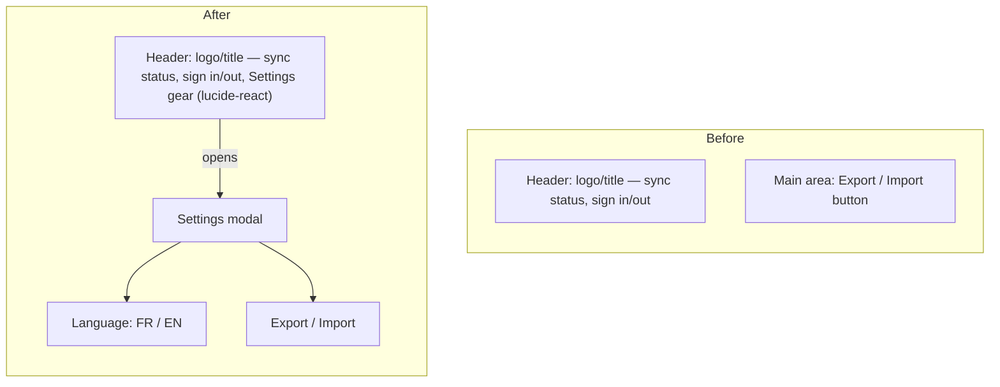
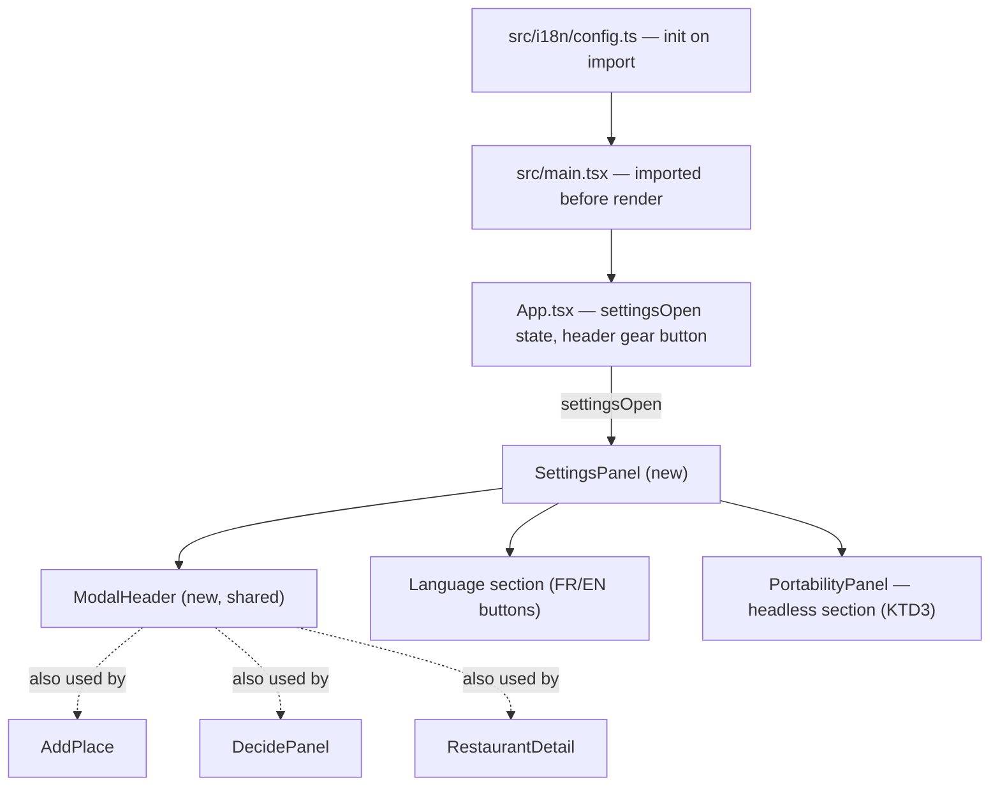
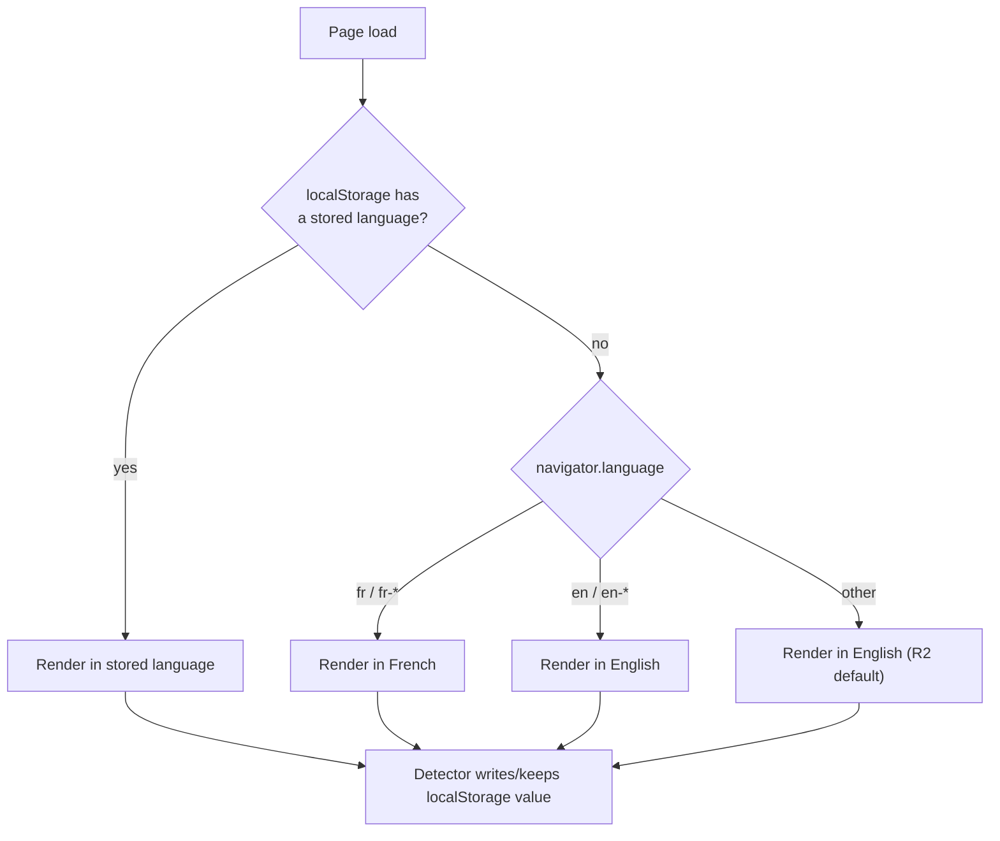

# Language & Settings Menu - Plan

## Goal Capsule

- **Objective:** Tablemarks is usable end-to-end in French or English, and the main area no longer carries a standalone Export/Import button competing with primary actions.
- **Means:** A new Paramètres (Settings) entry, opened from a gear icon in the header, reusing the app's existing Modal shell (KTD3), translated via react-i18next (KTD1), with the entry point rendered through `lucide-react` (KTD4).
- **Product authority:** The Product Contract below is authoritative for user-facing behavior; the Planning Contract and Implementation Units are authoritative for how it is built. No open product blocker remains.
- **Execution profile:** Standard-depth software plan, `execution: code`.
- **Stop conditions:** None. All origin questions are resolved below as Key Decisions or Key Technical Decisions.
- **Tail ownership:** An implementation unit is done only when `npm run lint` and `npm test` pass for it; `npm run build` is the final gate before the whole plan is considered shippable.

## Product Contract

### Summary

Tablemarks gains a Français/English language toggle that translates the entire app, plus a new Settings entry reachable from a header gear icon. Settings houses the language switch and the existing Export/Import actions, replacing today's standalone Export/Import button in the main area.

### Problem Frame

Every string in the app is currently hardcoded in English (`src/App.tsx` and throughout), with no translation mechanism. The main area also carries a full-width "Export / Import" button (`src/App.tsx:95-101`) that sits alongside primary actions despite being used rarely. Consolidating rarely-used actions behind a single Settings entry, and adding the language it should have had from the start, addresses both at once.

### Requirements

**Language & Localization**

- R1. The entire app UI translates fully between French and English: navigation, filters, forms, empty states, cuisine/status/verdict labels, and import/export feedback and error messages — not only the new Settings entry.
- R2. On first visit, before any manual choice, the displayed language is detected from the browser's language setting, defaulting to English when the browser reports neither French nor English.
- R3. The user can override the detected language at any time via a Language control in Settings; the choice persists for that device only (via local storage), not synced across devices or accounts — consistent with the app staying fully usable without signing in.
- R4. Verdict and Status labels use these exact French translations: *Go back* → *J'y retourne*; *Worth a detour* → *Vaut le détour*; *Once was enough* → *Une fois suffit*; *Never again* → *Plus jamais*; *to-try* → *à essayer*; *visited* → *visité*.
- R8. The document's `lang` attribute tracks the active language, so assistive technology and browser tooling read the correct language rather than staying fixed to English.

**Settings Menu & Navigation**

- R5. A Settings entry point (a gear/settings icon button) is added to the header, alongside the existing sync-status and sign-in/out controls.
- R6. Selecting the Settings icon opens a single panel, using the app's existing Modal shell, containing two sections: Language and Export/Import.
- R7. The standalone "Export / Import" button currently in the main area is removed; export and import behavior is unchanged, only its entry point moves into the Settings panel.

### Key Decisions

- **Browser auto-detect determines the default language.** Governs R2. (session-settled: user-directed — chosen over always-French or always-English as the default: user picked auto-detect among the three options presented)
- **Language persists per device via local storage, not per account.** Governs R3. Chosen to stay consistent with the app's local-first, no-account-required design. (session-settled: user-directed — chosen over syncing the preference to the account: user picked per-device after the sync trade-off was surfaced)
- **Verdict and Status wording is locked in now, not left for planning to invent.** Governs R4. (session-settled: user-approved — chosen over leaving the wording open for the user to supply separately: user approved the proposed French set as-is)
- **The Settings panel reuses the existing Modal shell rather than a new anchored dropdown.** Governs R5, R6. Avoids introducing a second UI primitive alongside the app's established bottom-sheet/centered Modal pattern already used for Add, Decide, and Portability. (session-settled: user-directed — chosen over an anchored header dropdown modeled on GrooveMark's menu: reuses an existing pattern instead of building a new one, and Export/Import would have needed its own modal regardless)
- **Cuisine translation is scoped to facet chrome only, not the curated/typed cuisine names.** Governs R1. Cuisine values are synced free-text data matched case-insensitively across devices and components (`src/features/facets/cuisines.ts`); translating the display names would need a display-vs-stored-value mapping layer disproportionate to this feature. Only the "Cuisine" facet heading and "Uncategorized" placeholder translate. (session-settled: user-approved — chosen over also translating the curated cuisine option names: surfaced as a planning-time call-out, user confirmed)
- **The translation sweep also fixes two pre-existing hardcoded French issues already in the filter bar: the expand/collapse toggle text ("Réduire" / "+N autres") and the mistranslated "Statut & verdict" group heading.** Governs R1. They sit in `src/features/facets/FilterBar.tsx`, a file R1's sweep already touches; fixing them now avoids shipping a known mixed-language bug. (session-settled: user-approved — chosen over deferring the fix to a separate bug ticket: surfaced as a planning-time call-out, user confirmed)

*Product Contract preservation: R1-R7 and the first four Key Decisions are unchanged from the brainstorm. R8 and the last two Key Decisions were added during planning; no existing requirement's intent was narrowed or reinterpreted.*

### Acceptance Examples

- AE1. **Covers R2.** **Given** a first-time visitor whose browser language is French, **When** they open the app with no prior manual choice, **Then** the UI displays in French.
- AE2. **Covers R2.** **Given** a first-time visitor whose browser language is neither French nor English (e.g. German), **When** they open the app, **Then** the UI displays in English.
- AE3. **Covers R3.** **Given** a user who manually switched to French on one device, **When** they open the app on a second device that has never had a manual choice made, **Then** the second device shows its own browser-detected language, not the first device's manual choice.

### Scope Boundaries

- No settings beyond Language and Export/Import (no theme, no account preferences) in this release.
- No language beyond French/English.
- No cross-device or cross-account sync of the language preference (see Key Decisions).
- Curated and user-entered cuisine names stay untranslated in both locales (see Key Decisions).

### Sources / Research

- Current header, no existing settings icon: `src/App.tsx:38-72`
- Current Export/Import entry point: `src/App.tsx:95-101`, opening `PortabilityPanel` inside the shared `Modal`: `src/features/ui/Modal.tsx:24-106`
- Centralized Verdict/Status label source (the one place R4 needs to change): `src/types/models.ts` (`VERDICT_LABELS`, `STATUS_LABELS`), fanning out to `src/features/display.ts`, `src/features/StatusBadge.tsx`, `src/features/facets/FilterBar.tsx`, `src/features/visits/RestaurantDetail.tsx`
- Cuisine values as synced free text, not a fixed enum: `src/features/facets/cuisines.ts`
- Pre-existing hardcoded French strings in an otherwise-English UI: `src/features/facets/FilterBar.tsx:168,176`
- Institutional learning: Export/Import's validate-then-commit reconcile wiring must not change when its entry point moves (`docs/solutions/architecture-patterns/import-as-reconcile-source-validate-then-commit.md`)
- Institutional learning: a local-only, non-synced device preference matches the app's existing local-first precedent (`docs/solutions/architecture-patterns/local-first-lww-sync-indexeddb-pocketbase.md`)
- No i18n library present before this plan (`package.json`); all UI strings were hardcoded in JSX

---

## Planning Contract

### Key Technical Decisions

- KTD1. **i18n library: react-i18next 17.x + i18next 26.x + i18next-browser-languagedetector 8.x, static JSON resources, no HTTP backend.** Governs R1. TypeScript keys are checked via module augmentation over the actual resource shape, matching the app's existing strict `tsc --noEmit` gate. (session-settled: user-approved — chosen over react-intl/FormatJS or Lingui: highest maturity and native Vite+TS fit, and a battle-tested detector plugin for the required browser-detect + localStorage + manual-override pattern)
- KTD2. **The language detector's caching accepts its library default: detection order `localStorage` then `navigator`, cache scoped to `localStorage` only.** Governs R2, R3. The first resolved language is written to local storage immediately and is indistinguishable from a manual choice on every later visit. (session-settled: user-approved — chosen over suppressing the auto-cache write to keep re-detecting the browser language on every load until an actual manual switch happens: matches AE1-AE3's first-visit/cross-device scope without extra code)
- KTD3. **`PortabilityPanel` loses its own Modal wrapper and becomes a headless section rendered inside the Settings panel's single Modal; one shared modal header/close-button component replaces the four copy-pasted title-bar blocks.** Governs R6, R7. (session-settled: user-approved — chosen over stacking two independent Modals or leaving five copies of the close-button markup: avoids undefined double-focus-trap/double-Escape-listener behavior and gives the "Close" label one translation key instead of five)
- KTD4. **The Settings icon renders via `lucide-react`'s Settings glyph — the app's first SVG icon dependency — rather than an emoji glyph matching the existing ✕/+/🍴 convention.** Governs R5. (session-settled: user-directed — chosen over emoji-glyph consistency and over the originally-named `lucide-vue-next`, which is Vue-only and incompatible with this React app)
- KTD5. **`document.documentElement.lang` tracks the active i18next language, updated on init and on every `languageChanged` event.** Governs R8. (session-settled: user-approved — chosen over leaving `lang="en"` static: avoids an accessibility/SEO regression once the UI can render in French)

### High-Level Technical Design

**Component wiring.** The i18n runtime initializes once, before the app renders, and every other piece reads from it through the standard hook rather than its own state.

**Language resolution at load.** Reflects KTD2's accepted detector behavior.

### Assumptions

- The PWA's precache already covers the translated strings, since resources are bundled as static JS imports rather than fetched from an HTTP backend; no `vite-plugin-pwa` config change is needed for this plan.
- No ESLint config exists in this repo; `npm run lint` (`tsc --noEmit`) is the only static gate, and `npm test` (`vitest run`) is the test command referenced throughout this plan.

---

## Implementation Units

### U1. i18n bootstrap and locale scaffolding

- **Goal:** Stand up the i18n runtime so every other unit can call a translation hook.
- **Requirements:** R1, R2, R3, R8. Governed by KTD1, KTD2, KTD5.
- **Dependencies:** None.
- **Files:**
  - `package.json` (add `react-i18next`, `i18next`, `i18next-browser-languagedetector`)
  - `tsconfig.json` (enable `resolveJsonModule`)
  - `src/i18n/config.ts` (new)
  - `src/i18n/resources.ts` (new)
  - `src/i18n/locales/en/translation.json` (new)
  - `src/i18n/locales/fr/translation.json` (new)
  - `src/types/i18next.d.ts` (new)
  - `src/main.tsx` (modify)
- **Approach:**
  1. Add the three i18n packages, keeping their versions in step per KTD1 (a version mismatch between `react-i18next` and `i18next` breaks peer resolution).
  2. Enable `resolveJsonModule` so the locale JSON files type-check under the existing strict build.
  3. Initialize i18next as a side-effect import in `main.tsx`, before the first render, using the detector configuration from KTD2 and static resources per KTD1.
  4. Augment the i18next module's types against the actual resource shape so `t()` keys are compile-checked.
  5. Subscribe to the `languageChanged` event to keep `document.documentElement.lang` current, per KTD5.
- **Test scenarios:**
  - Happy path: the app renders in the detected or persisted language on load. Covers AE1, AE2.
  - Edge case: no stored preference and an unsupported browser language falls back to English. Covers AE2.
  - Edge case: a stored preference from an earlier manual choice wins over the current browser language. Covers AE3.
  - Error path: local storage is unavailable (private browsing, quota exceeded, or disabled) — the detector falls back to browser-language detection alone, without throwing.
  - Integration: switching language updates `document.documentElement.lang` and local storage together.
- **Verification:** `npm run lint` passes with `resolveJsonModule` enabled; a smoke test renders the app tree once per locale.

### U2. Locale content: full string inventory

- **Goal:** Move every current hardcoded string into the two locale files behind translation keys.
- **Requirements:** R1, R4. Governed by the cuisine-scope and filter-bar Key Decisions above.
- **Dependencies:** U1.
- **Files:**
  - `src/i18n/locales/en/translation.json`, `src/i18n/locales/fr/translation.json` (extended)
  - `src/App.tsx`
  - `src/features/portability/PortabilityPanel.tsx`
  - `src/features/capture/AddPlace.tsx`
  - `src/features/decide/DecidePanel.tsx`
  - `src/features/visits/RestaurantDetail.tsx`
  - `src/features/facets/FilterBar.tsx`
  - `src/features/RestaurantList.tsx`
  - `src/features/sync/SyncStatusIndicator.tsx`
  - `src/features/pwa/ReloadPrompt.tsx`
  - `src/features/map/MapView.tsx`
  - `src/features/display.ts`
  - `src/features/StatusBadge.tsx`
  - `src/features/map/markers.ts`
  - `src/types/models.ts`
  - The 11 existing `*.test.tsx` files that assert on strings this unit replaces (one per component above that has a colocated test), plus `src/test/setup.ts`
- **Approach:**
  1. Organize translation keys by namespace mirroring the app's own feature areas (shell, capture, decide, visit detail, filters, portability, sync, pwa); a `settings` namespace is added later by U4, once `SettingsPanel` exists.
  2. Turn `VERDICT_LABELS` and `STATUS_LABELS` into locale-aware lookups resolved through the translation hook, using the French wording fixed by R4.
  3. Fix the filter bar's two pre-existing hardcoded French issues (the toggle text and the group heading) in the same pass.
  4. Leave cuisine option names in `cuisines.ts` untranslated; only the "Cuisine" heading and "Uncategorized" placeholder route through the hook.
  5. `display.ts`, `StatusBadge.tsx`, and `markers.ts` read the label constants from plain, non-component functions, so resolve their strings through i18next's instance API (`i18n.t()`, imported from `src/i18n/config.ts`) rather than the `useTranslation` hook. Add the active language (`i18n.language`) to `App.tsx`'s marker-building `useMemo` dependency array so map popups re-translate on a language switch without a reload.
  6. Add a global passthrough `t()` mock (e.g. `vi.mock('react-i18next', ...)`) to `src/test/setup.ts`, then update every existing test's string-based `getByText`/`getByRole(name:)` assertions to match what the mock resolves to, so the pre-existing suite keeps passing after the key migration.
- **Test scenarios:**
  - Happy path: switching language re-renders visible text in every touched component without a reload.
  - Edge case: Verdict and Status labels render the exact French wording from R4.
  - Edge case: the filter bar shows no French text when the active language is English.
  - Edge case: a map marker's popup text re-renders in the new language immediately after a language switch, with no page reload.
  - Integration: cuisine chips keep matching and filtering correctly in both locales, since their names stay untranslated.
  - Integration: the full pre-existing test suite passes against the global passthrough mock after the key migration.
- **Verification:** existing component test suites pass with translation-aware assertions; a targeted search confirms no hardcoded English or French string remains outside the locale JSON files.

### U3. Shared modal chrome extraction

- **Goal:** Replace four copy-pasted modal title-bar/close-button blocks with one shared component, and de-modalize `PortabilityPanel`.
- **Requirements:** R6, R7. Governed by KTD3.
- **Dependencies:** U1 (for the Close label's translation key).
- **Files:**
  - `src/features/ui/ModalHeader.tsx` (new)
  - `src/features/capture/AddPlace.tsx`
  - `src/features/decide/DecidePanel.tsx`
  - `src/features/visits/RestaurantDetail.tsx`
  - `src/features/portability/PortabilityPanel.tsx`
- **Approach:**
  1. Extract the existing title-plus-close-button markup into one component taking a title and an `onClose` callback.
  2. Swap all four current call sites to use it.
  3. Remove `PortabilityPanel`'s own `Modal` wrapper so it renders as a plain section; keep every internal handler (export, import, validate-then-commit wiring) untouched, per the existing reconcile-boundary learning.
- **Test scenarios:**
  - Happy path: each of the four panels still opens, closes on Escape or backdrop click, and traps focus exactly as the existing Modal shell tests verify.
  - Edge case: the Portability section renders correctly with no backdrop or focus trap of its own when nested inside Settings.
  - Integration: Portability's export and import behavior (success and error paths) is unchanged after losing its own Modal wrapper.
- **Verification:** the Modal shell's tests and the four panels' existing test suites still pass, unchanged in behavior, only in how they mount their header.

### U4. Settings panel and header entry point

- **Goal:** Add the gear-icon entry point and the Settings panel that hosts Language and Export/Import.
- **Requirements:** R1, R3, R5, R6, R7. Governed by KTD4.
- **Dependencies:** U1, U3.
- **Files:**
  - `package.json` (add `lucide-react`)
  - `src/App.tsx` (modify: new state, header button, remove the old Export/Import trigger)
  - `src/features/settings/SettingsPanel.tsx` (new)
  - `src/i18n/locales/en/translation.json`, `src/i18n/locales/fr/translation.json` (extended with a new `settings` namespace)
- **Approach:**
  1. Add `lucide-react` as a dependency, the app's first SVG icon library (KTD4).
  2. Add a `settingsOpen` boolean state in `App.tsx`, following the same pattern as the existing `adding`/`deciding`/`portability` flags.
  3. Render a header button using `lucide-react`'s Settings icon as a sibling of the header's `signedIn` conditional block (`src/App.tsx`'s signed-in vs. signed-out branches), not nested inside either branch, so it appears regardless of auth state per R5.
  4. Add a `settings` translation namespace and route every string `SettingsPanel` itself introduces — the Language and Export/Import section headings, the two language buttons' labels, and the gear button's own accessible name — through the translation hook, per R1.
  5. Build `SettingsPanel` on the shared Modal shell (via `ModalHeader` from U3) with two sections: a Language control (two mutually exclusive buttons calling the language-switch function from U1) and the de-modalized `PortabilityPanel` content from U3. Label the two buttons with fixed, native names ("Français" / "English") that do not themselves translate with the active locale, and mark the active one with `aria-pressed`, matching the existing filter-chip toggle convention (`FilterBar.tsx`'s `Chip` component).
  6. Remove the old standalone "Export / Import" button and its direct `PortabilityPanel` render from `App.tsx`.
- **Test scenarios:**
  - Happy path: clicking the gear icon opens Settings; clicking a language button switches language and updates `aria-pressed` on the active button.
  - Edge case: the gear icon is present and opens Settings in both the signed-in and signed-out header layouts.
  - Edge case: the gear button exposes a translated accessible name (not a bare icon with no label).
  - Edge case: the old standalone Export/Import button no longer exists in the rendered header or main area.
  - Integration: opening Export/Import from inside Settings behaves identically to the old standalone flow (same success, error, and summary states).
  - Covers AE1, AE2, AE3 at the UI level (displayed language matches the detection/override rules).
- **Verification:** an App-level test asserts the gear icon is present in both auth states with a translated accessible name, opens Settings, and that Export/Import is reachable only from within it.

### U5. Locale-persistence integration tests

- **Goal:** Prove the detection, override, and persistence contract end-to-end, not just per component.
- **Requirements:** R2, R3. Covers AE1, AE2, AE3.
- **Dependencies:** U1, U4.
- **Files:** `src/i18n/config.test.ts` (new), using the real `I18nextProvider` and a mocked `navigator.language` / `localStorage`, unlike the passthrough `t()` mock used elsewhere in the suite.
- **Execution note:** Write this alongside U1's init code — detector and local-storage behavior is easy to get subtly wrong and hard to notice without a real-provider test.
- **Test scenarios:**
  - Covers AE1: browser language French, no stored preference, renders French.
  - Covers AE2: browser language neither French nor English, no stored preference, renders English.
  - Covers AE3: a stored preference on one simulated device does not affect a second simulated device with its own empty storage.
- **Verification:** this is the one test file in the suite exercising real i18next initialization; it passes in isolation without depending on other suites' mocked `t()`.

---

## Verification Contract

| Command | Purpose |
|---|---|
| `npm run lint` | `tsc --noEmit` — the repo's only static gate; must pass with `resolveJsonModule` enabled and the new i18next type augmentation in place |
| `npm test` | `vitest run` — full suite, including U5's real-provider integration test |
| `npm run build` | `tsc --noEmit && vite build` — final gate; also proves the locale JSON imports resolve correctly in a production build |

## Definition of Done

- All five units land; `npm run lint`, `npm test`, and `npm run build` all pass.
- No hardcoded English or French UI string remains outside `src/i18n/locales/*/translation.json` (confirmed by a targeted search, per U2's verification).
- The standalone "Export / Import" button no longer exists; Export/Import is reachable only from the Settings panel.
- The Settings gear icon is reachable in the header on both mobile and desktop breakpoints.
- AE1, AE2, and AE3 all hold, proven by U5's integration tests.
- Any dead-end code from an approach that didn't pan out (e.g., an abandoned dropdown attempt) is removed, not left in the diff.

## Open Questions

- **Deferred to Implementation:** `RestaurantDetail`'s title bar (`items-start`, `text-lg`, `mb-1`, a dynamic restaurant-name heading) differs visually from the other three panels' (`items-center`, `text-base`, `mb-2`/`mb-3`, a static label) that U3's shared `ModalHeader` is built from. The implementer decides whether to normalize `RestaurantDetail` to the shared style or give `ModalHeader` a style variant, as long as the restaurant-name heading doesn't silently shrink or re-align.

## Risks & Dependencies

- **Peer-dependency drift:** `react-i18next` 17.x requires `i18next` ≥ 26.2.0. Installing them at different times risks a mismatched pair; install all three i18n packages together (KTD1).
- **PWA precache:** translations are bundled as static JS imports, so `vite-plugin-pwa`'s existing precache already covers them with no extra config. If a future change moves to an HTTP-loaded backend for code-splitting, the locale JSON files would need to be added to the precache list explicitly.
