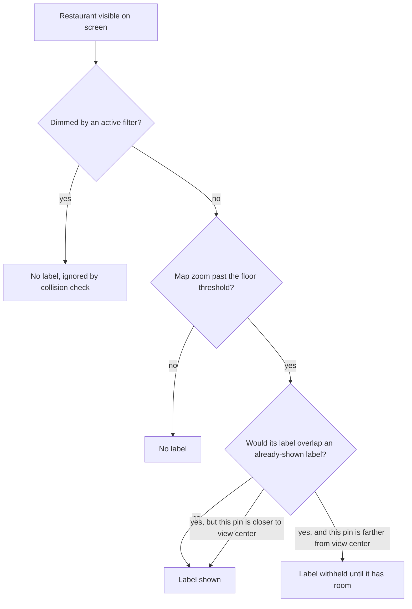
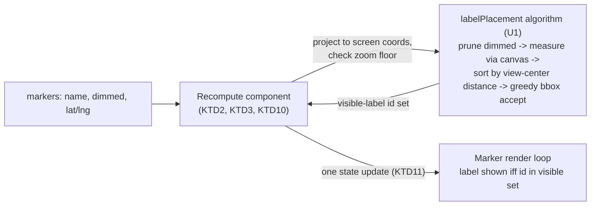

# Restaurant Names on the Map - Plan

## Goal Capsule

- **Objective:** A user browsing a wide view of the map can identify restaurants by name at a glance, without tapping each pin one at a time, once there's enough room on screen to show them.
- **Means:** A hand-rolled, view-center-priority label decluttering pass (KTD1, KTD4, KTD6), driven by a new `zoomend`/`moveend`-subscribed component modeled on the existing `CenterReporter` pattern (KTD2, KTD3).
- **Product authority:** The Product Contract below is authoritative for user-facing behavior; the Planning Contract and Implementation Units are authoritative for how it is built. No open product blocker remains.
- **Execution profile:** Standard-depth software plan, `execution: code`.
- **Stop conditions:** None. All origin questions are resolved below as Key Decisions or Key Technical Decisions.
- **Tail ownership:** An implementation unit is done only when `npm run lint` and `npm test` pass for it; `npm run build` is the final gate before the whole plan is considered shippable.

## Product Contract

### Summary

Restaurant names appear directly on the map once there's room to show them, prioritizing pins near the center of the current view and skipping names that would overlap already-shown ones — the same label-density feel as Google Maps' place labels. Filtered-out (dimmed) restaurants stay unlabeled and don't compete for label space.

### Problem Frame

Today the map (`src/features/map/MapView.tsx`) shows only colored teardrop pins with no visible text; a restaurant's name only appears inside its popup after tapping the pin (`MapView.tsx:126-130`). That's fine when looking at one restaurant up close, but a wide view of a city or neighborhood is hard to read — every pin looks the same until tapped through one by one.

### Requirements

- R1. Once the map is zoomed past a floor threshold, each visible, non-dimmed restaurant's name becomes eligible to display as a label attached to its pin.
- R2. Below that floor threshold, no restaurant names show as map labels, regardless of how much visual space is available.
- R3. When two or more eligible labels would visually overlap, the label for whichever pin is closer to the center of the current map view is shown and the other is withheld; a withheld label reappears once further zooming or panning gives it room without overlapping a currently shown label.
- R4. Dimmed/filtered-out restaurants (per the active facet filters) never display a name label, and do not count as occupying space when deciding whether a nearby non-dimmed restaurant's label fits.
- R5. There is no user-facing setting to turn map name labels on or off — the behavior in R1-R4 is always active once the zoom floor is reached.

**Key Flows omitted:** this is a continuous rendering rule that holds at every zoom/pan/filter state rather than a discrete multi-step interaction — the diagram above plus R1-R4 and the Acceptance Examples below fully describe the behavior without a separate flow.

### Key Decisions

- **Dynamic, collision-based decluttering instead of a fixed always-on-past-threshold display.** Governs R1, R3. Avoids overlapping names in dense clusters, at the cost of some labels only appearing once zoomed in further. (session-settled: user-directed — chosen over a simple fixed-zoom cutoff that shows all visible names regardless of overlap: compared side-by-side in a visual sketch, user preferred no overlapping text)
- **A zoom floor exists below which no labels ever show.** Governs R2. Keeps a dezoomed regional/city-wide view free of label clutter even where a restaurant happens to sit in isolation with room to spare. The exact zoom value is a tunable default (see U2). (session-settled: user-directed — chosen over letting available space alone decide, with no floor)
- **Label priority goes to whichever pin is closest to the center of the current view.** Governs R3. (session-settled: user-directed — chosen over prioritizing by restaurant status, or an arbitrary/stable order)
- **Dimmed/filtered restaurants never get a name label.** Governs R4. (session-settled: user-directed — chosen over showing labels for all visible restaurants regardless of active filters, since dimmed restaurants are already visually secondary)
- **Dimmed/filtered restaurants also don't occupy label space in the collision calculation.** Governs R4. Keeps a filtered-out restaurant from silently blocking a neighboring active restaurant's label. (session-settled: user-approved — surfaced as a call-out during scoping, user confirmed as proposed)
- **No Settings toggle to disable map labels.** Governs R5. Keeps the feature simple with no new control surface, and matches Google Maps' own lack of such a switch; can be revisited later if it proves too busy in practice. (session-settled: user-directed — chosen over adding an on/off switch to the existing Settings panel)
- **A marker's own on-map label follows the same priority/collision rules as any other marker, even while its own popup is open — no special-casing.** Governs R3. (session-settled: user-directed — chosen over hiding the label while its popup is open: keeps the rule simple and avoids an exception that would only rarely matter)

*Product Contract preservation: R1-R5 and the first six Key Decisions are unchanged from the brainstorm. The seventh Key Decision (a marker's own label ignores its popup-open state) was added during planning to close a gap flow analysis surfaced; no existing requirement's intent was narrowed or reinterpreted.*

### Acceptance Examples

- AE1. **Covers R1, R2.** **Given** the map is zoomed below the floor threshold, **When** restaurants are visible on screen, **Then** none of them show a name label.
- AE2. **Covers R1, R3.** **Given** the map is zoomed past the floor threshold with two restaurants far enough apart that their labels wouldn't overlap, **When** both are visible, **Then** both display their name label.
- AE3. **Covers R3.** **Given** two restaurants close enough that their labels would overlap, **When** the map is at a zoom level where only one label fits, **Then** the label is shown for whichever restaurant's pin is closer to the center of the current view, and the other pin shows no label.
- AE4. **Covers R3.** **Given** a restaurant's label was withheld due to overlap, **When** the user zooms in further so the overlap resolves, **Then** its label appears.
- AE5. **Covers R4.** **Given** a restaurant is dimmed by an active facet filter, **When** the map is zoomed past the floor threshold, **Then** that restaurant never shows a name label, even if there would otherwise be room.
- AE6. **Covers R4.** **Given** a dimmed restaurant sits close to a non-dimmed restaurant, **When** there's only room for one label between them, **Then** the non-dimmed restaurant's label is shown, unaffected by the dimmed one's presence.
- AE7. **Covers R3, seventh Key Decision.** **Given** a restaurant's popup is open (tapped), **When** the map recomputes label visibility, **Then** that restaurant's label follows the same priority/collision outcome as if the popup were closed — no forced show or forced hide because of the open popup.

### Scope Boundaries

- No user-facing setting to enable or disable map name labels (R5) — the behavior is always on past the zoom floor.
- Visual styling of a label (offset from pin, background, font, truncation for long names) is an implementation detail of U3, not fixed here.
- No debounce/hysteresis band at the exact zoom-floor boundary — a slow zoom right at the threshold can flicker labels on/off; accepted for v1 (KTD9).

### Dependencies / Assumptions

- Marker count and density in normal use stays small (a personal saved-places list, not a dense city-wide POI dataset), so the pairwise collision check chosen in KTD1 is workable without a spatial index; no requirement here depends on a specific performance target.

---

## Planning Contract

### Key Technical Decisions

- KTD1. **Hand-rolled collision detection (pairwise bounding-box overlap), not a third-party Leaflet plugin.** Governs R1, R3. (session-settled: user-directed — chosen over adopting an existing Leaflet plugin: none of the candidates found (`Leaflet.LayerGroup.Collision`, `Leaflet.LabelTextCollision`, `leaflet-tooltip-layout`, `leaflet-inflatable-markers-group`) support distance-to-view-center priority — the closest match is archived (Nov 2024), collides marker icons rather than label text, and uses a static insertion-order priority; a plain O(n²) pairwise check needs no spatial index at this marker count)
- KTD2. **A new logic-only component modeled on the existing `CenterReporter` pattern** (`src/features/map/MapView.tsx:51-70`): `useMap()`, latest inputs held in a ref so the effect dependency stays just `[map]`, event subscribe in a mount effect with `.off` cleanup, and one computation on mount (mirrors `CenterReporter`'s emit-on-mount, `MapView.tsx:63`) so labels aren't silently absent when the map first renders already past the zoom floor. Governs R1, R2, R3, R4.
- KTD3. **Recompute is bound to `zoomend` and `moveend`, never continuous `zoom`/`move`.** Avoids recomputing every animation frame during a pinch/pan gesture — a perf issue the closest candidate plugin's own README flags. Governs R1, R2, R3.
- KTD4. **Label width is measured via a single offscreen `canvas.measureText()` call per unique name+font, cached, not `getBoundingClientRect()` on live DOM.** Avoids forced synchronous layout on every recompute. Governs R3.
- KTD5. **Dimmed/filtered restaurants are pruned from the candidate list once, before the collision pass runs — not re-checked inside the collision loop.** Mirrors the repo's existing convention of normalizing/pruning expensive per-item state once at a boundary rather than at each read site (`docs/solutions/design-patterns/normalize-filter-selection-keys-at-the-boundary.md`). Governs R4.
- KTD6. **Tie-break for exactly-equal distance-to-center: stable sort by marker id.** Prevents label flicker between recomputes when two candidates are equidistant. Governs R3.
- KTD7. **"Closer to the view center" means the geometric center of the Leaflet map pane**, not a version adjusted for overlay UI (the locate button, the mobile List/Map toggle bar). Governs R3. (session-settled: user-approved — surfaced as a call-out during scoping, user confirmed as proposed)
- KTD8. **The exact zoom floor value is a tunable constant, not fixed by this plan** — start near zoom 14 (matches the illustrative value used in the brainstorm's visual probe) and adjust visually during implementation (see U2). Governs R2.
- KTD9. **No debounce/hysteresis band at the exact zoom-floor boundary in v1.** Simplest default; revisit if flicker at the threshold proves noticeable in practice. Governs R2. (session-settled: user-approved — surfaced as a call-out during scoping, user confirmed as proposed)
- KTD10. **Recompute also fires on a facet-filter change, on the restaurant list changing (add/delete/edit/import), and when the mobile List pane switches back to Map** — not only on `zoomend`/`moveend`. The filter/data trigger reuses the same markers-prop-change idiom `Recenter` already uses (`MapView.tsx:38-48`); the pane-restore trigger reuses the same call site as the existing `invalidateSize()` call for pane-visibility restore. Governs R3, R4.
- KTD11. **One state update per recompute (a single visible-label-id set), not one state update per marker.** Keeps high-frequency, Leaflet-driven updates from cascading through every marker component's render. Governs R1, R3.
- KTD12. **Tests extend the existing shared `react-leaflet` mock** (`src/features/map/MapView.test.tsx:9-28`, duplicated in `src/App.test.tsx:14-31`) with `on`/`off` spies capable of firing `zoomend`, keeping the mock's stable-map-instance-object convention — a fresh mock object per render previously caused a silent infinite effect loop that hung the test suite (`docs/solutions/conventions/react-leaflet-test-mock-stability.md`).

### High-Level Technical Design

The Recompute component (U2) owns Leaflet-facing concerns (projection, event subscription, trigger points); the placement algorithm (U1) is a pure function with no Leaflet or DOM dependency beyond an injectable text-measurer, so it is unit-testable in isolation.

### Assumptions

None beyond the Product Contract's Dependencies / Assumptions above — this section intentionally carries no additional planning-only assumptions.

---

## Implementation Units

### U1. Label placement algorithm

- **Goal:** A pure, framework-agnostic function that decides which candidate restaurants get a visible label, given their screen-projected positions and the current zoom-floor status. This is the algorithm underlying R1-R4.
- **Requirements:** R1, R2, R3, R4. Governed by KTD1, KTD4, KTD5, KTD6.
- **Dependencies:** None.
- **Files:**
  - `src/features/map/labelPlacement.ts` (new)
  - `src/features/map/labelPlacement.test.ts` (new)
- **Approach:**
  1. Accept a list of `{ id, x, y, name, dimmed }` in screen-pixel space (already projected by the caller), a `viewCenter: { x, y }`, and a `zoomFloorMet: boolean`.
  2. Exclude every `dimmed` entry before any further step (KTD5).
  3. If `!zoomFloorMet`, return an empty accepted-id set (R2).
  4. Measure each remaining candidate's label bounding box using a memoized `canvas.measureText()` width cache keyed by name+font (KTD4).
  5. Sort candidates by distance to `viewCenter` ascending; break exact ties by a stable sort on `id` (KTD6).
  6. Walk the sorted list, greedily accepting each candidate whose label box does not overlap any already-accepted box (KTD1); return the accepted id set.
- **Patterns to follow:** None existing in this codebase for this problem (confirmed net-new); the boundary-pruning idiom in KTD5 follows `docs/solutions/design-patterns/normalize-filter-selection-keys-at-the-boundary.md`.
- **Test scenarios:**
  - Below zoom floor returns an empty set. Covers AE1.
  - Two well-separated candidates above the floor: both accepted. Covers AE2.
  - Two overlapping candidates: the one nearer `viewCenter` is accepted, the other is not. Covers AE3.
  - A dimmed candidate is never accepted even with room, and does not block a nearby non-dimmed candidate from being accepted. Covers AE5, AE6.
  - Two candidates at exactly equal distance from `viewCenter`: the winner is deterministic (same result across repeated calls with the same input).
  - Empty candidate list returns an empty set without error.
- **Verification:** All test scenarios above pass; the function takes no Leaflet or DOM import except an injectable text-measurer, confirmed by inspection.

### U2. Zoom/pan/data-driven recompute wiring

- **Goal:** A logic-only component that projects markers to screen space and calls U1 on every trigger that should change label visibility, exposing the current visible-label id set.
- **Requirements:** R1, R2, R3, R4. Governed by KTD2, KTD3, KTD8, KTD10, KTD11.
- **Dependencies:** U1.
- **Files:**
  - `src/features/map/MapView.tsx` (modify — add the component alongside `Recenter` and `CenterReporter`)
  - `src/features/map/MapView.test.tsx` (modify — extend the shared mock per KTD12)
- **Approach:**
  1. New component calls `useMap()` once and holds the latest `markers` and zoom-floor constant in a ref, mirroring `CenterReporter` (`MapView.tsx:51-70`).
  2. `recompute()` reads `map.getZoom()`, projects each marker via `map.latLngToContainerPoint()`, reads `map.getSize()` for the pane center (KTD7), and calls U1's placement function; the result is set as a single Set-valued state update (KTD11).
  3. Subscribe `map.on('zoomend', recompute)` and `map.on('moveend', recompute)` in a mount effect; clean up with `.off` on unmount (KTD3, KTD12).
  4. Call `recompute()` once synchronously on mount, before any event fires (mirrors `CenterReporter`'s emit-on-mount, `MapView.tsx:63`).
  5. Re-run `recompute()` when the `markers` prop reference changes, following the same dependency idiom `Recenter` uses for reacting to `markers` (`MapView.tsx:38-48`) — this covers both a facet-filter toggle and a restaurant add/delete/edit/import (KTD10).
  6. Locate the existing call site that invokes `invalidateSize()` when the mobile List pane switches back to Map, and call `recompute()` there too (KTD10). *(Deferred to implementation: the exact file/line of that call site was not located during planning — search for `invalidateSize` in the top-level view/pane-toggle component.)*
  7. Start the zoom-floor constant at zoom 14 (KTD8); expose it as a single named constant so it is easy to retune.
- **Test scenarios:**
  - Simulated `zoomend` with mocked `getZoom()` below vs. above the floor toggles the visible-set state accordingly. Covers AE1, AE2.
  - Simulated `moveend` after a simulated pan (mocked `latLngToContainerPoint` returning new coordinates) recomputes the priority order. Covers AE3, AE4.
  - A `markers` prop change (simulating a filter toggle or a restaurant edit) triggers a recompute without any zoom/pan event firing. Covers AE5, AE6.
  - Mounting with a mocked `getZoom()` already above the floor computes labels immediately, with no event required.
  - Unmounting calls `map.off` for both `zoomend` and `moveend` (regression guard against the mock-stability pitfall in KTD12).
- **Verification:** All test scenarios above pass; the extended mock does not hang the test suite (per `docs/solutions/conventions/react-leaflet-test-mock-stability.md`).

### U3. Render on-map name labels

- **Goal:** Render the visible-label set from U2 as text next to each eligible marker's pin, styled to read clearly against the map, coexisting with a marker's own popup with no special-casing.
- **Requirements:** R1, R3, R5. Governed by KTD7, seventh Key Decision (Product Contract).
- **Dependencies:** U2.
- **Files:**
  - `src/features/map/MapView.tsx` (modify — marker-rendering loop, `MapView.tsx:118-132`)
  - `src/features/map/MapView.test.tsx` (modify)
- **Approach:**
  1. In the existing marker-rendering loop, render a label element next to any marker whose id is in U2's visible-label set.
  2. Style as small, legible text with a background readable against map tiles; no existing component in this codebase is an exact match (`FilterBar.tsx`'s pill/chip conventions are the closest reference, not a direct reuse), so this is new UI, not new user-facing configuration (R5 is satisfied by adding no control at all).
  3. Do not read `selectedId` or popup-open state anywhere in this rendering path (seventh Key Decision) — the label's visibility is entirely determined by U2's set.
  4. Coordinate z-index against Leaflet's internal panes if the label renders as an HTML overlay rather than inside the marker's own pane, following the existing precedent (`z-[1000]` on the map's overlay button, `MapView.tsx:139`).
- **Test scenarios:**
  - A marker in the visible-label set renders its name as on-map text.
  - A marker not in the visible-label set renders no on-map name text (its name remains available only in its Popup on tap). Covers AE1, AE3.
  - Selecting/tapping a marker (opening its popup) does not change whether its own label shows, compared to the same state with the popup closed. Covers AE7.
  - A dimmed marker never renders an on-map label, even if it would otherwise be in U2's computed set (defense-in-depth check). Covers AE5.
- **Verification:** All test scenarios above pass; existing marker/popup tests (`MapView.test.tsx:36-50`) show no regression.

---

## Verification Contract

| Command | Applies to | Gate |
|---|---|---|
| `npm test` | U1, U2, U3 | All new and existing tests pass. |
| `npm run lint` (`tsc --noEmit`) | U1, U2, U3 | No type errors. |
| `npm run build` | Whole plan | Final gate before shipping; production build succeeds. |

No `release:validate` or behavioral skill evaluation applies to this repo.

## Definition of Done

- All Acceptance Examples (AE1-AE7) are demonstrated by passing tests.
- `npm test`, `npm run lint`, and `npm run build` all pass.
- No dead-end or experimental code from an abandoned approach remains in the diff.
- The `invalidateSize()` call site referenced in U2 has been located and wired to `recompute()`, or an explicit note recorded if the mobile List/Map toggle turns out not to exist in the form assumed.
