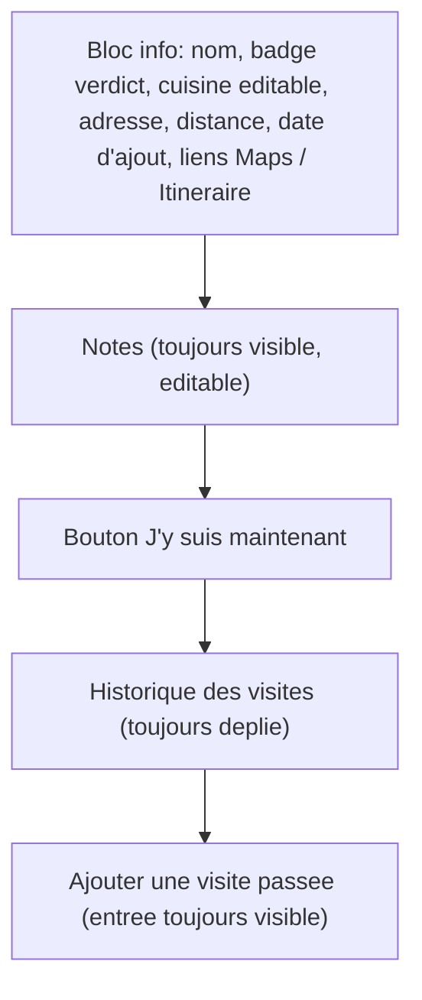
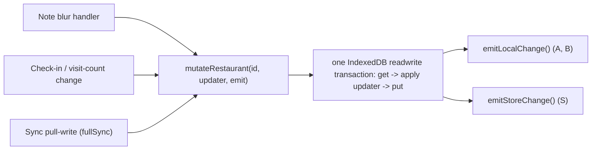

# Restaurant Modal Redesign - Plan

## Goal Capsule

- **Objective:** Opening a restaurant's detail view surfaces its identity, location, and personal notes as one clearly grouped block, shows how it was added and how far it is when that data exists, and keeps the check-in action and visit history each legible on their own — instead of parsing an undifferentiated stack of fields.
- **Means:** Rebuild `RestaurantDetail.tsx` around one info block (identity + location + Maps links), an always-visible notes field, the check-in action, and an always-expanded visit history — reusing the app's existing distance, Maps-link, and cuisine-edit mechanisms, and adding UI for the `Restaurant.note` field and a new `added` creation-date field that don't exist today (KTD1-KTD4).
- **Product authority:** The Product Contract below is authoritative for user-facing behavior; the Planning Contract is authoritative on mechanism. No open product blocker remains.
- **Execution profile:** Standard software feature work; scoped to one modal component plus its data-layer plumbing.
- **Open blockers:** None. Ready for implementation.

---

## Product Contract

**Product Contract preservation:** unchanged for R1-R8, Key Decisions, Scope Boundaries, and Acceptance Examples. The Dependencies / Assumptions bullet about the new field's exact naming and migration mechanics is now resolved (Planning Contract KTD1-KTD4, KTD10) and reworded below — no scope change.

### Summary

Rebuild the restaurant detail modal around one info block (verdict, cuisine — editable in place —, address, distance and added date when available, the existing Google Maps / Go-to links), followed by an always-visible restaurant-level notes field, the check-in button, and a visit-history list that stays fully expanded and ends in an always-visible "add a past visit" entry — replacing today's flat, undifferentiated stack of fields.

### Problem Frame

`RestaurantDetail.tsx` (`src/features/visits/RestaurantDetail.tsx:82-203`) renders six elements in a flat vertical stack with no visual grouping: a status+address line, conditional Maps/Go-to links, an editable cuisine input, the check-in button, the visit list, and a collapsed "add a past visit" disclosure — each gets its own margin but nothing distinguishes "who/where this place is," "editable personal detail," and "visit history" as separate zones. Two fields the data model already carries — `Restaurant.note` and `Visit.note` (`src/types/models.ts:62,76`) — have never gotten UI. Distance-from-current-position, already computed for the main list (`src/lib/geo.ts`, used at `src/features/RestaurantList.tsx:60-63`), isn't threaded into this modal. And nothing records when a restaurant was added, so there's no way to show that either.

### Requirements

**Nouveau contenu**

- R1. The modal shows a free-text notes field for the restaurant as a whole (backed by the existing `Restaurant.note` field), editable in place and saved the same way the existing cuisine field already saves (on blur/Enter).
- R2. When the device's current position is available and the restaurant has resolved coordinates, the modal shows the distance between them, formatted the same way the main list already formats it.
- R3. When a restaurant has a recorded creation date, the modal shows it; a restaurant with no recorded creation date shows no added-date line at all.

**Disposition**

- R4. The modal groups the restaurant's identity and location detail into one visually distinct info block: name, status/verdict badge, cuisine (tap to edit in place), address, distance (R2), added date (R3), and the existing Google Maps / Go-to action links.
- R5. The notes field (R1) renders immediately below the info block, always visible, never behind a disclosure toggle.
- R6. The check-in ("I'm here now") flow keeps its current behavior, positioned below the notes field.
- R7. The visit history renders as a chronological, always-expanded list, most recent visit first — never collapsed behind a disclosure — with each entry showing its verdict and date as today.
- R8. Adding a past visit is reachable as an always-visible entry at the end of the visit history, not behind a collapsed disclosure as today; tapping it reveals the date input and verdict buttons the same way the current disclosure does.

### Key Decisions

- **The notes field is restaurant-level only, not per-visit** (session-settled: user-directed — chosen over a per-visit note or both, keeping the visit-logging flow simple). Governs R1.
- **A restaurant with no recorded creation date shows no added-date line, rather than an approximate or backfilled one** (session-settled: user-directed — chosen over a generic "added before [ship date]" label or reusing the existing `updated` timestamp as an approximation; no creation timestamp exists anywhere today, locally or on the PocketBase remote, so any displayed value for a pre-existing restaurant would be fabricated). Governs R3.
- **Layout direction: one info block, always-visible notes, and an always-expanded visit history, chosen after comparing three sketched directions** (session-settled: user-directed — chosen over (a) condensing the info into an icon-only meta strip with the visit history collapsed by default, and (b) a minimal reorganization keeping today's structure and only grouping cuisine+notes into one editable block). Governs R4, R5, R7, R8.
- **Cuisine stays editable in place, directly inside the info block's text, rather than through a separate "edit" control or a standalone field below the block** (session-settled: user-directed — chosen over a small adjacent "edit" affordance and over keeping cuisine as its own field outside the info block). Governs R4.

### Scope Boundaries

- Per-visit comments are out of scope: `Visit.note` (`src/types/models.ts:76`) stays unbuilt in this pass — only the restaurant-level note gets UI (R1).
- No approximate or backfilled added-date for restaurants that exist before this ships (R3).
- Limited to `RestaurantDetail.tsx` and its direct data plumbing; the shared `Modal`/`ModalHeader` chrome, the other modals (Add a place, "Où manger ?", Settings), and the main list/map screens are unchanged.
- No new design tokens, colors, or typography — the redesign uses the app's existing "Carnet culinaire" tokens.

### Acceptance Examples

- AE1. **Given** a restaurant with an existing note, **when** the modal opens, **then** the notes field shows that text and is editable in place. **Covers R1.**
- AE2. **Given** the device's position is known and the restaurant has resolved coordinates, **when** the modal opens, **then** the info block shows the distance between them. **Covers R2.**
- AE3. **Given** the device's position is unavailable, or the restaurant is a pending/provisional record with no resolved coordinates, **when** the modal opens, **then** no distance line renders. **Covers R2.**
- AE4. **Given** a restaurant created after this feature ships, **when** the modal opens, **then** the info block shows its added date. **Covers R3.**
- AE5. **Given** a restaurant that already existed before this feature shipped, **when** the modal opens, **then** no added-date line renders. **Covers R3.**
- AE6. **Given** a restaurant with past visits, **when** the modal opens, **then** the visit history is fully visible with nothing to expand, and "add a past visit" appears as its own always-visible entry at the end of that history. **Covers R7, R8.**

### Success Criteria

- Without reading every line, a person can tell apart the restaurant's identity/location, its editable notes, the check-in action, and the visit history as distinct zones of the modal.
- Every field the modal shows today (name, status, address, cuisine, Maps/Go-to links, check-in, visit history, add-past-visit) is still present and usable after the redesign — nothing is dropped, only regrouped.

### Dependencies / Assumptions

- The new `added` creation-timestamp field is added to the `Restaurant` record end-to-end (type, sync mapper, a new PocketBase migration, and the portability export/import schema) to support R3. No IndexedDB schema migration is needed — see KTD3. Naming and migration mechanics: KTD1, KTD2, KTD4, KTD10.
- Distance (R2) reuses the existing `haversineMeters`/`formatDistance` helpers in `src/lib/geo.ts` and the `currentPosition` state already computed once on load in `src/App.tsx:35` (via `geolocate()`), threaded down as a new prop to `RestaurantDetail` — today it is invoked with only `restaurantId`/`onClose` (`src/App.tsx:228`) — the same pattern already used for `RestaurantList` and the map view.
- The existing Google Maps / Go-to links (`src/lib/mapsLinks.ts`, used at `src/features/visits/RestaurantDetail.tsx:55-61`) and the existing cuisine save-on-blur mechanism carry over unchanged in destination/URL logic, relocated into the new info block and restyled as a pair of pill-shaped buttons — each keeping its existing icon (`MapPin`, `Navigation`) but on a filled background rather than plain underlined text, for more visual prominence within the denser block.
- No loading/skeleton state is added for the modal's initial async load — unchanged pre-existing behavior, no new async dependency introduced by this plan.

### Sources / Research

- `src/features/visits/RestaurantDetail.tsx:82-203` — the modal being redesigned; current render order and behavior.
- `src/types/models.ts:53-77` — `Restaurant` and `Visit` types; both already carry an unused `note?: string` (lines 62, 76); no creation-timestamp field exists on either.
- `src/sync/mappers.ts`, `pocketbase/pb_migrations/1718200000_init_collections.js`, `pocketbase/README.md` — confirm no `created`/`createdAt` field exists locally or remotely; only `updated`/`syncedAt` (bumped on every edit); `pocketbase/README.md:26` documents the `updated`→`syncedAt` rename rationale this plan's `added` naming avoids repeating.
- `src/lib/geo.ts`, `src/features/RestaurantList.tsx:60-63` — existing distance computation and formatting, the pattern R2 reuses.
- `src/App.tsx:35,68,146,161,228` — `currentPosition` state and where it is, and isn't yet, threaded.
- `src/lib/mapsLinks.ts` — existing Google Maps / Go-to link helpers, reused unchanged.
- `src/data/restaurants.ts:6-55`, `src/data/ids.ts:15-17` — `RestaurantInput`/`RestaurantPatch` field whitelist, `createRestaurant`'s `updated: now()` stamp (the pattern `added` mirrors), and the `now()` helper.
- `src/data/rollup.ts:29-37` — `recomputeRollup`'s independent get-then-put on the same `restaurants` store as `updateRestaurant`, the source of the pre-existing note/check-in save race (KTD11).
- `src/sync/reconcile.ts:4-8` — confirms sync merge is whole-record last-write-wins (`pickWinner`), not field-level; a pre-existing condition this plan does not change.
- `src/sync/portability/schema.ts:79-126` — `asRestaurant()`/`asVisit()`'s hand-enumerated field allowlist; any field left off it is silently dropped on import (KTD10).
- `CONCEPTS.md` — already documents the Restaurant record as carrying "an optional cuisine and note," anchoring the restaurant-level note as the intended UI target (R1).
- `docs/plans/2026-08-29-2243-feat-filters-cards-refresh-plan.md` (R12) — the prior visual-refresh pass explicitly left this modal's visit-history pill treatment untouched, confirming it hasn't yet received the "Carnet culinaire" layout pass scoped here.
- Visual sketch comparison (three layout directions) conducted during this brainstorm; the user selected the "info block + always-visible notes + always-expanded history" direction over the other two.

---

## Planning Contract

### Key Technical Decisions

- KTD1. **Name the new field `added`, not `created`/`createdAt`, on both the local type and the PocketBase collection.** PocketBase base collections auto-provision only `id`; `created`/`updated` are opt-in autodate fields a migration must add explicitly, and this project's existing migration (`pocketbase/pb_migrations/1718200000_init_collections.js`) never added them to `restaurants` — so `created` was never actually reserved here. `added` is still the clearer name for consistency with this app's own vocabulary, mirroring the existing `updated`→`syncedAt` rename precedent, and needs no rename: the sync mapper takes it as a plain pass-through. Governs R3.
- KTD2. **Add `added` via a new PocketBase migration file, not by editing `pocketbase/pb_migrations/1718200000_init_collections.js` in place.** `pb_migrations/` auto-applies each file once on `serve`; editing the existing file would not re-run against an already-migrated instance. The new migration fetches the `restaurants` collection, adds `added` as `required: false` with no default (matching every other optional text field in the existing migration), and saves; it declares a `down()` that removes the field. Governs R3.
- KTD3. **No IndexedDB schema/version migration is needed.** `src/data/db.ts`'s `DB_VERSION` has never been bumped since project inception; IndexedDB stores whole JS objects with no fixed per-record schema, and a version bump is only needed for a new object store or index. A restaurant created before this ships simply lacks `added` (`undefined`) — this is exactly R3's "no backfill" behavior, at no implementation cost. Governs R3.
- KTD4. **Stamp `added: now()` once, only inside `createRestaurant`; exclude `added` from `RestaurantPatch`.** Mirrors how `updated`/`deleted`/rollup fields are already excluded from the patch whitelist (`src/data/restaurants.ts:20-22`), so `added` can never be overwritten via `updateRestaurant`. Governs R3.
- KTD5. **Render the added-date line with a truthy check, not a strict `!== undefined` check.** A restaurant backfilled from a remote PocketBase row gets the field's zero value (`""`, since it is `required: false` with no default), while a never-synced local restaurant without the field stays `undefined` — both must render no line under R3. Governs R3.
- KTD6. **Display the added-date value sliced to its `YYYY-MM-DD` portion**, matching the existing convention of showing visit dates as raw ISO date strings (`RestaurantDetail.tsx:172`) — no locale-aware date formatter exists anywhere in the codebase, and introducing one would be scope creep beyond this plan. This slice is the UTC calendar day (the date portion of the stored ISO timestamp, not the viewer's local day) — an accepted imprecision near UTC midnight, consistent with the rest of the app having no timezone-aware date handling. Governs R3.
- KTD7. **The notes field is a multi-line textarea, saved on blur only, with no Enter-to-blur shortcut** — unlike the single-line cuisine input, Enter in a textarea inserts a newline rather than submitting. Governs R1.
- KTD8. **The note save call mirrors the existing cuisine-field convention**: an uncontrolled input keyed on store-state (forces a remount when the store value changes externally), a best-effort write guarded by `.catch(() => {})`, and store-listener notification only after the write commits — through KTD11's shared helper rather than a direct `db.put`. Governs R1.
- KTD9. **"Add a past visit" keeps its existing `
/
` reveal mechanism; only its position and styling change** to read as the last row of the visit history. Its summary label is already unconditionally visible today (`RestaurantDetail.tsx:189`) — only the date-input/verdict-picker contents currently collapse — so R8 needs a reposition and restyle, not a new interaction pattern. Governs R8.
- KTD10. **Extend `src/sync/portability/schema.ts`'s `asRestaurant()` allowlist and reconstruction to include `added`**, with a round-trip test covering present, absent, and empty-string values. The allowlist silently drops any field left off it on import. Governs R3.
- KTD11. **Close a pre-existing save race between a field's blur-save (cuisine today, the new notes field after this plan) and the visit-triggered rollup write, via a single atomic read-modify-write helper both paths call through, generalizing the same single-transaction get/conditional-put shape `markRestaurantSynced` (`src/data/restaurants.ts`) already uses for its own write.** `updateRestaurant` and `recomputeRollup` (`src/data/rollup.ts:29-37`) each do an independent IndexedDB get-then-put against the same `restaurants` record with no shared transaction; typing a note then immediately tapping "I'm here now" can silently drop one of the two writes. The helper must preserve `recomputeRollup`'s existing no-`updated`-bump behavior — its write must leave `updated` unchanged, since bumping it would make every device's background rollup recompute look like a new local edit and break the last-write-wins sync comparison. The same helper also covers the sync engine's remote-pull write (`putRestaurantRaw`, called from `fullSync` in `src/sync/syncEngine.ts`) — previously a third independent writer to the same record, so a background sync pull overlapping a local edit could silently drop the local write the same way. That write must be conditional, mirroring `markRestaurantSynced`'s existing guard: apply the pulled remote-winning record only if the local record's `updated` still matches the value `reconcile()` read it against; otherwise a local edit raced the pull, and the write becomes a no-op for that record, left for the next sync cycle the local write's own `emitLocalChange()` already triggers. Because this write applies a remote-derived record rather than a local edit, the helper takes an emit mode — `'local'` (default, used by the two local-edit paths above) or `'store'` (used here) — mirroring the codebase's existing distinction between `emitLocalChange()` and `emitStoreChange()`. (session-settled: user-directed — chosen over leaving it as an accepted pre-existing limitation matching cuisine's current behavior today; surfaced as a call-out during the Phase 5.1.5 planning synthesis, the user chose to fix it now rather than defer it.) Not governed by any R — an internal reliability fix with no user-facing behavior change.

### High-Level Technical Design

KTD11's fix routes both mutation paths through one helper so their IndexedDB transactions serialize instead of racing:

### Assumptions

- The exact remote field name in the new PocketBase migration is `added`, matching the local type name — no rename table entry is needed in `pocketbase/README.md`'s local↔remote mapping section, only an addition to the field lists.
- `mutateRestaurant` (KTD11) is a new export from `src/data/restaurants.ts`, taking an emit-mode parameter (`'local' | 'store'`, default `'local'`) so the sync engine's remote-applied write can emit `emitStoreChange()` instead of `emitLocalChange()` and avoid re-triggering the local-change sync debounce; the exact function signature beyond that is an implementation-time choice, not fixed here.

### Sequencing

U1 has no dependencies. U2 depends on U1 only insofar as it touches the same file (`src/data/restaurants.ts`) — implement U1 first to avoid rebasing the patch-whitelist change. U3 depends on U2. U4 depends on U1. U5 depends on U1-U4.

---

## Implementation Units

### U1. Restaurant `added` field: type, sync, migration, portability

- **Goal:** Add the `added` creation-timestamp field end-to-end so R3 has real data to display.
- **Requirements:** R3 (KTD1, KTD2, KTD3, KTD4, KTD6, KTD10)
- **Dependencies:** none
- **Files:**
  - `src/types/models.ts` (modify)
  - `src/data/restaurants.ts` (modify)
  - `src/sync/mappers.ts` (modify)
  - `src/sync/portability/schema.ts` (modify)
  - `src/sync/portability/schema.test.ts` or `import.test.ts` (modify or new)
  - `pocketbase/pb_migrations/<timestamp>_add_restaurant_added_field.js` (new)
  - `pocketbase/README.md` (modify)
- **Approach:**
  1. Add `added?: string` to the `Restaurant` interface (`src/types/models.ts`), next to `note?`.
  2. In `createRestaurant`, stamp `added: now()` alongside the existing `updated: now()` stamp. Do not add `added` to `RestaurantPatch`.
  3. Add `added` as a plain pass-through field in both `restaurantToRemote` and `restaurantFromRemote` (`src/sync/mappers.ts`) — no rename, per KTD1.
  4. Add a new migration file that fetches the `restaurants` collection, adds `added` (`required: false`, no default), saves, and defines `down()` to remove it.
  5. Update `pocketbase/README.md`'s `restaurants` field list to include `added`.
  6. Extend `asRestaurant()`'s allowlist and reconstruction in `src/sync/portability/schema.ts` to carry `added` through export/import.
- **Patterns to follow:** the existing `note`/`cuisine` field handling in `mappers.ts` and `schema.ts` (plain pass-through, no special-casing); the existing migration's field-declaration shape for a new `required: false` text field.
- **Test scenarios:**
  - `createRestaurant` stamps a newly created restaurant's `added` with a valid ISO timestamp.
  - Test expectation: none -- `RestaurantPatch`'s TypeScript type already excludes `added`; there is no runtime path that could set it via a patch.
  - Sync mapper round-trip (`restaurantToRemote` then `restaurantFromRemote`) preserves `added` when present and when absent.
  - Portability export/import round-trip preserves `added` for a present value, an absent value, and an empty-string value.
- **Verification:** New/updated tests in `mappers.test.ts` (if one exists) and the portability test pass; `npm run build` type-checks cleanly; manually running `pocketbase serve` against the new migration shows `added` on the `restaurants` collection in the admin UI.
- **Rollout order:** apply and verify the PocketBase migration on the remote instance before releasing a client build that sends `added` — a client shipped first would have its writes of the field silently dropped remotely until the migration catches up.

### U2. Atomic restaurant read-modify-write (closes the note/rollup save race)

- **Goal:** Close the pre-existing race between a field's blur-save and a visit-triggered rollup write (KTD11), so a note edit can't be silently dropped by a near-simultaneous check-in.
- **Requirements:** none directly (KTD11)
- **Dependencies:** none (implement before U3 so the new notes field is built on top of it)
- **Files:**
  - `src/data/restaurants.ts` (modify — add a shared read-modify-write helper)
  - `src/data/rollup.ts` (modify — route `recomputeRollup`'s write through the helper)
  - `src/sync/syncEngine.ts` (modify — route `fullSync`'s pulled-restaurant write through the helper)
  - `src/data/restaurants.test.ts` or a new test file (modify or new)
- **Approach:**
  1. Add a helper, directionally: `mutateRestaurant(id, updater: (r: Restaurant) => Restaurant, emit: 'local' | 'store' = 'local'): Promise<void>` that opens one IndexedDB `readwrite` transaction on the `restaurants` store, reads the current record through that transaction, applies `updater`, writes the result back through the same transaction, and awaits its completion before calling `emitLocalChange()` (default) or `emitStoreChange()` (when `emit: 'store'`) — matching the persist-then-emit convention the cuisine save already follows.
  2. Route `updateRestaurant`'s patch application through this helper instead of its own independent get/put.
  3. Route `recomputeRollup`'s write (`src/data/rollup.ts:29-37`) through the same helper instead of its own independent get/put.
  4. Route `fullSync`'s pulled-restaurant write (`src/sync/syncEngine.ts`, currently `putRestaurantRaw({ ...rec, syncedUpdated: rec.updated })` in the `toWriteLocal` loop) through the same helper with `emit: 'store'`, using an updater that applies the pulled record only if the current stored record's `updated` still matches the value `reconcile()` read it against — otherwise a local edit raced the pull and the updater returns the current record unchanged (a no-op for this cycle).
- **Technical design:** see the High-Level Technical Design flowchart above (directional; the exact helper signature is an implementation-time choice per Planning Contract Assumptions).
- **Patterns to follow:** the existing persist-then-emit ordering already used by the cuisine save path; `markRestaurantSynced`'s existing single-transaction get/conditional-put shape (`src/data/restaurants.ts`), which `mutateRestaurant` generalizes.
- **Test scenarios:**
  - Two mutations issued back-to-back without awaiting between them (mirroring a note blur immediately followed by a check-in tap) both land — the final record carries both the new note and the new rollup fields.
  - A single ordinary mutation (e.g. a cuisine edit) still persists correctly through the new helper (regression/happy path).
  - Integration: creating a visit immediately after saving a note preserves both the note and the updated `visitCount`/`latestVerdict`.
  - A rollup-only mutation (mirroring `recomputeRollup`'s write) through the shared helper leaves `updated` unchanged, while a patch-driven mutation (e.g. a cuisine or note edit) still bumps it — confirming the helper preserves each caller's distinct timestamp behavior.
  - A local edit landing between `fullSync`'s reconcile snapshot and its pulled-restaurant write's commit is preserved: the pull-write becomes a no-op for that record instead of overwriting the newer local edit.
  - The sync engine's pulled-restaurant write emits `emitStoreChange()`, not `emitLocalChange()` — a pull does not re-trigger the local-change sync debounce.
- **Verification:** the race-condition test passes deterministically (not flaky); existing cuisine-save and check-in tests still pass unchanged.

### U3. Notes field UI

- **Goal:** Render and persist the restaurant-level notes field per R1.
- **Requirements:** R1, AE1 (KTD7, KTD8)
- **Dependencies:** U2
- **Files:**
  - `src/features/visits/RestaurantDetail.tsx` (modify)
  - `src/features/visits/RestaurantDetail.test.tsx` (modify)
  - `src/i18n/locales/en/translation.json` (modify)
  - `src/i18n/locales/fr/translation.json` (modify)
- **Approach:**
  1. Add a `<textarea>` bound to `restaurant.note`, uncontrolled and keyed on store-state (mirroring the cuisine input's `key={`${id}:${cuisine}`}` pattern).
  2. Save on blur only, via U2's `mutateRestaurant` helper, guarded by `.catch(() => {})`.
  3. Add new `visitDetail.notes*` label/placeholder keys to both locale files.
- **Patterns to follow:** `saveCuisine` (`RestaurantDetail.tsx:63-69`) for the save-on-blur, best-effort, race-tolerant shape.
- **Test scenarios:**
  - Covers AE1. An existing note pre-fills the textarea on open.
  - Editing the textarea then blurring persists the new text.
  - No existing note renders an empty textarea, not an error or placeholder text left behind after typing.
  - Pressing Enter inside the textarea inserts a newline and does not trigger a save (confirms no accidental blur-on-Enter wiring, per KTD7).
- **Verification:** new cases in `RestaurantDetail.test.tsx` pass; existing cuisine-save tests in the same file stay green.

### U4. Distance and added-date display plumbing

- **Goal:** Compute and render the distance (R2) and added-date (R3) lines.
- **Requirements:** R2, R3, AE2-AE5 (KTD5, KTD6)
- **Dependencies:** U1
- **Files:**
  - `src/App.tsx` (modify)
  - `src/features/visits/RestaurantDetail.tsx` (modify)
  - `src/features/visits/RestaurantDetail.test.tsx` (modify)
- **Approach:**
  1. Pass `currentPosition` as a new prop from `App.tsx:228` to `RestaurantDetail`, alongside the existing `restaurantId`/`onClose`.
  2. Inside `RestaurantDetail`, compute distance via `haversineMeters`/`formatDistance` exactly as `RestaurantList.tsx:60-63` does, guarded on `currentPosition` and the restaurant's resolved `lat`/`lng`.
  3. Render the added-date line with a truthy check on `restaurant.added` (KTD5), sliced to its date portion (KTD6), with a small leading calendar icon matching the per-line icon treatment already shown for address/distance/cuisine in the selected visual sketch.
- **Patterns to follow:** `RestaurantList.tsx:60-63`'s distance computation; the existing `{condition && ...}` conditional-line idiom already used for the address line.
- **Test scenarios:**
  - Covers AE2. `currentPosition` known and the restaurant has resolved coordinates: distance renders, formatted like the list.
  - Covers AE3. `currentPosition` is `null`, or the restaurant is pending with null `lat`/`lng`: no distance line renders.
  - Covers AE4. A restaurant with `added` set (created after this ships) renders the added-date line.
  - Covers AE5. A restaurant with `added` absent or `""` (pre-existing) renders no added-date line.
- **Verification:** new cases in `RestaurantDetail.test.tsx` pass.

### U5. Modal layout reorganization

- **Goal:** Reorganize the modal into the info block / notes / check-in / visit-history structure per R4-R8.
- **Requirements:** R4, R5, R6, R7, R8, AE6 (KTD9)
- **Dependencies:** U1, U2, U3, U4
- **Files:**
  - `src/features/visits/RestaurantDetail.tsx` (modify)
  - `src/features/visits/RestaurantDetail.test.tsx` (modify)
- **Approach:**
  1. Restructure the render order into: info block (name, verdict badge, cuisine — click to edit inline —, address, distance, added date, Google Maps / Go-to links) → notes (U3) → check-in flow (unchanged) → always-expanded visit history → "add a past visit" as the history's last entry.
  2. Remove the visit-history collapse (if any exists beyond the current always-rendered list) so history needs no expansion.
  3. Reposition and restyle the existing `
/
` "add a past visit" block (KTD9) to read as the last row of the visit-history list, with no change to its underlying reveal mechanism.
  4. Update `RestaurantDetail.test.tsx`'s existing assertions that depend on the disclosure's contents being present in the DOM (e.g. verdict-label occurrence counts) to match the new markup structure — these should still pass unchanged in substance since `
` keeps its contents in the DOM regardless of open/closed state.
  5. The info block wraps on narrow viewports the same way the app's existing meta-strip pattern already does; the inline cuisine-edit target and the repositioned "add a past visit" disclosure stay keyboard-focusable and screen-reader-announced by virtue of using native interactive elements (`<input>`, `
`) — no additional handling needed.
- **Patterns to follow:** the Product Contract's info-block mermaid diagram above; existing cuisine-click-to-edit interaction; the visit history renders as a timeline — a left-side vertical rail with a small dot per entry — per the selected visual sketch, not a flat divided list; the Google Maps / Go-to links render as filled pill-shaped buttons (each keeping its existing icon), not plain underlined text, per the selected visual sketch.
- **Test scenarios:**
  - Covers AE6. The visit history renders fully expanded with nothing to expand.
  - Covers R7. Given two visits with different dates, the more recent one renders first.
  - Covers AE6. "Add a past visit" appears as the last entry in the visit history and still reveals the date input and verdict buttons on tap.
  - Clicking the cuisine text inside the info block opens the same editable input as today (no regression).
  - Existing verdict-badge-count assertions in `RestaurantDetail.test.tsx` still pass after the reposition.
- **Verification:** `npm run test` passes for `RestaurantDetail.test.tsx`; manual check in the running app that the modal reads as four distinct zones (info block, notes, check-in, history) with no leftover disconnected spacing from the old layout.

---

## Verification Contract

| Command | Applicability | Done signal |
|---|---|---|
| `npm run test` | U1-U5 | All new and existing test files pass, including the race-condition test (U2) and updated `RestaurantDetail.test.tsx` assertions (U5) |
| `npm run build` | U1-U5 | `tsc --noEmit && vite build` reports no errors |
| Manual: `cd pocketbase && ./pocketbase serve`, inspect the `restaurants` collection in the admin UI | U1 | The `added` field appears with the expected type and no default |
| Manual: resize/inspect the running app (`npm run dev`) | U5 | The modal reads as four visually distinct zones (info block, notes, check-in, history), no field from the old layout is missing |

## Definition of Done

- All Acceptance Examples (AE1-AE6) hold in `RestaurantDetail.test.tsx`.
- The sync-mapper and portability round-trip tests pass for `added` (present, absent, and empty-string values).
- The U2 race-condition test passes deterministically, and no direct `db.get`/`db.put` call sites remain in `updateRestaurant`, `recomputeRollup`, or `fullSync`'s pulled-restaurant write path outside the shared helper.
- Both new locale files carry the new `visitDetail.notes*` keys; no hardcoded label text remains in `RestaurantDetail.tsx`.
- `npm run test` and `npm run build` pass.
- No leftover dead code from the atomic-helper refactor (old direct get/put call sites removed, not left alongside the new helper).
