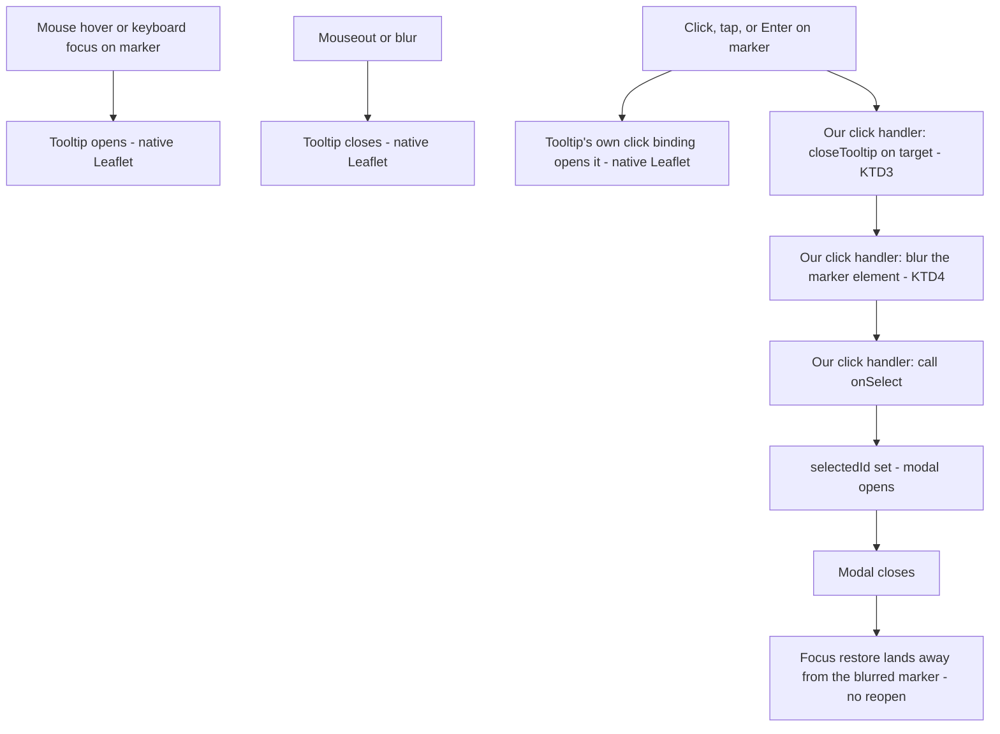

# Map Marker Hover Popup - Plan

## Goal Capsule

- **Objective:** A person browsing the map can preview a restaurant's status and cuisine by hovering or keyboard-focusing its marker, without triggering the detail modal, and a click or tap on a marker still reliably opens that modal.
- **Means:** Replace the marker's `Popup` (Leaflet's click-oriented widget, today's source of the coupling bug) with `Tooltip` (Leaflet's hover-and-focus-native widget), guarded so click, tap, and modal-close cannot leave the info-box lingering (KTD1, KTD3, KTD4).
- **Product authority:** The Product Contract below is authoritative for user-facing behavior. No open product blocker remains.
- **Execution profile:** Standard-depth software plan, `execution: code`.
- **Product Contract preservation:** No upstream Product Contract document exists; this plan bootstraps one from the invoking conversation.

## Product Contract

### Summary

Decouple the map marker's small info-box from the restaurant-detail modal. Today a marker click opens both at once. The info-box becomes hover-and-focus-only, shows the restaurant's name, status/verdict with visit count, and cuisine, and a click or tap always opens the modal directly with no lingering info-box.

### Problem Frame

Clicking a restaurant marker on the map opens Leaflet's `Popup` (auto-opened by Leaflet on marker click) and the `RestaurantDetail` modal at the same time, because both are wired to the same click. The popup's own content (name plus a rollup label) also duplicates status information the modal already shows in more detail.

### Requirements

- R1. On desktop, hovering a restaurant marker with the mouse, or moving keyboard focus to it, reveals an info-box for that marker.
- R2. A click or tap on a marker always opens the restaurant-detail modal for that restaurant; on a touchscreen, the info-box does not linger as a separate step before the modal opens.
- R3. After the modal opened from a marker closes, the info-box does not reappear as a side effect of focus returning to that marker.
- R4. The info-box shows the restaurant's name, a status/verdict badge with visit count identical to the restaurant list row's pattern, and its cuisine as emoji and text (or the uncategorized label when none is set).
- R5. The info-box lays out as a bold name line followed by one meta line combining the badge, visit count, and cuisine, separated by a middle dot; long content wraps to a second line instead of truncating or overflowing.
- R6. Each restaurant marker exposes its name as an accessible name for assistive technology.

### Key Decisions

- **Info-box trigger is hover/focus only, never click or tap.** Governs R1, R2. (session-settled: user-approved — chosen over keeping it on click, today's bug, and over a tap-and-hold or two-tap touch gesture.)
- **Content is name + the exact list-row status badge and visit-count pattern + cuisine as emoji and text.** Governs R4. (session-settled: user-directed — the user asked for the identical pattern `RestaurantList.tsx` uses, over a plain verdict-rollup text that would lose the shared badge styling, and over an emoji-only or text-only cuisine.)
- **Layout is a bold name line plus one wrapping meta line.** Governs R5. (session-settled: user-directed — chosen after comparing three visual sketches, over a fully stacked three-row layout and a single line that truncated instead of wrapping.)

### Scope Boundaries

- The restaurant-detail modal and the restaurant list are unchanged.
- Distance from the current position, shown in the list, is not added to the info-box.
- No new touch gesture (tap-and-hold, double-tap) is introduced; touch always goes straight to the modal.
- Filter-dimmed markers (rendered at reduced opacity) keep their current interactivity; this change does not alter dimming or filtering behavior.

### Sources / Research

- Leaflet 1.9.4 source, `src/layer/Tooltip.js` (`_initTooltipInteractions`, `_addFocusListenersOnLayer`) — confirms `Tooltip` opens on `mouseover`/`focus` and also registers its own `click` handler as a touch-accessible fallback; grounds KTD1–KTD4.
- Leaflet 1.9.4 `dist/leaflet.css:584,589` — `.leaflet-tooltip` defaults to `white-space: nowrap` and `pointer-events: none`; grounds KTD5 and rules out the tooltip blocking clicks on anything under it.
- `docs/solutions/conventions/react-leaflet-test-mock-stability.md` — the repo's convention for mocking `react-leaflet` hooks/components with referentially stable instances; shapes U2/U3's test approach.
- `src/features/RestaurantList.tsx`, `src/features/StatusBadge.tsx`, `src/features/facets/cuisines.ts` — the exact status-badge/visit-count/cuisine pattern R4 reuses.
- `src/features/map/MapView.tsx:172-173` (commit `aa4f046`) — the repo's only existing precedent for deliberately shaping a marker's interactive/keyboard footprint, informing U4.

---

## Planning Contract

### Key Technical Decisions

- KTD1. **Bind a `Tooltip` to each marker in place of the current `Popup`.** `Tooltip` opens on `mouseover`/focus and closes on `mouseout`/blur natively, so no manual event wiring is needed for the hover/focus behavior itself. Instantiates the hover/focus Key Decision. Governs R1. (session-settled: user-approved — chosen over keeping `Popup` and manually opening/closing it on custom mouseover/mouseout handlers while suppressing its default click-to-toggle: `Popup` has no native hover binding, so hand-building one duplicates what `Tooltip` already provides.)
- KTD2. **Keyboard focus is left to reveal the info-box, matching mouse hover, instead of being suppressed.** Enter still opens the modal, same as a mouse click. Extends the hover/focus Key Decision to keyboard input. Governs R1. (session-settled: user-approved — chosen over suppressing `Tooltip`'s native focus/blur listeners: Leaflet wires this focus-reveal for accessibility at no extra engineering cost, and fighting it would cost effort for no benefit.)
- KTD3. **The marker's `click` handler unconditionally calls `closeTooltip()` on the event's target**, rather than relying on `Tooltip`'s and `Marker`'s effect-mount order (which happens to close the tooltip first today, since `Tooltip` mounts as a child before `Marker`'s own handlers attach, but is not a documented contract). Leaflet's `Tooltip` also opens on `click` internally, as its own touch-accessible fallback for hover content — this decision keeps that from ever surviving past the same click. Governs R2.
- KTD4. **The marker's `click` handler blurs the marker's DOM element before calling `onSelect`.** `RestaurantDetail`'s modal restores focus to whatever element had it when the modal opened; without this, focus returns to the marker on modal close and its native focus listener reopens the info-box. Governs R3.
- KTD5. **The `Tooltip`'s rendered element gets a dedicated CSS class overriding Leaflet's default `white-space: nowrap` with `white-space: normal` and a max-width around 220px.** Instantiates the layout Key Decision, carrying forward the width validated in the visual prototype comparison. Governs R5. (session-settled: user-directed.)
- KTD6. **`MapMarker` gains `pending`, `visitCount`, `latestVerdict`, and `cuisine`, replacing the now-unused `label`.** This lets `MapView` render the exact `StatusBadge` and visit-count and cuisine pattern `RestaurantList` uses, without passing full `Restaurant` records into the map feature. Governs R4.
- KTD7. **Each marker's icon HTML gains an `aria-label` set to the restaurant's name**, mirroring the existing accessible-label pattern used for the current-position marker. Governs R6. (session-settled: user-approved — added because keyboard focus now meaningfully reveals content per KTD2, and an unlabeled marker undercuts that accessibility value.)

### High-Level Technical Design

### Risks & Dependencies

- `Tooltip`'s click-open binding is confirmed from Leaflet source, not from the official accessibility guide, which does not document it. KTD3's explicit `closeTooltip()` call is the mitigation and remains a safe no-op if a future Leaflet version changes this binding.
- Removing `MapMarker.label` is a breaking change contained to `src/features/map/markers.ts` and `src/features/map/markers.test.ts` — confirmed no other file reads `MapMarker.label` or calls `rollupLabel`.
- Deferred: `Tooltip` has no auto-pan or flip-direction fallback the outgoing `Popup` had, so a marker near the map's top edge could show a clipped or off-canvas info-box (KTD1). Not addressed by this plan; revisit if it proves disruptive in practice.
- Deferred: the `Tooltip` markup is not associated with the marker via `aria-describedby` or similar, so a keyboard/screen-reader user focusing a marker hears only its accessible name (KTD7), not the status/cuisine content the info-box surfaces (KTD2). Not addressed by this plan; revisit if accessibility feedback surfaces it as a real gap.

---

## Implementation Units

### U1. Extend the map marker data model

- **Goal:** Carry the fields the info-box needs (status, verdict, visit count, cuisine) on `MapMarker`, replacing the now-unused rollup label.
- **Requirements:** R4 (KTD6)
- **Dependencies:** none
- **Files:**
  - `src/features/map/markers.ts` (modify)
  - `src/features/map/markers.test.ts` (modify)
  - `src/features/display.ts` (modify — remove the now-unused `rollupLabel` export)
  - `src/App.tsx` (modify — update the stale comment on the `markers` memo and drop its now-unnecessary `i18n.language` dependency)
- **Approach:**
  1. Replace `label: string` on `MapMarker` with `pending: boolean`, `visitCount: number`, `latestVerdict: Verdict | null`, and `cuisine?: string`.
  2. Update `toMarkers` to copy those fields from each `Restaurant` instead of calling `rollupLabel`.
  3. Remove the now-unused `rollupLabel` import from `markers.ts`; if that leaves `rollupLabel` itself with no caller anywhere in the codebase, remove it from `display.ts` too.
  4. In `src/App.tsx`, update the comment above the `markers` `useMemo` (it currently describes verdict/status labels being "baked into marker popups via rollupLabel") and drop `i18n.language` from that memo's dependency array — marker data no longer carries pre-translated text; `StatusBadge`, `translateVisitsCount`, and `emojiForCuisine` translate at render time inside `MapView` and already react to a language switch on their own.
- **Patterns to follow:** `RestaurantList.tsx`'s use of `Pick<Restaurant, 'pending' | 'visitCount' | 'latestVerdict'>` to feed `StatusBadge`.
- **Test scenarios:**
  - `toMarkers` carries `pending`, `visitCount`, `latestVerdict`, and `cuisine` through from each restaurant unchanged.
  - A restaurant with `visitCount: 0` (to-try) produces a marker with `latestVerdict: null`.
  - A restaurant with no `cuisine` produces a marker with `cuisine` left unset, not a synthesized default string.
  - Edge case: `pending` is always `false` on any produced marker, since `toMarkers` already filters out pending restaurants before this point (existing behavior, unchanged).
  - The old `label`/i18n rollup-text assertions in `markers.test.ts` are removed, not left failing.
- **Verification:** `markers.test.ts` passes. `MapView.tsx` will not type-check again until U2 lands — expected mid-sequence, not a stopping point.

### U2. Replace Popup with a hover/focus-triggered Tooltip and guard its edge cases

- **Goal:** Show the info-box only on hover or focus, and prevent it from lingering after a click, tap, or modal close.
- **Requirements:** R1, R2, R3 (KTD1, KTD2, KTD3, KTD4)
- **Dependencies:** U1
- **Files:**
  - `src/features/map/MapView.tsx` (modify)
  - `src/features/map/MapView.test.tsx` (modify)
- **Approach:**
  1. Import `Tooltip` from `react-leaflet` and render it as the `Marker`'s child in place of `Popup`, with `direction="top"` and a dedicated `className`.
  2. Change the `Marker`'s `eventHandlers.click` to close the tooltip on the event's target, blur the marker's element, then call `onSelect(m.id)`, per KTD3 and KTD4.
  3. Add no new `eventHandlers` entries for hover or focus/blur — `Tooltip` handles those natively, per KTD2.
  4. In `iconForColor` (`MapView.tsx`), add a `tooltipAnchor` value to the `L.divIcon` options alongside the existing `popupAnchor` — Leaflet's `Tooltip` reads `tooltipAnchor` to position itself against the icon, not `popupAnchor`, so without it the info-box would anchor to the icon's default (0,0) point instead of the pin's tip. `popupAnchor` can stay or be removed now that nothing renders a `Popup`; check placement during this unit's manual pass.
- **Technical design:** `eventHandlers.click` receives Leaflet's `LeafletMouseEvent`; `event.target` is the `Marker` layer instance, exposing `closeTooltip()` and `getElement()` (the DOM node to call `.blur()` on). Directional guidance, not a call signature to copy verbatim.
- **Patterns to follow:** `docs/solutions/conventions/react-leaflet-test-mock-stability.md` for keeping any stable-instance mocks stable; the existing `interactive={false} keyboard={false}` current-position marker as the repo's only precedent for shaping a marker's interactive footprint.
- **Test scenarios:**
  - Clicking a marker still calls `onSelect(m.id)` (regression of existing behavior).
  - Integration scenario: extend the `Marker` mock with a shared fake target exposing `closeTooltip` and an element with `blur`, and a second, test-controlled handler standing in for Leaflet's own internal tooltip-open click binding. Register both handlers in either order and assert, via `vi.fn()`'s `invocationCallOrder` (no new dependency needed), that `closeTooltip` and `blur` on the target are called before `onSelect` fires, **and** that `closeTooltip` runs after the stand-in internal tooltip-open handler in both registration orders — proving KTD3's actual claim (the tooltip never survives past the click regardless of which handler Leaflet ran first), not just that closing happens before the modal opens.
  - The current-position marker still renders with no click handler and no tooltip child (regression of the existing "no popup" test).
  - Execution note: real hover, keyboard-focus, and touch-tap behavior are Leaflet-native and not provable under the jsdom mock — no existing tooling in this repo simulates touch events. Verify those manually in a running browser and a touch-emulated viewport before calling this unit done; the click/tooltip/blur ordering itself is proven by the automated integration scenario above, not manual-only.
- **Verification:** `MapView.test.tsx` passes with the updated mock, including the call-order assertion. Manual check in a browser confirms hover and keyboard focus reveal the info-box, click/tap/Enter open the modal with no lingering info-box, and closing the modal does not reopen it.

### U3. Redesign the info-box content and layout

- **Goal:** Render the agreed content and layout inside the new `Tooltip`.
- **Requirements:** R4, R5 (KTD5, KTD6)
- **Dependencies:** U1, U2
- **Files:**
  - `src/features/map/MapView.tsx` (modify — the `Tooltip`'s JSX children and CSS class, same file as U2)
  - `src/index.css` (modify — the tooltip max-width/wrap override)
  - `src/features/map/MapView.test.tsx` (modify)
- **Approach:**
  1. Render inside `Tooltip`: the restaurant name in bold, then a meta line built from the badge, the visit-count text (only when visited, exactly as `RestaurantList.tsx` does), and the cuisine emoji and text or the uncategorized label. Join only the segments that are actually present with a middle-dot separator — a to-try restaurant (no visit-count segment) renders "Badge · Cuisine," never a stray double separator or a leading/trailing dot.
  2. Reuse `translateVisitsCount`, `emojiForCuisine`, and the uncategorized-label i18n key exactly as `RestaurantList.tsx` does — no new translation logic.
  3. Add a CSS rule scoped to the `Tooltip`'s `className` (per KTD5) overriding `white-space` and setting `max-width`.
- **Patterns to follow:** `RestaurantList.tsx`'s status/visits/cuisine row.
- **Test scenarios:**
  - A visited restaurant's tooltip content includes its `StatusBadge` text and the visit-count text.
  - A to-try restaurant (`visitCount: 0`) shows the `StatusBadge` with no visit-count text.
  - A restaurant with a curated cuisine shows its emoji and name; a restaurant with no cuisine shows the uncategorized emoji and label.
  - The tooltip's root element carries the wrapping CSS class, exercising the max-width/wrap override.
- **Verification:** `MapView.test.tsx` passes. Manual check confirms a long restaurant name and a long custom cuisine name wrap onto a second line instead of overflowing or being cut off.

### U4. Add an accessible name to restaurant markers

- **Goal:** Give each restaurant marker's icon an `aria-label` of the restaurant's name.
- **Requirements:** R6 (KTD7)
- **Dependencies:** none
- **Files:**
  - `src/features/map/MapView.tsx` (modify)
  - `src/features/map/MapView.test.tsx` (modify)
- **Approach:**
  1. Pass the restaurant's name into the marker icon builder and set `aria-label` on the icon HTML, mirroring `currentPositionIcon`'s `role="img" aria-label="..."` construction.
  2. The existing icon cache is keyed by color and selected state, shared across markers of the same cuisine; once the name is part of the icon HTML, extend the cache key to include the name (accept a larger cache, one entry per restaurant rather than per color — restaurant counts are small enough that this is not a real memory concern).
- **Patterns to follow:** `currentPositionIcon`'s `role="img" aria-label="${label}"` construction.
- **Test scenarios:**
  - A restaurant marker's icon HTML contains an `aria-label` equal to its name.
  - The current-position marker's own existing `aria-label` is unaffected.
- **Verification:** `MapView.test.tsx` passes. A manual accessibility-tree check confirms each pin announces its restaurant name on focus.

---

## Verification Contract

| Command | Applicability | Done signal |
|---|---|---|
| `npx vitest run src/features/map/MapView.test.tsx src/features/map/markers.test.ts` | U1–U4 | All cases pass, including the new tooltip/aria-label assertions |
| `npm run test` | U1–U4 | Full suite passes, no regressions elsewhere |
| `npm run build` | U1–U4 | `tsc --noEmit` reports no type errors |

## Definition of Done

- R1–R6 hold, verified by the test scenarios in U1–U4 plus the manual browser and touch-emulation checks called out in U2 and U3.
- `npx vitest run` and `npm run build` pass.
- No leftover `label`/`rollupLabel` references tied to the map feature.
- No dead-end code from an approach that did not pan out (e.g., no unused manual mouseover/mouseout handlers left behind if `Tooltip`'s native binding turned out to need a fallback during implementation).
