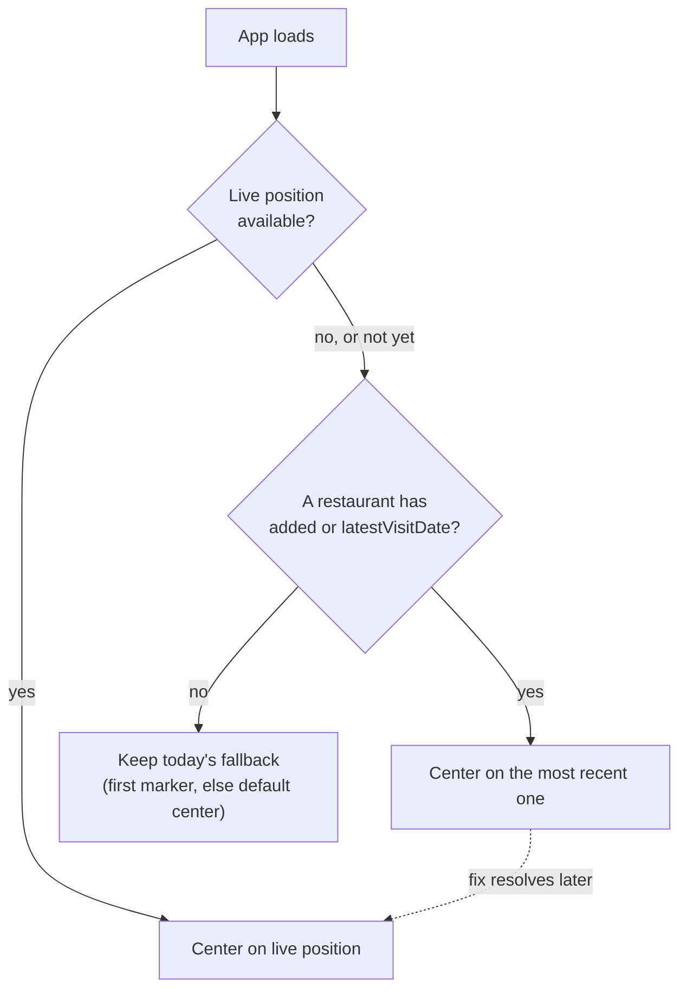
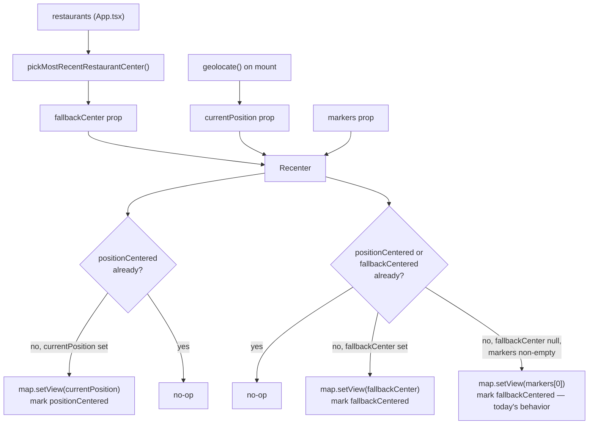

# Map Load Centering - Plan

## Goal Capsule

- **Objective:** Opening the app lands the map somewhere relevant to the user — their live position, or otherwise the restaurant they most recently added or visited — instead of an arbitrary first-in-list pin.
- **Means:** A priority chain evaluated once per app load: live device position, then the restaurant with the more recent of its `added` timestamp or `latestVisitDate`, then today's existing fallback (first marker, else the default city center).
- **Product authority:** The Product Contract below is authoritative for user-facing behavior. No open product blocker remains.
- **Execution profile:** Standard software feature work, `execution: code`.
- **Product Contract preservation:** Product Contract unchanged; its prior open question — how to compare `added` (a full timestamp) against `latestVisitDate` (date-only) — is resolved below by KTD2.

---

## Product Contract

### Summary

On app load, the map centers on the device's live position when a fix is available. Otherwise it centers on the restaurant most recently added or visited. When neither signal exists, the map falls back to today's default centering, unchanged.

### Problem Frame

Today the map's initial center is whichever restaurant happens to be first in the unfiltered list (`markers[0]` in `src/features/map/MapView.tsx`), or the default city center when the list is empty — an arbitrary choice with no relation to the user or their recent activity. The app already fetches the device's live position on load (`src/App.tsx`'s on-mount `geolocate()` call) to place a "you are here" marker, but nothing today uses that fix, or any notion of recency, to decide where the map itself opens.

### Requirements

- R1. On app load, when a device location fix becomes available, the map centers on that position.
- R2. When no live position is available, the map instead centers on the restaurant with the more recent of its `added` timestamp or `latestVisitDate`, considered only among restaurants with resolved coordinates.
- R3. The fallback restaurant (R2) is shown as soon as it's known, without waiting for the location fix; if a fix arrives afterward, the map re-centers onto it. This centering runs once per app load.
- R4. When no restaurant has an `added` timestamp or a visit, the map keeps today's existing fallback (first marker, else the default city center), unchanged.
- R5. The restaurant chosen under R2 is picked from all restaurants, independent of any active list filter.
- R6. The "Localiser" button's tap-to-recenter behavior and the "Où manger ?" flow's pannable anchor are unaffected by this feature.

### Key Decisions

- **Show the fallback restaurant immediately, then snap to the live position once it resolves** (session-settled: user-directed — chosen over waiting for geolocation to settle before centering anything: matches the existing pattern of surfacing the "you are here" marker with no loading indicator, and avoids delaying the map on every load). Governs R3.
- **"Added or visited" reuses the existing `added` timestamp and `latestVisitDate` rollup as-is**, rather than introducing a new recency concept — both fields already exist on `Restaurant` (`src/types/models.ts`) for exactly this kind of ranking. Governs R2.

### Key Flows

- F1. Initial map centering
  - **Trigger:** The app mounts (page load or reload).
  - **Steps:** The app requests the device's location once. Independently, and without waiting on that fetch, it determines which restaurant with resolved coordinates has the more recent of its `added` timestamp or `latestVisitDate`. The map centers on that restaurant as soon as it's known. If the location fix resolves afterward, the map re-centers onto it. If no restaurant qualifies, the map keeps today's fallback centering.
  - **Covers:** R1, R2, R3, R4, R5

### Acceptance Examples

- AE1. **Covers R1.** Given the user opens the app and a location fix arrives, when the map has finished its initial render, then it is centered on that position.
- AE2. **Covers R2, R5.** Given no fix is available and the restaurant list is filtered to a subset, when the app loads, then the map centers on the most-recently-added-or-visited restaurant across *all* restaurants, not just the filtered ones.
- AE3. **Covers R3.** Given no fix is available yet when restaurants first load, when the fallback restaurant is shown, then a fix arriving moments later re-centers the map onto it instead of leaving it on the fallback.
- AE4. **Covers R4.** Given no restaurant has an `added` timestamp or a visit, when the app loads with no location fix, then the map centers exactly as it does today (first marker, else the default city center).
- AE5. **Covers R6.** Given the map is already centered per R1 or R2, when the user taps "Localiser," then it recenters and refreshes the current-position marker exactly as it does today, independent of this feature.

### Scope Boundaries

- Outside this scope: the "Localiser" button and the "Où manger ?" flow's anchor (R6) — both keep their current behavior untouched.
- Outside this scope: the restaurant list's sort order — this feature changes only where the map opens, not how the list is ordered.
- Deferred: backfilling an `added` timestamp for restaurants created before that field existed — not needed, since R4 already covers restaurants with no recency signal.

### Dependencies / Assumptions

- Reuses `Restaurant.added` and `Restaurant.latestVisitDate` (`src/types/models.ts`) as they exist today — no schema change needed.
- Reuses `geolocate()` (`src/lib/geolocate.ts`), which already resolves within a bounded timeout and never rejects, and the existing `currentPosition` state and its on-mount fetch in `src/App.tsx`.
- Assumes the restaurant list's facet filter is genuinely irrelevant at load time (it resets to empty on every reload), so R5's "all restaurants, not just filtered" only guards against that assumption changing later.

### Sources / Research

- `src/features/map/MapView.tsx:255-257` — today's initial `center` is `markers[0]` or `DEFAULT_CENTER`.
- `src/features/map/MapView.tsx:112-122` — `Recenter` recenters once when markers first go from empty to non-empty, guarded by a single `centered` ref.
- `src/features/map/MapView.tsx:318-325` — the "you are here" marker render, conditional on `currentPosition`.
- `src/App.tsx:31-71` — `currentPosition` state, fed by an on-mount `geolocate()` call (no loading indicator, generation-token guarded via `beginLocate`/`commitLocate`) and by the "Localiser" tap; `filter` starts at `emptyFilter()` on every mount, with no persistence.
- `src/types/models.ts:63-73` — `Restaurant.added` (stamped once at creation, never backfilled) and `Restaurant.latestVisitDate` (denormalized rollup from visits).
- `src/lib/geolocate.ts:13-26` — `geolocate()` resolves a fix or `null` within a bounded timeout, never rejects.
- `docs/plans/2026-08-30-1320-feat-current-position-list-distance-plan.md` — the prior plan that introduced `currentPosition`; it explicitly left the map's initial centering untouched (only the "you are here" marker and list distances), which is the gap this plan fills.
- `docs/solutions/conventions/react-leaflet-test-mock-stability.md` — any `react-leaflet` mock (`useMap`, etc.) must return a referentially stable instance per call, or an effect keyed on it loops forever in tests.
- `src/lib/dates.ts:22-27` — `localDayToInstantRange(day)` returns the correct, timezone-aware UTC instant range for a local calendar day (`start`/`end`), built from `refactor/date-time-uniformization` (merged in PR #18) specifically to replace hand-rolled UTC-suffix arithmetic on local-day strings like `latestVisitDate`.
- `src/features/map/markers.ts:22-25` — `toMarkers`'s pending/null-coordinate guard, the pattern the new ranking helper reuses.
- `src/App.test.tsx:16-18,132-213` and `src/features/map/MapView.test.tsx:146-149` — existing `geolocate()` mocking and generation-token test patterns, extended by this plan rather than duplicated.
- `src/features/map/MapView.test.tsx:404-461` — `LabelVisibility`'s rising-edge ("fires once on false→true") test structure, the template for testing `Recenter`'s new two-tier once-only behavior, since no existing `Recenter` test exists to extend.

---

## Planning Contract

### Key Technical Decisions

- KTD1. **The recency-ranking helper lives in `src/features/map/markers.ts`, alongside `toMarkers`, and takes the raw `Restaurant[]` array rather than `MapMarker[]`.** `MapMarker` strips `added`/`latestVisitDate`, so the helper must read `Restaurant` directly; `src/App.tsx` already holds that array and already imports from this module (`toMarkers`), and the module already owns the pending/null-coordinate filtering this helper needs (`markers.ts:22-25`). `App.tsx` computes the result once via `useMemo` and passes it to `MapView` as a new `fallbackCenter` prop, mirroring how `currentPosition` is already plumbed down. No new IndexedDB query or schema change: the ranking reads only fields `useRestaurants()` already provides. Governs R2, R5.
- KTD2. **Each restaurant's comparison key is the true max of its `added` instant and its `latestVisitDate` converted to a comparable instant via `localDayToInstantRange(r.latestVisitDate).end`** (`src/lib/dates.ts`) — the correctly timezone-aware start of the following local day — not a hand-rolled UTC suffix. Using the shared local-day utility (rather than appending a fixed `T23:59:59.999Z`) matters because `latestVisitDate` is a *local* calendar day (`today()` in `src/data/visits.ts`), so a UTC-assuming suffix would misrank restaurants for any user west of UTC. A tie between two candidates' keys (expected whenever they share the same `latestVisitDate`, since both resolve to that day's identical instant) breaks on the greater `updated` timestamp, for a deterministic result. Resolves the Product Contract's prior open question. Governs R2.
- KTD3. **`Recenter` (`src/features/map/MapView.tsx`) splits its single `centered` ref-guard into two independent once-only effects: a position tier and a fallback tier.** The position tier fires once, the first time `currentPosition` is truthy, centering on it. The fallback tier fires once, the first time either `fallbackCenter` or a non-empty `markers` is available *and neither tier has fired yet*, preferring `fallbackCenter` over `markers[0]` (today's behavior) when both exist. Splitting the guard (rather than reusing one ref) lets a live position that resolves after the fallback already centered still override it (R3), while a position that resolves first prevents the fallback tier from firing at all (R1). `locate()`'s existing direct `map.setView` call on the "Localiser" tap is untouched and outside both guards (R6). Governs R1, R2, R3, R4, R6.

### High-Level Technical Design

### Assumptions

- `pickMostRecentRestaurantCenter` returns a `GeoPoint`, not a `Restaurant`, so callers never see the nullable `lat`/`lng` fields `Restaurant` otherwise carries.

---

## Implementation Units

### U1. Recency-based center target helper

- **Goal:** Add a pure function that picks the map center point for the restaurant most recently added or visited, among restaurants with resolved coordinates.
- **Requirements:** R2, R4, R5 (KTD1, KTD2)
- **Dependencies:** None
- **Files:**
  - `src/features/map/markers.ts` — add and export `pickMostRecentRestaurantCenter(restaurants: Restaurant[]): GeoPoint | null`
  - `src/features/map/markers.test.ts` — add direct unit tests
- **Approach:**
  1. Filter to restaurants with `!r.pending && r.lat !== null && r.lng !== null` — the same guard `toMarkers` already uses.
  2. For each candidate, compute a comparison key: the later of `r.added` (as-is, when present) and `localDayToInstantRange(r.latestVisitDate).end` (when `latestVisitDate` is present, per KTD2) — a true per-restaurant max, not an added-first fallback chain. Use whichever single value exists when only one field is present; skip a candidate with neither.
  3. Pick the candidate with the greatest key; break a tie (expected whenever two candidates share the same `latestVisitDate`) by the greater `updated` timestamp (KTD2).
  4. Return the winning candidate's `{ lat, lng }`; return `null` when no candidate has either field.
- **Patterns to follow:** `toMarkers`'s pending/null-coordinate guard (`src/features/map/markers.ts:22-25`); `localDayToInstantRange` from `src/lib/dates.ts` for local-day-to-instant conversion.
- **Test scenarios:**
  - A restaurant added today and another visited yesterday → the added-today restaurant's point wins.
  - A restaurant added yesterday and another visited today → the visited-today restaurant's point wins.
  - A restaurant added earlier today and another visited today → the visited-today restaurant wins, since its key (the start of the next local day) is later than any instant within today.
  - Two restaurants share the same `latestVisitDate` and different `updated` timestamps → the one with the greater `updated` wins (tie-break, KTD2).
  - No restaurant has `added` or `latestVisitDate` → returns `null`.
  - The restaurant with the most recent signal is pending (unresolved coordinates) → it is skipped; the next-most-recent resolved restaurant wins, or `null` if none qualifies.
  - Empty restaurant list → returns `null`.
- **Verification:** `markers.test.ts` asserts the above directly against the exported function.

### U2. Wire the fallback target into `App.tsx` and `MapView`

- **Goal:** Compute the fallback center once per render from `restaurants` and pass it to `MapView` alongside the existing `currentPosition`.
- **Requirements:** R2, R5 (KTD1)
- **Dependencies:** U1
- **Files:**
  - `src/App.tsx` — compute `fallbackCenter` via `useMemo`, pass to `MapView`
  - `src/features/map/MapView.tsx` — accept the new `fallbackCenter` prop and forward it to `Recenter`
  - `src/App.test.tsx` — updated/added coverage
- **Approach:**
  1. `const fallbackCenter = useMemo(() => pickMostRecentRestaurantCenter(restaurants), [restaurants])`, using the full `restaurants` array, not `visible` (R5).
  2. Pass `fallbackCenter` to `<MapView>`; `MapView` forwards it to `<Recenter>` alongside `markers` and `currentPosition`.
- **Patterns to follow:** the existing `markers`/`toMarkers` `useMemo` in `App.tsx` for deriving map-facing data from `restaurants`.
- **Test scenarios:**
  - Restaurants include one with a recent `added` timestamp → `MapView` receives that restaurant's coordinates as `fallbackCenter`.
  - An active facet filter narrows `visible` but not `restaurants` → `fallbackCenter` is unaffected by the filter. Covers R5, AE2.
  - No restaurants → `fallbackCenter` is `null`.
- **Verification:** `App.test.tsx` asserts `fallbackCenter` is derived from all restaurants, independent of `filter`.

### U3. Two-tier initial centering in `Recenter`

- **Goal:** Center the map on the live position when available, otherwise on `fallbackCenter`, otherwise on the first marker as today — each tier firing once per app load, with a later-arriving position still overriding an already-shown fallback.
- **Requirements:** R1, R2, R3, R4, R6 (KTD3)
- **Dependencies:** U2
- **Files:**
  - `src/features/map/MapView.tsx` — extend `Recenter`'s props and effects
  - `src/features/map/MapView.test.tsx` — updated/added coverage
- **Approach:**
  1. Add `currentPosition` and `fallbackCenter` props to `Recenter`.
  2. Replace the single `centered` ref with two: `positionCentered` and `fallbackCentered`.
  3. Effect A, keyed on `[currentPosition, map]`: when `currentPosition` is set and `!positionCentered.current`, call `map.setView(...)` and set `positionCentered.current = true`.
  4. Effect B, keyed on `[fallbackCenter, markers, map]`: skip entirely when `positionCentered.current` or `fallbackCentered.current` is already true. Otherwise, if `fallbackCenter` is present, center on it and set `fallbackCentered.current = true`; else if `markers` is non-empty, center on `markers[0]` (today's behavior) and set `fallbackCentered.current = true`; else do nothing, leaving `fallbackCentered.current` false so the effect can still fire once either source becomes available.
  5. Leave `locate()` and the "Localiser" button's direct `map.setView` call untouched (R6).
- **Technical design:** See the Planning Contract's High-Level Technical Design diagram above (this unit implements the `Recenter` box).
- **Patterns to follow:** the existing `centered` ref-guard shape in `Recenter` (`MapView.tsx:112-122`); `LabelVisibility`'s rising-edge test structure (`MapView.test.tsx:404-461`) as the template for testing "fires once" semantics.
- **Test scenarios:**
  - `currentPosition` becomes set on first render → map centers on it. Covers AE1.
  - `currentPosition` is `null` and `fallbackCenter` is set → map centers on `fallbackCenter` as soon as it's known. Covers AE2, AE3 (first half).
  - `fallbackCenter` centers the map first, then `currentPosition` resolves afterward → map re-centers onto the live position. Covers AE3 (second half).
  - `currentPosition` resolves before `fallbackCenter`/`markers` are known → when `fallbackCenter` later arrives, the map does not override the live position.
  - `fallbackCenter` is `null` and `markers` goes from empty to non-empty → map centers on `markers[0]`, exactly as today. Covers AE4.
  - After either tier has centered once, a later change to `markers` or `fallbackCenter` does not re-trigger centering.
  - Tapping "Localiser" still recenters and updates the marker exactly as today, independent of these effects. Covers AE5.
- **Verification:** `MapView.test.tsx` asserts each scenario above via `rerender(...)` with changed props and a `map.setView` spy, following the `LabelVisibility` test template.

---

## Verification Contract

| Check | Command | Applies to |
|---|---|---|
| Unit/component tests | `npm test` | U1, U2, U3 |
| Type check | `npm run lint` (runs `tsc --noEmit`; there is no separate typecheck or linter script) | All units |

No `release:validate` or behavioral skill evaluation applies — this is a client-only UI/state change with no server or agent-facing surface.

---

## Definition of Done

- All three units implemented and their test scenarios pass.
- `pickMostRecentRestaurantCenter` exists only in `src/features/map/markers.ts`.
- `Recenter`'s position and fallback tiers are independently guarded; the existing `markers[0]`/`DEFAULT_CENTER` fallback still applies unchanged when neither a live position nor a ranked restaurant exists.
- The "Localiser" button, the `beginLocate`/`commitLocate` generation-token guard, and the "Où manger ?" flow's `anchor` are unmodified.
- No dead code from abandoned approaches remains in the diff.
- `npm test` and `npm run lint` pass.
