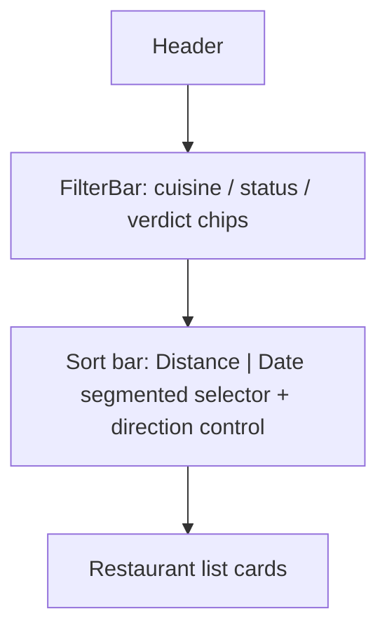
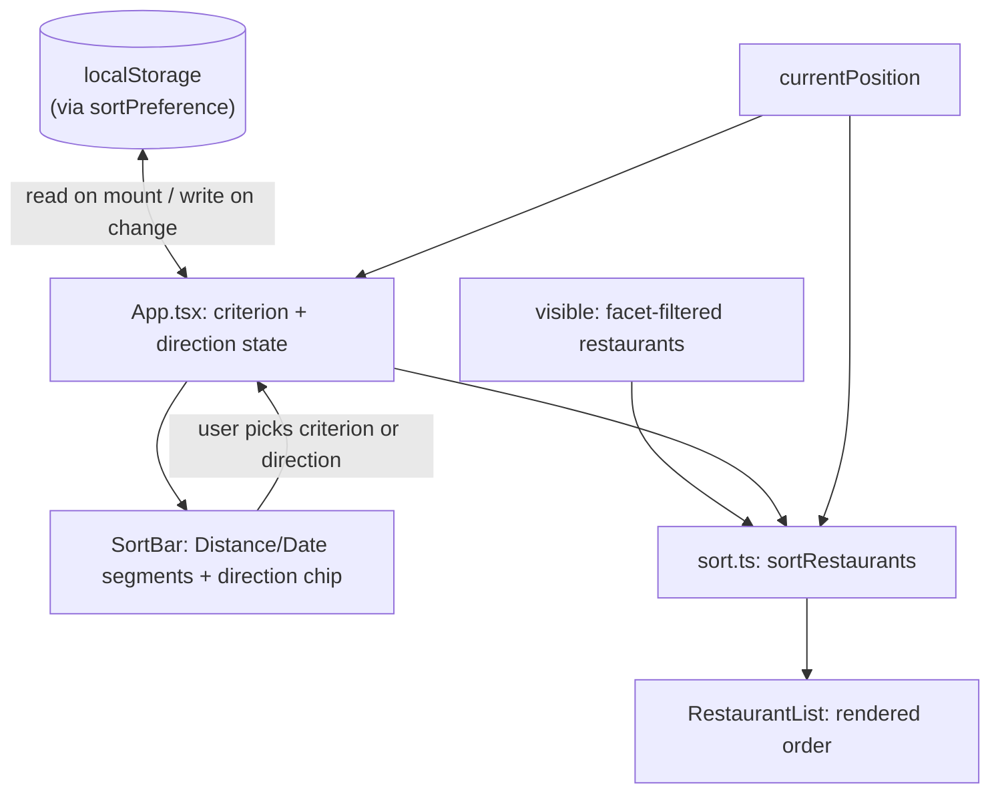

# Restaurant List Sort - Plan

## Goal Capsule

- **Objective:** The user can reorder the restaurant list to match what's most useful right now — nearest first when the device knows where they are, most relevant by date otherwise — and the app remembers that choice the next time it opens.
- **Product authority:** This plan owns adding a user-controlled sort to `src/features/RestaurantList.tsx`'s display order only. It does not touch `src/features/decide/candidates.ts`'s own nearest-first ordering, or `src/features/map/markers.ts`'s marker ordering and fallback-center logic — those are explicit non-goals (see Scope Boundaries).
- **Execution profile:** Standard software feature work; no autonomous/long-running optimization loop.
- **Stop conditions:** None beyond satisfying the Requirements below.
- **Open blockers:** None. All forks raised during brainstorming were resolved; see Key Decisions.

---

## Product Contract

**Product Contract preservation:** restructured, no scope change: R8 gained a stable-sort tie-break clause, R9 gained an explicit invalid/unavailable-storage fallback clause, R11 was added (sort applies after facet filtering — implicit in the original architecture, now stated), and a new Key Decision plus AE6 resolve a first-load ambiguity Phase 1.5 flow analysis surfaced. No existing R was weakened or lost an edge case.

### Summary

Adds a sort control to the restaurant list: a Distance/Date criterion selector plus a direction toggle, in a dedicated bar above the list, separate from `FilterBar`. Distance is offered only once the device's position is known and defaults to nearest-first; until then, Date is the only choice and defaults to most-recent-first. Each criterion remembers its own direction, and both the chosen criterion and its direction persist across reloads.

### Problem Frame

`docs/plans/2026-08-30-1320-feat-current-position-list-distance-plan.md` added per-row distance labels to the list but deliberately kept list order untouched ("distance is added information only"), so a restaurant's distance is visible but has no effect on where it sits in the list. Restaurants also currently have no sort order at all — the list renders in whatever order the local store returns, with no way to bring the nearest or most relevant places to the top. This plan is the follow-up: now that distance is visible, giving the user control over ordering is the natural next step.

### Key Decisions

- **Manual criterion picker (Distance / Date), not a fully automatic fallback** (session-settled: user-directed — chosen over an automatic distance-or-date switch with no manual override: the user wants explicit control over which criterion is active, not just its direction). Governs R1, R2.
- **Distance is disabled/hidden in the picker until a position is known, rather than shown but non-functional** (session-settled: user-approved — chosen over leaving Distance selectable but inert: avoids a "Distance" mode that doesn't actually sort by distance). Governs R1, R2.
- **Direction is remembered independently per criterion** (session-settled: user-approved — chosen over one shared direction toggle across both criteria: nearest-first and most-recent-first are independent preferences). Governs R3, R4.
- **Both the chosen criterion and its per-criterion direction persist via `localStorage`** (session-settled: user-directed — chosen over resetting on reload like the app's existing list/map view toggle: the user wants this preference remembered). Governs R9.
- **Restaurants without resolved coordinates always trail the list under Distance, never reordered by the reversed direction** (session-settled: user-approved — chosen over moving the block to the front when direction reverses: avoids a jarring jump for restaurants that can't be placed by distance at all). Governs R6.
- **The sort control lives in its own bar above the list, not folded into `FilterBar`** (session-settled: user-directed — chosen over sharing FilterBar's header row, after a sketch comparison of both placements: sort is not a filter facet). Governs R10.
- **Control layout: a Distance/Date segmented selector plus a separate direction control whose label adapts to the active criterion** (session-settled: user-directed — chosen over a single combined dropdown and over two independent icon-only buttons, among three sketched layouts). Governs R10.
- **A restaurant with no usable date at all (no `added`, never visited) is treated as the oldest possible date** (session-settled: user-approved — surfaced as a call-out across every synthesis revision and never redirected). Governs R8.
- **On a first-ever load with no persisted sort preference, Distance becomes selectable once a position resolves but does not auto-activate** — only a returning user with Distance already persisted gets the automatic switch (session-settled: user-approved — surfaced as a planning call-out; the alternative, auto-activating Distance for a brand-new user, risked a "criterion changed under me" surprise for someone who never touched the control). Governs R1, R2.

### Requirements

**Criterion selection**
- R1. The restaurant list offers a sort criterion picker with two choices, Distance and Date. Distance is selectable only when a device position is known (`currentPosition`, per `docs/plans/2026-08-30-1320-feat-current-position-list-distance-plan.md`); otherwise only Date is selectable.
- R2. The moment a position first becomes known during a session where none was known before, Distance becomes selectable; if Distance is the persisted preference (R9), it takes effect immediately without the user reselecting it.

**Direction**
- R3. Each criterion has its own direction, remembered independently: switching from Distance to Date and back preserves each criterion's own last-chosen direction.
- R4. The default direction the first time each criterion is ever selected is nearest-first for Distance and most-recent-first for Date.

**Ordering rules**
- R5. When Distance is active, restaurants are ordered by straight-line distance from `currentPosition` (per `src/lib/geo.ts`), nearest-first or farthest-first per the current direction.
- R6. When Distance is active, a restaurant with no resolved coordinates (`lat`/`lng` null — a provisional record) cannot be placed by distance; all such restaurants render as a single trailing block after every distance-ordered restaurant, regardless of direction, ordered among themselves by the Date rule (R7).
- R7. When Date is active, or within the trailing block of R6, each restaurant is ordered by its `added` date if never visited (`visitCount === 0`), otherwise by its `latestVisitDate`; most-recent-first or oldest-first per the current direction.
- R8. A restaurant with neither a usable `added` value nor any visit has no date to order by under R7; it is treated as the oldest possible date, sorting last within the date-ordered portion in the default direction (first when reversed). Two or more such restaurants keep their original relative order (a stable tie-break), so reversing direction twice returns them to where they started.
- R11. Sort applies to the already-filtered restaurant list (facet filtering, then sort) — not in place of, or independently from, the existing cuisine/status/verdict filtering.

**Persistence**
- R9. The chosen criterion and each criterion's chosen direction persist across app reloads, independent of the app's existing no-persistence pattern for other transient UI state. An invalid or unreadable persisted value is treated as if none were persisted, falling back to R4's default; a storage write failure fails silently, for that session only.

**UI placement**
- R10. The sort control renders in a dedicated bar above the restaurant list, visually separate from `FilterBar`'s facet chips: a Distance/Date segmented selector plus a separate direction control whose label reflects the active criterion (e.g. "nearest first" for Distance, "most recent first" for Date).



### Key Flows

- F1. Position resolves after the list first renders
  - **Trigger:** The list renders with only Date selectable (no position yet); the device's position later resolves.
  - **Steps:** Distance becomes selectable; if the persisted preference is Distance, the list immediately re-sorts by distance in its remembered direction, with no user action.
  - **Covers:** R1, R2, R9

- F2. User switches the sort criterion
  - **Trigger:** The user picks Date while Distance is active, or vice versa (only possible when Distance is selectable).
  - **Steps:** The list re-sorts under the new criterion, using that criterion's own remembered direction (or its default, the first time it's ever chosen); the choice persists.
  - **Covers:** R1, R3, R4, R9

- F3. User reverses direction
  - **Trigger:** The user taps the direction control for the active criterion.
  - **Steps:** The list re-sorts in the opposite direction for that criterion only; restaurants without resolved coordinates (under Distance) stay in their trailing block regardless. The new direction persists for that criterion.
  - **Covers:** R3, R5, R6, R7, R9

### Acceptance Examples

- AE1. **Covers R1, R2.** Given the app just launched and no position is known yet, When the restaurant list renders, Then the sort picker shows only Date as selectable and Date is active by default.
- AE2. **Covers R2, R9.** Given the persisted preference is Distance and a position resolves a few seconds after launch, When that position arrives, Then the list immediately re-sorts by distance in the persisted direction, without the user touching the picker.
- AE3. **Covers R6, R7.** Given a position is known, Distance is active, and one restaurant is a provisional record with no coordinates, When the list renders, Then that restaurant appears after every restaurant with a computed distance, in either direction.
- AE4. **Covers R7, R8.** Given Date is active and one restaurant has neither an `added` timestamp nor any visit, When the direction is most-recent-first, Then that restaurant appears last; When the direction is reversed to oldest-first, Then that restaurant appears first.
- AE5. **Covers R7.** Given Date is active, When comparing a never-visited restaurant to a visited one, Then the never-visited one is ordered by its `added` date and the visited one by its `latestVisitDate` — not by visit count or verdict.
- AE6. **Covers R1, R2.** Given a first-ever load with no persisted sort preference, When a position resolves partway through the session, Then Distance becomes selectable but Date stays active — the automatic switch to Distance (AE2) only fires for a returning user whose persisted preference was already Distance.

### Scope Boundaries

- `src/features/decide/DecidePanel.tsx` / `candidates.ts`'s own nearest-first candidate ordering is untouched.
- `src/features/map/markers.ts` marker ordering and `pickMostRecentRestaurantCenter`'s fallback-center logic are untouched — this plan only reorders `RestaurantList`'s display.
- No manual override to force Distance when no position is known (R1) — Date is the only option in that state.
- No additional sort criteria beyond Distance and Date (e.g. alphabetical, cuisine) are in scope.

### Dependencies / Assumptions

- Depends on `currentPosition`, `distanceLabelFor`, and the `Restaurant.lat`/`lng`, `added`, `latestVisitDate`, `visitCount` fields already shipped by `docs/plans/2026-08-30-1320-feat-current-position-list-distance-plan.md` — confirmed present in `src/App.tsx`, `src/features/RestaurantList.tsx`, `src/lib/geo.ts`, `src/types/models.ts`.
- This plan revises the prior current-position plan's own R4 ("List order is unchanged; distance is added information only", in `docs/plans/2026-08-30-1320-feat-current-position-list-distance-plan.md`) — a different R4 than this plan's own R4 above. This plan's R1–R9 supersede that prior R4.
- No existing hand-rolled `localStorage` pattern exists in `src/` for a user preference; the closest existing precedent is `src/i18n/config.ts`'s i18next `LanguageDetector` caching.

### Sources / Research

- `docs/plans/2026-08-30-1320-feat-current-position-list-distance-plan.md` — introduced `currentPosition`, `distanceLabelFor`, and the "distance is informational only" decision this plan revises; also the source of the `positionGenerationRef` stale-fetch guard this plan's sort step does not need to duplicate, since it only reads `currentPosition` and never re-fetches it.
- `src/types/models.ts` — `Restaurant.lat`/`lng`, `added`, `latestVisitDate`, `visitCount` (verified against the current codebase).
- `src/lib/geo.ts` — `haversineMeters`, `formatDistance`, `distanceLabelFor` (verified).
- `src/features/RestaurantList.tsx`, `src/features/useRestaurants.ts`, `src/App.tsx` — current list rendering and filtering; confirmed no existing sort logic.
- `src/features/facets/filter.ts` / `filter.test.ts` — the pure-logic-plus-tests module shape U2 mirrors.
- `src/features/decide/candidates.ts` — the app's only existing distance-comparator code; its "new array, precomputed key, numeric `.sort`" style is worth matching (U2), its exclusion of coordinate-less restaurants is not (R6 trails them instead).
- `src/features/facets/FilterBar.tsx` (`Chip`), `src/features/settings/SettingsPanel.tsx`, `src/App.tsx`'s view switch — the app's three existing `aria-pressed` toggle-button precedents (KTD3).
- `src/i18n/config.ts`, `src/i18n/config.test.ts`, `src/i18n/config.storage-unavailable.test.ts` — the only existing `localStorage` usage in `src/` (library-managed, via i18next's `LanguageDetector`) and its storage-unavailable test shape, mirrored by U1.
- `docs/solutions/design-patterns/normalize-filter-selection-keys-at-the-boundary.md` — the persisted-preference shape and the sort bar's active-state rendering must read from one canonical normalized representation, not re-derive it separately (KTD1).
- `CONCEPTS.md` — Status/Visit domain vocabulary underlying R7 ("never visited" = `visitCount === 0`).

---

## Planning Contract

### Key Technical Decisions

- **KTD1. Persisted-preference logic lives in its own module (`src/lib/sortPreference.ts`), not folded into `FacetFilter`'s state shape or inlined into the sort-bar component** (session-settled: user-approved — surfaced as a planning call-out; no existing app pattern extends beyond the library-managed i18next `LanguageDetector` localStorage caching). Its read/write functions share one canonical shape so the comparator (KTD2) and the sort bar's active-state rendering never re-derive it separately, per the linked design pattern above. Governs R9.
- **KTD2. Pure comparator logic lives in `src/features/facets/sort.ts`**, mirroring `filter.ts`'s pure-logic-plus-tests shape, rather than inline in `App.tsx` or added to `src/lib/geo.ts`. Governs R5, R6, R7, R8, R11.
- **KTD3. The sort bar reuses the codebase's existing `aria-pressed` toggle-button idiom** (`Chip` in `FilterBar.tsx`, the language toggle in `SettingsPanel.tsx`, `App.tsx`'s view switch) rather than a new control primitive or a custom ARIA widget role. Governs R10.
- **KTD4. Invalid or unavailable persisted values are treated as if unset**: an unrecognized criterion/direction string, or a `localStorage` read/write failure, falls back to R9's default behavior rather than throwing — mirroring `src/i18n/config.ts`'s storage-unavailable precedent and the current-position plan's "no error surfaced" philosophy. Governs R9.
- **KTD5. No scroll-position or in-flight-tap protection is added for the automatic re-sort when a position first resolves** (session-settled: user-approved — surfaced as a planning call-out; matches the already-shipped distance-label live-update behavior, which has no such handling either). Governs R2, R5.
- **KTD6. Restaurants with no usable date (R8) keep a stable relative order among themselves** — a stable sort with the existing store order as tie-break — so reversing direction twice returns them to where they started. Governs R8.
- **KTD7. Sort runs after facet filtering, on `App.tsx`'s existing filtered `visible` list** — not `decide/candidates.ts`'s separate filter-and-sort pairing, which this plan does not touch or reuse. Governs R1, R5, R11.

### High-Level Technical Design



---

## Implementation Units

### U1. Sort-preference persistence module

- **Goal:** Read and write the user's chosen sort criterion and each criterion's own direction to `localStorage`, safely.
- **Requirements:** R9
- **Dependencies:** none
- **Files:**
  - `src/lib/sortPreference.ts` (new)
  - `src/lib/sortPreference.test.ts` (new)
  - `src/lib/sortPreference.storage-unavailable.test.ts` (new)
- **Approach:**
  1. Define one canonical persisted shape (e.g. `{ criterion, directions: { distance, date } }`) that both U2's comparator and U3's active-state rendering read from (KTD1).
  2. Expose a read function: returns the persisted shape when present and recognized; returns "absent" when nothing is persisted, the value is unrecognized, or `localStorage` throws on read (KTD4).
  3. Expose a write function that no-ops silently when `localStorage` throws on write (KTD4).
- **Patterns to follow:** `src/i18n/config.ts`'s `LanguageDetector` `order`/`caches` usage; `src/i18n/config.test.ts` and `src/i18n/config.storage-unavailable.test.ts` for the test-isolation shape (clear `window.localStorage` in `beforeEach`/`afterEach`; a separate file for the storage-unavailable case).
- **Test scenarios:**
  - No persisted value yet: read returns "absent".
  - A valid persisted value: read returns it unchanged.
  - An unrecognized criterion/direction string: read returns "absent" (Covers KTD4).
  - `localStorage.getItem` throws: read returns "absent", no exception propagates (Covers KTD4).
  - `localStorage.setItem` throws: write no-ops, no exception propagates (Covers KTD4).
  - Write then read round-trips the exact persisted shape.
- **Verification:** all scenarios pass; the module never throws regardless of storage state.

### U2. Pure sort/comparator module

- **Goal:** Implement the ordering rules (R5-R8, R11) as a pure, testable function.
- **Requirements:** R5, R6, R7, R8, R11
- **Dependencies:** none
- **Files:**
  - `src/features/facets/sort.ts` (new)
  - `src/features/facets/sort.test.ts` (new)
- **Approach:**
  1. Export a function taking the filtered restaurant list, the active criterion, its direction, and `currentPosition`, and returning a new sorted array without mutating the input (KTD2, KTD7).
  2. Under Distance: partition into restaurants with and without resolved coordinates; sort the first group by `haversineMeters` (from `src/lib/geo.ts` — do not recompute distance math locally); sort the second group by the date rule and always append it after the first, regardless of direction (R6).
  3. Under Date, or within that trailing group: order by `added` when `visitCount === 0`, else by `latestVisitDate`; a restaurant with neither counts as the oldest possible value (R8); use a stable sort so ties keep their original order (KTD6).
- **Technical design (directional, not implementation):**
  ```
  sortRestaurants(items, criterion, direction, position):
    if criterion is distance and position is known:
      withCoords, withoutCoords = partition(items, hasCoords)
      return stableSortBy(withCoords, distanceFrom(position), direction)
           + stableSortBy(withoutCoords, dateKey, dateDirection)
    else:
      return stableSortBy(items, dateKey, direction)
  ```
- **Patterns to follow:** `src/features/facets/filter.ts` + `filter.test.ts` (pure function, local restaurant-factory test helper); `src/features/decide/candidates.ts`'s "new array, precomputed key, numeric `.sort`" style — not its coordinate-less exclusion.
- **Test scenarios:**
  - Distance, all items resolved, nearest-first: ascending distance order.
  - Distance, farthest-first: descending distance order.
  - Distance, one item with no coordinates: it trails after every distance-ordered item, in either direction (Covers AE3).
  - Distance, several items with no coordinates: they order among themselves by the date rule (Covers AE3).
  - Date, never-visited vs. visited restaurant: ordered by `added` and `latestVisitDate` respectively (Covers AE5).
  - Date, a restaurant with neither `added` nor a visit: sorts last by default, first when reversed (Covers AE4).
  - Date, two restaurants both with no usable date: keep their original relative order after a direction reversal (Covers KTD6).
  - Empty input array: returns an empty array, no error.
  - Distance criterion with `position` null: behaves identically to the coordinate-less path, without throwing (defensive; R1/KTD7 should prevent this state upstream).
- **Verification:** all scenarios pass; the function is pure (same input yields the same output; the input array is untouched).

### U3. Sort bar UI component

- **Goal:** Render the Distance/Date segmented selector and the direction chip, matching the confirmed sketch (segments plus a separate direction chip whose label adapts to the active criterion).
- **Requirements:** R1, R2, R3, R4, R10
- **Dependencies:** U1
- **Files:**
  - `src/features/facets/SortBar.tsx` (new)
  - `src/features/facets/SortBar.test.tsx` (new)
- **Approach:**
  1. Presentational component: receives the active criterion, the active criterion's direction, whether Distance is selectable, and callbacks for a criterion change and a direction toggle. State and persistence stay owned by U4.
  2. Reuse the `aria-pressed` idiom (KTD3) for both the segmented buttons and the direction chip; the chip's visible label adapts to the active criterion (R10).
  3. When Distance is not selectable, render it disabled or omit it — never selectable-but-inert.
- **Patterns to follow:** `Chip` in `src/features/facets/FilterBar.tsx`; `src/features/settings/SettingsPanel.tsx`'s inline two-option toggle.
- **Test scenarios:**
  - Distance selectable, criterion `distance`, default direction: the Distance segment reads pressed and the direction chip shows the distance-flavored label.
  - Clicking Date invokes the criterion-change callback with `date`.
  - Distance not selectable: it renders disabled, not a normal clickable option.
  - Distance becomes selectable while mounted (position resolves): the segment updates without remounting.
  - Both the segmented buttons and the direction chip expose `aria-pressed` reflecting their state.
- **Verification:** all scenarios pass; the rendered layout matches the confirmed segmented-selector-plus-chip sketch.

### U4. Wire sort into App.tsx

- **Goal:** Own the criterion/direction state, apply R1/R2's selectability and reactivation rules, and insert the sort step between the existing facet filter and `RestaurantList`.
- **Requirements:** R1, R2, R9, R11
- **Dependencies:** U1, U2, U3
- **Files:** `src/App.tsx` (modify)
- **Approach:**
  1. Add criterion/direction state, initialized from U1's persisted read; when nothing is persisted, default to Distance if `currentPosition` is already known at mount, else Date (R1, R4).
  2. When `currentPosition` transitions from unknown to known: if the persisted criterion is Distance, activate it automatically (R2); if nothing was persisted yet, only make Distance newly selectable — do not auto-activate it (the new Key Decision, AE6).
  3. Derive `sorted = sortRestaurants(visible, criterion, directionFor(criterion), currentPosition)` from U2 and pass `sorted` (not `visible`) to `RestaurantList` (R11, KTD7).
  4. Persist a criterion or direction change via U1 whenever the user makes one; the automatic R2 reactivation applies an already-persisted value and does not itself trigger a new write.
- **Patterns to follow:** the existing `visible = useMemo(...)` placement; `positionGenerationRef` is untouched — this unit only reads `currentPosition`, it does not re-fetch it.
- **Test scenarios:**
  - Toggling a facet filter chip while a sort is active preserves the current criterion/direction and re-sorts the newly filtered set (Covers R11).
  - `currentPosition` resolving after mount with a persisted Distance preference re-sorts the rendered list with no further user action (Covers AE2).
  - `currentPosition` resolving after mount with no persisted preference leaves Date active (Covers AE6).
  - The filtered list is empty or has exactly one item: the sort bar still renders without erroring.
- **Verification:** list order visibly changes as `currentPosition`, the active filter, or the chosen criterion/direction change; existing filter behavior is unchanged.

### U5. Update existing tests for the new sort behavior

- **Goal:** Align `src/features/RestaurantList.test.tsx` with the new architecture, where `RestaurantList` renders whatever order its `items` prop already has (sorting now happens one level up, in `App.tsx`).
- **Requirements:** R5, R6, R7 (test-only; no new product behavior)
- **Dependencies:** U2, U4
- **Files:** `src/features/RestaurantList.test.tsx` (modify)
- **Approach:** Revise the existing assertion that list order stays the same regardless of `currentPosition` — that invariant no longer holds now that sorting happens above `RestaurantList`. Replace it with an assertion that `RestaurantList` preserves the order of its `items` prop as given.
- **Test expectation:** none beyond the revision above; this unit changes no product behavior.
- **Verification:** `npm run test` passes with the revised assertion; a quick scan of the rest of the suite confirms no other existing test silently depends on the old ordering invariant.

---

## Verification Contract

| Command | Applies to | Done signal |
|---|---|---|
| `npm run test` | U1-U5 | All new and revised tests pass, including U1's storage-unavailable scenarios and U2's stable-sort scenarios |
| `npm run lint` | U1-U5 | `tsc --noEmit` reports no type errors |

---

## Definition of Done

- Every test scenario in U1-U5 passes under `npm run test`.
- `npm run lint` passes with no new type errors.
- The sort bar renders between `FilterBar` and the restaurant list (R10), matches the confirmed segmented-selector-plus-chip layout, and never shows Distance as selectable-but-inert.
- Manually verified: reloading the app with a persisted Distance preference and a fast position fix re-sorts the list with no user action (AE2); reloading with no persisted preference and a fast position fix leaves Date active (AE6).
- No dead-end or experimental code from approaches explored during implementation remains in the diff.
