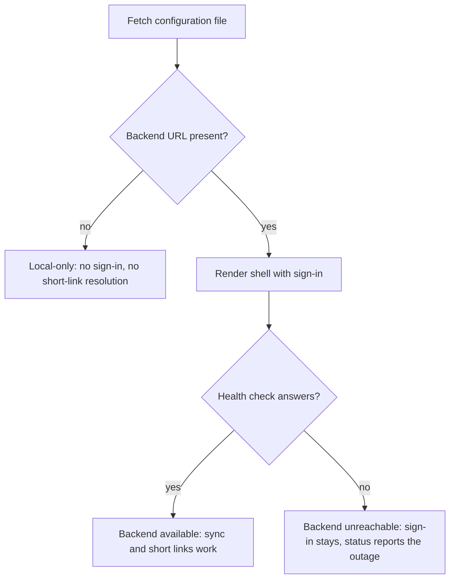
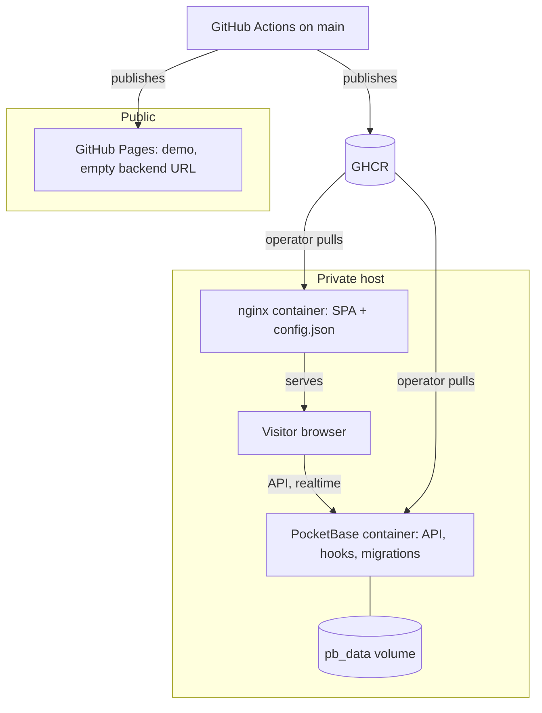
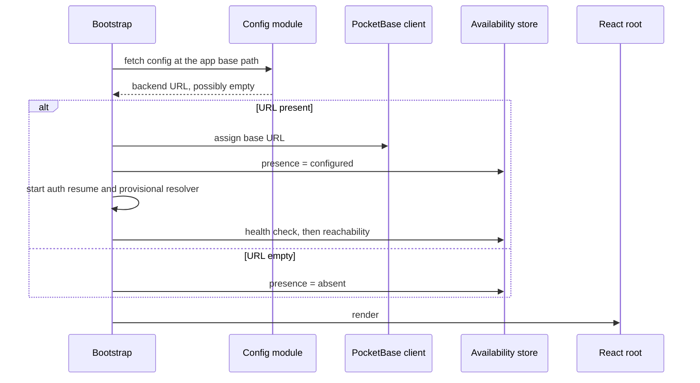

# Two-Target Deployment - Plan

## Goal Capsule

- **Objective:** Tablemarks is reachable from a browser without running a dev server — a private instance where sign-in and cross-device sync work, and a public demo anyone can open — and landing a change on `main` produces publishable artifacts for both without anyone building them by hand.
- **Means:** One source tree, two build targets, separated by build inputs and a configuration file read at startup (KTD1, KTD4). Container images carry no deployment hostname.
- **Product authority:** This plan owns all three deliverables — the private Docker stack, the public demo, and the workflows that publish them. The demo's app-side behavior is inside scope because the demo cannot ship correctly without it.
- **Authority hierarchy:** Requirements win on product behavior. Key Technical Decisions win on mechanism inside those requirements. Units override neither.
- **Execution profile:** Units U1-U5 are behavior changes and carry test scenarios, as does the hook-and-migration half of U8. The rest of U6-U12 is packaging, delivery, and prose; their proof is a successful build, a running container, and a passing docs gate.
- **Stop conditions:** Stop and ask if implementation shows the demo cannot avoid a request to a PocketBase origin, or if honoring the runtime-configuration decision requires moving startup out of the composition root. Extracting the composition root into an importable module is not that — see KTD10.
- **Tail ownership:** This plan ends at a merged change and published artifacts. Pulling images onto the private host stays manual and is not automated here.
- **Open blockers:** None.

**Product Contract preservation:** changed: R15 — both target builds join the checks CI runs; changed: R19 — the console steps are an ordered sequence with two stated couplings, and the sequence starts earlier than first written. Added at the next unused numbers: R21-R25 confirmed in dialogue, R26-R30 raised by the deepening pass as security and recovery gaps in already-confirmed scope. The document review then tightened R1 (HTTPS required), R26 (the gap is the redirect reach, not the ordering of a check that already runs), R27 (closing anonymous creation must not close the first Google sign-in), and R30 (resolution is time-bounded) — each narrows or corrects its own requirement without moving scope — and rewrote KD5 to state where codified hardening ends, which is what lets R27 stand. Its eleven remaining decisions were settled by the user and recorded under Outstanding Questions. Every pre-existing R-ID keeps its original meaning and number.

---

## Product Contract

### Summary

Publish Tablemarks to two targets from one source tree: a private Docker Compose stack running the app next to an exposed PocketBase, and a public GitHub Pages demo that runs with no backend at all. A single runtime-read configuration file decides which mode a given deployment is in, and GitHub Actions builds and publishes both.

### Problem Frame

Tablemarks today runs only under `npm run dev`. There is no container, no workflow, and no `.github/` directory. Nothing in the repository describes how to host it: `docs/how-to/development.md` documents a locally downloaded PocketBase binary and stops there.

Two different absences are being felt. The app has never been used for its actual purpose — saving a place while standing in front of it — because there is nowhere to open it from a phone. And there is no address to hand someone who asks what it does.

Those two needs pull in opposite directions. The first wants a backend: sign-in, sync across devices, and the short-link resolver hook. The second wants no backend at all, because a public demo must not be a client of a private database. The app currently assumes the first: `src/sync/pocketbase.ts:3` inlines a PocketBase URL at build time and defaults it to `http://127.0.0.1:8090`, and `src/App.tsx:290-303` renders the Sign in control with no availability check. Deployed to a static host as-is, the demo would offer a control that opens an OAuth popup against the visitor's own machine, and a pasted short link would leave a provisional record that never resolves.

### Key Decisions

- KD1. **Two build targets, one source tree.** The public demo runs local-only; the private instance runs with PocketBase. (session-settled: user-directed — chosen over a single Pages build pointed at the hosted PocketBase: a public demo must not be a client of the private database.) Governs R12, R13.
- KD2. **The backend location is read at runtime, never baked into the build.** (session-settled: user-directed — chosen over a build-time build argument: a build-time value ships the private hostname inside the public image and the public Actions log, where anyone can read it without visiting the site.) Governs R1, R2, R3.
- KD3. **Backend presence and backend reachability are two separate signals, resolved in that order.** (session-settled: user-directed — chosen over an optimistic render that flashes the Sign in control, and over holding the shell until a health check answers: the configuration file is local and resolves immediately, so the demo never renders a dead control and the private instance never pays a startup delay for the common case.) Governs R4, R6.
- KD4. **The public demo ships no service worker.** (session-settled: user-directed — chosen over a full PWA on the Pages subpath: dropping the worker also drops the `start_url` and scope questions the subpath would otherwise force, and the demo has no offline story worth the tile cache.) Governs R13, R14.
- KD5. **Hardening that depends on the host is an operator step; hardening that describes the collections is versioned.** Deployment topology and credentials — the public origin, the trusted proxy header, the rate limiter, the OAuth client secret — are documented console steps, never codified, because codifying them puts topology back inside the image and KD2 rejects that. Collection access rules are not topology: they are schema, and schema already lives in migrations, which is why R27 closes anonymous account creation by migration rather than by instruction. (session-settled: user-directed — the operator-steps half chosen over a settings migration and a boot-time reconciling hook; the dividing line drawn under document review, which found the original wording forbade the migration R27 requires.) Governs R19, R27.
- KD6. **All three deliverables ship as one plan.** (session-settled: user-directed — chosen over splitting the demo's app-side work into its own plan: the workflows wire the other two together, and each build target is defined by what the other one is not.)
- KD7. **An unreachable backend is reported to signed-out visitors, not only signed-in ones.** (session-settled: user-directed — chosen over narrowing the requirement to what the existing signed-in status surface already covers: a configured instance that is down must not read as a deliberately backend-free build.) Governs R6.

### Requirements

**Runtime configuration**

- R1. The app reads the PocketBase base URL from a configuration file served alongside the built assets, fetched at startup. A non-empty URL must use HTTPS; a loopback origin is exempt so local development keeps working. A URL that is neither is treated as a misconfiguration, not as a usable backend.
- R2. An empty backend URL is a valid configured state meaning "no backend", not an error or a missing value to fall back from.
- R3. The published app image contains no deployment-specific hostname; the operator supplies it when the container starts.

**Local-only behavior**

- R4. With no backend URL configured, the app never renders the Sign in control.
- R5. With no backend URL configured, pasting a `maps.app.goo.gl` short link tells the user the link cannot be resolved without a backend, and creates no provisional record.
- R6. With a backend URL configured but the instance unreachable, the app keeps sign-in available and reports the backend as unreachable rather than presenting itself as local-only.
- R7. The provisional-record resolver does not run when no backend is configured.
- R21. Settings remain reachable in every configuration, including local-only.

**Private Docker stack**

- R8. `docker compose up` on a clean host brings up the app and PocketBase together, with PocketBase data surviving container restarts and image upgrades.
- R9. The PocketBase image carries the repository's migrations and hooks, so the short-link resolver is available on a fresh instance without a manual copy step.
- R10. The app container serves the SPA at the site root and exposes a health endpoint the orchestrator can poll.
- R11. Google sign-in succeeds against the deployed instance.
- R22. No image contains developer machine state: no local PocketBase database, no uploaded files, no downloaded binary.
- R23. Realtime sync subscriptions survive being proxied.

**Public demo**

- R12. The demo is published to GitHub Pages and is fully usable with no backend reachable from the visitor's browser.
- R13. The demo registers no service worker and offers no install prompt.
- R14. The two targets differ only by build inputs, never by edits an operator or workflow has to make and revert.

**Delivery**

- R15. Every push and every pull request runs the type check, the unit tests, both target builds, and the documentation gate.
- R16. A push to `main` publishes an app image and a PocketBase image for both `linux/amd64` and `linux/arm64`.
- R17. A pull request builds those images without publishing them.
- R18. A push to `main` republishes the demo.

**Operator documentation**

- R19. A deployment how-to documents the manual PocketBase console steps a public instance needs, as an ordered sequence: claim the superuser account over a private path — loopback or a tunnel — before any public route reaches the instance, then set the trusted proxy header to `X-Forwarded-For` with rightmost selection, enable the rate limiter, enable the Google auth provider with its credentials, and finally register the deployed origin as a redirect URI on the Google side. It states that enabling the limiter before trusting a proxy header collapses every visitor into one rate-limit bucket, and that all of this lives in `pb_data` — which therefore holds the OAuth client secret and the token signing keys, loses every one of these settings if the volume is destroyed, and makes any backup of it a copy of those secrets rather than of data alone.
- R20. `README.md` links the deployment how-to and the public demo.
- R24. Documentation this work makes false is corrected in the same change.
- R25. The architectural choices behind the two targets are recorded as decision records.

**Raised by the deepening pass**

- R26. The short-link resolver constrains where a redirect can take it, not only which host it is asked for, and returns no upstream error detail to callers.
- R27. Anonymous account creation is closed on the deployed instance, without closing the account creation that the first Google sign-in performs.
- R28. Each publish tags both images with the commit SHA alongside a moving tag, and the deployed pair is upgraded together rather than one at a time.
- R29. The app container sends security headers, and the runtime configuration file carries the backend URL and nothing else.
- R30. Backend presence, backend absence, and a backend that cannot be reached are three distinguishable outcomes, and a launch with no network does not resolve a configured deployment to absent. Configuration resolution is bounded in time, so a connection that accepts but never answers resolves to unreachable instead of leaving the page unrendered.

### Key Flows

- F1. Startup, public demo
  - **Trigger:** A visitor opens the Pages URL.
  - **Steps:** The app fetches the configuration file, reads an empty backend URL, and settles into local-only before the header renders. No health check is attempted. The Sign in control is never rendered; Settings is.
  - **Outcome:** The visitor sees a working map with no dead controls and no failed request to their own machine.
  - **Covers R1, R2, R4, R7, R12, R21.**

- F2. Startup, private instance
  - **Trigger:** The operator opens the deployed app.
  - **Steps:** The app fetches the configuration file, reads the backend URL the container wrote there, and renders the shell with sign-in available. A health check then resolves whether the instance is currently answering.
  - **Outcome:** Sign-in and sync work; a backend that is configured but down is reported as unreachable rather than as absent.
  - **Covers R1, R3, R6, R11.**

- F3. Publishing a change
  - **Trigger:** A commit lands on `main`.
  - **Steps:** The checks run; the app and PocketBase images are built and published; the demo is rebuilt and republished. The operator pulls the new images on the private host.
  - **Outcome:** The demo is current automatically; the private instance is current after the operator's pull.
  - **Covers R15, R16, R18.**

The startup decision F1 and F2 share is the plan's one piece of non-linear product logic — two signals, three outcomes:



### Acceptance Examples

- AE1. **Covers R2, R4, R21.** Given a deployment whose configuration file carries an empty backend URL, when the shell has settled, then the Sign in control is absent from the header, Settings is still reachable, and the `fetch` and `EventSource` spies each recorded no backend call. The assertion is about calls made, not about the origin they targeted — an empty base URL resolves against the app's own origin, so an origin-scoped assertion cannot see a leaked call.
- AE2. **Covers R5, R7.** Given a local-only deployment, when the user pastes a `maps.app.goo.gl` link into capture, then the app explains that short links need a backend, and the restaurant list gains no provisional record.
- AE3. **Covers R6.** Given a deployment whose configuration file carries a backend URL, when that instance does not answer, then the Sign in control remains present, a status indicator reports the backend as unreachable, and the app does not present itself as local-only.
- AE4. **Covers R3, R22.** Given the published app image pulled by someone other than its author, when its **layers** are inspected, then no deployment-specific hostname and no developer database or uploaded file appear in any of them. Inspecting the running filesystem is not sufficient: a file added and deleted in a later layer still ships.
- AE5. **Covers R8, R9.** Given a host with no prior Tablemarks state, when the operator brings the stack up, then PocketBase serves the short-link resolver and the collections exist without a manual migration or hook copy.
- AE6. **Covers R30.** Given an installed app on a configured deployment, when it is launched with no network, then it reports the backend as unreachable and does not present itself as local-only.
- AE7. **Covers R27.** Given the deployed instance, when an anonymous caller attempts to create a user, then the attempt is refused — and when the operator signs in with Google for the first time on that same instance, an account is created and the sign-in completes. Both halves are required: the refusal alone is satisfiable by a rule that also disables the only working sign-in path.

### Scope Boundaries

- Demo content. The public demo starts with an empty map; no seeded or sample places. (session-settled: user-directed, and reaffirmed under document review against the product reviewer's objection that an empty map answers "what does this do?" only after the visitor does data entry — seeded places would need a rule for what becomes of them once the visitor adds their own, and would blur whose data is on the map.)
- A PWA on the demo. Per KD4, install and offline behavior belong to the private instance only.
- A custom domain for either target.
- Browser or end-to-end tests in CI. The repository has only jsdom tests, and adding a browser tier is separate work.
- Automated deployment to the private host. Publishing images is in scope; pulling them on the host stays manual.
- Rate-limit rules and proxy settings tracked in the repository. Per KD5, these are operator steps.
- Metrics, dashboards, and log aggregation. Failure visibility is one external HTTP check and a restart policy; anything more is disproportionate to a single-operator deployment.

#### Deferred to Follow-Up Work

- Re-examining the no-backlog convention's stated reasoning once CI exists. R24 corrects the factual claims about CI; whether the convention's conclusion still holds is a separate judgment.

### Success Criteria

- A person handed only the public demo URL, with no explanation, can add a place and see it on the map.
- An operator following the deployment how-to on a clean host reaches a working signed-in instance without reading the plan or the source.

### Dependencies / Assumptions

- The private instance needs a host with a public HTTPS endpoint for PocketBase. Which host and which reverse proxy front it are not decided; R19's wording assumes a proxy that sets a trusted client-IP header.
- Registering the deployed origin as a Google OAuth redirect URI requires Google Cloud Console access.
- GitHub Pages must be switched to the GitHub Actions source once, by hand, in repository settings. No workflow can do this for the first deployment.
- **Assumed, verification deferred to U7:** the `nginx:alpine` image provides `envsubst`. The behavior of its entrypoint directory is confirmed from the image's own entrypoint source but is absent from the official image documentation, so it is treated as an implementation detail to verify rather than a documented contract. The Docker daemon was not running during planning, so this could not be settled.
- **Assumed, verification deferred to U6:** Vite serves `public/` files at the configured base path in dev as well as in build. The build behavior is documented; the dev behavior with a non-root base is not.
- PocketBase ships four rate-limit rules disabled by default, the broadest of which already covers the resolver hook. R19 assumes enabling the limiter is sufficient and no custom rule is required.
- **Hard prerequisite, not an open question:** the public hostname is chosen and resolving with TLS terminated before U8's stack smoke. The OAuth redirect URI is derived from it, so R11 cannot be verified before it exists. This does not license a first boot on the public route: per R19 the superuser is claimed over loopback or a tunnel, and the public route is opened only afterwards, so the unclaimed-installer screen is never internet-reachable.
- Container packages are private on first publish. Making them public is a one-time manual settings step, in the same class as switching the Pages source; AE4 and U10's verification cannot be satisfied until it is done.
- **Assumed, verification assigned to U8:** whether the resolver hook's HTTP client follows redirects, and what its result exposes. The hook reads a field the generated type definitions do not document. This decides both the hook's SSRF reach and whether R9 works at all.
- The demo depends on two keyless third-party services with rate limits and block policies — the tile host and the geocoder — and has no fallback provider wired in. A public demo is the traffic shape that gets a keyless geocoder blocked.

### Outstanding Questions

**Deferred to Planning** — resolved during this planning pass:

- Whether the module-scope PocketBase client forces a build-time URL. It does not; see KTD1.
- Whether the reload-prompt component needs a guard when the service worker is disabled. It does not; see KTD4.

**Resolved during document review** — each settled by the user, recorded where it governs:

- The demo's service-worker mode: the plain `disable` flag, not self-destroying; see KTD4 and U6.
- The last-known-good backend URL: not persisted; see KTD9 and U1.
- The capture copy: unchanged, with the refusal message carrying the redirect; see U5.
- An empty demo map: reaffirmed; see Scope Boundaries.
- Signed in with no backend: the session is cleared; see U4.
- The content policy's connect directive: templated at container start; see U7.
- Where codified hardening ends and operator steps begin: see KD5.
- A configured deployment whose address never resolved: Sign in renders disabled; see U2 and U4.
- The geocoder risk: owned by U5 and U11.
- Reachability not yet known: no indicator renders; see U4.
- The indicator's placement and narrow-viewport form: see U4.

**Deferred to Implementation**

- Whether R5 should also refuse short links when the backend is configured but unreachable. The plan keeps the current deferring behavior there, because a transient outage is exactly what the provisional record exists for. Revisit if the retry backoff proves noisy in practice.
- What happens to provisional records that already exist locally when a deployment becomes local-only. They remain visible and unresolved; no migration or cleanup is planned.
- Whether the health check repeats after a first failure, and what retriggers it. The plan requires it to run at startup; a reconnect-driven retry follows the existing online-status pattern if it proves needed.

---

## Planning Contract

### Key Technical Decisions

- KTD1. **Assign the client's base URL after configuration resolves; keep the client at module scope.** Constructing the PocketBase client performs no network I/O and its base URL is a public mutable field, so the module-scope singleton does not force a build-time value. A dynamic-import bootstrap would move startup into a remountable place and violate the composition-root rule in `docs/journal/solutions/architecture-patterns/restart-controllers-on-startup.md`. (session-settled: user-directed — chosen over a build-time build argument: a build-time value ships the private hostname inside the public image and the public Actions log.) Governs R1, R2, R3.
- KTD2. **Backend availability is a module-singleton store read through `useSyncExternalStore`.** This is the repository's established shape for cross-cutting reactive state; there is no React context anywhere in `src/`. The store holds presence and reachability as separate fields so they cannot collapse into one boolean. Governs R4, R6.
- KTD3. **Bootstrap awaits configuration, then starts the controllers, then renders.** The two controller starts become conditional on backend presence rather than gaining a new branch, preserving the "safe when absent" property the existing convention requires. Chosen over resolving configuration inside a React effect, which StrictMode double-invokes and a remount repeats. Governs R1, R4, R7.
- KTD4. **The build config becomes the function form, and the demo target sets the PWA plugin's `disable` flag.** The plugin keeps resolving its virtual register module when disabled and serves a no-op stub, so the reload-prompt component needs no conditional import and no guard. The same flag suppresses the web manifest, which is what removes the install prompt. Plain disabling is enough rather than the plugin's self-destroying mode: self-destroying exists to unregister a worker a returning visitor already holds, and nothing has ever been published to this Pages subpath, so no visitor can hold one. Revisit only if a worker is ever published to that origin. (session-settled: user-directed — chosen over a full PWA on the Pages subpath: dropping the worker also drops the `start_url` and scope questions the subpath would force.) Governs R13, R14.
- KTD5. **The app container writes the configuration file from an environment variable through an executable script in the nginx entrypoint directory.** The documented template mechanism writes to a single output directory intended for nginx configuration, so using it for a web-root asset would give up nginx templating entirely. Governs R3.
- KTD6. **Capture gains a result variant for the refused case rather than throwing.** Capture returns a discriminated union today and never returns failures; the calling component owns all user-facing copy. A thrown error would land in that component's catch-all and produce the generic message. Governs R5.
- KTD7. **The two published images move together, addressed by one shared tag.** The split rollout that `docs/journal/solutions/database-issues/guard-empty-syncedat-after-pocketbase-field-retype.md` names is not between the demo and the backend — the demo is a client of nothing — but between the app image and the PocketBase image on the private host, which the operator pulls by hand and can advance independently. Both carry the same commit SHA, the production Compose file reads one tag variable for both, and the app waits for PocketBase to report healthy. Governs R16, R28.
- KTD8. **An ignore file excludes PocketBase runtime state from every build context.** The working tree carries a live database, a backup directory, and an uploaded avatar under paths a naive copy would include, and the images are published publicly. Governs R22.
- KTD9. **Configuration resolution returns three outcomes, not two.** Collapsing a failed fetch into "no backend configured" reintroduces exactly the conflation KD3 exists to prevent, one layer lower: an installed app launched with no network would hide sign-in, skip the controllers, and — because controllers start only at the composition root — never recover for the life of that tab. No last-known-good URL is persisted: it would carry no invalidation rule, so a changed backend address could pin an installed client to the old one indefinitely, and it contradicts KTD3's await-then-render. The network-first runtime cache on the configuration file (U6) is what carries a repeat launch through an outage. Governs R30.
- KTD10. **One module performs the configuration I/O; every other consumer reads the synchronous store.** Only the bootstrap imports the fetching module. This keeps a network dependency out of the roughly forty tests that render the whole app, and it is why the composition root is extracted into an importable module with the entry point reduced to a call — the root stays where the convention requires, and becomes testable. Governs R30.

### High-Level Technical Design

**Deployment topology.** Five participants, two of which exist only for one target:



The demo has no arrow into any backend. That absence is the product decision, and it is enforced by the committed configuration file carrying an empty URL rather than by a build flag.

**Startup ordering.** The composition-root constraint is what makes this a sequence rather than a component question — everything below happens before the first render, outside React:



**Build targets.** Two inputs produce the two artifacts; nothing else differs:

| Target | Base path | PWA plugin | `config.json` at runtime | Published by |
|---|---|---|---|---|
| Private instance | `/` | enabled | written by the container entrypoint | GHCR image |
| Public demo | repository subpath | `disable: true` | the committed file, empty URL | Pages workflow |

### Output Structure

```text
.dockerignore
docker/
  Dockerfile                    # app: node build stage -> nginx runtime
  Dockerfile.pocketbase         # PocketBase + tracked hooks and migrations
  docker-compose.yml            # builds locally
  docker-compose.prod.yml       # pulls published images
  nginx.conf
  docker-entrypoint.d/
    30-write-config.sh          # writes config.json from the environment
  .env.example
.github/workflows/
  ci.yml
  docker-build.yml
  deploy-pages.yml
public/
  config.json                   # committed, empty backend URL
src/sync/
  runtimeConfig.ts
  backendStatus.ts
  useBackendStatus.ts
docs/how-to/deployment.md
docs/journal/decisions/
  0001-read-the-backend-location-at-runtime.md
  0002-separate-backend-presence-from-reachability.md
```

### Sequencing

Units U1-U5 are independent of the container work and land first, because the demo cannot be published correctly until local-only behavior exists. Within them, U1 and U2 precede everything: U3 bridges them, and U4 and U5 read only U2.

U6 depends on U1 for the base-path-aware fetch. U9 depends on U6, because it builds both targets. U7-U8 depend on U6 for a build that produces the right artifact. U10 depends on U6-U8 for something to publish, and must never run its Pages job against a tree without U6. U11-U12 depend on the rest being settled enough to describe.

---

## Implementation Units

| Unit | Title | Key files | Depends on |
|---|---|---|---|
| U1 | Runtime configuration module | `src/sync/runtimeConfig.ts`, `public/config.json` | — |
| U2 | Backend availability store | `src/sync/backendStatus.ts`, `src/sync/useBackendStatus.ts` | U1 |
| U3 | Gate bootstrap on backend presence | `src/main.tsx`, `src/sync/pocketbase.ts` | U1, U2 |
| U4 | Local-only header | `src/App.tsx` | U2 |
| U5 | Refuse short-link capture with no backend | `src/capture/capture.ts`, `src/features/capture/AddPlace.tsx` | U2 |
| U6 | Build-target configuration | `vite.config.ts` | U1 |
| U7 | App container image | `docker/Dockerfile`, `docker/nginx.conf`, `docker/docker-entrypoint.d/` | U6 |
| U8 | PocketBase image and Compose stack | `docker/Dockerfile.pocketbase`, `docker/docker-compose*.yml`, ignore files, `pocketbase/pb_hooks/`, `pocketbase/pb_migrations/` | U7 |
| U9 | CI workflow | `.github/workflows/ci.yml` | U6 |
| U10 | Publish workflows | `.github/workflows/docker-build.yml`, `deploy-pages.yml` | U6, U7, U8 |
| U11 | Deployment documentation | `docs/how-to/deployment.md`, `docs/README.md`, `README.md`, `docs/conventions/documentation.md`, `docs/how-to/development.md`, `pocketbase/README.md` | U7, U8, U9 |
| U12 | Decision records | `docs/journal/decisions/` | — |

### U1. Runtime configuration module

- **Goal:** One module resolves the backend location at startup and distinguishes "no backend configured" from "could not find out".
- **Requirements:** R1, R2, R30. Part of F1, F2. Governed by KTD1, KTD9, KTD10.
- **Dependencies:** none.
- **Files:** `src/sync/runtimeConfig.ts`, `src/sync/runtimeConfig.test.ts`, `public/config.json`.
- **Approach:**
  1. Place the module under `src/sync/` — `docs/how-to/development.md` states only `sync` reaches PocketBase, and this module holds the PocketBase location.
  2. Fetch the configuration file relative to the app's base URL, not an absolute root path. A root-absolute fetch returns the Pages 404 page under a repository subpath.
  3. Return three outcomes, per KTD9. A parsed body with a non-empty URL is configured; a parsed body with an empty URL is absent; every failure — network rejection, non-OK status, unparseable body, missing key — is unavailable. Collapsing the third into the second is the defect KTD9 names.
  4. Bound the fetch with a timeout, per R30. A rejected connection settles the promise; a connection that is accepted and then never answers does not, and rendering in a `finally` cannot help a promise that never settles — the page stays blank for exactly the flaky-mobile case this deployment exists to serve. Use the same mechanism the geocoder already uses — `AbortSignal.timeout` at `src/capture/geocode.ts:27` — with a budget well under the geocoder's, since this one gates first paint. A timeout resolves to unavailable, not to absent.
  5. Reject a non-HTTPS URL, per R1, treating it as unavailable rather than as a usable backend. The exemption is a loopback host, which is how development runs. Without the check any non-empty string reads as configured, so a mistyped `http://` origin would carry the auth token in the clear.
  6. Persist nothing. An earlier draft cached the last resolved URL; per KTD9 it is not carried, because it had no invalidation rule and contradicted the await-then-render decision. Offline repeat launches are served by U6's network-first runtime cache instead.
  7. Commit `public/config.json` carrying an empty backend URL. This is what makes the demo local-only with no build flag, and the container overwrites it.
- **Patterns to follow:** `src/capture/geocode.test.ts` for stubbing `fetch` through `vi.stubGlobal`; the repository uses no fetch-mocking library.
- **Test scenarios:**
  - A response carrying a non-empty backend URL resolves to configured with that URL.
  - A response carrying an empty backend URL resolves to absent.
  - A network rejection resolves to unavailable — distinguishable from absent, not merged with it.
  - A 404 whose body is HTML resolves to unavailable without throwing.
  - A 200 response with malformed JSON resolves to unavailable without throwing.
  - A fetch that never settles resolves to unavailable once the timeout elapses, rather than pending forever.
  - A non-empty `http://` URL on a non-loopback host resolves to unavailable, not to configured.
  - A `http://127.0.0.1` URL resolves to configured, so development is unaffected.
  - Covers AE1. The fetch is issued against the base-prefixed path, not a root-absolute one.
- **Verification:** the module never rejects and never pends indefinitely, the three outcomes are distinguishable by a caller, and the committed configuration file parses.

### U2. Backend availability store

- **Goal:** Presence and reachability are two independently readable signals that components can subscribe to.
- **Requirements:** R2, R4, R6, R30. Part of F1, F2. Governed by KTD2, KTD9.
- **Dependencies:** U1.
- **Files:** `src/sync/backendStatus.ts`, `src/sync/backendStatus.test.ts`, `src/sync/useBackendStatus.ts`.
- **Approach:**
  1. Mirror `src/sync/syncStatus.ts` — a listener set, a current value, an emit function, a getter, and a subscribe function returning an unsubscribe.
  2. Mirror `src/sync/useSyncStatus.ts` for the hook, which that file documents as mirroring `useAuth`'s shape.
  3. Carry presence as configured, absent, or unavailable, and reachability separately. Unavailable maps to configured-but-unreachable, never to absent — but it is not interchangeable with it either: unavailable means the address itself is unknown, so U4 renders Sign in disabled there and active when the address is known. Keep the two distinguishable rather than collapsing both into one unreachable flag.
  4. Expose a setter for reachability so the sync engine's success path can clear it. A store with one writer and no clearer is what strands the header in a stale state — see U3.
  5. Memoise the value the hook returns. A fresh object identity per render feeding an effect dependency is the hang-with-no-error failure documented in `docs/journal/solutions/conventions/react-leaflet-test-mock-stability.md`.
- **Patterns to follow:** `src/sync/syncStatus.ts` and `src/sync/useSyncStatus.ts`. The store carries the tests; the hook does not, matching the existing pair.
- **Test scenarios:**
  - Setting presence to absent leaves reachability unset rather than defaulting it to reachable.
  - An unavailable resolution reads as configured-but-unreachable, not as absent.
  - An unavailable resolution stays distinguishable from a known-address-unreachable one, so a consumer can tell whether an address exists.
  - Reachability has an unknown state distinct from both reachable and unreachable.
  - Clearing reachability after a successful sync returns the store to reachable.
  - A subscriber is notified on presence change and on reachability change.
  - Unsubscribing stops notifications.
  - Reading the store before any write returns a defined initial state, not undefined.
  - An absent backend never produces a state a consumer would render as a sync problem.
- **Verification:** the store admits absent, configured-and-reachable, configured-and-unreachable-with-a-known-address, and configured-with-no-known-address — and reachability admits unknown. Nothing else.

### U3. Gate bootstrap on backend presence

- **Goal:** Startup resolves configuration before anything touches the backend, the controllers do not run when no backend is configured, and the shell renders whatever happens.
- **Requirements:** R1, R3, R7, R30. Realizes the startup ordering in F1 and F2. Governed by KTD1, KTD3, KTD9, KTD10.
- **Files:** `src/main.tsx`, `src/sync/bootstrap.ts`, `src/sync/bootstrap.test.ts`, `src/sync/pocketbase.ts`, `src/sync/syncEngine.ts`, `src/capture/resolvePending.test.ts`.
- **Dependencies:** U1, U2.
- **Approach:**
  1. Extract the composition root into an importable module and reduce the entry file to a call. The root stays where the convention requires and becomes testable — this is KTD10, and it is not the stop condition the Goal Capsule names.
  2. Change the client's constructor argument to an empty placeholder so no host is baked in, then assign its base URL once configuration resolves.
  3. Await configuration, populate the availability store, and only then call the auth resume and the provisional resolver. Render in a `finally`, so a throw anywhere above still paints a shell rather than a blank page.
  4. Run the health check after render is scheduled. Presence gates the first paint; reachability does not.
  5. Subscribe the health check to the existing online-status change seam so reachability re-derives instead of being written once and stranded.
  6. Add rejection handling to the two realtime subscribe calls in `src/sync/syncEngine.ts`. They are unhandled today; making configured-but-unreachable a routinely exercised state turns a latent unhandled rejection into a failing test run.
- **Execution note:** the existing regression guard asserts the auth resume is a safe no-op when signed out. Extend that same guard to "and when no backend is configured" rather than writing a parallel test.
- **Patterns to follow:** `docs/journal/solutions/architecture-patterns/restart-controllers-on-startup.md` — idempotent, safe when absent, symmetric with the interactive path, wired at the composition root.
- **Test scenarios:**
  - Covers AE1. With no backend configured, the provisional resolver starts nothing and no backend call is recorded.
  - With no backend configured, the auth resume is a no-op and does not escalate to a sync problem state.
  - With a backend configured, the client's base URL equals the configured value before the resume runs.
  - With a backend configured, the resume and the resolver each run exactly once.
  - Covers AE6. A configuration fetch that rejects leaves the app reporting unreachable, not local-only.
  - If configuration resolution throws, the shell still renders.
  - Reachability recovers when the online-status seam reports a reconnect.
  - A realtime subscribe rejection does not surface as an unhandled rejection.
- **Verification:** no backend call is observable on a local-only startup, a configured startup reaches the behavior it has today, and no startup path can leave the page blank.

### U4. Local-only header

- **Goal:** The header hides Sign in when no backend is configured, keeps Settings in every configuration, reports an unreachable backend without contradicting the sync status, and never renders a control that cannot work or a claim it cannot support.
- **Requirements:** R4, R6, R21, R30. Realizes the rendered outcome of F1 and F2. Governed by KD7, KTD2, KTD9.
- **Dependencies:** U2.
- **Files:** `src/App.tsx`, `src/App.test.tsx`, `src/i18n/locales/en/translation.json`, `src/i18n/locales/fr/translation.json`.
- **Approach:**
  1. The signed-out branch of the header is a fragment carrying both Sign in and Settings. Gate only the Sign in control; gating the fragment removes the language switcher from the demo.
  2. Add locale keys under a backend namespace rather than reusing the sync ones. The existing unreachable copy promises the app will keep trying in the background, which is false for a signed-out visitor with no controller running.
  3. Clear the auth store when presence is absent. The signed-in check is a local token check, so it can be true with no backend at all, in which case the account menu renders a sync chip reading "all synced" while nothing syncs — the one place the app makes a false backup claim. (session-settled: user-directed — chosen over rendering a distinct not-backed-up state, which both the coherence and adversarial reviewers preferred: clearing removes a state rather than adding one. Local data is retained by design, so nothing is lost; the visible effect is a session that does not survive a deployment losing its backend.)
  4. Render the Sign in control differently for the two configured-but-not-working cases, which are not the same control. When the configuration resolved and the backend simply is not answering, the address is known and retrying can work, so the control stays active. When configuration resolution itself failed, no address is known at all — an active control would open an authentication window against the visitor's own machine, exactly the dead control this plan exists to remove — so the control renders present but disabled, with the explanation. Neither case presents the app as local-only, which is what R6 and KD3 require.
  5. Render no indicator while reachability is still unknown. Presence resolves from a local file and reachability from a health check that answers later, so there is a window on every launch where neither "reachable" nor "unreachable" is true yet. Defaulting either way produces a claim the app cannot support — and defaulting to unreachable reproduces, on this indicator, the startup flash KD3 rejected for the Sign in control. No indicator is no claim.
  6. Place the indicator in the header's right-hand group and give it a narrow-viewport form. That group is `shrink-0` by deliberate bug fix — `src/App.tsx:268-289` documents why: it must not truncate, so the left group absorbs the overflow instead, and anything widening the right group pushes the row past the viewport edge again. Hide the label below the `sm` breakpoint following the existing pattern at `src/App.tsx:301`, leaving the icon alone. An icon with no text needs an accessible name, so give it one rather than relying on the visual.
  7. Reuse the existing `Badge` primitive and the sync-status presentation helper for tone and shape.
  8. Add the new hook to the existing mock block in `src/App.test.tsx` with a default in the shared setup. Roughly forty tests render the app; an unmocked hook would fetch in each.
- **Patterns to follow:** `src/features/ui/Badge.tsx` and `src/features/sync/syncStatusPresentation.ts`. Per the repository's UI directives, extend the primitive's variant map rather than writing new markup, and compose classes through the class helper.
- **Test scenarios:**
  - Covers AE1. With no backend configured, Sign in is absent and Settings is present.
  - Covers AE3. With a backend configured but unreachable, Sign in is present and an unreachable indicator is shown.
  - With a backend configured and reachable, the header matches today's signed-out rendering exactly.
  - Signed in with a reachable backend, the account menu renders as it does today.
  - Presence absent clears the stored session and the header renders its signed-out form; the stored restaurants are untouched.
  - The header indicator and the account status chip never report opposite facts.
  - A backend that becomes reachable after an unreachable startup clears the indicator.
  - The unreachable indicator is absent in local-only — an absent backend is not an outage.
  - While reachability is unknown, no indicator renders at all.
  - With configuration resolution failed, Sign in renders present but disabled, and no authentication window can be opened from it.
  - With the backend configured and unreachable, Sign in renders active — the address is known.
  - At a 320px viewport the header does not overflow with the indicator present.
  - The indicator exposes an accessible name when its label is hidden.
  - Both locales resolve the indicator's copy.
- **Verification:** each configuration renders a header with no dead controls and no two surfaces disagreeing about the backend.

### U5. Refuse short-link capture with no backend

- **Goal:** Pasting a short link with no backend explains why it cannot work, points at what does, and creates no record that will never resolve.
- **Requirements:** R5. Governed by KTD6, KTD10. Carries the demo's guidance burden: the capture copy deliberately still invites a short link, so this message is the only surface that redirects a visitor to a working path.
- **Dependencies:** U2. Capture reads the synchronous store, never the fetching module — otherwise every test that renders the app acquires a network dependency through the capture import chain.
- **Files:** `src/capture/capture.ts`, `src/capture/capture.test.ts`, `src/features/capture/AddPlace.tsx`, `src/i18n/locales/en/translation.json`, `src/i18n/locales/fr/translation.json`.
- **Approach:**
  1. Add a result variant for the refused case and check backend presence *before* the resolve attempt, not in its catch. A configured-but-unreachable backend must still reach the catch and create a provisional record.
  2. Add the matching branch in the calling component's result handler. That handler's final branch currently assumes the search case and is not exhaustiveness-checked.
  3. Add the message key to both locale files under the capture namespace, following its existing flat error-key naming.
  4. Give the refusal its own surface, not the shared error paragraph. Every failure in this component currently renders through one red paragraph at `src/features/capture/AddPlace.tsx:126`, so a refusal placed there is styled identically to "could not add" and reads as a transient fault the visitor should retry. It is neither: it is a permanent property of this deployment. Render it in an informational tone, distinct from the error paragraph, built from the existing UI primitives per the repository's directives.
  5. Make that surface carry the two paths that do work — searching by name, or pasting a full Maps URL with coordinates. This is the demo's only guidance: the pasted-link copy stays as it is, so this message is what redirects the visitor. (session-settled: user-directed — chosen over making the placeholder and empty-state copy presence-aware, which was the alternative remedy.)
  6. Keep the geocoder's two existing failure messages distinct and add the fallback suggestion to the provider-failure one. `src/features/capture/AddPlace.tsx:51,53` already separates "no matches" from "search failed" — the distinction exists and must survive, because name search is the demo's working path and a blocked geocoder is a named risk with no fallback. A visitor whose search fails needs to be told the full-Maps-URL path still works.
  7. The capture test file replaces the whole PocketBase module with a factory exposing only the resolver. Reading presence from the store module keeps that factory valid and adds one independent mock.
- **Patterns to follow:** the existing discriminated result union in `src/capture/capture.ts`; user-facing copy is resolved in the component, never in the capture module.
- **Test scenarios:**
  - Covers AE2. With no backend configured, a short link returns the refused variant and creates no record.
  - With a backend configured but unreachable, a short link still creates a provisional record.
  - With a backend reachable, a short link resolves as it does today.
  - A full Maps URL with coordinates is unaffected in every configuration — it never needed the backend.
  - A non-Maps text input still routes to search in every configuration.
  - The refused variant renders its message in both locales.
  - The refusal renders on its own surface, not through the shared error paragraph.
  - The refusal names both working alternatives.
  - A geocoder failure and an empty result set still render different messages.
- **Verification:** local-only capture of a short link leaves the restaurant list unchanged, and the visitor is told in the same breath what does work.

### U6. Build-target configuration

- **Goal:** One config file produces both artifacts, with the service worker gone from the demo and the base path set.
- **Requirements:** R13, R14. Governed by KTD4.
- **Dependencies:** U1.
- **Files:** `vite.config.ts`.
- **Approach:**
  1. Convert to the function form so the plugin options can vary by build target.
  2. Set the plugin's `disable` flag on the demo target. It emits no worker and no web manifest, which is what removes the install prompt. Do not use the self-destroying mode: it exists to unregister a worker a returning visitor already holds, and this Pages subpath has never been published to, so there is none. Its cost is real — it emits a worker and leaves the manifest in place, which then has to be suppressed separately.
  3. Remove the hardcoded root start URL from the manifest, or make it target-dependent. It overrides the plugin's base-derived default, so a subpath build would otherwise ship a manifest launching at the origin root.
  4. Add a runtime-cache entry for the configuration file on the worker-bearing target, with a network-first strategy. It is excluded from the precache glob by extension, so without an entry an installed app has no offline path to it — the failure KTD9 exists to survive. The strategy has to be stated rather than copied: the repository's only existing runtime-cache precedent is cache-first for map tiles, and cache-first here would pin the backend URL on every installed client permanently, which is the opposite of the no-store intent U7 sets on the same file. Network-first serves the cached copy only when the network does not answer.
  5. Keep the base path override in the workflow rather than the config file, so the container build is unaffected.
  6. Keep the test block intact — this file also configures the test runner.
  7. Verify the configuration file is served at the base path in dev with a non-root base. Only the build behavior is documented.
- **Execution note:** this file is outside the type check's include path, so a mistake here surfaces only at build. Prove both targets with a real build.
- **Test expectation:** none — build configuration. Proof is that both target builds succeed and produce the expected artifacts.
- **Verification:** the demo build emits no service worker and no web manifest; the default build emits a normal worker and a manifest whose start URL matches its base.

### U7. App container image

- **Goal:** A published image with no hostname in it serves the SPA, writes its configuration at container start, and does not hand an attacker a token.
- **Requirements:** R3, R10, R29. Governed by KTD5.
- **Dependencies:** U6.
- **Files:** `docker/Dockerfile`, `docker/nginx.conf`, `docker/docker-entrypoint.d/30-write-config.sh`, `docker/.env.example`.
- **Approach:**
  1. First, settle the assumption: confirm the runtime image provides `envsubst`. If it does not, install it or write the file with a shell here-document instead.
  2. Build in a Node 22 stage, then copy only the built output into the nginx runtime stage. Name the major explicitly rather than deferring to a repository floor: `package.json` declares no `engines` field and there is no `.nvmrc`, so there is no floor to align with, and CI and the image would otherwise be free to land on different majors. Pass no backend URL as a build argument — that is the whole point of KTD1.
  3. The entrypoint script must end in `.sh`, be executable, and sort after the image's own numbered scripts. A non-executable file is skipped with only a log line, and the mechanism runs only when the container command is nginx — do not override the command.
  4. Serve the configuration file with a no-store header. It is the one asset that must never be stale.
  5. Send security headers: a content policy, no-sniff, a referrer policy, and a frame-ancestors restriction. The auth token lives in browser storage on this origin, so script execution here is a full account takeover, and the connect directive is the one that stops a hostile script sending that token anywhere. Template it at container start from the same environment variable that fills the configuration file — a small extension of the entrypoint this unit already writes. (session-settled: user-directed — chosen over shipping a permissive connect directive and recording the accept.) Name every destination the app legitimately reaches, not the backend alone: the geocoder and the tile host are third-party origins the map depends on, and omitting them breaks the map silently, with no error a user could report usefully.
  6. Keep the configuration file to the backend URL and nothing else. It is world-readable by construction; no secret may be added to it or to the variable that fills it.
  7. Add an SPA fallback and a health endpoint the orchestrator can poll.
- **Test expectation:** none — packaging. Proof is runtime behavior, below.
- **Verification:** a container started with a backend URL serves that URL in the configuration file; started without one, it serves an empty value and the app runs local-only. The health endpoint answers. The response headers carry the security policy. Grep the image layers for the hostname and find it nowhere.

### U8. PocketBase image and Compose stack

- **Goal:** The stack comes up on a clean host with the resolver working and the instance closed to strangers, and no developer state reaches a published image.
- **Requirements:** R8, R9, R11, R22, R23, R26, R27. Governed by KTD7, KTD8.
- **Dependencies:** U7.
- **Files:** `docker/Dockerfile.pocketbase`, `docker/docker-compose.yml`, `docker/docker-compose.prod.yml`, `.dockerignore`, `.gitignore`, `pocketbase/pb_hooks/resolveShortLink.pb.js`, `pocketbase/pb_migrations/`.
- **Approach:**
  1. Write two ignore files, not one. The build-context ignore keeps runtime state out of images. The repository ignore needs the backup directory and an environment-file rule added: the backup directory is currently excluded only by a file PocketBase wrote inside it, and there is no environment-file rule at all while this unit introduces an example one.
  2. Delete the developer backup directory, or ignore it at the repository root deliberately. A `pb_data` holds the OAuth client secret and the token signing keys, not just settings.
  3. Copy only the tracked hooks and migrations into the image. Check what is tracked rather than what is on disk.
  4. Close anonymous account creation without closing the first Google sign-in. The initial migration never touches the user collection, so its rules are the PocketBase defaults, and its create rule is the empty string — which means anyone, including unauthenticated callers. On localhost that is inert; on a public origin it is an open write endpoint on a single-operator instance. The trap is that the operator's very first Google sign-in *is* a user creation, so a migration that simply denies creation bricks the only sign-in path — on exactly the clean-host smoke this unit defines. Constrain the API create rule while leaving the OAuth provider's own account creation enabled, then prove both halves rather than only the refusal. Add a migration, and state the intent in it.
  5. Harden the resolver hook, which becomes internet-reachable. The host allowlist already runs before the outbound request — restating that as the fix would tell an implementer the work is done and leave the real gap untouched. What is missing is a constraint on where a *redirect* may lead: the destination check runs only after the redirect has been followed, so the hook will issue a request to whatever the upstream names. Decide the reach explicitly — stop following redirects and read the location header, or re-check the resolved target against the same allowlist before any body is fetched — and settle it against the finding this unit already owes on the hook's HTTP client. Alongside it: drop the general-purpose redirector host the client never produces, and stop returning upstream error text to callers — those errors distinguish refused from timed-out and turn a blind request into a network probe.
  6. Pin the PocketBase version. The repository's only PocketBase-internals learning is empirically scoped to one version, and a moving tag silently invalidates it.
  7. Mount the data volume at the runtime data path only. PocketBase writes generated migrations into the migrations directory, so that path stays in the image and out of the volume.
  8. Give both services health checks, make the app wait for PocketBase to be healthy, and set a restart policy on both. Nothing acts on a health check otherwise, and a host reboot would leave the instance down until someone notices.
  9. Address both images through one shared tag variable in the production Compose file, per KTD7.
  10. Document the reverse-proxy requirements the operator's proxy must meet: response buffering off and a read timeout long enough for realtime. The sign-in flow returns its authorization code over the realtime channel, so a buffering proxy breaks sign-in and not only sync.
- **Test expectation:** the hook and the migration are testable and should be tested; the container assembly is not. Add scenarios for the resolver's redirect reach and for both halves of the user-creation rule.
- **Test scenarios:**
  - The resolver rejects a non-allowlisted host without issuing an outbound request — a regression guard on behavior that already exists.
  - A redirect pointing away from the allowlisted hosts does not cause a request to the redirect target.
  - The resolver returns no upstream error text on a failed fetch.
  - Covers AE7. The migration leaves the user collection closed to anonymous creation.
  - The migration leaves account creation through the Google provider working, so a first sign-in on a clean instance still succeeds.
- **Verification:** on a host with no prior state the stack reaches healthy, the resolver returns coordinates for a real short link and refuses a non-allowlisted host, an anonymous caller cannot create a user, and the operator's first Google sign-in on that same clean instance completes. Inspect both image layer sets and find no database, no uploaded file, and no local binary.

### U9. CI workflow

- **Goal:** Every push and pull request runs the checks the repository has, against both build targets.
- **Requirements:** R15. Part of F3.
- **Dependencies:** U6.
- **Files:** `.github/workflows/ci.yml`.
- **Approach:**
  1. Run the type check, the tests, the documentation gate, and **both** target builds. A change that breaks only the demo — a root-absolute asset path, the start-URL regression U6 exists to prevent — otherwise passes every check and is discovered after merge, with the public demo already broken.
  2. Install Python for the documentation gate. It uses only the standard library.
  3. Pin Node to 22, the same major U7's build stage names. The repository declares no `engines` and carries no `.nvmrc`, so nothing else keeps the two aligned, and a green CI run on a different major proves nothing about the image.
  4. There is no linter or formatter in this repository; do not add steps for tools it does not have.
- **Test expectation:** none — CI configuration. Proof is a green run on a pull request.
- **Verification:** the workflow fails on a deliberately broken type, a failing test, a documentation-gate violation, and a change that breaks only the demo build.

### U10. Publish workflows

- **Goal:** A merge publishes both images under a retrievable name and republishes the demo; a pull request builds without publishing.
- **Requirements:** R12, R16, R17, R18, R28. Realizes F3. Governed by KTD7.
- **Dependencies:** U6, U7, U8.
- **Files:** `.github/workflows/docker-build.yml`, `.github/workflows/deploy-pages.yml`.
- **Approach:**
  1. Build both images for the two architectures; publish only when the event is not a pull request.
  2. Tag both images with the commit SHA alongside the moving tag. Without an immutable name, the operator who finds a bad deploy has nothing to roll back to.
  3. Build the demo with the repository subpath as the base and publish it through the Pages deployment action, with a concurrency group so overlapping runs do not race.
  4. Give each job only the permissions it needs — package write on the publish job, Pages and identity on the deploy job, neither on the pull-request build.
  5. Pass no backend URL to the image build. If a workflow needs one, KTD1 has been violated.
  6. Pin every third-party action to a commit SHA rather than a moving tag, in these workflows and in U9's. These jobs are the repository's highest-privilege surface — one holds package-write, the other holds the Pages deployment identity — and a tag is repointable by whoever owns the action, so a compromised upstream inherits both without a change landing here.
  7. The Pages deploy must never run against a tree without U6, or the demo origin receives a worker that then has to unregister itself.
- **Test expectation:** none — CI configuration. Proof is a published image and a live demo.
- **Verification:** a pull request produces built-but-unpublished images; a merge produces images addressable by commit SHA and an updated demo. Pull a published image as an unauthenticated user and confirm no hostname is in it.

### U11. Deployment documentation

- **Goal:** An operator can stand the instance up, recover a bad deploy, and upgrade without losing data, from documentation alone — and no maintained document still says something this work made false.
- **Requirements:** R19, R20, R24. 
- **Dependencies:** U7, U8, U9.
- **Files:** `docs/how-to/deployment.md`, `docs/README.md`, `README.md`, `docs/conventions/documentation.md`, `docs/how-to/development.md`, `pocketbase/README.md`.
- **Approach:**
  1. Write the how-to with the frontmatter the documentation gate requires, and add it to the index in `docs/README.md`. A document absent from that index fails the gate.
  2. Give the console steps as the ordered sequence R19 names, with both couplings stated. The superuser is claimed over loopback or a tunnel *before* the public route is opened, because a fresh instance answers its first caller with an unauthenticated installer screen and the window between first boot and first claim is however long the operator takes. The trusted proxy header comes before the rate limiter, because a limiter that sees only the proxy's address puts every visitor in one bucket.
  3. State the recovery procedure: change the shared tag variable to a previous commit SHA and bring the stack back up. State the asymmetry plainly — the app container rolls back cleanly because it is stateless, the PocketBase container does not, because pulling an older image does not un-apply a migration already recorded in the volume. Schema recovery is restore-from-backup.
  4. Open the upgrade procedure with taking a PocketBase backup, and say plainly what that backup is: a copy of the volume, so it carries the OAuth client secret and the token signing keys, not restaurant data alone. PocketBase writes it *inside* the volume it is meant to protect, which makes it useless against volume loss and puts a secret archive in the same place as the secrets. Direct the operator to move it off the host and store it where a secret belongs. Then give one post-upgrade check runnable without SQL: the record counts are unchanged and no record shows a blank timestamp where one was populated.
  5. State the same handling for a restored volume: a restore returns the instance to whatever hardening the backup captured, so the console settings R19 lists — trusted proxy header, rate limiter, auth provider — are re-verified after any restore rather than assumed.
  6. Cover the first-run path: export the local data before the first sign-in on the private instance, since first sign-in is a reconciliation event.
  7. Name the one-time manual steps and what happens if they are skipped — the first Pages deploy fails until the source is switched, and the published packages are private until made public. Both are recoverable by re-running, not by editing the workflow.
  8. Add an operational note: one external HTTP check against the public URL is the whole monitoring story, and it proves the app is up rather than that the backend is answering.
  9. Name the demo's third-party dependencies, their privacy consequence, and the failure they carry — a visitor's searches and viewport reach the geocoder and the tile host, neither has a fallback provider, and a blocked geocoder takes name search with it, leaving only the full-Maps-URL path. This is the demo's single point of failure for its own success criterion, so it is named rather than discovered.
  10. Correct `docs/conventions/documentation.md`, which asserts twice that this repository has no CI and names the pre-commit hook as the only enforcement point.
  11. Correct `docs/how-to/development.md` and `pocketbase/README.md`, which both tell the reader to point the app at PocketBase with a build-time variable that no longer exists.
  12. Do not rename the section in `docs/how-to/development.md` that the root readme links by fragment, or fix the link in the same change.
  13. Add no backlog, roadmap, or future-work section. The gate rejects them.
- **Test expectation:** none — documentation. The gate is the check.
- **Verification:** the documentation gate passes, every relative link and fragment resolves, and no maintained document mentions the removed build-time variable.

### U12. Decision records

- **Goal:** The architectural choices a future reader would otherwise have to reverse-engineer are written down.
- **Requirements:** R25.
- **Dependencies:** none.
- **Files:** `docs/journal/decisions/`.
- **Approach:**
  1. Write two records: reading the backend location at runtime rather than at build time, and separating backend presence from backend reachability.
  2. Follow the template already in that directory, filling the confirmation section rather than leaving it as a placeholder. The gate rejects unresolved template placeholders anywhere, journal included.
  3. Use the numbered kebab-case filename shape the gate enforces. These are the repository's first records, so they start at one.
  4. Record what was rejected and why. The rejected build-time alternative is what makes the runtime decision legible later.
- **Test expectation:** none — decision records.
- **Verification:** the documentation gate passes and neither record contains an unresolved placeholder.

---

## System-Wide Impact

- **The configuration fetch becomes a single point of failure for the entire startup path.** Everything that used to run unconditionally now runs after an await. KTD9 keeps its failure mode from aliasing a valid product state, U3 renders in a `finally` so a throw cannot blank the page, and U1's timeout keeps a connection that never answers from holding first paint hostage.
- **Three writers and two renderers now describe backend health.** The sync engine's failure ladder escalates to a problem state after repeated failures and shows it in the account menu; the new store is written at startup and shown in the header. Without coupling, a startup blip strands the header while sync works fine, and a backend that dies after startup reddens the account chip while the header still says reachable. U3 re-derives reachability from the online-status seam and U4 tests that the two surfaces cannot disagree.
- **The signed-in check is local and survives the backend disappearing.** It reads a stored token, so a signed-in session renders the account menu — and its "all synced" chip — on a deployment with no backend at all. U4 owns the resolution.
- **Module layering acquires a rule it did not need before.** One module performs I/O, one holds state, and only the bootstrap bridges them. Without it, the capture import chain drags a network dependency into the roughly forty tests that render the whole app.
- **The service-worker decision is one-way per origin.** A worker that reaches an origin stays until something unregisters it. Nothing has ever been published to the Pages subpath, so the demo can simply emit none — but that property holds only while it holds, which is why U10 must never deploy Pages from a tree without U6. A single deploy without it would put a worker on the origin permanently and force the self-destroying mode after all.
- **"Backend unreachable" stops being a rare path.** Code that has never had to survive it now runs it deliberately in tests — including two realtime subscribe calls whose rejections are currently unhandled.

---

## Risks & Operational Notes

| Risk | Mitigation | Owner |
|---|---|---|
| The resolver hook becomes an internet-reachable request proxy and error oracle | Constrain where a redirect may lead — the host allowlist already guards the requested host, not the resolved one — drop the general-purpose redirector host, return no upstream detail | U8 |
| Anonymous account creation is open by default on a public instance | Close it by migration; verify both the anonymous refusal and that a first Google sign-in still creates its account | U8 |
| A published image carries the developer's database, avatar, or OAuth secret | Two ignore files, delete the stray backup, inspect layers rather than the running filesystem | U8 |
| A bad deploy has no previous version to return to | Commit-SHA tags on both images, one shared tag variable, documented recovery | U10, U11 |
| A migration auto-applies on upgrade and corrupts data, as one in this repo's history already did | Backup before upgrade, and a post-upgrade check the operator can actually run | U11 |
| The instance is down and nobody knows until it is needed | Restart policy on both services, one external HTTP check | U8, U11 |
| An installed app launched offline mistakes a configured backend for none | Three-outcome resolution, bounded fetch, network-first runtime cache for the config file | U1, U6 |
| Script execution on the app origin steals a long-lived auth token from browser storage | Content policy and companion headers | U7 |
| A plaintext backend URL carries the auth token in the clear | Reject a non-HTTPS URL at configuration resolution, loopback exempted | U1 |
| The first-boot installer screen is reachable before the superuser is claimed | Claim over loopback or a tunnel, open the public route only afterwards | U11 |
| A pre-upgrade backup is a secret archive stored inside the volume it protects | Documented as a secret, moved off the host; hardening re-verified after any restore | U11 |
| A compromised third-party action inherits package-write or the Pages identity | Every third-party action pinned by commit SHA | U9, U10 |
| The demo's geocoder blocks a public URL's traffic, breaking the first success criterion | Search failure stays distinguishable from no-results and offers the full-Maps-URL path; documented as a dependency with no fallback | U5, U11 |
| The demo's visitors have their searches and viewport observed by third parties | Named in the how-to; not mitigable without dropping the map | U11 |

---

---

## Verification Contract

| Gate | Command | Applies to |
|---|---|---|
| Type check | `npm run lint` | U1-U5 |
| Unit tests | `npm test` | U1-U5 |
| Production build | `npm run build` | U1-U6 |
| Demo build | `npm run build` with the base override and the demo target | U6, U9, U10 |
| Documentation gate | `npm run check:docs` | U11, U12 |
| Stack smoke | `docker compose up` against a clean volume | U7, U8 |

The build configuration file is outside the type check's include path, so the production build and the demo build are the only gates that prove U6.

Behavioral proof that the plan worked, beyond the gates:

- A local-only startup records no backend call on the `fetch` and `EventSource` spies.
- An installed app launched with no network reports the backend as unreachable, not absent.
- A published image's layers contain no deployment hostname and no developer data.
- An anonymous caller cannot create a user on the deployed instance.
- The stack reaches healthy on a host with no prior state, and Google sign-in completes against it.

---

## Definition of Done

Global:

- Every requirement is either implemented or explicitly listed as deferred in Scope Boundaries.
- All six verification gates pass.
- Both build targets produce their artifact from an unmodified working tree — no edit that has to be reverted for the other target.
- No maintained document contradicts the shipped behavior.
- Exploratory scaffolding is removed: no unused entrypoint script, no commented-out Compose service, no abandoned build stage, no test left skipped.
- The developer backup directory is deleted or ignored at the repository root, not by a file that happens to sit inside it.
- No service worker has ever been published to the demo origin, and the demo build emits none — the assumption the simple disable flag rests on still holds at merge.
- No published image can be pulled that carries a deployment hostname, a database, or an uploaded file in any layer.
- No workflow references a third-party action by a moving tag.
- CI and the app image build on the same named Node major.
- The unverified assumptions in this plan are either settled in the implementation or restated in the deployment how-to as things the operator must check.

Per unit: the unit's own Verification line holds, and every test scenario it lists exists as a test.

---

## Sources / Research

Current Tablemarks state this plan is written against:

- `src/sync/pocketbase.ts:3` — the only build-time environment read in `src/`; the client is constructed at module scope with a localhost default.
- `src/App.tsx:290-303` — Sign in is gated only on signed-in state; the signed-out branch carries the Settings control in the same fragment.
- `src/capture/capture.ts:44-54` — the short-link branch; the provisional record is created in the catch.
- `src/main.tsx` — the auth resume and the provisional resolver run before render, synchronously, at the composition root.
- `src/sync/syncStatus.ts` and `src/sync/useSyncStatus.ts` — the module-singleton store pattern KTD2 copies. There is no React context anywhere in `src/`.
- `vite.config.ts` — no base path; the manifest hardcodes a root start URL; the service-worker glob does not match JSON.
- `src/App.tsx:268-289` — the header's right-hand group is `shrink-0` by deliberate bug fix and must not be widened without a narrow-viewport plan; `src/App.tsx:301` is the existing hide-label-below-`sm` pattern.
- `src/features/capture/AddPlace.tsx:126` — one red paragraph renders every failure in the capture component; lines 51 and 53 already separate "no matches" from "search failed".
- `src/capture/capture.ts:25` — the reverse geocode is best-effort and swallows its own failure, so a full Maps URL survives a geocoder outage; name search does not.
- `src/capture/geocode.ts:27` — `AbortSignal.timeout` is the repository's existing way to bound a fetch.
- `src/i18n/locales/*/translation.json` — the capture placeholder shows `https://maps.app.goo.gl/…`, and both the paste label and the empty state lead with "paste a Google Maps link".
- `package.json` — no `engines` field, and the repository carries no `.nvmrc`, so nothing pins a Node major.
- `package.json` — the four commands CI runs. No linter, no formatter.

Learnings that constrain this work:

- `docs/journal/solutions/architecture-patterns/restart-controllers-on-startup.md` — controllers restart at the composition root, idempotent and safe when absent. KTD3 extends "safe when signed out" to "safe when no backend is configured".
- `docs/journal/solutions/database-issues/guard-empty-syncedat-after-pocketbase-field-retype.md` — a split rollout of client and schema fails silently. KTD7 orders publication because of it.
- `docs/journal/solutions/conventions/cache-cross-origin-assets-in-cors-mode.md` — the tile cache bound depends on a cross-origin attribute set in the map component, not in the service-worker config. Disabling the worker for the demo must not touch that attribute.
- `docs/journal/solutions/conventions/react-leaflet-test-mock-stability.md` — an unstable object identity feeding an effect dependency hangs the test run with no error. KTD2 memoises for this reason.

Findings from the deepening pass that changed the plan:

- The short-link resolver's host allowlist runs before the outbound request; what runs after it is the check on the redirect-resolved URL. So the gap is the redirect reach, not the ordering of the allowlist — and the hook returns raw transport errors to anonymous callers. Both are inert on localhost and are not once the endpoint is public.
- No migration touches the user collection, so its rules are PocketBase defaults and its create rule is the empty string — anyone, unauthenticated. This is why R27 exists.
- The developer backup directory is excluded from version control only by a file PocketBase wrote inside it; the repository-root rules do not match its path.
- The client's realtime and file URLs are built at call time from the mutable base URL, so no module-scope importer captures it at construction. This confirms KTD1 rather than merely assuming it.
- Sign-in returns its authorization code over the realtime channel, so a buffering reverse proxy breaks sign-in and not only sync.
- The sync status initialises to "synced" and its label ignores the pending count, so a stranded startup reports a backed-up state to a user with unsynced writes.

External findings that changed a decision:

- The PocketBase client's constructor performs no network I/O and its base URL is a public mutable field. This is what makes KTD1 a small change rather than a bootstrap rewrite.
- The PWA plugin keeps resolving its virtual register module when disabled, serving a no-op stub. This is what makes KTD4 need no application code change.
- PocketBase resolves the rate-limit bucket key from the trusted-proxy headers. This is what makes R19 an ordered pair rather than two independent settings.
- The nginx image's entrypoint directory behavior is real in the image's entrypoint source but absent from its published documentation, which is why U7 verifies it rather than assuming it.
