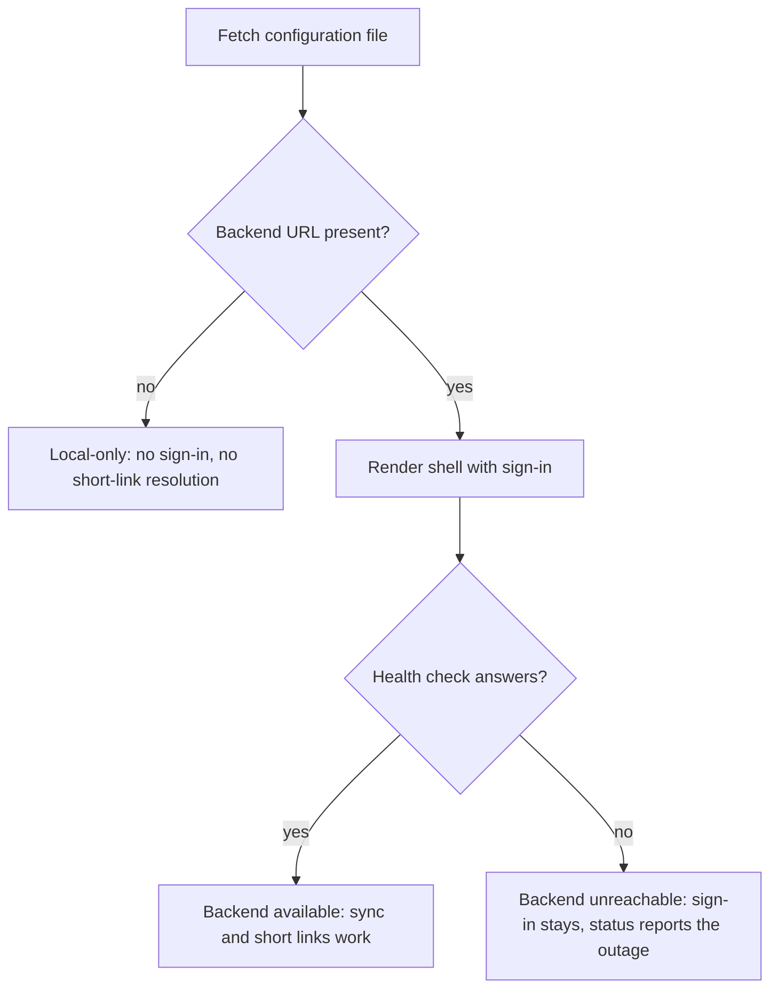

# Two-Target Deployment - Plan

## Goal Capsule

- **Objective:** Tablemarks is reachable from a browser without running a dev server — a private instance where sign-in and cross-device sync work, and a public demo anyone can open — and landing a change on `main` produces publishable artifacts for both without anyone building them by hand.
- **Means:** Reuse the deployment shape already proven in the GrooveMark repo (two-container Compose stack, GHCR images, a Pages workflow), diverging where Tablemarks has something GrooveMark does not: a service worker, a public unauthenticated backend hook, and an image that must not carry a private hostname.
- **Product authority:** This plan owns all three deliverables — the private Docker stack, the public demo, and the workflows that publish them. The demo's app-side behavior (backend detection and degradation) is inside this scope because the demo cannot ship correctly without it.
- **Open blockers:** None.

---

## Product Contract

### Summary

Publish Tablemarks to two targets from one source tree: a private Docker Compose stack running the app next to an exposed PocketBase, and a public GitHub Pages demo that runs with no backend at all. A single runtime-read configuration file decides which mode a given deployment is in, and GitHub Actions builds and publishes both.

### Problem Frame

Tablemarks today runs only under `npm run dev`. There is no container, no workflow, and no `.github/` directory. Nothing in the repository describes how to host it: `docs/how-to/development.md` documents a locally downloaded PocketBase binary and stops there.

Two different absences are being felt. The app has never been used for its actual purpose — saving a place while standing in front of it — because there is nowhere to open it from a phone. And there is no address to hand someone who asks what it does.

Those two needs pull in opposite directions. The first wants a backend: sign-in, sync across devices, and the short-link resolver hook. The second wants no backend at all, because a public demo must not be a client of a private database. The app currently assumes the first: `src/sync/pocketbase.ts:3` inlines a PocketBase URL at build time and defaults it to `http://127.0.0.1:8090`, and `src/App.tsx:290-303` renders the Sign in control with no availability check. Deployed to a static host as-is, the demo would offer a control that opens an OAuth popup against the visitor's own machine, and a pasted short link would leave a provisional record that never resolves.

### Key Decisions

- KD1. **Two build targets, one source tree.** The public demo runs local-only; the private instance runs with PocketBase. (session-settled: user-directed — chosen over a single Pages build pointed at the hosted PocketBase: a public demo must not be a client of the private database.) Governs R12, R13.
- KD2. **The backend location is read at runtime, never baked into the build.** (session-settled: user-directed — chosen over GrooveMark's build-time `ARG VITE_POCKETBASE_URL`: a build-time value ships the private hostname inside the public GHCR image and the public Actions log, where anyone can read it without visiting the site.) Governs R1, R2, R3.
- KD3. **Backend presence and backend reachability are two separate signals, resolved in that order.** (session-settled: user-directed — chosen over an optimistic render that flashes the Sign in control, and over holding the shell until a health check answers: the configuration file is local and resolves immediately, so the demo never renders a dead control and the private instance never pays a startup delay for the common case.) Governs R4, R6.
- KD4. **The public demo ships no service worker.** (session-settled: user-directed — chosen over a full PWA on the Pages subpath: dropping the worker also drops the `start_url` and scope questions the subpath would otherwise force, and the demo has no offline story worth the tile cache.) Governs R13, R14.
- KD5. **PocketBase hardening is documented as operator steps, not codified in the repository.** (session-settled: user-directed — chosen over a settings migration and over a boot-time reconciling hook: both would put deployment topology back inside the image, which KD2 rejects.) Governs R19.
- KD6. **All three deliverables ship as one plan.** (session-settled: user-directed — chosen over splitting the demo's app-side work into its own plan: the workflows wire the other two together, and each build target is defined by what the other one is not.)

### Requirements

**Runtime configuration**

- R1. The app reads the PocketBase base URL from a configuration file served alongside the built assets, fetched at startup.
- R2. An empty backend URL is a valid configured state meaning "no backend", not an error or a missing value to fall back from.
- R3. The published app image contains no deployment-specific hostname; the operator supplies it when the container starts.

**Local-only behavior**

- R4. With no backend URL configured, the app never renders the Sign in control.
- R5. With no backend URL configured, pasting a `maps.app.goo.gl` short link tells the user the link cannot be resolved without a backend, and creates no provisional record.
- R6. With a backend URL configured but the instance unreachable, the app keeps sign-in available and reports the backend as unreachable rather than presenting itself as local-only.
- R7. The provisional-record resolver does not run when no backend is configured.

**Private Docker stack**

- R8. `docker compose up` on a clean host brings up the app and PocketBase together, with PocketBase data surviving container restarts and image upgrades.
- R9. The PocketBase image carries the repository's migrations and hooks, so the short-link resolver is available on a fresh instance without a manual copy step.
- R10. The app container serves the SPA at the site root and exposes a health endpoint the orchestrator can poll.
- R11. Google sign-in succeeds against the deployed instance.

**Public demo**

- R12. The demo is published to GitHub Pages and is fully usable with no backend reachable from the visitor's browser.
- R13. The demo registers no service worker and offers no install prompt.
- R14. The two targets differ only by build inputs, never by edits an operator or workflow has to make and revert.

**Delivery**

- R15. Every push and every pull request runs the type check, the unit tests, and the documentation gate.
- R16. A push to `main` publishes an app image and a PocketBase image to GHCR for both `linux/amd64` and `linux/arm64`.
- R17. A pull request builds those images without publishing them.
- R18. A push to `main` republishes the demo.

**Operator documentation**

- R19. A deployment how-to documents the manual PocketBase console steps a public instance needs: enabling the rate limiter, setting the proxy header to `X-Forwarded-For` with rightmost selection, and registering the deployed origin as a Google OAuth redirect URI. It states that these settings live in `pb_data` and are silently lost if the volume is destroyed.
- R20. `README.md` links the deployment how-to and the public demo.

### Key Flows

- F1. Startup, public demo
  - **Trigger:** A visitor opens the Pages URL.
  - **Steps:** The app fetches the configuration file, reads an empty backend URL, and settles into local-only before first paint of the header. No health check is attempted. The Sign in control is never rendered.
  - **Outcome:** The visitor sees a working map with no dead controls and no failed request to their own machine.
  - **Covers R1, R2, R4, R7, R12.**

- F2. Startup, private instance
  - **Trigger:** The operator opens the deployed app.
  - **Steps:** The app fetches the configuration file, reads the backend URL the container's entrypoint wrote there, and renders the shell with sign-in available. A health check then resolves whether the instance is currently answering.
  - **Outcome:** Sign-in and sync work; a backend that is configured but down is reported as unreachable rather than as absent.
  - **Covers R1, R3, R6, R11.**

- F3. Publishing a change
  - **Trigger:** A commit lands on `main`.
  - **Steps:** The checks run; the app and PocketBase images are built and published; the demo is rebuilt and republished. The operator pulls the new images on the private host.
  - **Outcome:** The demo is current automatically; the private instance is current after the operator's pull.
  - **Covers R15, R16, R18.**

The startup decision F1 and F2 share is the plan's one piece of non-linear logic — two signals, three outcomes:

### Acceptance Examples

- AE1. **Covers R4, R2.** Given a deployment whose configuration file carries an empty backend URL, when the app finishes starting, then the Sign in control is absent from the header and no request has been made to any PocketBase origin.
- AE2. **Covers R5, R7.** Given a local-only deployment, when the user pastes a `maps.app.goo.gl` link into capture, then the app explains that short links need a backend, and the restaurant list gains no provisional record.
- AE3. **Covers R6.** Given a deployment whose configuration file carries a backend URL, when that instance does not answer, then the Sign in control remains present and the app reports the backend as unreachable — it does not present itself as local-only.
- AE4. **Covers R3.** Given the published app image pulled by someone other than its author, when its filesystem and bundle are inspected, then no deployment-specific hostname appears in either.
- AE5. **Covers R8, R9.** Given a host with no prior Tablemarks state, when the operator brings the stack up, then PocketBase serves the short-link resolver and the collections exist without a manual migration or hook copy.

### Scope Boundaries

- Demo content. The public demo starts with an empty map; no seeded or sample places.
- A PWA on the demo. Per KD4, install and offline behavior belong to the private instance only.
- A custom domain for either target.
- Browser or end-to-end tests in CI. The repository has only jsdom tests, and adding a browser tier is separate work.
- Automated deployment to the private host. Publishing images is in scope; pulling them on the host stays manual.
- Rate-limit rules and proxy settings tracked in the repository. Per KD5, these are operator steps.

### Dependencies / Assumptions

- The private instance needs a host with a public HTTPS endpoint for PocketBase. Which host and which reverse proxy front it are not decided; R19's wording assumes a proxy that appends `X-Forwarded-For`.
- Registering the deployed origin as a Google OAuth redirect URI requires Google Cloud Console access.
- GitHub Pages must be switched to the GitHub Actions source once, by hand, in repository settings. No workflow can do this for the first deployment.
- Assumed but not verified in this repository: the `nginx:alpine` image runs executable scripts placed in `/docker-entrypoint.d/` before starting, which is the mechanism R3 relies on to write the configuration file from an environment variable.
- PocketBase ships four rate-limit rules disabled by default, the broadest of which already covers the resolver hook. R19 assumes enabling the limiter is sufficient and no custom rule is required.

### Outstanding Questions

**Deferred to Planning**

- Whether R5 replaces the provisional-record path only in local-only mode, or whether an unreachable-but-configured backend should also refuse rather than defer. Today `src/capture/capture.ts:50` defers in both cases.
- How the demo build suppresses the service worker, and whether the existing `injectRegister: false` registration path in `src/features/pwa/ReloadPrompt.tsx` needs a guard or only the plugin needs disabling.
- What happens to provisional records that already exist locally when a user's deployment becomes local-only.
- Whether the health check runs once at startup or repeats, and what retriggers it after an outage.

### Sources / Research

Current Tablemarks state this plan is written against:

- `src/sync/pocketbase.ts:3` — the only `import.meta.env` read in `src/`; inlines `VITE_PB_URL` at module scope with a `http://127.0.0.1:8090` default.
- `src/App.tsx:290-303` — Sign in is gated only on `signedIn`; there is no availability check anywhere in `src/`.
- `src/capture/capture.ts:50` and `src/capture/resolvePending.ts` — the provisional-record path and its reconnect-triggered backoff retry.
- `vite.config.ts` — no `base` key; the PWA manifest sets `start_url: '/'`.
- `pocketbase/pb_hooks/resolveShortLink.pb.js` — the unauthenticated resolver route, guarded by a host allowlist.
- `package.json` — `lint`, `test`, and `check:docs` are what CI has to run; there is no ESLint or Prettier, and `check:docs` needs Python.

Reference implementation, in the sibling GrooveMark repository (not a dependency of this one): its `docker/` directory and its `ci.yml`, `deploy.yml`, and `docker-build.yml` workflows are the shape this plan reuses. Its Pages deploy overrides the base path with a CLI flag only, which is safe there because it has neither a service worker nor a router — KD4 is what makes the same approach safe here.
