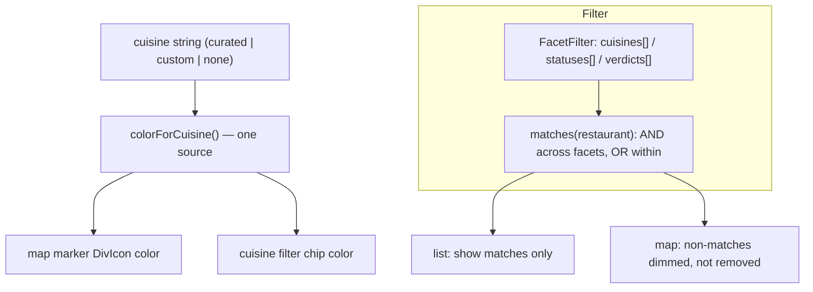

# feat: Faceted classification and filtering

## Summary

Give each place a single optional cuisine from a curated-plus-custom vocabulary, color its map marker by that cuisine from one shared color source, and let the user filter the map and list by any combination of cuisine, status, and verdict. Non-matching markers dim rather than disappear; the list shows only matches. No new persistence — cuisine is the existing optional record field.

## Problem Frame

The foundation stores a `cuisine` on each restaurant but does nothing with it: markers are uniform and there is no way to narrow a growing collection. A flat pile of pins stops being useful once there are more than a handful. Faceting — filter by cuisine, status, and verdict in any combination — is what keeps the collection queryable, and colored markers make the map scannable at a glance. The decision mode (R4) already wants cuisine filtering and is waiting on this. The work is read-mostly: it adds classification UI and a filter layer over existing data, with the only model touch being how `cuisine` is set.

## Requirements

Plan R-IDs trace to the origin (`docs/brainstorms/2026-06-12-faceted-classification-requirements.md`).

**Cuisine vocabulary**

- R1. A curated set of cuisines ships with the app, each with an assigned color (origin R1).
- R2. The user can set a cuisine not on the curated list (free text); it is treated like any cuisine and gets a color (origin R2).
- R3. A place has at most one cuisine and may have none; an uncategorized place renders and filters under a neutral treatment (origin R3).

**Facets and filtering**

- R4. The collection can be filtered by cuisine, by status (to-try / visited), and by verdict (origin R4).
- R5. Filters across different facets combine as AND; multiple selections within one facet combine as OR (origin R5).
- R6. The same filter state applies to both the map and the list (origin R6).
- R7. Active filters show as clearable chips; clearing returns to the full set (origin R7).

**Color and markers**

- R8. A single cuisine-to-color source drives both a place's marker color and its cuisine filter chip (origin R8).
- R9. When a filter is active, non-matching places dim on the map rather than disappear (origin R9).

---

## Key Technical Decisions

- **No cuisine entity — colors are derived, vocabulary is computed.** Cuisine stays the existing optional `string` on the restaurant record. The picker offers a curated list unioned with cuisines already in use; there is no separate synced "cuisines" collection. This satisfies "curated plus add-your-own" without new persistence or sync surface.
- **One color source drives markers and chips.** A single module maps a cuisine to a color: curated cuisines get fixed palette entries; a custom cuisine hashes deterministically into the palette; no/unknown cuisine is a reserved neutral. Both the `DivIcon` marker and the filter chip read this one function (R8), so they can't drift. Hash collisions are acceptable — color is a scannability hint, not an identifier.
- **Facet filter is a pure predicate.** A `FacetFilter` (selected cuisines, statuses, verdicts) and a `matches(restaurant, filter)` function: AND across facets, OR within a facet (R5). Pure and unit-tested, mirroring the R4 candidate logic. Status/verdict read off the R3 rollup; no visit loads.
- **List filters; map dims.** One predicate, two presentations: the list renders only matches, the map renders all places but dims non-matches (R6, R9) so spatial context is preserved.
- **Filter state is in-memory UI state.** Held in the shell (like the R4 anchor), not persisted. A chip/segmented bar atop the list panel; no saved presets (deferred).

---

## High-Level Technical Design

---

## Implementation Units

### U1. Cuisine vocabulary and color source

- **Goal:** A pure module defining the curated cuisine list, the one cuisine-to-color function, and the picker's option set.
- **Requirements:** R1, R2, R3, R8
- **Dependencies:** none
- **Files:** `src/features/facets/cuisines.ts`, `src/features/facets/cuisines.test.ts`
- **Approach:** Export `CURATED_CUISINES` (a sensible default set) with fixed palette colors; `colorForCuisine(cuisine: string | null | undefined): string` returning the curated color, else a deterministic hash of the string into the palette, else a reserved neutral for empty/uncategorized; and `cuisineOptions(restaurants): string[]` = curated unioned with in-use cuisines, sorted, for the picker. Palette and neutral live here as the single source consumed by markers (U3) and chips (U4).
- **Patterns to follow:** the pure-logic + unit-test shape of `src/features/decide/candidates.ts` and `src/lib/geo.ts`.
- **Test scenarios:**
  - Happy: a curated cuisine returns its fixed color; the same custom cuisine string always returns the same color; empty/undefined returns the neutral.
  - Edge: `cuisineOptions` unions curated with in-use cuisines, de-duplicates, and excludes blank/undefined.
  - Edge: two different custom cuisines may share a color (collision tolerated) but a curated cuisine never collides onto the neutral.
- **Verification:** color mapping is deterministic and total; the picker option set is curated ∪ in-use with no blanks.

### U2. Cuisine capture and edit

- **Goal:** Let the user set/clear a cuisine when adding a place and when editing one.
- **Requirements:** R2, R3
- **Dependencies:** U1
- **Files:** `src/features/capture/AddPlace.tsx`, `src/features/visits/RestaurantDetail.tsx`, `src/features/capture/AddPlace.test.tsx`, `src/features/visits/RestaurantDetail.test.tsx`
- **Approach:** Add an optional cuisine control to the add flow (choose from `cuisineOptions` or type a custom value) that sets `cuisine` on create. In the detail view, allow editing/clearing the cuisine via `updateRestaurant`. Leaving it unset is valid (uncategorized). No filtering logic here — just setting the field.
- **Patterns to follow:** `AddPlace` form state; `updateRestaurant` from `src/data/restaurants.ts`; `RestaurantDetail` edit affordances.
- **Test scenarios:**
  - Happy: adding a place with a chosen cuisine persists it; editing a place's cuisine updates it.
  - Edge: a custom (non-curated) cuisine string is accepted and persisted.
  - Edge: clearing the cuisine leaves the place uncategorized (no error).
- **Verification:** cuisine round-trips through create and edit; unset remains valid.

### U3. Cuisine-colored markers

- **Goal:** Color each map marker by its cuisine from the U1 source.
- **Requirements:** R8, R3
- **Dependencies:** U1
- **Files:** `src/features/map/markers.ts`, `src/features/map/MapView.tsx`, `src/features/map/markers.test.ts`
- **Approach:** `toMarkers` annotates each marker with `colorForCuisine(restaurant.cuisine)`. `MapView` builds (and memoizes by color) a `DivIcon` per color so markers render in their cuisine color; uncategorized uses the neutral. No new color literals in `MapView` — it reads U1.
- **Patterns to follow:** existing `toMarkers` / `DivIcon` construction in `src/features/map/`.
- **Test scenarios:**
  - Happy: a marker for a curated-cuisine place carries that cuisine's color; an uncategorized place carries the neutral.
  - Edge: two places of the same cuisine share one color (one cached icon).
- **Verification:** marker color comes solely from `colorForCuisine`; uncategorized renders neutral.

### U4. Facet filter and filter bar

- **Goal:** Filter the list and map by cuisine/status/verdict via clearable chips.
- **Requirements:** R4, R5, R6, R7, R9
- **Dependencies:** U1, U3
- **Files:** `src/features/facets/filter.ts`, `src/features/facets/FilterBar.tsx`, `src/features/facets/filter.test.ts`, `src/features/facets/FilterBar.test.tsx`, `src/App.tsx`, `src/features/map/markers.ts`
- **Approach:** `filter.ts` defines `FacetFilter` (selected cuisine / status / verdict sets) and a pure `matches(restaurant, filter)` — AND across facets, OR within (an empty facet matches all). `FilterBar` renders the available facet values (cuisine chips colored from U1) and the active selections as clearable chips, with a clear-all. The shell holds filter state; the list renders only `matches` places; `toMarkers` takes the filter and flags non-matching markers `dimmed`, which `MapView` renders at reduced opacity (still placed — R9).
- **Patterns to follow:** R4's in-memory filter/selection pattern; `RestaurantList`; `statusOf`/verdict rollup from `src/types/models.ts`.
- **Test scenarios:**
  - Covers AE3 (origin). Happy: cuisine = Indian OR Thai AND status = to-try matches only to-try Indian/Thai places.
  - Edge: an empty facet imposes no constraint; clearing all filters returns the full set.
  - Covers AE4 (origin). Map: with a filter active, non-matching markers are flagged dimmed (not removed); the list shows only matches.
  - Edge: an uncategorized place matches only when no cuisine filter is active (or a dedicated "uncategorized" chip is selected).
- **Verification:** the predicate honors AND-across/OR-within; list and map share it; chips clear correctly.

---

## Scope Boundaries

**Deferred for later** (origin scope boundaries)

- A free-form tag facet.
- A fixed "occasion" facet (date-night / quick-lunch / group).
- Multiple cuisines per place.
- Saved filter presets / smart lists.
- User recoloring of cuisines beyond the automatic assignment.

**Outside this product's identity** (origin)

- A price or external-rating-source dimension imported from third-party listings — facets describe the user's own classification.

**Deferred to Follow-Up Work**

- Wiring cuisine filtering into the R4 decision mode — R4 left a seam for it (`R11/R12` there); connect once this lands, as a small follow-up rather than part of this plan.

---

## Open Questions

**Deferred to implementation**

- The exact curated cuisine list and palette values, and the hash function for custom-cuisine color assignment (any stable string hash into the palette length).
- Whether "uncategorized" gets its own filter chip or is simply the absence of a cuisine filter.
- Filter-bar layout on small screens (the desktop chip bar is the baseline).

---

## System-Wide Impact

Read-mostly: the only model interaction is setting the existing optional `cuisine` field (U2). Everything else is a presentation/filter layer over existing data. The one shared-code touch is `toMarkers`/`MapView` gaining color + a dim flag (U3/U4), which the existing map render must keep working. No schema, repository, or sync change — cuisine already syncs as part of the restaurant record.

---

## Risks & Dependencies

- **Palette size vs. custom-cuisine collisions** — many custom cuisines will reuse colors; acceptable since color is a scannability hint. Note for U1.
- **Filter ⇄ marker coupling** — `toMarkers` now depends on the filter; keep the no-filter path (all markers, none dimmed) cheap so the common case is unaffected.
- **Depends on R3 rollup** (`statusOf`, `latestVerdict`) for the status/verdict facets — already maintained by the foundation.

---

## Sources & Research

- Origin: `docs/brainstorms/2026-06-12-faceted-classification-requirements.md`.
- Foundation/R4 code reused: `src/types/models.ts` (`cuisine`, `Verdict`, `statusOf`), `src/features/useRestaurants.ts`, `src/features/display.ts`, `src/features/map/markers.ts` + `MapView.tsx`, `src/features/decide/candidates.ts` (filter/selection pattern), `src/data/restaurants.ts` (`updateRestaurant`).
- Domain terms per `CONCEPTS.md`: Verdict, Status, Rollup (this plan adds the Cuisine/Facet vocabulary).
