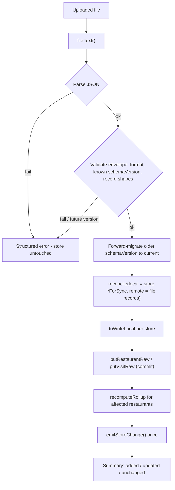

# feat: Data export/import (full-fidelity JSON, reconcile-backed)

## Summary

The portability half of R6 (Own-your-data). One action exports the entire collection as a single versioned, full-fidelity JSON file — every restaurant, its visits, its cuisine, and the stable sync IDs — that the user downloads as a backup. Import reads such a file back and merges it **non-destructively** by reusing the existing reconcile path: upsert by stable ID, last-write-wins per record, unseen records added, nothing deleted, and re-importing the same file is a no-op. A malformed or unrecognized file is rejected before any write, leaving the store untouched.

This plan deliberately covers **only portability**. The PWA/offline half of the same brainstorm (R8–R11: installable PWA, offline shell, progressive tile caching, update prompt) is split into its own follow-up plan.

---

## Problem Frame

The prior-art lesson from the brainstorm is sharp: Google Maps saved lists lock data in with no export, and that lock-in is what stops people committing to a tool long enough to build a multi-year collection. Knowing you can leave with everything — and re-import it without clobbering newer edits — is a precondition for trust.

The data already lives locally in the IndexedDB store (from the local-first foundation), keyed by stable client-generated IDs with an `updated` last-write-wins timestamp and soft-delete tombstones. Both export and import are therefore mostly about **surfacing what is already true**: serialize the local records to a portable file, and feed an imported file through the *same* reconcile machinery that sign-in already uses. The work is in getting the export envelope durable and versioned, and the import validation honest, not in new merge logic.

---

## Requirements

Carried from the origin (Export + Import sections; see origin: `docs/brainstorms/2026-06-12-data-portability-and-offline-requirements.md`). The PWA/offline requirements (R8–R11) are out of scope for this plan.

- **R1.** Export the entire collection as a single JSON file in one action. → U1, U4
- **R2.** Export is full-fidelity: restaurants, their visits, cuisine, and the stable sync identifiers, sufficient to reconstruct the collection. → U1
- **R3.** The export file carries a schema version identifying its format. → U1
- **R4.** The user can import a previously exported JSON file. → U2, U4
- **R5.** Import upserts by stable record ID with last-write-wins: newer records win, unseen records are added, nothing is deleted. → U3
- **R6.** Re-importing the same unchanged file results in no changes. → U3
- **R7.** Import validates the file and its schema version, handling a malformed or unrecognized file without corrupting the store. → U2, U4

**Acceptance examples** (from origin):
- **AE1** (R1–R3): a collection with restaurants and visits exports to a single versioned JSON file containing every restaurant, its visits, and its cuisine. → U1, U4
- **AE2** (R5, R6): importing a file into the store it came from changes nothing; importing into a store missing some records adds the missing ones and reconciles existing ones by last-write-wins. → U3
- **AE3** (R7): a truncated or non-Tablemarks JSON file is reported as a problem and leaves the store unchanged. → U2, U4

---

## Key Technical Decisions

1. **Export the local model verbatim as full-fidelity JSON — not GeoJSON.** Each record is serialized in its on-device shape (the `Restaurant` and `Visit` types), carrying `id`, `updated`, and `deleted` plus all content fields. Cuisine is a field on `Restaurant`; there is no separate facet store, so "facets" need no special handling — exporting restaurants captures them. The model holds only JSON-native values (ISO strings for `updated`/`date`, numbers, booleans), so `JSON.stringify`/`JSON.parse` round-trips losslessly with no custom (de)serialization.

2. **Tombstones and `updated` are part of fidelity.** Export reads **all** records including soft-deleted tombstones (via the existing `allRestaurantsForSync` / `allVisitsForSync`), and preserves each record's `updated` timestamp. Dropping tombstones would break delete propagation; rewriting `updated` would break last-write-wins. Import never regenerates IDs and never blanket-stamps `now()` — it preserves the file's `updated` and lets the reconciler arbitrate.

3. **Import is "another reconcile source" — reuse `reconcile()`, do not reimplement merge.** The parsed file's records are passed as the `remote` argument and the live store (`*ForSync`) as `local`. The existing pure `reconcile()` returns `toWriteLocal`; import applies those via `putRestaurantRaw` / `putVisitRaw`, then recomputes rollups for affected restaurants — mirroring `fullSync` in `src/sync/syncEngine.ts`. Upsert-by-stable-ID, LWW, tombstone handling, and **re-import-is-a-no-op** (the reconciler skips records whose `updated` is equal) all fall out for free.

4. **Versioned, self-describing envelope.** The file is `{ format: "tablemarks-export", schemaVersion: <int>, exportedAt: <ISO>, records: { restaurants: [...], visits: [...] } }`. `schemaVersion` is the **file-format** version, deliberately distinct from the IndexedDB database `version` (which gates local store/index migrations). Today `EXPORT_SCHEMA_VERSION = 1`. A forward-migration registry (`v1→v2→…`, identity for now) lets future app versions keep reading older files.

5. **Validate-then-commit; reject future versions.** Import parses, then validates the whole payload (format guard, known `schemaVersion`, `records.{restaurants,visits}` are arrays, each record has the required fields and types) **before** any write. A `schemaVersion` newer than the running app understands is rejected (a future file may carry fields we'd silently drop). Verdict strings are coerced defensively (reuse the `asVerdict` guard pattern from `src/sync/mappers.ts`). A malformed file yields a structured error and zero writes.

6. **Import uses store-change (pull) semantics, not local-change (push).** Applied writes go through the raw helpers + a final `emitStoreChange()` (matching `fullSync`), refreshing the UI without triggering a sync **push** loop. **On a signed-in device, the cloud converges on the next sync cycle** (the sync controller already re-syncs on reconnect/realtime) — import itself does not force a push. This is the simpler default chosen during planning; an explicit post-import sync trigger is deferred (see Scope Boundaries).

7. **Persist-then-notify ordering holds** (see `docs/solutions/conventions/emit-store-change-after-write-commits.md`): every record commits to IndexedDB before the change event fires, so reactive hooks re-fetch committed state.

---

## High-Level Technical Design

Import pipeline — a file becomes store writes only after full validation, then flows through the same reconciler sign-in uses:



Export is the inverse and simpler: read all records (incl. tombstones) → wrap in the versioned envelope → `Blob` → object URL → anchor download → revoke URL.

---

## Output Structure

New portability logic lives under `src/sync/` (it reuses reconcile and the data-layer raw helpers); the file read/write/download UI lives under `src/features/`.

```
src/
  sync/
    portability/
      schema.ts            # envelope type, EXPORT_SCHEMA_VERSION, validate + migrate (pure)
      schema.test.ts
      export.ts            # buildExport (pure) + exportCollection (reads *ForSync)
      export.test.ts
      import.ts            # parseImport (pure) + applyImport (reconcile-backed)
      import.test.ts       # pure parse/validate/migrate
      importApply.test.ts  # freshDB integration (reconcile apply)
  features/
    portability/
      PortabilityPanel.tsx       # Export button + Import dialog
      PortabilityPanel.test.tsx
```

The tree is a scope declaration, not a constraint — the implementer may adjust (e.g. fold `import.test.ts` and `importApply.test.ts` into one file). Per-unit `Files:` are authoritative.

---

## Implementation Units

### U1. Export serialization + versioned envelope

- **Goal:** Produce a full-fidelity, versioned JSON envelope of the entire collection.
- **Requirements:** R1, R2, R3 (AE1)
- **Dependencies:** none
- **Files:** `src/sync/portability/schema.ts` (create — envelope type, `EXPORT_SCHEMA_VERSION = 1`), `src/sync/portability/export.ts` (create), `src/sync/portability/export.test.ts` (create)
- **Approach:** Define `ExportEnvelope { format: 'tablemarks-export'; schemaVersion: number; exportedAt: string; records: { restaurants: Restaurant[]; visits: Visit[] } }` in `schema.ts` as a plain interface + const (no enum — `erasableSyntaxOnly`). `buildExport(restaurants, visits): ExportEnvelope` is pure. `exportCollection(): Promise<ExportEnvelope>` reads `allRestaurantsForSync()` + `allVisitsForSync()` so tombstones and `updated` are included, and stamps `exportedAt` via `now()`. No download here (that is U4) — this unit yields the data structure.
- **Patterns to follow:** `allRestaurantsForSync` / `allVisitsForSync` in `src/data/restaurants.ts` / `src/data/visits.ts`; `now()` in `src/data/ids.ts`; const-array-over-enum style in `src/types/models.ts`.
- **Test scenarios:**
  - Covers AE1. `buildExport` of a collection with restaurants and visits yields `format: 'tablemarks-export'`, `schemaVersion: 1`, and `records.restaurants` / `records.visits` containing every input record with `id`, `updated`, `cuisine`, and `deleted` preserved.
  - A soft-deleted (tombstoned) record is present in the envelope (full fidelity), not filtered out.
  - `exportedAt` is a valid ISO string; envelope shape is stable (snapshot of keys).
  - Empty store → valid envelope with empty `records` arrays.
- **Verification:** exporting a seeded store returns an envelope that contains every live and tombstoned record with timestamps intact.

### U2. Import parse, validate, and migrate (pure)

- **Goal:** Turn untrusted file text into validated records or a safe, structured error — never a partial/corrupt result.
- **Requirements:** R4, R7 (AE3)
- **Dependencies:** U1 (shares `schema.ts`)
- **Files:** `src/sync/portability/schema.ts` (extend — `validateEnvelope`, `migrateToCurrent`), `src/sync/portability/import.ts` (create — `parseImport`), `src/sync/portability/import.test.ts` (create)
- **Approach:** `parseImport(text: string): { ok: true; records: { restaurants: Restaurant[]; visits: Visit[] } } | { ok: false; error: string }`. Steps: `JSON.parse` in a try/catch; assert `format === 'tablemarks-export'`; assert `schemaVersion` is a known integer and **reject if greater than `EXPORT_SCHEMA_VERSION`**; assert `records.restaurants` / `records.visits` are arrays; validate each record with type guards (string `id`, string `updated`, boolean `deleted`, required fields present and typed; coerce `verdict` defensively like `asVerdict`). For older known versions, run `migrateToCurrent` (an ordered forward-migration chain — identity at v1, structured for growth). No store access in this unit — it is pure and fully unit-testable.
- **Execution note:** Test-first — the validation contract (what is accepted vs rejected) is the unit's whole value; write the failing cases before the guards.
- **Patterns to follow:** `asVerdict` defensive coercion in `src/sync/mappers.ts`; reconcile-test literal-builder style in `src/sync/reconcile.test.ts`.
- **Test scenarios:**
  - Happy: a well-formed v1 envelope parses to the expected restaurants/visits arrays.
  - Covers AE3. Truncated/invalid JSON → `{ ok: false }` with a message; no throw escapes.
  - Wrong/missing `format` → rejected.
  - `schemaVersion` greater than current → rejected (future-version guard).
  - Missing required field / wrong type on a record (e.g. `updated` absent, `lat` a string) → rejected.
  - Unknown `verdict` string on a visit → coerced to a safe value rather than rejected (mirrors existing remote-ingest behavior).
  - An older known `schemaVersion` (simulated) routes through `migrateToCurrent` and yields current-shape records.
- **Verification:** every malformed/unrecognized input returns a structured error and no exception; valid input returns current-shape records.

### U3. Import apply via reconcile

- **Goal:** Merge validated records into the store non-destructively, idempotently, reusing the existing reconcile/LWW path.
- **Requirements:** R5, R6 (AE2)
- **Dependencies:** U2
- **Files:** `src/sync/portability/import.ts` (extend — `applyImport`), `src/sync/portability/importApply.test.ts` (create)
- **Approach:** `applyImport(records): Promise<{ added: number; updated: number; unchanged: number }>`. Mirror `fullSync` in `src/sync/syncEngine.ts`: `reconcile(allRestaurantsForSync(), records.restaurants)` → write each `toWriteLocal` via `putRestaurantRaw`; same for visits via `allVisitsForSync()` / `putVisitRaw`, tracking affected `restaurantId`s; `recomputeRollup(id)` for each affected restaurant; a single `emitStoreChange()` at the end. Use `emitStoreChange` (pull semantics), never `emitLocalChange` — import is not a user edit to push. Derive the added/updated/unchanged counts from the reconcile result for the UI summary. Do not push to cloud here (KTD 6).
- **Execution note:** Test-first — idempotency and LWW are exact contracts; write the re-import-no-op and missing-records-merge assertions before the apply logic.
- **Patterns to follow:** `fullSync` in `src/sync/syncEngine.ts` (reconcile → `putRaw` → `recomputeRollup` → `emitStoreChange`); `reconcile` / `pickWinner` in `src/sync/reconcile.ts`; `freshDB` integration style in `src/sync/syncEngine.test.ts`.
- **Test scenarios:**
  - Covers AE2. Re-import: exporting a store then importing the same file back into it changes nothing (counts: `unchanged` = all, `added`/`updated` = 0) — idempotent.
  - Covers AE2. Import into a store missing some records adds exactly the missing ones (`added`) and leaves existing identical ones unchanged.
  - LWW: a file record with a newer `updated` overwrites the local one; a file record with an older `updated` is ignored (local kept).
  - Tombstone in the file with a newer `updated` propagates a delete; it does not resurrect or duplicate a record.
  - Importing visits triggers `recomputeRollup` so the parent restaurant's `latestVerdict` / `visitCount` reflect the merged visits, without bumping the restaurant's `updated`.
  - Nothing is ever deleted as a side effect of import (no local record disappears that the file did not tombstone).
- **Verification:** import is a non-destructive merge keyed on stable ID; re-import is a no-op; rollups are recomputed for affected restaurants.

### U4. Export/Import UI

- **Goal:** Give the user one-action export (download) and a guarded import (pick file → see result → confirm).
- **Requirements:** R1, R4, R7 (AE1, AE3)
- **Dependencies:** U1, U2, U3
- **Files:** `src/features/portability/PortabilityPanel.tsx` (create), `src/features/portability/PortabilityPanel.test.tsx` (create), `src/App.tsx` (modify — add the entry point + render)
- **Approach:** A small panel/modal following the existing modal pattern (`AddPlace.tsx`, `RestaurantDetail.tsx`: `fixed inset-0 z-[1000]` card, `✕` close with `aria-label`, `onClose` prop). **Export:** button calls `exportCollection()`, `JSON.stringify`s it into a `Blob` (`application/json`), creates an object URL, clicks a generated `<a download="tablemarks-YYYY-MM-DD.json">`, then `URL.revokeObjectURL`. **Import:** `<input type="file" accept="application/json">` (id via `useId()`), read with `await file.text()`, run `parseImport`; on error show the message and leave the store untouched; on success show a confirm step, call `applyImport`, then show the added/updated/unchanged summary. Wire a trigger into the sidebar action block in `src/App.tsx` (near "+ Add a place" / "Where to eat?"). Guard the async actions against double-invocation and surface failures inline.
- **Patterns to follow:** modal shape + `useId()` + fire-and-forget `.catch` guards in `src/features/capture/AddPlace.tsx`; sidebar action buttons in `src/App.tsx`; `@testing-library/user-event` interaction style.
- **Test scenarios:**
  - Covers AE1. Clicking Export produces a download whose Blob content parses to a valid envelope containing the seeded records (assert via a stubbed `URL.createObjectURL` / anchor, or by intercepting the Blob text).
  - Happy import: selecting a valid file, confirming, persists the records (assert via `allRestaurants` / `getRestaurant`) and shows the summary counts.
  - Covers AE3. Selecting a malformed/non-Tablemarks file shows the error message and the store is unchanged (no records added); no confirm step is offered or it is a no-op.
  - Re-selecting the just-exported file imports as all-unchanged (UI reflects 0 added / 0 updated).
  - `revokeObjectURL` is called after export (no object-URL leak).
- **Verification:** a user can export a backup file and re-import it; a bad file is reported without touching the store.

---

## Scope Boundaries

**Deferred for later** (from origin):
- GeoJSON or other interop export formats.
- A replace-all ("restore exactly this snapshot") import mode.
- Encryption of the export file.
- Automated or scheduled backups.

**Outside this product's identity** (from origin):
- Using exported files as a sync transport between users. Export is for personal backup and portability; cross-user sharing is not a goal.

**Deferred to follow-up work** (plan-local sequencing / scope split):
- **The entire PWA/offline half of R6 (R8–R11)** — installable PWA, offline shell + assets, progressive OSM tile caching with the CORS/opaque-response fix, and the service-worker update prompt. This was split into its own plan during planning.
- **Explicit post-import cloud push.** Import reconciles locally and relies on the next sync cycle for cloud convergence (KTD 6). A trigger that immediately syncs after import on a signed-in device is a small, optional follow-up.

---

## Risks & Dependencies

- **Partial/corrupt write on bad input.** Mitigated by validate-then-commit (U2 fully validates before U3 writes) and by reconcile returning a set the caller writes in one pass — a malformed file never reaches the write stage.
- **Future-version files silently losing data.** Mitigated by rejecting `schemaVersion` greater than the running app's `EXPORT_SCHEMA_VERSION`.
- **Accidental `updated` rewrite breaking LWW.** Import must preserve the file's `updated` and use the raw write helpers (no `now()` stamp); recompute rollups without bumping `updated`. Called out in KTD 2 and the relevant solution doc.
- **Object-URL leak** on export if `revokeObjectURL` is omitted — covered by a U4 test scenario.
- **Dependencies:** reuses `reconcile` / `pickWinner` (`src/sync/reconcile.ts`), `allRestaurantsForSync` / `putRestaurantRaw` and visit equivalents (`src/data/`), `recomputeRollup` (`src/data/rollup.ts`), `emitStoreChange` (`src/data/events.ts`). No new third-party dependencies. No IndexedDB version bump (import reuses existing stores).
- **Note (non-blocking):** the PocketBase SDK is pinned at ~0.26.x in the repo, not 0.39; irrelevant here since both export and import operate purely on the IndexedDB store.

---

## Documentation

Per `AGENTS.md`, document the export file format (envelope shape + `schemaVersion` contract) and the import merge semantics in `docs/` (e.g. a short data-portability doc), linked from the README — not inline in the README. The export-via-reconcile decision and the schema-version/validate-then-commit pattern are strong `/ce-compound` candidates after implementation; neither is documented yet.

---

## Sources & Research

- Origin requirements: `docs/brainstorms/2026-06-12-data-portability-and-offline-requirements.md`.
- Institutional learnings (load-bearing): `docs/solutions/architecture-patterns/local-first-lww-sync-indexeddb-pocketbase.md` (reuse reconcile; stable-ID union key; tombstones first-class; rollups never bump `updated`), `docs/solutions/conventions/emit-store-change-after-write-commits.md` (persist-then-notify; use `emitStoreChange` for pull-style writes).
- IndexedDB JSON export/import best practices — self-describing versioned envelope, validate-before-transaction, upsert-by-stable-ID idempotency, `Blob`/`createObjectURL`/`revokeObjectURL` download and `Blob.text()` read (current, non-deprecated): MDN (`URL.createObjectURL`, `URL.revokeObjectURL`, `Blob.text`), `dexie-export-import` file-format pattern.
