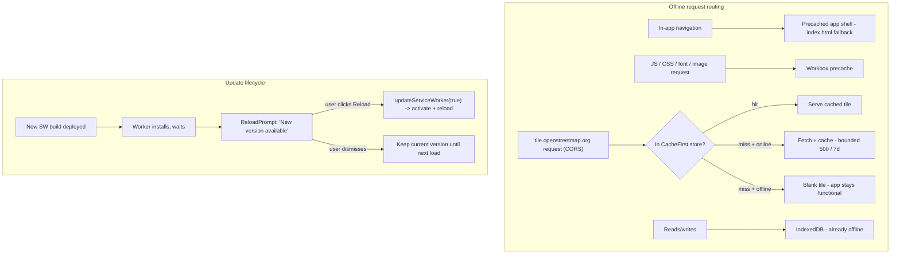

# feat: Installable PWA with offline shell, data, and tiles

## Summary

The offline half of R6 (Own-your-data). Make Tablemarks an installable PWA that launches standalone; its app shell, assets, and IndexedDB data all work with no connection. Map tiles viewed while online are progressively cached (bounded) and re-served offline, so browsed areas render on a plane or subway platform while unbrowsed areas show blank rather than failing. App updates are picked up automatically, and the user is told — via an explicit prompt — when a newer version is ready to load.

The portability half of the same brainstorm (export/import, R1–R7) shipped separately. This plan is purely the PWA/offline work: build configuration, a service worker, a small update-prompt component, app icons, and one CORS change to the existing tile layer.

---

## Problem Frame

The data already lives locally — the IndexedDB store is canonical, the app runs with no account, and a reload mid-pending never drops a write. So "works offline" is mostly about surfacing what's already true: make the app *installable*, precache the shell and assets so they load with no network, and cache map tiles as they're viewed so browsed areas render offline. The only genuinely new infrastructure is the service worker (via `vite-plugin-pwa` + Workbox) and the update-notification UX.

Two non-obvious constraints shape the work. First, OpenStreetMap's tile usage policy permits caching tiles a user *actually views* but prohibits bulk/pre-emptive fetching — so the cache is a bounded runtime cache of viewed tiles, never an offline-region download. Second, cross-origin tiles fetched without CORS return *opaque* responses (status 0) that browsers pad to ~7 MB each in the cache; a naive "500-entry" tile cache of opaque responses can consume over a gigabyte and blow the storage quota, defeating the bound. Both constraints are addressed in the decisions below.

---

## Requirements

Carried from the origin (PWA and offline section; see origin: `docs/brainstorms/2026-06-12-data-portability-and-offline-requirements.md`). The export/import requirements (R1–R7) shipped in a prior plan and are out of scope here.

- **R8.** The app is installable as a PWA and launches standalone. → U1
- **R9.** The app shell, assets (including images and fonts), and all stored data are usable with no network connection. → U1 (shell/assets), U2 (tiles); data is already local
- **R10.** Map tiles viewed while online are cached and re-served offline, up to a bounded cache size; unviewed areas render blank offline rather than failing. → U2
- **R11.** App updates are picked up automatically, with the user told when a newer version is ready to load. → U3

**Acceptance examples** (from origin):
- **AE4** (R9, R10): on the installed PWA, offline, the user can view/add/edit places and a previously-browsed map area's tiles render. → U1, U2
- **AE5** (R10): an area never viewed online renders blank tiles offline while the rest of the app stays functional. → U2

---

## Key Technical Decisions

1. **`vite-plugin-pwa` with the `generateSW` strategy.** There is no custom service-worker logic — only precaching plus a couple of runtime-cache rules — so `generateSW` is the right fit; `injectManifest` (hand-written SW) is unwarranted. The plugin is added to the existing Vite config alongside `react()` and `tailwindcss()`. Version is current/Vite-7-compatible (confirmed during research).

2. **Explicit update prompt, not silent auto-reload** (resolves the origin's deferred SW-update question). Configure `registerType: 'prompt'` and `injectRegister: false`, and register the worker manually via the `virtual:pwa-register/react` `useRegisterSW` hook in a small `ReloadPrompt` component. A silent `autoUpdate` could reload the page mid-capture/mid-edit; a prompt lets the user finish, then reload. The waiting worker activates only on the user's click (`updateServiceWorker(true)`).

3. **Bounded, progressive tile cache** (resolves the origin's deferred cap/expiry question). A Workbox `CacheFirst` runtime rule matches `tile.openstreetmap.org` (the single host the map already uses — not the deprecated `a/b/c` subdomains), with an expiration of `maxEntries: 500` and `maxAgeSeconds: 7 days` and `purgeOnQuotaError: true`. Tiles are immutable per `{z}/{x}/{y}`, so cache-first is correct and minimizes requests. No prefetch — only viewed tiles are cached, per OSM policy.

3a. **Fetch tiles in CORS mode so the bound actually holds** (load-bearing — see Risks). Set `crossOrigin` on the existing `TileLayer` so tile responses are non-opaque (status 200), and cache only `{ statuses: [200] }`. Without this, cross-origin tiles are opaque (status 0) and browsers pad each cached entry to ~7 MB, so 500 entries could exceed 1 GB and trigger quota eviction — the "bounded" cache would be unbounded in storage terms. `tile.openstreetmap.org` serves permissive CORS headers, so this is safe.

4. **OSM tile-usage-policy compliance.** Progressive caching of viewed tiles only (no region prefetch), the existing "© OpenStreetMap contributors" attribution stays visible, and the ≥7-day cache aligns with the policy's caching-header expectation. Scaling note: the donation-funded OSM tile servers are appropriate for a personal tool but are not a production CDN — flagged as a boundary, not addressed here.

5. **App-shell + asset precache and SPA offline fallback.** `workbox.globPatterns` includes JS/CSS/HTML plus `woff2`/`png`/`svg` so fonts and images are available offline (R9), and `navigateFallback: 'index.html'` serves the SPA shell for any in-app navigation offline. Stored data is already offline-capable via IndexedDB; the service worker covers only network assets and tiles.

6. **Manifest.** `name`/`short_name` Tablemarks, `display: standalone`, `start_url: '/'`, `theme_color: '#d4561f'` (matching the existing `index.html` meta), a `background_color`, and icons at 192/512 plus a maskable 512 and an Apple touch icon. Icons are generated placeholders from the brand color for now (a polished logo is deferred — see Scope Boundaries).

7. **The `resume()` startup bootstrap must survive a service-worker reload.** Sync only runs because `auth.resume()` re-runs on startup; a SW-triggered reload re-executes the app entry, so `resume()` runs again — no change needed, but verified and noted so the update flow doesn't silently leave sync dead after a reload.

8. **Dev vs prod.** `devOptions.enabled: false` — the service worker does not run under `vite dev` (a dev SW caches stale modules and fights HMR); verification is via `vite build` + `vite preview`. The worker also cannot run under the jsdom test environment, which shapes the test scope below.

---

## High-Level Technical Design

Offline request routing and the update lifecycle the plan introduces:



---

## Output Structure

New directories: `public/` (icons + static assets the plugin references) and `src/features/pwa/` (the update-prompt component).

```
public/
  pwa-192x192.png
  pwa-512x512.png
  pwa-maskable-512x512.png
  apple-touch-icon.png
src/
  features/
    pwa/
      ReloadPrompt.tsx
      ReloadPrompt.test.tsx
```

The tree is a scope declaration, not a constraint; the per-unit `Files:` sections are authoritative. `vite.config.ts`, `index.html`, `src/vite-env.d.ts`, and `src/App.tsx` are modified, not created.

---

## Implementation Units

### U1. PWA scaffold: plugin, manifest, icons, precache

- **Goal:** The app is installable and launches standalone; the shell and assets are precached for offline use.
- **Requirements:** R8, R9 (shell/assets) — AE4
- **Dependencies:** none
- **Files:** `vite.config.ts` (modify — add `VitePWA`), `src/vite-env.d.ts` (modify — add the plugin's client/react type references), `public/pwa-192x192.png`, `public/pwa-512x512.png`, `public/pwa-maskable-512x512.png`, `public/apple-touch-icon.png` (create — generated placeholder icons), `index.html` (modify only if an apple-touch-icon `<link>` is needed beyond what the plugin injects)
- **Approach:** Add `vite-plugin-pwa` (dev dependency) and configure `VitePWA({ registerType: 'prompt', injectRegister: false, manifest: {...}, workbox: { globPatterns, navigateFallback: 'index.html', navigateFallbackDenylist for any backend path } })` per KTDs 1, 2, 5, 6. Generate the icon set from the brand color (a generator such as `@vite-pwa/assets-generator`, or hand-produced PNGs) — they need only be valid placeholders. Add `/// <reference types="vite-plugin-pwa/client" />` and `.../react` to `src/vite-env.d.ts` so the virtual module resolves in U3. Manifest `theme_color` must equal the `#d4561f` already in `index.html`.
- **Patterns to follow:** existing `vite.config.ts` plugin array; keep the `vitest/config` reference directive intact.
- **Test scenarios:** `Test expectation: none (build-level config).` Verification is a production build, not a jsdom unit test.
- **Verification:** `vite build` emits a service worker and a web manifest; the precache manifest includes the hashed JS/CSS, `index.html`, and font/image assets; `vite preview` serves an installable app (manifest valid in DevTools, icons present, `display: standalone`) and the shell loads with the network throttled offline after one online load.

### U2. Offline tile caching with a bounded, CORS-correct cache

- **Goal:** Tiles viewed online are cached and re-served offline within a bounded size; unviewed areas render blank, not broken.
- **Requirements:** R9 (tiles), R10 — AE4, AE5
- **Dependencies:** U1
- **Files:** `vite.config.ts` (modify — add `workbox.runtimeCaching`), `src/features/map/MapView.tsx` (modify — add `crossOrigin` to `TileLayer`)
- **Approach:** Add a `CacheFirst` runtime-caching rule for `tile.openstreetmap.org` with an `ExpirationPlugin` (`maxEntries: 500`, `maxAgeSeconds` = 7 days, `purgeOnQuotaError: true`) and `cacheableResponse: { statuses: [200] }` (KTD 3). Set `crossOrigin` on the existing `TileLayer` so tiles are fetched in CORS mode and the cached responses are non-opaque (KTD 3a) — this is what keeps the entry cap from ballooning storage. Leave the existing attribution untouched (KTD 4). Do not add a rule for the geocoding host (`nominatim.openstreetmap.org`) — it has its own usage policy and is out of scope.
- **Patterns to follow:** the single-host tile URL already in `MapView`; `docs/solutions/conventions/react-leaflet-test-mock-stability.md` if a `MapView` test is added or touched (keep the `useMap` mock a stable module-scoped instance).
- **Test scenarios:**
  - Covers AE4 (partial). If a `MapView` test is added, assert the rendered `TileLayer` receives a `crossOrigin` prop (so the CORS fetch mode is in place) — using the stable react-leaflet mock.
  - `Test expectation (runtime caching): none` — Workbox/service-worker caching cannot run under jsdom; verify by build + preview.
  - Covers AE4/AE5 (manual verification): with the built app and DevTools offline, a previously-panned area's tiles render from cache; an un-panned area shows blank tiles while the list/map/add/edit stay functional; the `osm-tiles` cache entry count stays at/under the cap and total size is in KB-per-tile (not ~7 MB-per-tile), confirming non-opaque caching.
- **Verification:** offline, browsed tiles render and unbrowsed tiles are blank without breaking the app; the tile cache is bounded in both entries and bytes (CORS-correct).

### U3. Service-worker update prompt

- **Goal:** When a new version is deployed, the user is told and can reload to update; no silent reload interrupts in-progress work.
- **Requirements:** R11
- **Dependencies:** U1
- **Files:** `src/features/pwa/ReloadPrompt.tsx` (create), `src/features/pwa/ReloadPrompt.test.tsx` (create), `src/App.tsx` (modify — render `<ReloadPrompt />`)
- **Approach:** A small component using `useRegisterSW` from `virtual:pwa-register/react`. It registers the service worker (since `injectRegister` is false) and exposes `needRefresh` / `offlineReady` state plus `updateServiceWorker`. Render nothing when neither flag is set; when `needRefresh`, render an unobtrusive banner ("A new version is available") with a **Reload** button that calls `updateServiceWorker(true)` (activates the waiting worker and reloads); optionally a transient "ready to work offline" note on `offlineReady`. Mount it once near the app root in `src/App.tsx`. The SW-triggered reload re-runs `main.tsx`, so the `auth.resume()` bootstrap restarts sync (KTD 7) — no code change, but covered by the verification.
- **Execution note:** Implement the component test-first — the render states (idle / needRefresh / offlineReady) and the Reload action are the unit's whole contract.
- **Patterns to follow:** existing modal/banner styling in `src/App.tsx` and feature components; mock the `virtual:pwa-register/react` module in the test (it has no jsdom implementation), mirroring how `src/App.test.tsx` stubs `react-leaflet`.
- **Test scenarios:**
  - Happy: with the hook mocked to report no update, the component renders nothing.
  - Covers R11. With `needRefresh` true, the banner and a Reload control render; clicking Reload calls `updateServiceWorker(true)` exactly once.
  - Edge: with `offlineReady` true (and no refresh), the offline-ready note renders and can be dismissed without triggering an update.
  - Edge: a registration error path (`onRegisterError`) does not crash the component (renders nothing/benign).
- **Verification:** a rebuilt-and-redeployed app surfaces the update prompt on next load; clicking Reload activates the new worker and reloads; after the reload, sync resumes (signed-in session still active). The prompt never appears without a real waiting worker.

---

## Scope Boundaries

**Deferred for later** (from origin):
- One-time neighborhood tile prefetch on install.
- Encryption and automated/scheduled backups (portability concerns, already noted).
- GeoJSON/interop formats and replace-all import (portability, shipped half's deferrals).

**Outside this product's identity** (from origin):
- Using OSM tiles as a production CDN or any bulk/offline-region tile download — prohibited by OSM policy and counter to the personal-scale design.

**Deferred to follow-up work** (plan-local):
- A polished app icon / logo. This plan ships valid placeholder icons so the app is installable; replacing them with a designed mark is a follow-up that touches only `public/` assets and the manifest.
- Caching the geocoding (`nominatim.openstreetmap.org`) responses — separate host, separate usage policy.

---

## Risks & Dependencies

- **Opaque-response storage blowup (load-bearing).** Caching cross-origin tiles without CORS stores opaque (status 0) responses padded to ~7 MB each, so the entry cap does not bound bytes and the quota is hit fast. Mitigated by KTD 3a (fetch in CORS mode, cache status 200 only) plus `purgeOnQuotaError`. This finding shaped KTD 3a and is the reason the `TileLayer` change is in scope.
- **OSM policy compliance.** Suppressed attribution or a stripped `Referer`, or any pre-emptive/bulk tile fetching, can get the app IP-blocked. Mitigated by progressive-only caching and keeping attribution visible (KTD 4).
- **Stale service worker in development.** A dev SW caches stale modules and fights HMR. Mitigated by `devOptions.enabled: false`; verify via build + preview.
- **Service worker is untestable under jsdom.** Precache/runtime-caching/update activation can't be unit-tested in the Vitest environment. Mitigated by scoping unit tests to the `ReloadPrompt` component (mocked virtual module) and the `TileLayer` prop, with SW behavior verified by build + preview + manual offline check.
- **Icons require real assets.** Placeholder icons unblock installability; a real logo is deferred.
- **Dependencies:** adds `vite-plugin-pwa` (bundles Workbox) as a dev dependency. No runtime dependencies. Touches the existing `vite.config.ts`, `index.html`, `src/vite-env.d.ts`, `src/App.tsx`, and `src/features/map/MapView.tsx`; creates `public/` and `src/features/pwa/`.

---

## System-Wide Impact

- **Startup path:** a SW-triggered reload re-executes `src/main.tsx`, so the `auth.resume()` sync bootstrap and the pending-resolver restart run again — the update flow must not bypass the app entry (it doesn't; verified in U3). See `docs/solutions/architecture-patterns/restart-controllers-on-startup.md`.
- **Map component:** the `crossOrigin` change is the only modification to existing runtime behavior; tiles continue to load identically online, now also cacheable offline.
- **No data-model, sync, or persistence change** — this is additive infrastructure around the existing app.

---

## Documentation

Per `AGENTS.md`, document offline behavior and install instructions in `docs/` (e.g. an offline/PWA section), linked from the README — not inline in the README. The tile-cache CORS/opaque-response constraint and the generateSW + prompt-update setup are candidate `/ce-compound` learnings after implementation; neither is documented yet.

---

## Sources & Research

- Origin requirements: `docs/brainstorms/2026-06-12-data-portability-and-offline-requirements.md`.
- External research (load-bearing; gathered this cycle): `vite-plugin-pwa` (current, Vite 7-compatible) `generateSW` setup, `registerType` prompt vs autoUpdate, `virtual:pwa-register/react` `useRegisterSW` API, Workbox `runtimeCaching` + `ExpirationPlugin` for tiles, and the cross-origin opaque-response quota-padding trap (CORS mode + `cacheableResponse: [200]` as the fix). Vite PWA docs (vite-pwa-org), Workbox `workbox-expiration`/storage-quota docs, OSM Foundation tile usage policy.
- Institutional learnings: `docs/solutions/conventions/react-leaflet-test-mock-stability.md` (map test mocking), `docs/solutions/architecture-patterns/restart-controllers-on-startup.md` (resume-on-reload).
