# feat: Sync trust layer — a single honest backup-status indicator

## Summary

R7 makes sync *trustworthy*, not more capable. A single global indicator answers one question — "is my stuff backed up?" — as **all synced**, **N pending**, **offline**, or a distinct **problem** state. It rides on the existing IndexedDB store (already the durable outbox) plus a new per-record "needs push" marker so the pending count is cheap, offline-correct, and survives reloads. A push that fails keeps retrying automatically; repeated **non-offline** failures escalate the indicator to a named problem state ("sign in again", "can't reach the cloud") so a stuck account never hides behind normal "pending". Last-write-wins discards stay silent.

This is a read/observe layer over the existing sync engine. It does not change reconciliation, conflict resolution, or what gets pushed — it surfaces state that is currently invisible (`docs/architecture.md` lists "a visible sync-status indicator" as the one deferred layer).

---

## Problem Frame

Sync that happens invisibly has a failure mode worse than no sync: a place saved on a phone with spotty signal *looks* saved, the user opens their laptop, and it isn't there. One such experience and the user retreats to local-only, defeating the cloud feature. The fix is legibility — a single honest answer plus a queue that never silently drops an offline write — not more machinery (see origin: `docs/brainstorms/2026-06-12-sync-trust-layer-requirements.md`).

The machinery is mostly already present: the `SyncController` auto-syncs on local change, reconnect, and realtime; the IndexedDB store is the durable outbox; reconcile already computes which local records are ahead of the cloud. **The one thing missing is a local signal for "which records are not yet pushed."** Today records carry only `updated` (the LWW key); the not-yet-pushed set is only computable by reconciling against a freshly fetched remote — useless offline and for a live count. So the core of this plan is a small per-record marker, and everything else surfaces existing state.

---

## Requirements

Carried from the origin (see origin doc). The trust layer reads and surfaces sync state; it never changes reconciliation.

- **R1.** A single global indicator shows one of: all synced, N pending, or offline. → U2, U4
- **R2.** The indicator reflects the count of records not yet pushed to the cloud. → U1, U2
- **R3.** There are no per-record sync indicators. → U4
- **R4.** Changes made while offline are queued locally and the app remains fully usable. → U1 (already true — confirm)
- **R5.** The queue flushes automatically when connectivity returns, with no manual action. → U2 (already true via the reconnect trigger — confirm)
- **R6.** The pending queue persists across app reloads and restarts; pending writes are never lost. → U1
- **R7.** A push that fails stays pending and is retried automatically. → U3
- **R8.** After repeated non-offline push failures, the indicator escalates to a distinct problem state naming the likely cause. → U3
- **R9.** Last-write-wins discards are not surfaced. → no work (already silent — verified in U4)

**Acceptance examples** (from origin):
- **AE1** (R1, R5): pending changes + restored connection → queue flushes → indicator moves "N pending" → "all synced". → U2, U4
- **AE2** (R4, R6): changes made offline, app reloaded while still offline → changes still queued, indicator still shows them pending. → U1, U4
- **AE3** (R1): signed-in user offline → indicator reads "offline" and reflects the pending count. → U2, U4
- **AE4** (R7, R8): push fails repeatedly because auth expired → indicator escalates to a problem state telling the user to sign in again, not normal "pending". → U3, U4
- **AE5** (R9): same record edited on two devices → LWW keeps the newer edit → discard happens with no conflict prompt. → U4 (verification only)

---

## Key Technical Decisions

1. **Per-record `needsPush` marker, local-only.** Add a boolean to the local `Restaurant` and `Visit` records: `true` = local state is ahead of the cloud (not yet pushed). Pending count = number of live records with `needsPush === true`, computed from the store with no remote fetch — so it is correct offline and survives reloads (the marker is persisted in IndexedDB). A required boolean (not optional) so the type-checker forces every record-construction site to set it deliberately — the safety against a missed write path that would under-count. This is **not** a separate queue; it is a flag on the canonical records, keeping the IndexedDB store the single durable outbox.

2. **The marker is device-local — never synced, exported, or part of LWW.** It is excluded from `src/sync/mappers.ts` (not a remote field), from the R6 export envelope, and from import validation. It plays no part in `reconcile`/`pickWinner` (which key only on `updated`). This honors the rule that derived/local sync metadata must never bump or influence the LWW key.

3. **Which path sets the marker** (the invariant: `needsPush` ⇔ "local is ahead of cloud"):
   - User mutators (`create*`/`update*`/`remove*`) → `true`.
   - A pulled remote winner written by `fullSync` → `false` (local now equals remote).
   - A successful push of a local winner → `false` (write the cleared marker back via a raw, non-`updated`-bumping write).
   - An imported winner (R6 `applyImport`) → `true` (local now ahead of cloud; converges on next sync).
   - Rollup recompute (`recomputeRollup`) → **must not change it** (mirrors "derived writes don't bump `updated`").
   The exact call-site wiring is left to implementation; the invariant above is the contract.

4. **One-version IndexedDB migration (v1 → v2).** Bump `DB_VERSION` with an `oldVersion`-branched upgrade that backfills `needsPush = true` on all existing records — treating pre-migration data as "pending" so the next sync re-pushes it. Re-pushing is an idempotent no-op under LWW when the remote already matches, so a backfill-everything default is safe and self-corrects.

5. **Sync state machine on the controller.** Derive a single state — `synced | pending | offline | problem` (plus a pending count) — and expose it as an observable the UI subscribes to (the `useAuth`/`useSyncExternalStore` pattern). When signed out there is no cloud, so the indicator is hidden (it is a backup-state concept). Online + 0 pending → synced; online + N pending → pending; `!navigator.onLine` → offline; repeated non-offline failures → problem.

6. **Failure classification + escalation (resolves the origin's open question).** Distinguish three push outcomes: **offline-skip** (not a failure — `syncNow` already early-returns when `!navigator.onLine`), **auth failure** (PocketBase 401/403), and **server-unreachable** (network error / 5xx). A consecutive-non-offline-failure counter escalates to `problem` after **3** failures, naming the cause: auth → "Sign in again to keep syncing"; server → "Can't reach the cloud — retrying". The counter resets on any successful sync or on going offline (offline is its own state, never escalation).

7. **Backoff auto-retry for the stuck-but-online case (resolves the origin's open question).** Today retries are only event-driven (local change, reconnect, realtime), so a push failing while online would never retry until the next event. Add an exponential backoff timer (≈5s, doubling, capped ≈5 min) that runs while online and failing, reset on success and cleared on `stop()`/sign-out (same lifecycle discipline as the existing realtime-subscription guard).

8. **Read-only, single, informational indicator.** No tap-to-retry and no per-record markers — a manual "sync now" control and per-record status are explicitly deferred in the brainstorm. Auto-retry + escalation handle the stuck case.

---

## High-Level Technical Design

The indicator's state machine and the per-record marker lifecycle:

```mermaid
stateDiagram-v2
  [*] --> Synced: signed in, queue empty
  Synced --> Pending: user write (needsPush=true)
  Pending --> Synced: push succeeds (queue empties)
  Pending --> Offline: connection lost
  Synced --> Offline: connection lost
  Offline --> Pending: reconnect, queue non-empty
  Offline --> Synced: reconnect, queue empty
  Pending --> Problem: 3+ consecutive non-offline push failures
  Problem --> Synced: a push finally succeeds
  Problem --> Offline: connection lost (de-escalates; offline is not a failure)
  note right of Problem: names the cause — auth (sign in again) or server (can't reach cloud)
```

Marker lifecycle (per record): `user write → needsPush=true` → counted as pending → `push succeeds → needsPush=false` (raw write, no `updated` bump) → not counted. A pulled remote winner also clears it; `recomputeRollup` never touches it.

---

## Implementation Units

### U1. Per-record `needsPush` marker + durable pending derivation

- **Goal:** Track, locally and durably, which records are not yet pushed, so the pending count is offline-correct and reload-proof.
- **Requirements:** R2, R4, R6 (AE2)
- **Dependencies:** none
- **Files:** `src/types/models.ts` (add `needsPush` to `Restaurant`/`Visit`), `src/data/db.ts` (DB v2 + upgrade backfill), `src/data/restaurants.ts` + `src/data/visits.ts` (set on mutators; raw writes/clear helper), `src/sync/mappers.ts` (exclude from remote shape — verify), `src/sync/portability/schema.ts` + `export.ts` (exclude from export/validation; imported winners → `needsPush=true`), `src/data/pending.ts` (new — `pendingCount()` over the store), test files: `src/data/pending.test.ts`, and updates to `src/data/restaurants.test.ts` / `src/data/visits.test.ts` / `src/sync/portability/*.test.ts` fixtures.
- **Approach:** Per KTDs 1–4. User-facing mutators stamp `needsPush=true`; provide a raw clear used by sync after a successful push and by pulled-winner writes (`needsPush=false`). `recomputeRollup` leaves it untouched. `pendingCount()` counts live (`!deleted`) records with `needsPush`. The DB upgrade backfills `true`. Keep the marker out of `mappers`, the export envelope, and import validation; `applyImport` sets imported winners to `true`.
- **Execution note:** Test-first — the dirty/clean transitions across write/pull/push/rollup/import are the contract and the easiest thing to get subtly wrong.
- **Patterns to follow:** `SyncFields` and the mutator/raw-write split in `src/data/restaurants.ts`; the rollup "don't bump `updated`" rule (`src/data/rollup.ts`); `freshDB` test style.
- **Test scenarios:**
  - Happy: a created restaurant/visit has `needsPush=true`; after a simulated successful push it is `false`; `pendingCount()` reflects both.
  - Covers AE2. Records created offline keep `needsPush=true` across a `closeDB()`+reopen (durable), and `pendingCount()` still counts them.
  - A pulled remote winner (raw write) lands with `needsPush=false` and does not inflate the count.
  - `recomputeRollup` on a synced restaurant leaves `needsPush` unchanged (does not mark it pending).
  - An update to a synced record flips it back to `needsPush=true`; a soft-delete also marks it pending (the tombstone must push).
  - Migration: a record present before v2 reads back with `needsPush=true` after upgrade.
  - Export excludes `needsPush`; importing a file marks the applied winners `needsPush=true` (they must converge to the cloud).
- **Verification:** the pending count is derivable from the local store alone, is correct offline, survives reload, and no remote/export/LWW path carries the marker.

### U2. Controller sync-state: synced / pending / offline, observable

- **Goal:** Derive and expose the live sync state (and pending count) for the happy paths, reacting to writes and connectivity.
- **Requirements:** R1, R2, R5 (AE1, AE3)
- **Dependencies:** U1
- **Files:** `src/sync/syncEngine.ts` (state field + `onChange` observable + recompute on store change and online/offline), `src/auth/auth.ts` (expose the controller's sync-state to the UI off the `auth` singleton), test: `src/sync/syncEngine.test.ts` (extend).
- **Approach:** Give `SyncController` an observable `SyncState = { status: 'synced'|'pending'|'offline'|'problem'; pending: number }` with a subscribe/`onChange`. Recompute on `onStoreChange` (catches user writes and sync-applied clears) and on `online`/`offline` window events (the controller already listens for `online`; add `offline`). Status when signed in: `!navigator.onLine` → `offline`; else `pending>0` → `pending`; else `synced`. (Problem state is U3.) `fullSync` success path already empties the queue; ensure the state recomputes after it (the existing `emitStoreChange` is the hook). Expose via `auth` so a hook can read it without importing the sync layer (layering rule). Confirm R5 (auto-flush on reconnect) and R4 (app usable offline) already hold and add coverage rather than new mechanism.
- **Execution note:** Test-first for the state-derivation function (pure mapping from `{online, pending, failureState}` → status).
- **Patterns to follow:** `useAuth`/`pb.authStore.onChange` observable shape; the `online` listener already in `SyncController.start`; `FakeRemote` test harness.
- **Test scenarios:**
  - Covers AE1. With pending records and a `FakeRemote`, a successful `fullSync` empties the queue and the derived status goes `pending` → `synced` (pending count → 0).
  - Covers AE3. With `navigator.onLine` stubbed false and pending records, status is `offline` and the pending count is still reported.
  - A user write while online moves status `synced` → `pending` and bumps the count; the observable fires.
  - Reconnect (`online` event) with a non-empty queue triggers a sync and, on success, status → `synced` (AE1 end-to-end via the reconnect trigger).
  - Signed-out: the controller is stopped/absent, so the exposed state is the hidden/neutral sentinel (no "problem", no misleading "synced").
- **Verification:** the observable reports synced/pending/offline correctly and updates on every write and connectivity change, read-only.

### U3. Failure escalation + backoff auto-retry (the problem state)

- **Goal:** Keep failing pushes retrying, and escalate to a named problem state after repeated non-offline failures instead of hiding behind "pending".
- **Requirements:** R7, R8 (AE4)
- **Dependencies:** U2
- **Files:** `src/sync/syncEngine.ts` (failure classification, consecutive-failure counter, escalation into the state machine, backoff timer), test: `src/sync/syncEngine.test.ts`.
- **Approach:** Per KTDs 6–7. Classify the outcome of a sync attempt: offline-skip (no failure), auth failure (PocketBase 401/403), server-unreachable (network/5xx). Today `runSync` only logs the rejection — add classification on the catch. Maintain a consecutive-non-offline-failure count; at ≥3, set status `problem` with a cause (`auth` | `server`) that the UI maps to a message. Reset the counter on any success or on going offline. Add an exponential backoff timer (≈5s, ×2, cap ≈5 min) that re-attempts while online and failing so escalation can occur and recovery is automatic without a user event; clear it on success, `stop()`, and sign-out. `PocketBaseRemote.upsert` already surfaces non-404 errors (so they reach the catch); 404 stays a create (not a failure).
- **Execution note:** Test-first — the escalation threshold, classification, and reset conditions are exactly the logic AE4 pins down.
- **Patterns to follow:** the existing `runSync().catch(...)` seam; the realtime-subscription `stop()`-guard lifecycle for the new timer; `FakeRemote` extended to throw classified errors.
- **Test scenarios:**
  - Covers AE4. A `FakeRemote` whose push throws a 401-shaped error: after 3 consecutive attempts the status is `problem` with cause `auth`; before the threshold it stays `pending`.
  - A server-unreachable (network/5xx) error escalates to `problem` with cause `server` after the threshold.
  - One success resets the counter: 2 failures then a success leaves status `synced`/`pending`, not `problem`.
  - Going offline mid-failure-streak sets status `offline` (not `problem`) and resets the counter; reconnecting resumes retries.
  - Backoff: while online and failing, a retry is scheduled without any external event; the interval grows and is capped; it is cleared on `stop()` (no leaked timer after sign-out).
  - Offline-skip is never counted as a failure (status stays `offline`, counter unchanged).
- **Verification:** repeated non-offline failures escalate with the right cause; offline never escalates; retries are automatic with backoff and clean up on teardown.

### U4. Sync-status indicator UI

- **Goal:** Show the single global indicator in the header, reading the controller state, with no per-record markers.
- **Requirements:** R1, R3, R9 (AE1–AE5 surface)
- **Dependencies:** U2, U3
- **Files:** `src/sync/useSyncStatus.ts` (new hook), `src/features/SyncStatusIndicator.tsx` (new), `src/App.tsx` (mount in header), tests: `src/features/SyncStatusIndicator.test.tsx`, `src/sync/useSyncStatus.test.ts` (or covered via the component test).
- **Approach:** `useSyncStatus()` modeled on `useAuth` (`useSyncExternalStore` over the controller's `onChange`, snapshot = `{ status, pending, cause? }`). `SyncStatusIndicator` renders a small header pill: hidden when signed out; "All synced" / "N pending" / "Offline" / a problem pill with the cause message. Informational only — no click handler (manual sync-now is deferred). Mount in the header's right-hand block beside the email (`src/App.tsx`). R3 is satisfied by there being exactly one indicator and no per-record UI; R9 by surfacing no conflict prompt anywhere.
- **Execution note:** Test-first for the component's state-to-label mapping.
- **Patterns to follow:** `useAuth.ts` hook shape; header layout and Tailwind pill styling in `src/App.tsx`; `FilterBar.test.tsx` component-test conventions (render with a stubbed status, assert label/role).
- **Test scenarios:**
  - Happy: status `synced` renders "All synced"; `pending` with count 3 renders "3 pending"; `offline` renders "Offline".
  - Covers AE4. status `problem` with cause `auth` renders the "sign in again" message (distinct styling from pending); cause `server` renders the "can't reach the cloud" message.
  - Signed-out renders nothing (no indicator).
  - Covers AE5 / R3 (verification): no per-record sync badge exists anywhere and no conflict prompt renders on a last-write-wins discard — assert the indicator is the only sync-status surface.
  - The indicator is non-interactive (no button/click handler that triggers a sync).
- **Verification:** one header indicator reflects all four states with the right labels; nothing per-record; no conflict UI.

---

## Scope Boundaries

**Deferred for later** (from origin):
- An undo-able conflict ribbon surfacing last-write-wins discards.
- Per-record sync-status indicators.
- A manual "sync now" control and per-record retry actions.
- A sync history / activity log.

**Outside this product's identity** (from origin):
- Real-time presence or multi-user co-editing indicators. This layer reports a single user's backup state, not collaboration.

**Deferred to follow-up work** (plan-local):
- Tap-to-retry on the problem state (would brush the deferred "manual sync now"; revisit if users want it).
- Tuning the escalation threshold (3) and backoff curve once real failure telemetry exists.

---

## Risks & Dependencies

- **IndexedDB v1→v2 migration touches persistent data.** Mitigated: the upgrade only *adds* a field, backfilling `needsPush=true`; re-pushing pre-existing records is an idempotent LWW no-op when the remote matches. No data is moved or deleted. Verify the `oldVersion`-branched upgrade and a reload-after-upgrade test.
- **Marker bookkeeping spread across write paths** (the main correctness risk). A missed "set false on push" undercounts forever; a missed "set true on import" loses an imported record to the cloud. Mitigated by the required-boolean type (compiler forces every construction site) and the U1 transition test matrix covering write/pull/push/rollup/import.
- **Marker leaking into sync/LWW/export.** Must stay out of `mappers`, `reconcile`, the export envelope, and import validation. Mitigated by explicit exclusion + a test that an exported file omits it and the remote shape never carries it.
- **Escalation false positives.** Offline must never count as a failure (it is its own state). Mitigated by classifying offline-skip separately (the `!navigator.onLine` early-return) from thrown push errors.
- **Stale "synced" after reload if the controller is dead.** The indicator must derive from the *live* controller, which `auth.resume()` restarts at bootstrap (see `docs/solutions/architecture-patterns/restart-controllers-on-startup.md`); signed-out shows no indicator rather than a misleading "synced".
- **Backoff timer lifecycle.** Must clear on `stop()`/sign-out so a reconnect/retry loop never leaks after teardown — mirror the existing realtime-subscription `stop()` guard.
- **Dependencies:** reads/extends `SyncController`, `fullSync`/`reconcile`, the data-layer mutators + raw writes, the event bus, and `auth`. No new third-party dependencies. Integrates with R6 export/import (marker exclusion).

---

## System-Wide Impact

- **Data model + DB version:** a new local field on every `Restaurant`/`Visit` and a v2 migration — every record-construction site (mutators, mappers-from-remote, import, test factories) must set it; the compiler enforces this.
- **Sync engine:** gains observable state, failure classification, and a backoff timer — but no change to what is pushed or how conflicts resolve (R9 unchanged).
- **R6 export/import:** must exclude the local marker from the envelope and set it on imported winners — the one cross-feature seam.
- **Startup:** the indicator depends on the `resume()`-restarted controller; no new bootstrap call site, but the dependency is real.
- **Users:** the only visible change is the new header indicator; offline usability and reconciliation behavior are unchanged.

---

## Documentation

Per `AGENTS.md`, document the indicator's states and the pending/backup model in `docs/` (and update `docs/architecture.md`, which currently lists the sync-status indicator as deferred). Add the new sync-status / pending / problem-state terms to `CONCEPTS.md` (the Sync cluster has no "pending"/"sync status" term yet). The per-record `needsPush` marker and the escalation/backoff state machine are candidate `/ce-compound` learnings after implementation.

---

## Sources & Research

- Origin requirements: `docs/brainstorms/2026-06-12-sync-trust-layer-requirements.md`.
- Institutional learnings (load-bearing): `docs/solutions/architecture-patterns/local-first-lww-sync-indexeddb-pocketbase.md` (the store is the durable outbox — surface pending as a view, never a second queue; never touch the LWW key); `docs/solutions/architecture-patterns/restart-controllers-on-startup.md` (the indicator must reflect the live, `resume()`-restarted controller; new timers need the same lifecycle); `docs/solutions/conventions/emit-store-change-after-write-commits.md` (subscribe via `onStoreChange`/`onLocalChange`; read post-commit state); `docs/solutions/conventions/indexeddb-transaction-scope-local-batch-vs-network.md` (auto-retry leans on LWW idempotency, not transactional flush).
- No external research was load-bearing: the sync machinery, online detection, and the controller-backed hook pattern are all established in the codebase.
