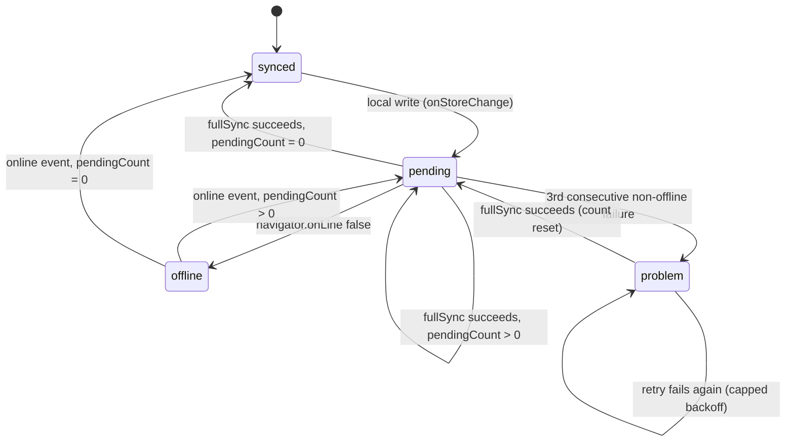
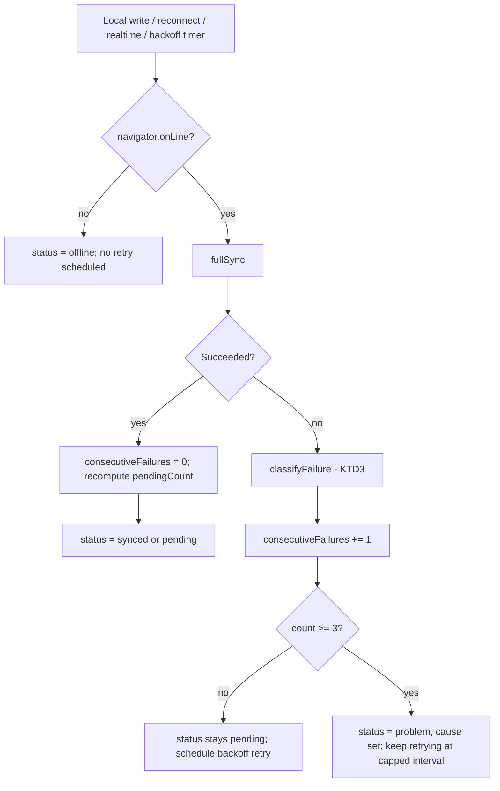

# Sync Trust Layer - Plan

## Goal Capsule

- **Objective:** A signed-in user can always tell whether everything they saved is backed up, and an offline or failing write is never silently lost — the app tells them it is still pending, or names the problem, instead of staying quiet.
- **Means:** Track per-record sync status locally, extend the existing `SyncController` with failure counting, backoff, and escalation, and surface the result through one global header indicator (KTD1, KTD2, KTD4).
- **Authority hierarchy:** `docs/brainstorms/2026-06-12-sync-trust-layer-requirements.md` (R1-R9) is authoritative on product behavior. This plan's Key Technical Decisions are authoritative on mechanism.
- **Stop conditions:** Stop and ask before changing the `Restaurant`/`Visit` data model beyond the one local-only field this plan adds (KTD1), and before wiring `resolvePendingRestaurants` failures into the global sync indicator (U5 keeps them separate by design — see Key Decisions).
- **Execution profile:** Standard. No phased rollout; land as ordered units U1 → U5.
- **Tail ownership:** No follow-up ownership beyond the items under Deferred to Follow-Up Work.

---

## Product Contract

### Summary

A single global indicator tells the user whether their data is backed up — all synced, N pending, or offline — backed by a durable offline write queue that survives reloads and auto-flushes on reconnect. Pushes that keep failing for a non-offline reason escalate the indicator to a problem state naming the likely cause. Last-write-wins discards stay silent; there is no conflict UI in this version.

This plan extends the existing sync engine (`src/sync/syncEngine.ts`) rather than building a parallel system: pending state is derived from a local-only per-record marker (no new queue table), and the indicator reuses the header row that already hosts sign-in state.

### Problem Frame

`docs/plans/2026-06-12-001-feat-tablemarks-foundation-plan.md` built sync but not its visibility: `SyncController` re-syncs on every local write, reconnect, and realtime push, but a failed push is only logged to the console, and nothing tracks how many records are unsynced. A user with spotty signal has no way to know their save didn't back up until they switch devices and find it missing — the exact failure this layer exists to prevent (see origin: `docs/brainstorms/2026-06-12-sync-trust-layer-requirements.md`).

### Requirements

Plan R-IDs are carried verbatim from the origin brief.

**Status indicator**

- R1. A single global indicator shows one of: all synced, N pending, or offline.
- R2. The indicator reflects the count of records not yet pushed to the cloud, derived from R2's per-record synced state. *(Origin's own R2 numbering — this R2 is about the indicator's data source, distinct from the foundation plan's sync-engine R2.)*
- R3. There are no per-record sync indicators.

**Offline queue**

- R4. Changes made while offline are queued locally and the app remains fully usable.
- R5. The queue flushes automatically when connectivity returns, with no manual action required.
- R6. The queue persists across app reloads and restarts; pending writes are never lost to a refresh.

**Failures and conflicts**

- R7. A push that fails stays pending and is retried automatically.
- R8. After repeated push failures for a non-offline reason, the indicator escalates to a distinct problem state that names the likely cause (e.g. cannot reach the server, sign-in needed).
- R9. Last-write-wins discards are not surfaced to the user in this version. Covers AE5. Already holds via the existing `src/sync/reconcile.ts`; this plan adds no conflict UI and changes no reconcile test. Origin's assumption — single-user-per-account conflict rate is low enough to defer surfacing — is unchanged by this plan and revisited only if real usage shows otherwise.

### Key Decisions

- **Indicator is shown only when signed in.** A local-only (no-account) user has nothing being backed up, so the indicator renders nothing rather than a meaningless "offline". `Governs R1.` (session-settled: user-approved — chosen over always showing the indicator: local-only mode has no sync to report, and an always-visible "offline" badge for no-account users would misstate their situation.)
- **Scope includes closing the existing retry-cap TODO in short-link resolution** (`src/capture/resolvePending.ts`), reusing this plan's backoff primitive, but its failures never feed the global sync indicator — an unresolvable Maps link is a capture problem, not a backup-trust problem. (session-settled: user-approved — chosen over leaving the TODO deferred: the code already names this plan as the place to resolve it, and the primitive is built here regardless.)

### Scope Boundaries

**Deferred for later** (from origin)

- An undo-able conflict ribbon surfacing last-write-wins discards.
- Per-record sync status indicators.
- A manual "sync now" control and per-record retry actions — tapping the indicator opens a read-only detail view, never a retry trigger.
- A sync history or activity log.

**Outside this product's identity** (from origin)

- Real-time presence or multi-user co-editing indicators. This layer reports one user's backup state, not collaboration.

**Deferred to Follow-Up Work** (plan-local)

- A dedicated "sign in again" call-to-action inside the problem-state detail view. The existing header sign-out/sign-in control already covers recovery; a contextual shortcut is a small follow-up, not required to satisfy R8.
- Per-record retry-cap UI for `resolvePendingRestaurants` (e.g. showing which specific place failed to resolve). U5 caps retries silently; surfacing them is a separate, smaller feature.

### Open Questions

None blocking. The origin's three deferred questions are resolved by this plan: escalation threshold and cause messages (KTD2), tap behavior (opens a detail view, per Scope Boundaries above), and retry backoff strategy (KTD2).

---

## Planning Contract

### Key Technical Decisions

- **KTD1. Pending state via a local-only per-record marker, not a new queue table.** Add an optional `syncedUpdated?: string` field to `Restaurant` and `Visit` — the `updated` value last confirmed synced. A record is pending when `updated !== syncedUpdated` (or the field is unset). This field is local-only: `src/sync/mappers.ts` already enumerates remote fields explicitly rather than spreading, so it never reaches PocketBase. Pending count is `count(restaurants) + count(visits)` where that condition holds, computed on demand from `allRestaurantsForSync()` / `allVisitsForSync()` — both already exist. This extends `docs/solutions/architecture-patterns/local-first-lww-sync-indexeddb-pocketbase.md`'s "the local store is the durable outbox" rule rather than replacing it: the marker is a status cache, never a second source of sync correctness — if it were ever wrong, the next `fullSync` recomputes and self-corrects, it does not gate what gets pushed. No `db.ts` version bump: adding an optional field to existing object-store values needs no schema migration. Field name avoids `Restaurant.pending`, which already means "awaiting geocode resolution." (session-settled: user-approved — chosen over a separate persisted queue table: the queue table was sketched in the original foundation plan but never built, and the shipped architecture deliberately treats IndexedDB itself as the outbox; adding a real queue would contradict that documented decision for no correctness benefit.)
- **KTD2. Escalate to "problem" after 3 consecutive non-offline failures, with exponential backoff between retries.** `SyncController` tracks `consecutiveFailures`. Each failure (an exception from `fullSync` while `navigator.onLine` is true) schedules the next retry with a capped exponential delay; on the 3rd consecutive failure the status becomes `problem` and the delay caps out, so retries continue quietly in the background rather than escalating further. A success resets the counter and clears any scheduled retry. `Governs R7, R8.` (session-settled: user-approved — chosen over an unbounded retry count or a fixed interval: 3 gives the user a signal within roughly the first minute of real trouble without flapping on a single transient blip, and backoff avoids hammering a struggling server.)
- **KTD3. Failure classification: two causes only.** `classifyFailure(err)` reads the PocketBase `ClientResponseError.status`: `401`/`403` → `sign-in-needed`; anything else (network error, 5xx, no status) → `server-unreachable`. Offline is never classified as a failure — `syncNow()` keeps its existing early return when `!navigator.onLine`, so "offline" and "problem" stay on separate code paths, matching R8's "non-offline" qualifier. `Governs R8.`
- **KTD4. One subscribable sync-status store, not a prop-drilled state.** A new `src/sync/syncStatus.ts` module holds `{ state: 'offline' | 'synced' | 'pending' | 'problem', pendingCount: number, cause?: 'server-unreachable' | 'sign-in-needed' }` and its own change emitter, mirroring the existing `onLocalChange`/`onStoreChange` pattern in `src/data/events.ts`. It recomputes on every `onStoreChange` (so a fresh local write bumps "N pending" immediately, per AE2) and on every sync attempt's outcome (so success/failure/escalation update promptly) — it does not reuse `onStoreChange` as its own emitter, since that event does not fire when a sync attempt changes nothing (e.g. going from 1 pending to 0 with no local write-back). A `useSyncStatus()` hook exposes it via `useSyncExternalStore`, mirroring `src/auth/useAuth.ts`.
- **KTD5. Consolidate the two duplicated online/offline listeners.** `src/sync/syncEngine.ts` and `src/capture/resolvePending.ts` each independently read `navigator.onLine` and add their own `window` `'online'` listener. Factor one shared `isOnline()` / `onOnlineChange()` pair (co-located with KTD3's classifier) and have both call sites use it. Reduces drift risk; no behavior change.

### High-Level Technical Design

Sync status state machine — states and the transitions this plan introduces:

Retry and escalation flow inside `SyncController.syncNow()`:

### Assumptions

None — every planning-time fork was surfaced and confirmed in the Phase 5.1.5 scoping synthesis; the confirmed choices are recorded as session-settled Key Decisions and KTDs above.

### System-Wide Impact

- **Data model:** `Restaurant` and `Visit` gain one optional local-only field (`syncedUpdated`, KTD1). It is never sent to or read from PocketBase — verified by `src/sync/mappers.ts` not referencing it. No migration of `pocketbase/pb_migrations/` collections.
- **Sync engine:** `SyncController` (`src/sync/syncEngine.ts`) gains status tracking and backoff; `fullSync`'s push/pull loops gain a per-record "mark synced" step. The reconcile core (`src/sync/reconcile.ts`) is untouched.
- **Two other call sites reuse the new primitives:** `resolvePendingRestaurants` (U5) and any future consumer of online/offline state (KTD5) — factoring these now avoids a third duplicated listener.

### Risks & Dependencies

- **One-time transitional inaccuracy on deploy.** Records synced before this plan ships have no `syncedUpdated` value, so they read as "pending" until the next successful `fullSync` marks them — which runs automatically on the next app open (`SyncController.start()` already calls `runSync()` immediately). Self-correcting within one sync pass; not a data-loss risk. Worth a one-line note if surprising in testing, not a blocker.
- **PocketBase SDK error shape.** `classifyFailure` (KTD3) depends on `ClientResponseError.status` being present on push/pull failures, matching the existing precedent at `syncEngine.ts`'s 404-branch in `PocketBaseRemote.upsert`. A network-level failure (no HTTP response at all) has no `status` and correctly falls through to `server-unreachable`.
- **Dependencies:** no new npm packages. Touches `src/sync/`, `src/data/restaurants.ts`, `src/data/visits.ts`, `src/types/models.ts`, `src/capture/resolvePending.ts`, `src/App.tsx`; creates `src/features/sync/`.

### Sources & Research

- Origin: `docs/brainstorms/2026-06-12-sync-trust-layer-requirements.md`.
- Prior plans this extends: `docs/plans/2026-06-12-001-feat-tablemarks-foundation-plan.md` (U4, sync engine — its Scope Boundaries explicitly deferred sync-trust UI to this plan), `docs/plans/2026-06-13-004-feat-pwa-offline-plan.md` (the `ReloadPrompt` component — evaluated as a pattern; not reused directly, since it is an ephemeral dismissible banner and this indicator is persistent ambient status).
- Institutional learnings applied: `docs/solutions/architecture-patterns/local-first-lww-sync-indexeddb-pocketbase.md` (durable-outbox rule, grounds KTD1), `docs/solutions/architecture-patterns/restart-controllers-on-startup.md` (status must be live after a reload, not just after sign-in — `SyncController.start()` already runs on `resume()`, covering this), `docs/solutions/conventions/indexeddb-transaction-scope-local-batch-vs-network.md` (the mark-synced write and the network push cannot share one IndexedDB transaction), `docs/solutions/conventions/emit-store-change-after-write-commits.md` (grounds KTD4's persist-then-notify ordering).
- Code precedent: `src/capture/resolvePending.ts:14`'s comment explicitly defers its retry-cap question to this plan (R7) — grounds U5 and the Scope Boundaries decision to keep its failures separate from the global indicator.

---

## Implementation Units

### U1. Backoff and failure-classification primitives

- **Goal:** Pure, testable building blocks for retry timing, failure classification, and shared online/offline detection.
- **Requirements:** R7, R8 (KTD1 rationale: durable-outbox extension; KTD2, KTD3, KTD5)
- **Dependencies:** none
- **Files:** `src/sync/backoff.ts`, `src/sync/backoff.test.ts`, `src/sync/onlineStatus.ts`, `src/sync/onlineStatus.test.ts`
- **Approach:**
  1. `backoff.ts`: `nextRetryDelayMs(attempt: number): number` — capped exponential (e.g. base delay doubling per attempt, capped at the escalation ceiling); `classifyFailure(err: unknown): 'server-unreachable' | 'sign-in-needed'` per KTD3.
  2. `onlineStatus.ts`: `isOnline(): boolean` (wraps `navigator.onLine`) and `onOnlineChange(cb): () => void` (wraps the `window` `'online'`/`'offline'` listeners), per KTD5.
- **Patterns to follow:** `src/sync/reconcile.ts` as the precedent for a pure, side-effect-free module in this codebase; `src/data/events.ts` for the subscribe/unsubscribe function shape.
- **Test scenarios:**
  - Happy: `nextRetryDelayMs` grows with attempt number and is capped at the documented ceiling.
  - Covers R8. `classifyFailure` maps a `401`/`403`-status error to `sign-in-needed`.
  - Edge: `classifyFailure` maps a `5xx`-status error and a status-less network error to `server-unreachable`.
  - Edge: `onOnlineChange` fires its callback on a simulated `'online'` event and stops firing after unsubscribe.
- **Verification:** Unit tests pass; no consumer imports `navigator.onLine` or `window.addEventListener('online', ...)` directly outside `onlineStatus.ts`.

### U2. Per-record pending tracking

- **Goal:** A local-only marker and a pending-count query, with no change to the synced data shape.
- **Requirements:** R2, R6 (KTD1)
- **Dependencies:** none
- **Files:** `src/types/models.ts` (modify), `src/data/restaurants.ts` (modify), `src/data/visits.ts` (modify), `src/data/restaurants.test.ts` (modify), `src/data/visits.test.ts` (modify)
- **Approach:**
  1. Add `syncedUpdated?: string` to `Restaurant` and `Visit` (`src/types/models.ts`).
  2. Add a low-level `markRestaurantSynced(id, syncedUpdated)` / `markVisitSynced(id, syncedUpdated)` pair — patches only that field, alongside the existing `putRestaurantRaw`/`putVisitRaw` raw-write helpers, no `updated` bump, no `emitLocalChange`.
  3. Confirm `src/sync/mappers.ts` needs no change — its explicit field enumeration already excludes `syncedUpdated` on both push and pull.
- **Patterns to follow:** `putRestaurantRaw`/`allRestaurantsForSync` in `src/data/restaurants.ts` as the precedent for a raw, event-light write used by the sync layer.
- **Test scenarios:**
  - Happy: `markRestaurantSynced` sets `syncedUpdated` without changing `updated` or other fields.
  - Covers R2. A restaurant with `updated !== syncedUpdated` (or `syncedUpdated` unset) is distinguishable from one where they match — the primitive `allRestaurantsForSync()` result exposes this to the caller.
  - Edge: a newly created record (never synced) has `syncedUpdated` unset and reads as pending.
  - Integration: `src/sync/mappers.test.ts` (existing) still passes unmodified — confirms no leak to the remote shape.
- **Verification:** Data-layer tests pass; `restaurantToRemote`/`visitToRemote` output is unchanged by this unit.

### U3. SyncController status, backoff, and escalation

- **Goal:** `fullSync` marks records synced as it writes/pushes them; `SyncController` tracks and publishes sync status through backoff and escalation.
- **Requirements:** R1, R2, R4, R5, R6, R7, R8 (KTD1-KTD4)
- **Dependencies:** U1, U2
- **Files:** `src/sync/syncEngine.ts` (modify), `src/sync/syncStatus.ts` (create), `src/sync/syncEngine.test.ts` (modify), `src/sync/syncStatus.test.ts` (create)
- **Approach:**
  1. In `fullSync`, call the U2 mark-synced helper immediately after each successful local write (`toWriteLocal`) and each successful individual push (`toPush`), inside the existing loops — so a mid-batch push failure still credits the records pushed before it.
  2. Add `syncStatus.ts`: holds the KTD4 status shape, a `recomputePending()` that reads `allRestaurantsForSync()` + `allVisitsForSync()` and counts the KTD1 condition, and `onSyncStatusChange(cb)` / `getSyncStatus()`. Subscribes to `onStoreChange` (`src/data/events.ts`) to recompute pending count on every write.
  3. In `SyncController`, wrap `syncNow()`: check `isOnline()` (U1) first — offline sets status `offline` (recomputing pending count) with no failure counted and no backoff scheduled, matching the existing early-return behavior. On success, reset `consecutiveFailures`, clear any scheduled backoff timer, and set status to `synced`/`pending` per KTD2. On failure, classify (U1), increment `consecutiveFailures`, schedule the next retry via `nextRetryDelayMs` (U1), and set status to `problem` with `cause` once the KTD2 threshold is reached.
  4. `stop()` clears any pending backoff timer alongside its existing cleanup.
- **Technical design:** See the High-Level Technical Design flowchart above for the exact branch order inside `syncNow()`.
- **Patterns to follow:** `src/sync/syncEngine.test.ts`'s existing `FakeRemote` (in-memory `RemoteStore`) for exercising `fullSync`/`SyncController` without a live PocketBase; `fake-indexeddb` + `freshDB()` (`src/test/idb.ts`) for IndexedDB state.
- **Execution note:** Extend the existing `SyncController` tests incrementally — add one failing scenario at a time (offline, single failure, escalation, recovery) rather than rewriting the suite.
- **Test scenarios:**
  - Covers AE1, R5. Happy: pending changes plus a restored connection flush, and status moves from `pending` to `synced`.
  - Covers AE2, R6. Integration: a write while offline (simulated `isOnline() → false`), followed by a fresh `SyncController` instance against the same IndexedDB (simulating reload), still reports the record pending.
  - Covers AE3, R1. Edge: offline with existing pending records reports `offline` with the correct pending count, not `problem`.
  - Covers AE4, R7, R8. Integration: three consecutive `FakeRemote` push failures with a `401`-shaped error escalate status to `problem` with `cause: 'sign-in-needed'`; a subsequent success resets to `synced`/`pending`.
  - Edge: two consecutive failures (below threshold) leave status at `pending`, not `problem`.
  - Edge: a push failure partway through a batch still marks the records pushed before it as synced.
- **Verification:** `SyncController`/`fullSync` tests pass; manually driving a `FakeRemote` through offline → pending → problem → recovered exercises every state-diagram transition once.

### U4. Sync status indicator

- **Goal:** One header-level indicator surfacing the KTD4 status, visible only when signed in.
- **Requirements:** R1, R3, R8 (Key Decision: indicator shown only when signed in)
- **Dependencies:** U3
- **Files:** `src/sync/useSyncStatus.ts` (create), `src/features/sync/SyncStatusIndicator.tsx` (create), `src/features/sync/SyncStatusIndicator.test.tsx` (create), `src/App.tsx` (modify)
- **Approach:**
  1. `useSyncStatus.ts`: `useSyncExternalStore` over `syncStatus.ts`'s subscribe/get, mirroring `src/auth/useAuth.ts`.
  2. `SyncStatusIndicator.tsx`: renders `null` when `useAuth().signedIn` is false. Otherwise renders text per state — "All synced", "N pending", "Offline" (with count when > 0), or the `cause`-specific problem message (KTD3's two causes: "Can't reach the server" / "Sign in again to keep backing up"). A click/tap toggles a small inline detail view (plain text elaboration, no action buttons — per Scope Boundaries, never a retry trigger).
  3. Mount `<SyncStatusIndicator />` in `src/App.tsx`'s header row, beside the existing sign-in/email/sign-out controls — not as a bottom banner (that pattern is reserved for `ReloadPrompt`'s transient update notice).
- **Patterns to follow:** `src/auth/useAuth.ts` for the hook shape; `src/App.tsx`'s existing header conditional (`signedIn ? ... : ...`) for placement.
- **Test scenarios:**
  - Covers R1. Happy: with `useSyncStatus` mocked to `{ state: 'synced', pendingCount: 0 }`, the indicator renders "All synced".
  - Covers R1. Happy: `{ state: 'pending', pendingCount: 3 }` renders "3 pending" (or equivalent wording).
  - Covers AE3, R1. Edge: `{ state: 'offline', pendingCount: 2 }` renders an offline message including the count.
  - Covers AE4, R8. Edge: `{ state: 'problem', cause: 'sign-in-needed' }` renders the sign-in-needed message, visually distinct from `pending`/`offline`.
  - Covers R3. Edge: with `useAuth` mocked to signed-out, the component renders nothing regardless of sync status.
  - Edge: clicking the indicator opens the detail view and does not call any retry/sync function.
- **Verification:** Component tests pass; manually driving `App` through sign-in with pending/offline/problem states (via the mocked hook) confirms placement and wording read correctly.

### U5. Close the resolvePendingRestaurants retry-cap TODO

- **Goal:** Provisional-record resolution retries use the same backoff primitive instead of retrying on every reconnect indefinitely, closing the TODO at `src/capture/resolvePending.ts:14`.
- **Requirements:** none from the origin brief — addresses the explicit code TODO and the origin's "retry backoff strategy" outstanding question, per the confirmed Scope Boundaries decision.
- **Dependencies:** U1
- **Files:** `src/capture/resolvePending.ts` (modify), `src/capture/resolvePending.test.ts` (modify)
- **Approach:** Track a per-record failure count (in-memory is sufficient — a page reload naturally resets the backoff window, and provisional records already retry on every startup) and skip a record's resolve attempt until its backoff window elapses, using `nextRetryDelayMs` (U1). Cap stays local to this module: it changes retry pacing, not user-visible state, so it does not touch `syncStatus.ts` or the indicator (see Key Decision above).
- **Patterns to follow:** `src/capture/resolvePending.ts`'s existing `inFlight` guard and `startPendingResolver` structure — extend, do not restructure.
- **Test scenarios:**
  - Happy: a record that fails once is retried on the next `online` event within its backoff window closing.
  - Edge: a record that fails repeatedly is skipped on an `online` event that fires before its backoff window elapses.
  - Covers the existing "still unresolvable" edge (already tested): a record still fails after backoff-gated retries and remains provisional with no crash.
- **Verification:** `resolvePendingRestaurants` tests pass, including the pre-existing scenarios; no change to `SyncStatusIndicator` behavior from this unit.

---

## Verification Contract

| Command | Applies to |
|---|---|
| `npm test` (`vitest run`) | All units — unit and component tests |
| `npm run lint` (`tsc --noEmit`) | All units — type safety for the new `syncedUpdated` field and status types |
| `npm run build` | Final check — production build succeeds with the new modules |

No service-worker or PocketBase-live verification is needed: all sync-engine tests already run against the in-memory `FakeRemote`, per existing convention.

---

## Definition of Done

- All five units land with their test scenarios passing under `npm test`.
- `npm run lint` and `npm run build` succeed.
- The state-diagram transitions in High-Level Technical Design are each exercised by at least one test in U3.
- `resolvePendingRestaurants`'s retry-cap TODO comment (`src/capture/resolvePending.ts:14`) is removed or updated to reflect the shipped behavior.
- No dead-end code from an abandoned approach remains (e.g., no unused queue-table scaffolding if one was prototyped and rejected in favor of KTD1).
