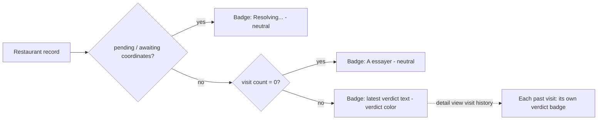

# Design Refresh - Plan

## Goal Capsule

- **Objective:** Someone opening Tablemarks — on desktop or on a phone, at home planning a visit or standing at a restaurant deciding where to eat — reads it as a distinctive, personal app ("Carnet culinaire") rather than a generic UI template, and can tell a place's cuisine apart from its status/verdict at a glance in the list, the detail view, and the map. On a phone, every primary use (browsing, deciding, logging a visit, adding a place) stays comfortable one-handed.
- **Means:** Build the Carnet culinaire identity, the mobile Liste/Carte toggle, and the fused status/verdict badge described below. Reuse branch `feat/ui-polish`'s already-built structural mechanics — sticky header, unified modal shell, mobile pane-switch, marker shapes, button/chip shapes — as an implementation starting point, retokenized to the new palette and type rather than kept in that branch's original stone-neutral styling.
- **Product authority:** This Product Contract is authoritative on product/visual behavior; `ce-plan`'s enrichment is authoritative on mechanism (exact colors, tokens, component structure). Solo personal project — the requester is the sole user and decision-maker.
- **Open blockers:** None. Ready for planning.

---

## Product Contract

### Summary

Give Tablemarks one distinctive visual identity — "Carnet culinaire": warm, editorial, terracotta + deep-teal — applied consistently across every screen, replace the always-side-by-side desktop layout with a persistent Liste/Carte toggle on mobile, and make cuisine and a fused status/verdict badge each legible at a glance in the list, the detail view, and the map.

### Problem Frame

The app today renders in Tailwind's default styling — a flat gray/orange palette (`--color-brand: #d4561f`), system-font typography, no responsive breakpoints anywhere in `src/App.tsx` — with a fixed `w-80` list sidebar always shown beside the map. That side-by-side layout does not adapt below desktop width, and mobile is where the pain concentrates: deciding where to eat nearby, logging a visit on site, and casual browsing are the three real phone-use contexts, and none of them are served by an unconditionally split screen. Separately, the restaurant list shows only plain text — a status word and a verdict/visit-count rollup string; cuisine color-coding already exists for map markers, filter chips, and the detail view, but not in the list itself, and status/verdict are two separate signals rather than one legible facet. Modals (Add a place, the decide panel, restaurant detail, export/import) share the same generic centered-dialog chrome on every screen size, with no mobile-appropriate presentation and no tap-outside-to-close. Map markers are plain circles with no visual distinction for the selected place.

### Requirements

**Identité visuelle**

- R1. The app adopts one distinctive visual identity ("Carnet culinaire": warm, editorial tone; paper-like background; serif display type) in place of the current default Tailwind look, expressed through a saturated terracotta primary accent and a deep teal/blue-green secondary accent. Exact color values, typefaces, and spacing are a planning decision.
- R2. This identity is applied consistently across every screen: the main list/map screen, the restaurant detail view, the add-a-place flow, the "Où manger ?" decide panel, the export/import panel, the sync status indicator, and the app-update banner.
- R3. Personalization means a bespoke, built-in identity for the app itself. It does not include user-facing customization such as a choice of theme or accent color, or personal usage statistics/greetings.

**Header**

- R4. The header stays visible while scrolling, with a translucent, blurred background in the Carnet culinaire identity, a small logo mark next to the app name, and a tagline visible on wider screens.

**Responsive mobile**

- R5. Below a width where the current side-by-side list+map layout stops being usable (planning decides the exact breakpoint), the layout switches to a single-pane view with a persistent Liste/Carte toggle fixed at the bottom of the screen; adding a place stays reachable from either pane (a floating "+" button over the map when Carte is active).
- R6. The desktop/wide-screen layout keeps its current side-by-side list+map structure; only its visual styling changes there, not its structure.
- R7. Every primary flow — browsing the list/map, opening "Où manger ?" to decide, logging a visit, and adding a new place — remains fully usable in the narrow single-pane mobile layout; switching panes preserves the active filters and each pane's own scroll/pan position.

**Lisibilité des catégories (cuisine / statut / verdict)**

- R8. Cuisine is visually indicated on every restaurant row in the main list (not only in the filter bar, map markers, and detail view as today), using the same cuisine-to-color mapping already used elsewhere in the app.
- R9. A restaurant's status and verdict are combined into a single colored badge per row, not two separate elements: an unvisited ("to try") place shows a neutral "À essayer" badge; a visited place's badge shows its latest verdict (e.g. "On y retourne") in place of a generic "Visité" label.
- R10. A provisional restaurant awaiting coordinate resolution (`CONCEPTS.md`'s Provisional record) keeps a distinct, visually neutral "Resolving…" badge state, never the verdict-colored treatment, regardless of visit count.
- R11. Wherever a verdict is shown as text outside the list rollup — including each entry in the restaurant detail panel's visit history — it gets the same colored-badge treatment; each past visit shows its own verdict badge for that entry, distinct from the row-level fused badge which shows only the latest.
- R12. The empty list state (no places saved yet) shows a supporting icon, a short title, and one line of guidance, instead of a single plain sentence.
- R13. Filter chips (cuisine, status, verdict) adopt the same category-distinction visual language as the list and detail badges, sized and spaced for easier tapping, with the active state visually stronger — shadow plus a more saturated fill — than today's plain outline.

**Map markers**

- R14. Map markers render as a pin shape rather than a plain circle, continuing to encode cuisine by color per the existing mapping; the selected marker is visually larger and carries a glow/halo in its own color so the selection is unambiguous. Map internals (tile provider, clustering, the Leaflet library itself) are unchanged.

**Modals**

- R15. Every modal-style panel (Add a place, Où manger ?, Restaurant detail, Export/Import) shares one shell: on a phone-width screen it rises from the bottom of the screen with rounded top corners and a small drag-indicator bar; on a wider screen it stays centered. Clicking outside the panel closes it, and the darkened backdrop is opaque enough to read as a clear foreground/background separation.

**Buttons**

- R16. Primary action buttons (Add a place, Où manger ?, Pick for me, I'm here now) use a strongly rounded shape with a subtle shadow and a visible hover transition.

### Key Decisions

- **"Carnet culinaire" (warm, editorial; terracotta + deep-teal) as the app's visual identity** (session-settled: user-directed — chosen over reusing the already-shipped `feat/ui-polish` branch's stone-neutral ramp and Fraunces/Inter pairing as-is when reconciling two independently-produced plans for the same redesign; the identity itself was chosen through sketch comparison against a clean-minimal and a dark/bold direction). Governs R1.
- **Personalization means a built-in app identity, not user-facing customization** (session-settled: user-directed — chosen over "personalized for the user" and "both," keeping scope to a visual refresh rather than a new preferences feature). Governs R3.
- **Whole app in scope now, including the surfaces `feat/ui-polish` did not touch** (session-settled: user-directed — chosen over doing only the main screen and deferring the rest, and over limiting the remaining surfaces to only Export/Import: full visual consistency across every screen). Governs R2.
- **Status and verdict fused into one badge, over keeping a separate status pill plus a distinct verdict badge** (session-settled: user-directed — chosen over the other plan's three-element row of cuisine dot, status pill, and separate verdict badge when reconciling the two plans; itself a deliberate mix across two of three sketched directions, borrowing the rejected dark/bold direction's chip treatment). Governs R9, R10, R11.
- **Mobile navigation: a bottom Liste/Carte toggle, over a map-with-draggable-list-drawer and a stacked single-page layout** (session-settled: user-directed — chosen among three concrete alternatives). Governs R5.
- **Desktop keeps its current side-by-side structure; only mobile gets the new toggle** (session-settled: user-approved — proposed during scope confirmation and accepted, matching that the request named "responsive for mobile" as distinct from "modern look"). Governs R6.

### Key Flows

- F1. Mobile list/map navigation
  - **Trigger:** The viewport renders below the desktop breakpoint.
  - **Steps:** The screen shows one pane (Liste or Carte) at a time, with a toggle fixed at the bottom of the screen; switching panes preserves the active filters and each pane's own scroll/pan position. When Carte is active, a floating "+" button over the map lets the user add a place.
  - **Outcome:** Only one of Liste/Carte is visible at a time on mobile; both remain visible side by side, structurally unchanged, on a wider screen, where the toggle itself is hidden.
  - **Covers:** R5, R6, R7.

```mermaid
flowchart TB
  H[Header: app name + sync status] --> C[Filter chips: cuisine / status / verdict]
  C --> P{Liste/Carte toggle state}
  P -->|Liste| L[Restaurant list: cuisine tag + fused status/verdict badge per row]
  P -->|Carte| M[Map: cuisine-colored pins, floating + button]
  L --> N[Bottom toggle: Liste | Carte]
  M --> N
```

- Restaurant badge state (covers R9, R10, R11):



### Acceptance Examples

- AE1. **Covers R9, R10.**
  - Given a restaurant with zero visits, When rendered in the list or detail view, Then its badge reads "À essayer" in the neutral to-try color, with no separate status pill.
  - Given a restaurant with one or more visits, When rendered, Then its badge reads the latest visit's verdict (e.g. "On y retourne") instead of a generic "Visité" label.
  - Given a provisional restaurant awaiting coordinate resolution, When rendered, Then its badge reads "Resolving…" in a neutral, non-verdict color regardless of visit count.
- AE2. **Covers R8, R9.** Given a restaurant with zero visits, when it appears in the list, then it shows the cuisine dot and the neutral "À essayer" badge — there is no visit to rate yet.
- AE3. **Covers R11.** Given a restaurant with two visits carrying different verdicts, when it appears in the list, then only the latest visit's verdict shows as the row-level fused badge (matching today's rollup: latest verdict + visit count); in the detail panel's visit history, each past visit shows its own verdict badge for that entry.
- AE4. **Covers R5, R6, R7.**
  - Given the viewport is at or above the desktop breakpoint, When the app renders, Then list and map remain visible side-by-side as today.
  - Given the viewport is below the desktop breakpoint, When the app renders, Then only one of Liste/Carte is visible at a time with a persistent toggle, and every primary flow (browse, Où manger ?, log a visit, add a place) stays reachable and usable in that narrow layout.
- AE5. **Covers R15.** Given a screen at or above the tablet breakpoint, when any modal-style panel opens (Add a place, Où manger ?, Restaurant detail, Export/Import), then it appears centered rather than as a bottom sheet.

### Success Criteria

- The redesign reads as one coherent, distinctive style across every screen — no screen still looks like the old default-Tailwind chrome.
- On a phone, a user can complete each of the three real usage contexts (deciding where to eat, logging a visit, casual browsing) one-handed, without horizontal scrolling or cramped side-by-side panels.
- Without reading any text, a user can distinguish a place's cuisine (by color) from its status/verdict (by the fused badge) at a glance.

### Scope Boundaries

- Dark mode is out of scope; the palette is designed for a light background only.
- No numeric star rating is introduced — Verdict stays a returnability judgment (per `CONCEPTS.md`), never a number; the fused badge is a color/label treatment of the existing four Verdict values, not a new rating scale.
- User-facing personalization (choice of theme/accent color, personal usage stats, or a tailored greeting) is explicitly out of scope — the ask is a bespoke built-in identity, not a user setting.
- Map internals (tile provider, clustering behavior, the Leaflet library itself) are unchanged; only marker/pin visual styling is refreshed (R14).
- No new data fields, verdicts, or domain behavior are introduced — this redesigns how existing data (cuisine, status, verdict) is presented, not what data exists.

### Dependencies / Assumptions

- Assumes Tailwind v4's `@theme` block in `src/index.css` remains the styling mechanism; new design tokens (colors, and any font import) are added there rather than via a separate config file. Today it holds only `--color-brand` and `--color-brand-soft`.
- Assumes the existing cuisine→color mapping (`colorForCuisine` in `src/features/facets/cuisines.ts`) is reused rather than replaced, since the filter bar, map markers, and detail view already depend on it.
- Branch `feat/ui-polish` (commit `d73d93d`, unmerged into `main`) already implements much of the structural work this plan assumes as a starting point — the responsive breakpoint/pane-switch mechanics, the unified modal shell, the sticky/blurred header, teardrop map markers, and rounded/shadowed buttons and chips — across `index.html`, `src/index.css`, `src/App.tsx`, `src/features/RestaurantList.tsx`, `src/features/facets/FilterBar.tsx`, `src/features/map/MapView.tsx`, `src/features/capture/AddPlace.tsx`, `src/features/decide/DecidePanel.tsx`, `src/features/visits/RestaurantDetail.tsx`. Its color/typography tokens (the stone-neutral ramp, Fraunces/Inter) are superseded by R1's Carnet culinaire identity; the structural mechanics are assumed reusable, retokenized. Planning should verify how much of that branch's structure survives against the new tokens.
- `src/features/portability/PortabilityPanel.tsx`, `src/features/sync/SyncStatusIndicator.tsx`, and `src/features/pwa/ReloadPrompt.tsx` are unmodified by `feat/ui-polish` and still carry the prior look (R2).

### Outstanding Questions

- Deferred to Planning: the exact pixel breakpoint at which the layout switches from side-by-side to the Liste/Carte toggle.
- Deferred to Planning: exact hex palette values and the specific serif/sans typeface pairing for Carnet culinaire, and whether `feat/ui-polish`'s existing Fraunces/Inter wiring in `index.html` (with its offline CSS fallback stack) partially survives or is fully replaced.
- Deferred to Planning: how much of `feat/ui-polish`'s already-built structural code (header, modal shell, markers, buttons) is reused versus rebuilt once retokenized to the new identity.

### Sources / Research

- Branch `feat/ui-polish` (commit `d73d93d`, "feat(ui): modern polish, responsive mobile, teardrop markers") implements the structural mechanics behind R4-R7, R12, R14-R16 today, with a visual identity this plan supersedes (see Dependencies / Assumptions for file list).
- `src/App.tsx` — current always-side-by-side layout on `main` (`w-80` sidebar + `flex-1` map), no responsive classes; confirms both source plans' problem framing.
- `src/features/RestaurantList.tsx` — list rows show only name, status text, and rollup text on `main`; no cuisine color indicator.
- `src/features/display.ts` — `statusLabel()` and `rollupLabel()` as today's two separate plain-text signals; `pending` field backs the Resolving… state (R10).
- `src/features/facets/cuisines.ts`, `src/features/facets/FilterBar.tsx`, `src/features/map/markers.ts`, `src/features/map/MapView.tsx`, `src/features/visits/RestaurantDetail.tsx` — existing cuisine→color mapping and its current usages.
- `src/features/capture/AddPlace.tsx`, `src/features/decide/DecidePanel.tsx`, `src/features/portability/PortabilityPanel.tsx` — share the same generic modal chrome as `RestaurantDetail.tsx` today.
- `src/index.css` — only existing design tokens are `--color-brand` and `--color-brand-soft`.
- `CONCEPTS.md` — defines Verdict as a returnability judgment with no numeric score, Status as derived (never stored), Rollup as the latest-verdict-plus-count cache, and Provisional record as the pending-coordinate state backing R10.
