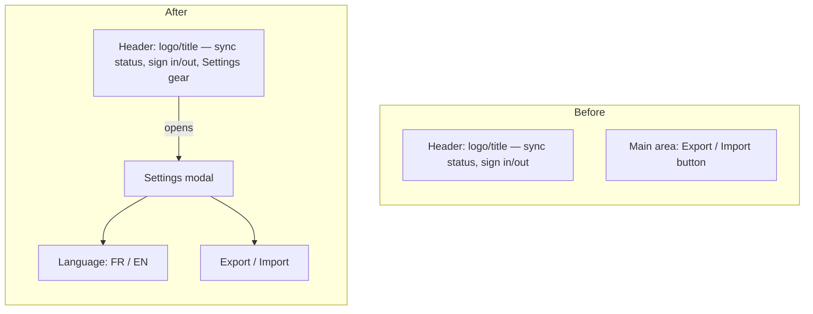

# Language & Settings Menu - Plan

## Goal Capsule

- **Objective:** Tablemarks is usable end-to-end in French or English, and the main area no longer carries a standalone Export/Import button competing with primary actions.
- **Means:** A new Paramètres (Settings) entry, opened from a gear icon in the header, reusing the app's existing Modal shell, holding the Language switch and the relocated Export/Import actions.
- **Product authority:** This brainstorm resolves the user-facing behavior below; `ce-plan` decides the i18n library and implementation structure.
- **Open blockers:** None.

## Product Contract

### Summary

Tablemarks gains a Français/English language toggle that translates the entire app, plus a new Settings entry reachable from a header gear icon. Settings houses the language switch and the existing Export/Import actions, replacing today's standalone Export/Import button in the main area.

### Problem Frame

Every string in the app is currently hardcoded in English (`src/App.tsx` and throughout), with no translation mechanism. The main area also carries a full-width "Export / Import" button (`src/App.tsx:95-101`) that sits alongside primary actions despite being used rarely. Consolidating rarely-used actions behind a single Settings entry, and adding the language it should have had from the start, addresses both at once.

### Requirements

**Language & Localization**

- R1. The entire app UI translates fully between French and English: navigation, filters, forms, empty states, cuisine/status/verdict labels, and import/export feedback and error messages — not only the new Settings entry.
- R2. On first visit, before any manual choice, the displayed language is detected from the browser's language setting, defaulting to English when the browser reports neither French nor English.
- R3. The user can override the detected language at any time via a Language control in Settings; the choice persists for that device only (via local storage), not synced across devices or accounts — consistent with the app staying fully usable without signing in.
- R4. Verdict and Status labels use these exact French translations: *Go back* → *J'y retourne*; *Worth a detour* → *Vaut le détour*; *Once was enough* → *Une fois suffit*; *Never again* → *Plus jamais*; *to-try* → *à essayer*; *visited* → *visité*.

**Settings Menu & Navigation**

- R5. A Settings entry point (a gear/settings icon button) is added to the header, alongside the existing sync-status and sign-in/out controls.
- R6. Selecting the Settings icon opens a single panel, using the app's existing Modal shell, containing two sections: Language and Export/Import.
- R7. The standalone "Export / Import" button currently in the main area is removed; export and import behavior is unchanged, only its entry point moves into the Settings panel.

### Key Decisions

- **Browser auto-detect determines the default language.** Governs R2. (session-settled: user-directed — chosen over always-French or always-English as the default: user picked auto-detect among the three options presented)
- **Language persists per device via local storage, not per account.** Governs R3. Chosen to stay consistent with the app's local-first, no-account-required design. (session-settled: user-directed — chosen over syncing the preference to the account: user picked per-device after the sync trade-off was surfaced)
- **Verdict and Status wording is locked in now, not left for planning to invent.** Governs R4. (session-settled: user-approved — chosen over leaving the wording open for the user to supply separately: user approved the proposed French set as-is)
- **The Settings panel reuses the existing Modal shell rather than a new anchored dropdown.** Governs R5, R6. Avoids introducing a second UI primitive alongside the app's established bottom-sheet/centered Modal pattern already used for Add, Decide, and Portability. (session-settled: user-directed — chosen over an anchored header dropdown modeled on GrooveMark's menu: reuses an existing pattern instead of building a new one, and Export/Import would have needed its own modal regardless)

### Acceptance Examples

- AE1. **Covers R2.** **Given** a first-time visitor whose browser language is French, **When** they open the app with no prior manual choice, **Then** the UI displays in French.
- AE2. **Covers R2.** **Given** a first-time visitor whose browser language is neither French nor English (e.g. German), **When** they open the app, **Then** the UI displays in English.
- AE3. **Covers R3.** **Given** a user who manually switched to French on one device, **When** they open the app on a second device that has never had a manual choice made, **Then** the second device shows its own browser-detected language, not the first device's manual choice.

### Scope Boundaries

- No settings beyond Language and Export/Import (no theme, no account preferences) in this release.
- No language beyond French/English.
- No cross-device or cross-account sync of the language preference (see Key Decisions).

### Dependencies / Assumptions

- Assumes an i18n mechanism capable of namespace-organized locale files, a translation hook, and localStorage-with-browser-detect persistence — the pattern GrooveMark (a sibling project) uses with `vue-i18n`. Tablemarks is React, so the specific library differs; selecting it is a planning-tier decision.
- Every string currently hardcoded in JSX across the app becomes a translation key; this is the bulk of the implementation effort, not the Settings-menu relocation.

### Outstanding Questions

- **Deferred to Planning:** Which React-compatible i18n library to use (e.g. `react-i18next`) and how to structure translation namespaces/keys.

### Sources / Research

- Current header, no existing settings icon: `src/App.tsx:38-72`
- Current Export/Import entry point: `src/App.tsx:95-101`, opening `PortabilityPanel` inside the shared `Modal`: `src/features/ui/Modal.tsx:24-106`
- No i18n library present today (`package.json`); all UI strings are hardcoded in JSX
- Header identity/branding is set by a recent plan that does not yet account for a Settings entry: `docs/plans/2026-08-29-1725-feat-design-refresh-plan.md`
