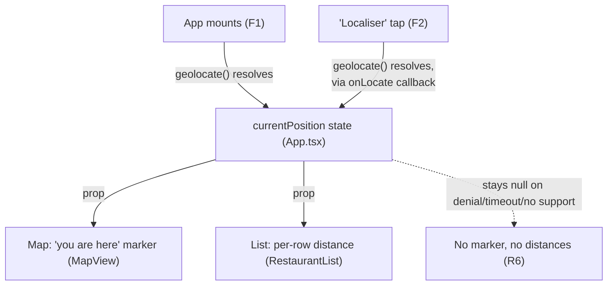

# Current Position & List Distance - Plan

## Goal Capsule

- **Objective:** When the device can obtain a location fix, the user can see their own position on the map and glance at how far each saved restaurant is directly from the list, without panning the map or opening "Où manger ?".
- **Means:** A new `currentPosition` state in `src/App.tsx`, sibling to the existing `anchor` state, fed by an on-mount fetch and by the existing "📍 Localiser" button (KTD1); a distinct marker on the map and a per-row distance in the list both read from it.
- **Product authority:** This plan owns showing the device's real current position on the map and its distance to each restaurant in the main list only. The map-pan "anchor" and radius search already used by `src/features/decide/` are not touched or reused, except for a pure import-swap in `DecidePanel.tsx` moving `formatDistance` into the shared `src/lib/geo.ts` module (KTD2) — no Decide behavior changes.
- **Execution profile:** Standard software feature work; no autonomous/long-running optimization loop.
- **Stop conditions:** None beyond satisfying the Definition of Done below.
- **Open blockers:** None. Ready for implementation.

---

## Product Contract

**Product Contract preservation:** unchanged. Planning added the Planning Contract, Implementation Units, Verification Contract, and Definition of Done below; no Requirement, Key Decision, or scope boundary text was altered.

### Summary

On app load, the app automatically requests the device's location once. When a fix comes back, a "you are here" marker appears on the map and every restaurant row in the main list shows its straight-line distance from that fix. When no fix is available, both surfaces look exactly as they do today.

### Key Decisions

- **Automatic fetch on load, not gated behind a tap** (session-settled: user-directed — chosen over reusing the existing "📍 Localiser" button as the only trigger, which is today's explicit-opt-in pattern for geolocation: the user wants the pin and distances to appear without an extra action). Governs R1, R6.
- **Any successful fix counts as "available"** (session-settled: user-directed — chosen over gating on `position.coords.accuracy`: keeps behavior simple and matches `geolocate()`, which already doesn't inspect accuracy). Governs R1, R3.
- **List order is unchanged; distance is added information only** (session-settled: user-directed — chosen over sorting the list nearest-first now that distance is visible). Governs R4.

### Requirements

**Map position**
- R1. On app load, the app attempts to obtain the device's location once; when a fix comes back, a distinct "current position" marker appears on the map at that point, visually distinct from restaurant pins.
- R2. Tapping the existing "📍 Localiser" button re-fetches the location and refreshes the current-position marker, in addition to its existing recenter-the-map behavior — it is not a separate, unrelated fetch.

**List distance**
- R3. Whenever a device location fix is available (from R1 or R2), every restaurant row in the main list (`src/features/RestaurantList.tsx`) shows its straight-line distance from that fix, formatted the way `DecidePanel` already formats distance (meters below 1 km, one decimal km above).
- R4. The list's current sort order and facet filtering (`src/features/facets/filter.ts`) are unchanged; distance is additional per-row information, not a new sort key.
- R5. A restaurant with no resolved coordinates (a provisional record, per `src/features/decide/candidates.ts`'s existing exclusion) shows no distance.

**Fallback**
- R6. When no location fix is available — permission denied, timeout, or no Geolocation support — the map shows no current-position marker and the list shows no distances; nothing else changes and no error is surfaced to the user.

### Key Flows

- F1. Automatic fetch on load
  - **Trigger:** The app mounts.
  - **Steps:** The app calls the existing `geolocate()` once; on success the fetched point becomes the shared "current position" used by both the map marker and the list; on failure, timeout, or no support, that state stays unset and both surfaces render as they do today.
  - **Covers:** R1, R3, R6

- F2. Manual refresh via "Localiser"
  - **Trigger:** The user taps the map's existing "📍 Localiser" button.
  - **Steps:** The existing recenter-the-map behavior runs unchanged; the same fetched point also replaces the shared "current position", updating the marker and every list distance.
  - **Covers:** R2

### Acceptance Examples

- AE1. **Covers R1, R6.** Given the user opens the app and grants the location permission prompt, when a fix returns, then a "you are here" marker appears on the map without any extra tap.
- AE2. **Covers R6.** Given the user denies the location prompt (or no fix arrives before the timeout), when the app finishes loading, then no current-position marker appears and no list row shows a distance — the app looks exactly as it does today.
- AE3. **Covers R3, R5.** Given a mix of restaurants with and without resolved coordinates, when a location fix is available, then rows with coordinates show a distance and provisional/coordinate-less rows show none.
- AE4. **Covers R2.** Given the app already has a current-position marker from the load-time fetch, when the user taps "Localiser" again after moving, then the marker and every list distance update to the new fix.

### Scope Boundaries

- **Deferred for later:** Continuous/live position tracking while the app stays open (`watchPosition`) — this plan only ever takes one fix per trigger (load, or a "Localiser" tap).
- **Outside this scope:** The map-pan "anchor" and radius search used by "Où manger ?" (`src/features/decide/`) are untouched and keep working exactly as today, independent of this new device-location concept — except for the pure `formatDistance` import-swap in `DecidePanel.tsx` (KTD2), which changes no Decide behavior. Sorting the list by distance is explicitly out of scope (R4).

### Dependencies / Assumptions

- Reuses `geolocate()` (`src/lib/geolocate.ts:13`) and `haversineMeters()` (`src/lib/geo.ts:9`) as-is; no new geolocation or distance-math capability is needed.
- Assumes a one-shot fetch per trigger, matching `geolocate()`'s existing contract, rather than continuous tracking — consistent with the "simple distance" framing and the absence of any `watchPosition` use elsewhere in the codebase.
- The distance-formatting helper currently lives inline in `DecidePanel.tsx:12` (`formatDistance`); reusing it for the list implies sharing it across both call sites, a planning-level detail.

### Sources / Research

- `src/lib/geolocate.ts:13` — `geolocate()`: resolves the device position once, or `null` on denial/timeout/no support; never rejects.
- `src/lib/geo.ts:6-18` — `haversineMeters()` and `DEFAULT_MAP_CENTER` (Paris fallback), already used for distance math.
- `src/features/map/MapView.tsx:99-104` — the existing "📍 Localiser" button already calls `geolocate()` and recenters the map; today it does not drop a marker or feed the list.
- `src/features/decide/candidates.ts:22-35` and `src/features/decide/DecidePanel.tsx:12-18` — the existing "Où manger ?" flow already computes and formats per-restaurant distance from a pannable map-center anchor, and already excludes deleted/pending/coordinate-less restaurants — the pattern this plan's list distance follows, without reusing the anchor itself.
- `src/App.tsx:31` — today's `anchor` state defaults to `DEFAULT_MAP_CENTER` and updates only from map panning (`onCenterChange`); this plan introduces a separate "current position" concept fed by real device geolocation instead.
- `src/i18n/locales/fr/translation.json:129` — `"locateAria": "Centrer sur ma position"` confirms geolocation is currently framed as an explicit, user-initiated action; R1 is a deliberate change from that pattern (see Key Decisions).

---

## Planning Contract

### Key Technical Decisions

- KTD1. **`currentPosition` lives in `src/App.tsx` as a state sibling to `anchor`, never merged with it.** `anchor` (`App.tsx:31`) is pan-driven, defaults to Paris, and belongs entirely to the Decide flow; `currentPosition` starts `null` and is fed only by the two triggers in F1/F2. Governs R1, R2, R6.
- KTD2. **`formatDistance` moves from `DecidePanel.tsx:12` into `src/lib/geo.ts`**, alongside `haversineMeters` and `DEFAULT_MAP_CENTER`. `DecidePanel.tsx` imports it from there instead of defining it locally; `RestaurantList.tsx` imports the same function. It is a pure move — `formatDistance` has no other call site. Governs R3.
- KTD3. **The on-load fetch (F1) and a manual "Localiser" tap (F2) both write into `currentPosition` with no sequencing guard among successful fetches** — whichever `geolocate()` call resolves last wins, even if it started first. This matches how `anchor`/`onCenterChange` already behaves (no guard there either), and the realistic collision window is the 10-second timeout in `geolocate()`. No `AbortController` or sequence number is added. A failed fetch (`null`) never overwrites an existing `currentPosition`, so a bad retry cannot erase a working position (see U2). Governs R2.
- KTD4. **The "Localisation…" busy label (`MapView.tsx:90`) stays scoped to the manual "Localiser" tap only.** The automatic on-load fetch (F1) has no visible loading indicator — AE1 only requires the marker to appear when a fix arrives, not a global loading state. Governs R1.
- KTD5. **The new "you are here" marker gets its own icon function** (e.g. `currentPositionIcon()`) next to `iconForColor` in `MapView.tsx:12`, built the same way (a cached `L.divIcon` with an inline HTML string) but shaped as a plain dot, not `iconForColor`'s teardrop — so it cannot be mistaken for a cuisine pin. Governs R1.

### High-Level Technical Design

Two independent triggers write into one piece of state, which two consumers read.

`anchor`/`onCenterChange` (map-pan, feeds Decide) is a separate, untouched path — not shown, per Scope Boundaries.

### Assumptions

- Restaurants with no resolved coordinates are already fully identified by `lat === null || lng === null` (`pending: true` implies this per `src/types/models.ts`), so the list's distance gating needs no separate `pending`/`deleted` check — `RestaurantList` already receives pre-filtered, non-deleted `visible` items from `App.tsx`.
- No accuracy/timeout/behavior changes are needed in `geolocate()` itself; it is reused exactly as it exists today.

---

## Implementation Units

### U1. Shared distance formatting in `src/lib/geo.ts`

- **Goal:** Move `formatDistance` out of `DecidePanel.tsx` into the shared distance-math module so both the Decide panel and the restaurant list format distance identically.
- **Requirements:** R3 (KTD2)
- **Dependencies:** None
- **Files:**
  - `src/lib/geo.ts` — add and export `formatDistance(m: number): string`
  - `src/lib/geo.test.ts` — add direct unit tests
  - `src/features/decide/DecidePanel.tsx` — remove the local `formatDistance`, import it from `../../lib/geo`
- **Approach:** Move the function body verbatim (`m < 1000` → rounded meters with `" m"`; otherwise one-decimal km with `" km"`). No behavior change at the call site.
- **Patterns to follow:** `haversineMeters` and `DEFAULT_MAP_CENTER` already live in `src/lib/geo.ts` as the shared distance-math home.
- **Test scenarios:**
  - `formatDistance(0)` → `"0 m"`.
  - `formatDistance(999)` → `"999 m"` (just under the km boundary).
  - `formatDistance(1000)` → `"1.0 km"` (at the km boundary).
  - `formatDistance(2500)` → `"2.5 km"`.
  - Existing `DecidePanel.test.tsx` distance assertions still pass unchanged after the import swap.
- **Verification:** `geo.test.ts` covers the moved function directly; `DecidePanel`'s existing tests pass with no changes to their assertions.

### U2. Current-position state and fetch wiring

- **Goal:** Introduce `currentPosition` and wire its two triggers (F1 on-mount fetch, F2 the existing "Localiser" tap), without touching `anchor`/`onCenterChange`.
- **Requirements:** R1, R2, R6 (KTD1, KTD3, KTD4)
- **Dependencies:** None
- **Files:**
  - `src/App.tsx` — add `currentPosition` state (`GeoPoint | null`, starts `null`) and an on-mount effect calling `geolocate()` once
  - `src/features/map/MapView.tsx` — add an `onLocate?: (p: GeoPoint) => void` prop, invoked from inside `locate()` alongside the existing `map.setView(...)` call
  - `src/App.test.tsx`, `src/features/map/MapView.test.tsx` — updated/added coverage
- **Approach:**
  1. In `App.tsx`, add `const [currentPosition, setCurrentPosition] = useState<GeoPoint | null>(null)` next to `anchor`.
  2. Add a mount-only effect that calls `geolocate()` once and calls `setCurrentPosition` with its result (F1).
  3. Pass `onLocate={setCurrentPosition}` to `MapView`; `locate()` calls it with the fetched point alongside its existing `map.setView(...)` (F2), gated the same way that call already is — only report a point when one comes back, so a failed retry leaves the last-known `currentPosition` in place instead of overwriting it with `null`.
  4. Pass `currentPosition` down to `MapView` and to `RestaurantList` (consumed by U3 and U4).
- **Patterns to follow:** `anchor`'s `useState` + `onCenterChange` prop plumbing (`App.tsx:31`, `App.tsx:130`) is the sibling pattern to mirror structurally — without merging state.
- **Test scenarios:**
  - `geolocate()` resolves with a point on mount → `currentPosition` becomes that point (observable via `MapView`/`RestaurantList` receiving the prop, per U3/U4).
  - `geolocate()` resolves `null` on mount (denied/timeout/no support) → `currentPosition` stays `null`. Covers AE2.
  - Tapping "Localiser" resolves a new point → `currentPosition` updates to it, in addition to the existing `map.setView` recenter. Covers AE4.
  - Tapping "Localiser" fails (denied/timeout) after a prior successful fetch → `currentPosition` keeps its last-known value; the marker and list distances are unchanged.
- **Verification:** `App.test.tsx` and `MapView.test.tsx` assert the state updates and callback wiring described above, including the failed-retry case.

### U3. "You are here" map marker

- **Goal:** Render a distinct current-position marker on the map when `currentPosition` is set.
- **Requirements:** R1 (KTD4, KTD5)
- **Dependencies:** U2
- **Files:**
  - `src/features/map/MapView.tsx` — accept `currentPosition` prop; add `currentPositionIcon()`; render a conditional `<Marker>`
  - `src/features/map/MapView.test.tsx` — updated/added coverage
  - `src/i18n/locales/en/translation.json`, `src/i18n/locales/fr/translation.json` — add `map.currentPositionAria`
- **Approach:** Follow `iconForColor`'s `L.divIcon` + cached-icon technique (`MapView.tsx:12-30`), but as a plain dot/pulse shape distinct from the cuisine teardrop pins — one icon, no color/selected variants. Bake `t('map.currentPositionAria')` into the icon's HTML string as an `aria-label` on its outer element (the same way the "Localiser" button already gets its aria-label from `t('map.locateAria')`) — `L.divIcon` has no `alt`/accessible-name prop of its own, so the label must live in the HTML string itself. Render one `<Marker position={[currentPosition.lat, currentPosition.lng]} icon={...} />` inside `<MapContainer>`, conditional on `currentPosition` being non-null, alongside the existing `markers.map(...)` loop. The marker is non-interactive: no `onSelect`/click handler and no `<Popup>`, unlike restaurant pins. Do not modify the `<TileLayer>`'s `crossOrigin="anonymous"` prop (`docs/solutions/conventions/cache-cross-origin-assets-in-cors-mode.md` — it keeps OSM tile cache entries non-opaque).
- **Patterns to follow:** `iconForColor` (`MapView.tsx:12-30`); the existing `<Marker>` usage in the `markers.map()` loop (`MapView.tsx:118-131`); the `useMap()`/`Marker` mock pattern in `MapView.test.tsx` — per `docs/solutions/conventions/react-leaflet-test-mock-stability.md`, any new mock must return a referentially stable instance so effects keyed on it don't loop.
- **Test scenarios:**
  - `currentPosition` is `null` → no current-position marker renders. Covers AE2.
  - `currentPosition` is set → a marker renders at that lat/lng with an icon distinguishable (by size/class/testid) from a cuisine pin, and carries the `map.currentPositionAria` label. Covers AE1.
  - `currentPosition` changes after a "Localiser" tap → the marker moves to the new point. Covers AE4.
  - The marker has no click handler and renders no `<Popup>`, unlike restaurant pins.
  - The `<TileLayer>`'s `crossOrigin="anonymous"` prop is unchanged (regression guard).
- **Verification:** `MapView.test.tsx` asserts marker presence/absence and position against `currentPosition`, plus the `TileLayer` regression check.

### U4. Per-row distance in the restaurant list

- **Goal:** Show each restaurant's distance from `currentPosition` on its list row, without changing list order or filtering.
- **Requirements:** R3, R4, R5 (KTD2)
- **Dependencies:** U1, U2
- **Files:**
  - `src/features/RestaurantList.tsx` — accept `currentPosition` prop; render distance per row
  - `src/features/RestaurantList.test.tsx` — updated/added coverage
- **Approach:** For each restaurant with `lat !== null && lng !== null`, compute `haversineMeters(currentPosition.lat, currentPosition.lng, r.lat, r.lng)` and render `formatDistance(...)` on the row. Place it on the existing status/visit-count line (`RestaurantList.tsx`'s second row, currently `StatusBadge` + visit count), right-aligned so it sits under the cuisine badge on the row above (e.g. push it to the row's trailing edge with `justify-between`/`ml-auto` rather than appending it after `StatusBadge`) — not as a new line. The row's layout is otherwise unchanged, so no space is reserved when a distance is absent and no reflow/height jump occurs when `currentPosition` first arrives. Skip rendering distance when `currentPosition` is `null` or the restaurant's coordinates are `null`. Do not alter the `items` iteration order or `facets/filter.ts` usage.
- **Patterns to follow:** `decideCandidates`'s exclusion of coordinate-less restaurants (`src/features/decide/candidates.ts:29`) and `DecidePanel`'s existing distance rendering (`DecidePanel.tsx:110`); the `r(...)` fixture-builder pattern in `RestaurantList.test.tsx`.
- **Test scenarios:**
  - `currentPosition` is `null` → no row shows a distance. Covers AE2.
  - `currentPosition` is set, restaurant has resolved coordinates → the row shows the formatted distance. Covers AE3.
  - `currentPosition` is set, restaurant has `lat`/`lng` `null` (provisional) → the row shows no distance. Covers AE3, R5.
  - List/DOM order of rows is unchanged whether or not `currentPosition` is set. Covers R4.
- **Verification:** `RestaurantList.test.tsx` asserts the above via the existing fixture-builder pattern.

---

## Verification Contract

| Check | Command | Applies to |
|---|---|---|
| Unit/component tests | `npm test` | U1, U2, U3, U4 |
| Type check | `npm run lint` (runs `tsc --noEmit`; there is no separate typecheck or linter script) | All units |

No `release:validate` or behavioral skill evaluation applies — this is a client-only UI/state change with no server or agent-facing surface.

---

## Definition of Done

- All four units implemented and their test scenarios pass.
- `formatDistance` exists only in `src/lib/geo.ts`; `DecidePanel.tsx` imports it, no duplicate definition remains.
- `anchor`/`onCenterChange` and the Decide flow's behavior are unmodified (only the `formatDistance` import in `DecidePanel.tsx` changes, per KTD2) — verified by re-running `DecidePanel.test.tsx` and `candidates.test.ts` unchanged.
- The `<TileLayer>`'s `crossOrigin="anonymous"` prop in `MapView.tsx` is unchanged.
- No dead code from abandoned approaches remains in the diff.
- `npm test` and the type check pass.
