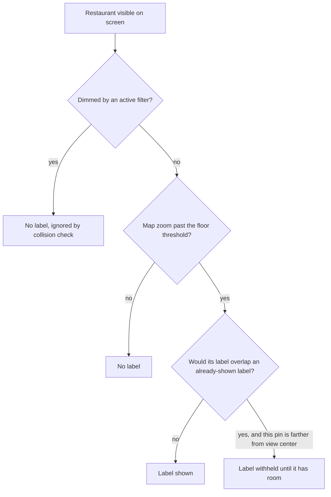

# Restaurant Names on the Map - Plan

## Goal Capsule

- **Objective:** A user browsing a wide view of the map can identify restaurants by name at a glance, without tapping each pin one at a time, once there's enough room on screen to show them.
- **Product authority:** The Product Contract below is authoritative for user-facing behavior. No open product blocker remains.
- **Open blockers:** None — all origin questions are resolved below as Key Decisions.

## Product Contract

### Summary

Restaurant names appear directly on the map once there's room to show them, prioritizing pins near the center of the current view and skipping names that would overlap already-shown ones — the same label-density feel as Google Maps' place labels. Filtered-out (dimmed) restaurants stay unlabeled and don't compete for label space.

### Problem Frame

Today the map (`src/features/map/MapView.tsx`) shows only colored teardrop pins with no visible text; a restaurant's name only appears inside its popup after tapping the pin (`MapView.tsx:126-130`). That's fine when looking at one restaurant up close, but a wide view of a city or neighborhood is hard to read — every pin looks the same until tapped through one by one.

### Requirements

- R1. Once the map is zoomed past a floor threshold, each visible, non-dimmed restaurant's name becomes eligible to display as a label attached to its pin.
- R2. Below that floor threshold, no restaurant names show as map labels, regardless of how much visual space is available.
- R3. When two or more eligible labels would visually overlap, the label for whichever pin is closer to the center of the current map view is shown and the other is withheld; a withheld label reappears once further zooming or panning gives it room without overlapping a currently shown label.
- R4. Dimmed/filtered-out restaurants (per the active facet filters) never display a name label, and do not count as occupying space when deciding whether a nearby non-dimmed restaurant's label fits.
- R5. There is no user-facing setting to turn map name labels on or off — the behavior in R1-R4 is always active once the zoom floor is reached.

**Key Flows omitted:** this is a continuous rendering rule that holds at every zoom/pan/filter state rather than a discrete multi-step interaction — the diagram above plus R1-R4 and the Acceptance Examples below fully describe the behavior without a separate flow.

### Key Decisions

- **Dynamic, collision-based decluttering instead of a fixed always-on-past-threshold display.** Governs R1, R3. Avoids overlapping names in dense clusters, at the cost of some labels only appearing once zoomed in further. (session-settled: user-directed — chosen over a simple fixed-zoom cutoff that shows all visible names regardless of overlap: compared side-by-side in a visual sketch, user preferred no overlapping text)
- **A zoom floor exists below which no labels ever show.** Governs R2. Keeps a dezoomed regional/city-wide view free of label clutter even where a restaurant happens to sit in isolation with room to spare. The exact zoom value is left to planning (see Outstanding Questions). (session-settled: user-directed — chosen over letting available space alone decide, with no floor)
- **Label priority goes to whichever pin is closest to the center of the current view.** Governs R3. (session-settled: user-directed — chosen over prioritizing by restaurant status, or an arbitrary/stable order)
- **Dimmed/filtered restaurants never get a name label.** Governs R4. (session-settled: user-directed — chosen over showing labels for all visible restaurants regardless of active filters, since dimmed restaurants are already visually secondary)
- **Dimmed/filtered restaurants also don't occupy label space in the collision calculation.** Governs R4. Keeps a filtered-out restaurant from silently blocking a neighboring active restaurant's label. (session-settled: user-approved — surfaced as a call-out during scoping, user confirmed as proposed)
- **No Settings toggle to disable map labels.** Governs R5. Keeps the feature simple with no new control surface, and matches Google Maps' own lack of such a switch; can be revisited later if it proves too busy in practice. (session-settled: user-directed — chosen over adding an on/off switch to the existing Settings panel)

### Acceptance Examples

- AE1. **Covers R1, R2.** **Given** the map is zoomed below the floor threshold, **When** restaurants are visible on screen, **Then** none of them show a name label.
- AE2. **Covers R1, R3.** **Given** the map is zoomed past the floor threshold with two restaurants far enough apart that their labels wouldn't overlap, **When** both are visible, **Then** both display their name label.
- AE3. **Covers R3.** **Given** two restaurants close enough that their labels would overlap, **When** the map is at a zoom level where only one label fits, **Then** the label is shown for whichever restaurant's pin is closer to the center of the current view, and the other pin shows no label.
- AE4. **Covers R3.** **Given** a restaurant's label was withheld due to overlap, **When** the user zooms in further so the overlap resolves, **Then** its label appears.
- AE5. **Covers R4.** **Given** a restaurant is dimmed by an active facet filter, **When** the map is zoomed past the floor threshold, **Then** that restaurant never shows a name label, even if there would otherwise be room.
- AE6. **Covers R4.** **Given** a dimmed restaurant sits close to a non-dimmed restaurant, **When** there's only room for one label between them, **Then** the non-dimmed restaurant's label is shown, unaffected by the dimmed one's presence.

### Scope Boundaries

- No user-facing setting to enable or disable map name labels (R5) — the behavior is always on past the zoom floor.
- Exact zoom floor value and the visual styling of a label (offset from pin, background, font, truncation for long names) are left to planning and implementation, not fixed here.

### Dependencies / Assumptions

- Assumes the currently selected/tapped restaurant's on-map label follows the same priority and collision rules as any other restaurant — there is no forced always-on label for the current selection. Its name remains available via the existing tap popup regardless of whether its on-map label is currently shown. If this feels wrong in practice (e.g., a selected pin's name still doesn't show because of collision), it can be revisited.
- Assumes the restaurant count and marker density in normal use is small enough (a personal saved-places list, not a dense city-wide POI dataset) that a straightforward per-frame collision check is workable; no requirement here depends on a specific performance target.

### Outstanding Questions

- OQ1. **Deferred to Planning.** The exact zoom floor value (R2) and the collision-detection approach (bounding-box sizing, padding, font-size assumptions) are unresolved — to be chosen and tuned during implementation.

### Sources / Research

- `src/features/map/MapView.tsx` — Leaflet/`react-leaflet` map component; pin rendering (`iconForColor`, lines 12-30, 118-132); existing `useMap` zoom-event subscription pattern in `CenterReporter` (lines 51-70) as precedent for hooking a zoom listener; current name display is popup-only (lines 126-130).
- `src/features/map/markers.ts` — `MapMarker` type and `toMarkers()` (lines 6-16, 22-37): `name`, `dimmed`, `lat`/`lng` are already present on every marker, so no new data plumbing is needed.
- `src/types/models.ts:53-69` — `Restaurant` interface; `name` is a direct field.
- No clustering library, zoom-based rendering, or label/collision logic exists anywhere in the codebase today — this is new behavior built from scratch.
