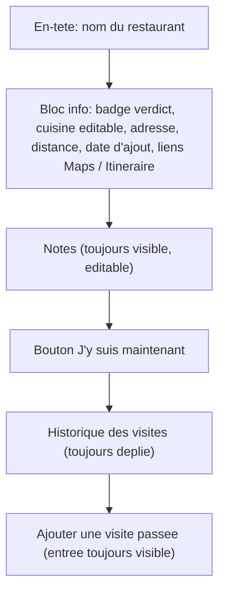

# Restaurant Modal Redesign - Plan

## Goal Capsule

- **Objective:** Opening a restaurant's detail view surfaces its identity, location, and personal notes as one clearly grouped block, shows how it was added and how far it is when that data exists, and keeps the check-in action and visit history each legible on their own — instead of parsing an undifferentiated stack of fields.
- **Means:** Rebuild `RestaurantDetail.tsx` around one info block (identity + location + Maps links), an always-visible notes field, the check-in action, and an always-expanded visit history — reusing the app's existing distance, Maps-link, and cuisine-edit mechanisms, and adding UI for the `Restaurant.note` field and a new creation-date field that don't exist today.
- **Product authority:** The Product Contract below is authoritative for user-facing behavior. No open product blocker remains.
- **Execution profile:** Standard software feature work; scoped to one modal component.
- **Open blockers:** None. The exact mechanics of the new creation-date field (naming, migration) are a planning decision — see Dependencies / Assumptions.

---

## Product Contract

### Summary

Rebuild the restaurant detail modal around one info block (verdict, cuisine — editable in place —, address, distance and added date when available, the existing Google Maps / Go-to links), followed by an always-visible restaurant-level notes field, the check-in button, and a visit-history list that stays fully expanded and ends in an always-visible "add a past visit" entry — replacing today's flat, undifferentiated stack of fields.

### Problem Frame

`RestaurantDetail.tsx` (`src/features/visits/RestaurantDetail.tsx:82-203`) renders eight elements in a flat vertical stack with no visual grouping: a status+address line, conditional Maps/Go-to links, an editable cuisine input, the check-in button, the visit list, and a collapsed "add a past visit" disclosure — each gets its own margin but nothing distinguishes "who/where this place is," "editable personal detail," and "visit history" as separate zones. Two fields the data model already carries — `Restaurant.note` and `Visit.note` (`src/types/models.ts:62,76`) — have never gotten UI. Distance-from-current-position, already computed for the main list (`src/lib/geo.ts`, used at `src/features/RestaurantList.tsx:60-63`), isn't threaded into this modal. And nothing records when a restaurant was added, so there's no way to show that either.

### Requirements

**Nouveau contenu**

- R1. The modal shows a free-text notes field for the restaurant as a whole (backed by the existing `Restaurant.note` field), editable in place and saved the same way the existing cuisine field already saves (on blur/Enter).
- R2. When the device's current position is available and the restaurant has resolved coordinates, the modal shows the distance between them, formatted the same way the main list already formats it.
- R3. When a restaurant has a recorded creation date, the modal shows it; a restaurant with no recorded creation date shows no added-date line at all.

**Disposition**

- R4. The modal groups the restaurant's identity and location detail into one visually distinct info block: name, status/verdict badge, cuisine (tap to edit in place), address, distance (R2), added date (R3), and the existing Google Maps / Go-to action links.
- R5. The notes field (R1) renders immediately below the info block, always visible, never behind a disclosure toggle.
- R6. The check-in ("I'm here now") flow keeps its current behavior, positioned below the notes field.
- R7. The visit history renders as a chronological, always-expanded list — never collapsed behind a disclosure — with each entry showing its verdict and date as today.
- R8. Adding a past visit is reachable as an always-visible entry at the end of the visit history, not behind a collapsed disclosure as today; tapping it reveals the date input and verdict buttons the same way the current disclosure does.

### Key Decisions

- **The notes field is restaurant-level only, not per-visit** (session-settled: user-directed — chosen over a per-visit note or both, keeping the visit-logging flow simple). Governs R1.
- **A restaurant with no recorded creation date shows no added-date line, rather than an approximate or backfilled one** (session-settled: user-directed — chosen over a generic "added before [ship date]" label or reusing the existing `updated` timestamp as an approximation; no creation timestamp exists anywhere today, locally or on the PocketBase remote, so any displayed value for a pre-existing restaurant would be fabricated). Governs R3.
- **Layout direction: one info block, always-visible notes, and an always-expanded visit history, chosen after comparing three sketched directions** (session-settled: user-directed — chosen over (a) condensing the info into an icon-only meta strip with the visit history collapsed by default, and (b) a minimal reorganization keeping today's structure and only grouping cuisine+notes into one editable block). Governs R4, R5, R7, R8.
- **Cuisine stays editable in place, directly inside the info block's text, rather than through a separate "edit" control or a standalone field below the block** (session-settled: user-directed — chosen over a small adjacent "edit" affordance and over keeping cuisine as its own field outside the info block). Governs R4.

### Scope Boundaries

- Per-visit comments are out of scope: `Visit.note` (`src/types/models.ts:76`) stays unbuilt in this pass — only the restaurant-level note gets UI (R1).
- No approximate or backfilled added-date for restaurants that exist before this ships (R3).
- Limited to `RestaurantDetail.tsx` and its direct data plumbing; the shared `Modal`/`ModalHeader` chrome, the other modals (Add a place, "Où manger ?", Settings), and the main list/map screens are unchanged.
- No new design tokens, colors, or typography — the redesign uses the app's existing "Carnet culinaire" tokens.

### Acceptance Examples

- AE1. **Given** a restaurant with an existing note, **when** the modal opens, **then** the notes field shows that text and is editable in place. **Covers R1.**
- AE2. **Given** the device's position is known and the restaurant has resolved coordinates, **when** the modal opens, **then** the info block shows the distance between them. **Covers R2.**
- AE3. **Given** the device's position is unavailable, or the restaurant is a pending/provisional record with no resolved coordinates, **when** the modal opens, **then** no distance line renders. **Covers R2.**
- AE4. **Given** a restaurant created after this feature ships, **when** the modal opens, **then** the info block shows its added date. **Covers R3.**
- AE5. **Given** a restaurant that already existed before this feature shipped, **when** the modal opens, **then** no added-date line renders. **Covers R3.**
- AE6. **Given** a restaurant with past visits, **when** the modal opens, **then** the visit history is fully visible with nothing to expand, and "add a past visit" appears as its own always-visible entry at the end of that history. **Covers R7, R8.**

### Success Criteria

- Without reading every line, a person can tell apart the restaurant's identity/location, its editable notes, the check-in action, and the visit history as distinct zones of the modal.
- Every field the modal shows today (name, status, address, cuisine, Maps/Go-to links, check-in, visit history, add-past-visit) is still present and usable after the redesign — nothing is dropped, only regrouped.

### Dependencies / Assumptions

- Assumes a new creation-timestamp field is added to the `Restaurant` record end-to-end (local type, IndexedDB, sync mapper, PocketBase migration) to support R3 — no such field, or any other source of a true creation timestamp, exists anywhere today (verified against `src/types/models.ts`, `src/sync/mappers.ts`, and `pocketbase/pb_migrations/1718200000_init_collections.js`). Exact field name and migration mechanics are a planning decision.
- Assumes distance (R2) reuses the existing `haversineMeters`/`formatDistance` helpers in `src/lib/geo.ts` and the `currentPosition` state already computed once on load in `src/App.tsx:35` (via `geolocate()`), threaded down as a new prop to `RestaurantDetail` — today it is invoked with only `restaurantId`/`onClose` (`src/App.tsx:228`) — the same pattern already used for `RestaurantList` and the map view.
- Assumes the existing Google Maps / Go-to links (`src/lib/mapsLinks.ts`, used at `src/features/visits/RestaurantDetail.tsx:55-61`) and the existing cuisine save-on-blur mechanism carry over unchanged in behavior, only relocated into the new info block.

### Sources / Research

- `src/features/visits/RestaurantDetail.tsx:82-203` — the modal being redesigned; current render order and behavior.
- `src/types/models.ts:53-77` — `Restaurant` and `Visit` types; both already carry an unused `note?: string` (lines 62, 76); no creation-timestamp field exists on either.
- `src/sync/mappers.ts`, `pocketbase/pb_migrations/1718200000_init_collections.js` — confirm no `created`/`createdAt` field exists locally or remotely; only `updated`/`syncedAt` (bumped on every edit).
- `src/lib/geo.ts`, `src/features/RestaurantList.tsx:60-63` — existing distance computation and formatting, the pattern R2 reuses.
- `src/App.tsx:35,68,146,161,228` — `currentPosition` state and where it is, and isn't yet, threaded.
- `src/lib/mapsLinks.ts` — existing Google Maps / Go-to link helpers, reused unchanged.
- `CONCEPTS.md` — already documents the Restaurant record as carrying "an optional cuisine and note," anchoring the restaurant-level note as the intended UI target (R1).
- `docs/plans/2026-08-29-2243-feat-filters-cards-refresh-plan.md` (R12) — the prior visual-refresh pass explicitly left this modal's visit-history pill treatment untouched, confirming it hasn't yet received the "Carnet culinaire" layout pass scoped here.
- Visual sketch comparison (three layout directions) conducted during this brainstorm; the user selected the "info block + always-visible notes + always-expanded history" direction over the other two.
