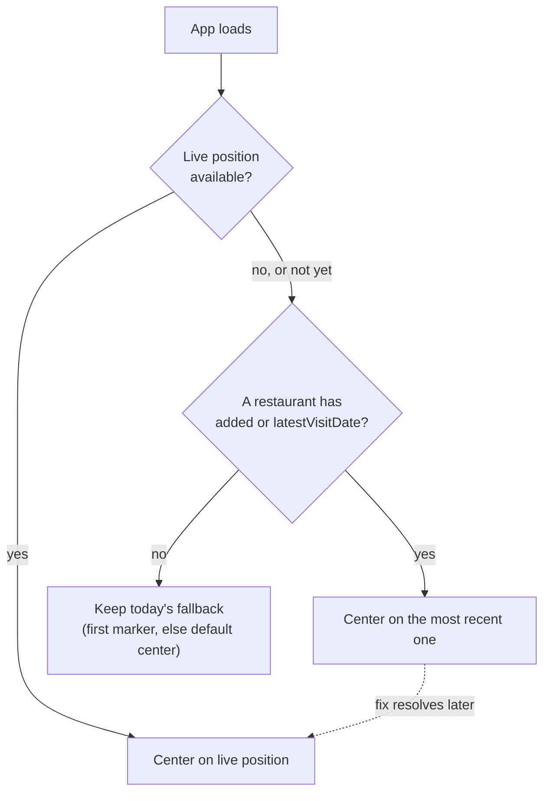

# Map Load Centering - Plan

## Goal Capsule

- **Objective:** Opening the app lands the map somewhere relevant to the user — their live position, or otherwise the restaurant they most recently added or visited — instead of an arbitrary first-in-list pin.
- **Means:** A priority chain evaluated once per app load: live device position, then the restaurant with the more recent of its `added` timestamp or `latestVisitDate`, then today's existing fallback (first marker, else the default city center).
- **Product authority:** The Product Contract below is authoritative for user-facing behavior. No open product blocker remains.
- **Execution profile:** Standard software feature work, `execution: code`.

---

## Product Contract

### Summary

On app load, the map centers on the device's live position when a fix is available. Otherwise it centers on the restaurant most recently added or visited. When neither signal exists, the map falls back to today's default centering, unchanged.

### Problem Frame

Today the map's initial center is whichever restaurant happens to be first in the unfiltered list (`markers[0]` in `src/features/map/MapView.tsx`), or the default city center when the list is empty — an arbitrary choice with no relation to the user or their recent activity. The app already fetches the device's live position on load (`src/App.tsx`'s on-mount `geolocate()` call) to place a "you are here" marker, but nothing today uses that fix, or any notion of recency, to decide where the map itself opens.

### Requirements

- R1. On app load, when a device location fix becomes available, the map centers on that position.
- R2. When no live position is available, the map instead centers on the restaurant with the more recent of its `added` timestamp or `latestVisitDate`, considered only among restaurants with resolved coordinates.
- R3. The fallback restaurant (R2) is shown as soon as it's known, without waiting for the location fix; if a fix arrives afterward, the map re-centers onto it. This centering runs once per app load.
- R4. When no restaurant has an `added` timestamp or a visit, the map keeps today's existing fallback (first marker, else the default city center), unchanged.
- R5. The restaurant chosen under R2 is picked from all restaurants, independent of any active list filter.
- R6. The "Localiser" button's tap-to-recenter behavior and the "Où manger ?" flow's pannable anchor are unaffected by this feature.

### Key Decisions

- **Show the fallback restaurant immediately, then snap to the live position once it resolves** (session-settled: user-directed — chosen over waiting for geolocation to settle before centering anything: matches the existing pattern of surfacing the "you are here" marker with no loading indicator, and avoids delaying the map on every load). Governs R3.
- **"Added or visited" reuses the existing `added` timestamp and `latestVisitDate` rollup as-is**, rather than introducing a new recency concept — both fields already exist on `Restaurant` (`src/types/models.ts`) for exactly this kind of ranking. Governs R2.

### Key Flows

- F1. Initial map centering
  - **Trigger:** The app mounts (page load or reload).
  - **Steps:** The app requests the device's location once. Independently, and without waiting on that fetch, it determines which restaurant with resolved coordinates has the more recent of its `added` timestamp or `latestVisitDate`. The map centers on that restaurant as soon as it's known. If the location fix resolves afterward, the map re-centers onto it. If no restaurant qualifies, the map keeps today's fallback centering.
  - **Covers:** R1, R2, R3, R4, R5

### Acceptance Examples

- AE1. **Covers R1.** Given the user opens the app and a location fix arrives, when the map has finished its initial render, then it is centered on that position.
- AE2. **Covers R2, R5.** Given no fix is available and the restaurant list is filtered to a subset, when the app loads, then the map centers on the most-recently-added-or-visited restaurant across *all* restaurants, not just the filtered ones.
- AE3. **Covers R3.** Given no fix is available yet when restaurants first load, when the fallback restaurant is shown, then a fix arriving moments later re-centers the map onto it instead of leaving it on the fallback.
- AE4. **Covers R4.** Given no restaurant has an `added` timestamp or a visit, when the app loads with no location fix, then the map centers exactly as it does today (first marker, else the default city center).
- AE5. **Covers R6.** Given the map is already centered per R1 or R2, when the user taps "Localiser," then it recenters and refreshes the current-position marker exactly as it does today, independent of this feature.

### Scope Boundaries

- Outside this scope: the "Localiser" button and the "Où manger ?" flow's anchor (R6) — both keep their current behavior untouched.
- Outside this scope: the restaurant list's sort order — this feature changes only where the map opens, not how the list is ordered.
- Deferred: backfilling an `added` timestamp for restaurants created before that field existed — not needed, since R4 already covers restaurants with no recency signal.

### Dependencies / Assumptions

- Reuses `Restaurant.added` and `Restaurant.latestVisitDate` (`src/types/models.ts`) as they exist today — no schema change needed.
- Reuses `geolocate()` (`src/lib/geolocate.ts`), which already resolves within a bounded timeout and never rejects, and the existing `currentPosition` state and its on-mount fetch in `src/App.tsx`.
- Assumes the restaurant list's facet filter is genuinely irrelevant at load time (it resets to empty on every reload), so R5's "all restaurants, not just filtered" only guards against that assumption changing later.

### Outstanding Questions

- **Deferred to Planning:** `added` is a full timestamp while `latestVisitDate` is a date only (no time of day), so a restaurant added earlier today and a different restaurant visited today are not directly comparable at full precision. Planning should pick one consistent comparison rule (e.g., treat a visit date as end-of-day) rather than leaving the tie-break to whatever a naive string/date comparison happens to produce.

### Sources / Research

- `src/features/map/MapView.tsx:53,93-115,141-151` — today's initial `center` is `markers[0]` or `DEFAULT_CENTER`; `Recenter` recenters once when markers first go from empty to non-empty.
- `src/App.tsx:31-71` — `currentPosition` state, fed by an on-mount `geolocate()` call (no loading indicator) and by the "Localiser" tap; `filter` starts at `emptyFilter()` on every mount, with no persistence.
- `src/types/models.ts:63-73` — `Restaurant.added` (stamped once at creation, never backfilled) and `Restaurant.latestVisitDate` (denormalized rollup from visits).
- `src/lib/geolocate.ts:13-26` — `geolocate()` resolves a fix or `null` within a bounded timeout, never rejects.
- `docs/plans/2026-08-30-1320-feat-current-position-list-distance-plan.md` — the prior plan that introduced `currentPosition`; it explicitly left the map's initial centering untouched (only the "you are here" marker and list distances), which is the gap this plan fills.
