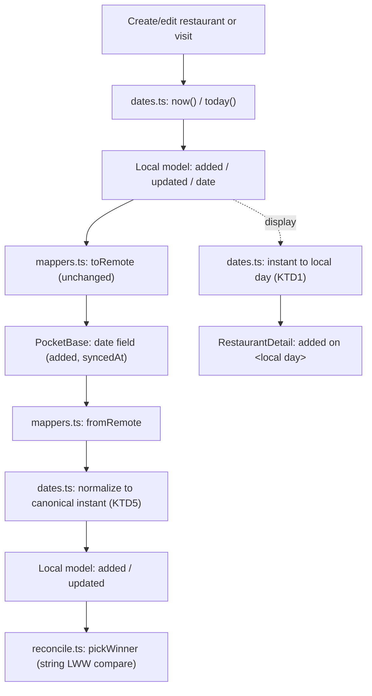

# Date/Time Uniformization - Plan

## Goal Capsule

- **Objective:** Every date/time value in the app is either a real UTC instant or a local calendar day, never ambiguously both, and comparing or displaying one against the other always goes through a documented, correct conversion — so a bug like the map-centering plan's KTD2 naive `T23:59:59.999Z` suffix (and this plan's display-side twin) can't recur.
- **Means:** A shared client-side date utility module for instant ↔ local-day conversions and comparisons, plus a breaking PocketBase schema migration that types genuine instant fields (`added`, `syncedAt`) as PocketBase's native `date` field and keeps genuine local-calendar-day fields (`visit.date`, `latestVisitDate`) as plain `text` (`YYYY-MM-DD`).
- **Product authority:** This Product Contract is authoritative for the resulting date/time conventions and PocketBase schema shape. No open product blocker remains.
- **Execution profile:** Standard software refactor/infrastructure work, `execution: code`.
- **Open blockers:** None.
- **Product Contract preservation:** restructured, no scope change — R5's migration *technique* (in-place field-type change vs. collection recreate) moved to KTD3; R5's product-level commitment (native `date` type for the three instant fields, no data-preservation guarantee) is unchanged. AE3, the Scope Boundaries data bullet, and the Dependencies resync bullet were reworded to match. The prior Outstanding Question is resolved by KTD4.

---

## Product Contract

### Summary

Establish one documented convention distinguishing real UTC instants from local-calendar-day values, backed by a shared date utility module and a breaking PocketBase schema migration that gives instant fields their own native type while calendar-day fields stay plain text. This replaces every naive mix of the two — including the reviewer-flagged map-centering comparison bug and a matching display bug — scoped to these foundations only; the in-flight `feat/map-load-centering` branch adopts the new comparison rule separately, later.

### Problem Frame

A PR review on the unmerged `feat/map-load-centering` branch (commit `f94a933`) flagged that its planned `pickMostRecentRestaurantCenter` comparison key treats `Restaurant.latestVisitDate` (a local-calendar-day string) as `<date>T23:59:59.999Z` before comparing it lexicographically against `Restaurant.added` (a real UTC instant). That's wrong for anyone west of UTC: a real UTC instant late in the evening can misjudge which candidate is actually more recent in the user's own local day.

The root cause isn't local to that one comparison. Nothing in the codebase names which date-ish fields are true instants and which are bare local calendar days, so each call site invents its own conversion. `RestaurantDetail.tsx` has the same class of bug on the display side: it shows a restaurant's `added` date by slicing the raw ISO instant string to its first 10 characters, which is the instant's *UTC* calendar day, not the viewer's local one. Underneath, every date-ish PocketBase column (`added`, `syncedAt` on both collections, `date`, `latestVisitDate`) is typed as plain `text`, so the schema itself carries no signal for which kind of value a field holds.

### Key Decisions

- **Two field natures, not one.** Real instants (`added`, `syncedAt`) and real local-calendar-days (`visit.date`, `latestVisitDate`) stay distinct kinds of value, rather than converting everything — including visit dates — into timestamps. (session-settled: user-directed — chosen over making every date a timestamp with an invented time-of-day: visits keep a date-only input, so a stored value would need a fabricated time with no product meaning.) Governs R1, R2, R4.
- **PocketBase reset, not a data migration.** The schema migration carries no obligation to preserve existing row data and writes no data-migration/backfill script. (session-settled: user-directed — chosen over writing a data-migration script: the local PocketBase instance holds only the developer's own personal dev data.) Governs R5.
- **Scoped to foundations; `feat/map-load-centering` adopts separately.** This plan builds the shared utility and the schema migration only; it does not touch `pickMostRecentRestaurantCenter` or anything else on that branch. (session-settled: user-directed — chosen over fixing that branch's comparison as part of this work: keeps this plan self-contained and lets the map branch pick up the new utility whenever it next merges.) Governs Scope Boundaries.
- **The display bug rides along.** `RestaurantDetail.tsx`'s UTC-slice-for-display bug shares the same root cause — an instant read as if it were already a local calendar day — and is fixed here rather than deferred as a separate ticket. Governs R3.
- **Portability validation gets tightened too.** `src/sync/portability/schema.ts` currently accepts any string for `date`/`latestVisitDate`/`added` and any parseable string for `updated` (`syncedAt` is a remote-only field name and never reaches this file); validation is tightened to match the new conventions as part of this work. Governs R6.

### Requirements

**Shared date conventions**
- R1. A single shared client-side module provides the conversion/comparison primitives the app uses at any local-day ↔ instant boundary: the current local calendar day, the current UTC instant, a local calendar day's correct UTC instant range in the device's current timezone, and an instant's correct local calendar day for display.
- R2. Every existing call site that reads, formats, or compares a date/instant value by conflating the two — the UTC-slice display in `RestaurantDetail.tsx`, and any other site the implementation turns up — is rewritten to use R1's module instead of a hand-rolled conversion.

**Display correctness**
- R3. A restaurant's "added on" date, wherever shown to the user, reflects the viewer's local calendar day for that instant, not the instant's UTC calendar day.

**Comparison correctness**
- R4. Nothing in the app compares a local-calendar-day value against an instant value by assuming a fixed UTC end-of-day suffix; any such comparison first resolves the local day to its correct instant range in the device's current timezone, per R1.

**PocketBase schema**
- R5. The PocketBase schema for `restaurants.added`, `restaurants.syncedAt`, and `visits.syncedAt` uses PocketBase's native `date` field type; `visits.date` and `restaurants.latestVisitDate` stay `text` in the `YYYY-MM-DD` shape. The migration carries no obligation to preserve the local PocketBase instance's existing row data and writes no data-migration script.
- R6. `src/sync/portability/schema.ts`'s import/export validation checks that `added`/`updated` values are real ISO instants and that `date`/`latestVisitDate` values match the `YYYY-MM-DD` shape, instead of accepting any parseable-or-plain string.

The schema change in R5:

| Field | Collection | Current type | New type |
|---|---|---|---|
| `added` | restaurants | `text` | `date` |
| `syncedAt` | restaurants | `text` | `date` |
| `syncedAt` | visits | `text` | `date` |
| `date` | visits | `text` | `text` (unchanged) |
| `latestVisitDate` | restaurants | `text` | `text` (unchanged) |

### Acceptance Examples

- AE1. **Covers R3.** Given a restaurant added at `2026-08-30T23:30:00Z` and a viewer in UTC-5 (local calendar day still 2026-08-30 at that instant), when the "added on" date renders, then it shows 2026-08-30, not 2026-08-31.
- AE2. **Covers R4.** Given restaurant X with `latestVisitDate` "2026-08-30" and restaurant Y with `added` "2026-08-30T23:00:00Z", when a device in UTC-5 ranks recency, then X (whose local day 2026-08-30 extends to `2026-08-31T05:00:00Z` in UTC) outranks Y — the opposite of what the naive UTC end-of-day suffix would produce.
- AE3. **Covers R5.** Given the PocketBase migration runs, when the `restaurants`/`visits` collections are inspected afterward, then `added` and `syncedAt` are `date`-typed fields and `date`/`latestVisitDate` remain `text` — with no requirement that pre-migration rows be preserved or validated.
- AE4. **Covers R6.** Given an exported JSON record with `date: "not-a-date"`, when import validation runs, then the record is rejected instead of silently accepted.

### Scope Boundaries

- Fixing `feat/map-load-centering`'s `pickMostRecentRestaurantCenter` to use the new comparison primitive — deferred to that branch, whenever it next merges.
- Adding time-of-day capture to visit logging — visits keep a date-only input; this plan only fixes how existing date-only and instant values are represented and compared.
- Migrating or preserving the local PocketBase instance's existing data — no data-migration script is written and no preservation is guaranteed.

### Dependencies / Assumptions

- Because IndexedDB is the canonical local store and PocketBase is a sync mirror (`docs/solutions/architecture-patterns/local-first-lww-sync-indexeddb-pocketbase.md`), the migration doesn't touch any device's local data; the next sync reconciles local records against whatever exists remotely afterward via the existing upsert-falls-through-to-create-on-404 behavior, regardless of the fact that the field-type change resets every pre-existing row's value for the three migrated fields (verified — see KTD3).
- Field *names* (`added`, `syncedAt`, `date`, `latestVisitDate`) are unchanged; only the PocketBase field *type* changes for the three instant fields in R5.
- Existing tests asserting exact string shapes for these fields (`src/features/visits/RestaurantDetail.test.tsx`, `src/sync/portability/export.test.ts`) will need updates to match; not enumerated individually since they follow mechanically from R1-R6.

### Sources / Research

- `src/data/visits.ts:18-25` — `today()`: local calendar day, explicitly not the UTC slice of `now()`.
- `src/data/ids.ts:15-17` — `now()`: `new Date().toISOString()`, a real UTC instant.
- `src/types/models.ts:38-51,63-82` — `SyncFields.updated`, `Restaurant.added`, `Restaurant.latestVisitDate`, `Visit.date`.
- `src/data/rollup.ts:11-23` — `latestVisitDate` comparison is safe today (both sides `YYYY-MM-DD`); the bug is specifically the added-vs-visited comparison, not this one.
- `src/features/visits/RestaurantDetail.tsx:153` — the display-side UTC-slice bug: `restaurant.added.slice(0, 10)`.
- `src/sync/portability/schema.ts:60-63,86-88,115-116` — `isValidTimestamp`, and the un-shape-checked `date`/`latestVisitDate` validation.
- `pocketbase/pb_migrations/1718200000_init_collections.js` and `pocketbase/pb_migrations/1735689600_add_restaurant_added_field.js` — every date-ish PocketBase field currently typed `text`.
- `docs/solutions/architecture-patterns/local-first-lww-sync-indexeddb-pocketbase.md` — why `syncedAt` is a custom field distinct from PocketBase's reserved `updated` autodate column; confirmed (KTD4) to still hold once `syncedAt`'s type changes.
- `docs/plans/2026-08-30-1932-feat-map-load-centering-plan.md` (KTD2, branch `feat/map-load-centering`, commit `f94a933`) — the review comment that triggered this plan.
- PocketBase binary in this repo: `pocketbase/pocketbase --version` → `0.39.3`.
- `src/sync/reconcile.ts` (`pickWinner`) and `src/sync/mappers.ts` (`restaurantFromRemote`/`visitFromRemote`) — the LWW string comparison and the remote-to-local field mapping that KTD5's normalization protects.
- PocketBase source (`core/field_date.go`, `core/field_autodate.go`, `tools/types/datetime.go` in `pocketbase/pocketbase`) and official docs (`pocketbase.io/docs/collections/`, `pocketbase.io/docs/js-migrations/`) — confirms `DateField` has no create/update interceptor (KTD4), and that `DateTime.String()`/`MarshalJSON()` always re-serialize to a space-separated `Y-m-d H:i:s.uZ` format regardless of the input format (KTD5).
- Empirical verification during document review, against the installed PocketBase 0.39.3 binary in a disposable scratch data directory (not the developer's real dev instance): (1) a raw `T`-separated value written to a migrated `date` field reads back space-separated (`"2026-08-30T15:30:45.123Z"` → `"2026-08-30 15:30:45.123Z"`), confirming KTD5's premise; (2) removing a `text` field named `added` and re-adding a `date` field under the same name changes the field's id (`text3418329323` → `date3418329323`), and PocketBase's collection-save validation rejects reusing the old id under the new type (`Field type cannot be changed`) if attempted directly — refuting KTD3's original "id is derived from name alone" claim and confirming the swap always resets every row's value for that field, not only malformed ones.

---

## Planning Contract

### Key Technical Decisions

- KTD1. **A new `src/lib/dates.ts` module consolidates the app's instant/local-day primitives, under names matching `geo.ts`/`mapsLinks.ts`'s verb-first convention:** `now()` and `today()` (absorbed unchanged from `src/data/ids.ts` and `src/data/visits.ts`'s private implementation), `localDayToInstantRange(day)` (a local calendar day's correct UTC instant range in the device's current timezone), `instantToLocalDay(instant)` (an instant's correct local calendar day for display), `normalizeInstant(value)` (re-serializes any parseable instant string into the app's canonical `toISOString()` shape), and `isLocalDay(value)` (validates the `YYYY-MM-DD` shape, shared with R6's portability validation). No date library is installed or needed. Governs R1, R2, R3, R4, R6.
- KTD2. **`localDayToInstantRange` uses native `Date` constructed in local time** (year/month/day passed to the local `Date` constructor, not manual UTC-offset arithmetic), so the runtime's own timezone resolution does the work. This is the direct implementation of the review comment's requested fix — interpreting the date as local time before converting it to a comparable instant. Governs R1, R4.
- KTD3. **The PocketBase migration changes `restaurants.added`, `restaurants.syncedAt`, and `visits.syncedAt` field-by-field** — removing each `text` field and re-adding it as a `date` field with the same name — rather than dropping and recreating the collections, mirroring the incremental style already established by `pocketbase/pb_migrations/1735689600_add_restaurant_added_field.js`. (session-settled: user-approved — chosen over a full collection drop/recreate: it needs no new collection ids anywhere else in the schema and avoids re-declaring the collections' rules and indexes.) **Verified empirically (scratch PocketBase 0.39.3 instance, not the dev database) that this is not a data-preserving in-place edit: a field's id is derived from its *type and name together* (`text3418329323` → `date3418329323` for the same field name across the swap), and PocketBase's collection-save validation explicitly refuses to reuse the old id under a new type (`Field type cannot be changed`). So remove-then-re-add is PocketBase's only available technique for a field-type change, and it resets every existing row's value for that field to empty — not only rows with a malformed value.** This is fully covered by R5's decision not to preserve existing data: it's a complete reset of these three fields' values on every row, not a selective one, so no pre-migration inspection of the dev database's current values changes the outcome. The down-migration reverses the field *type* only, back to an empty `text` column; it does not and cannot restore whatever value existed before the up-migration ran. Governs R5.
- KTD4. **PocketBase's `date` field type is fully client-settable, distinct from its `autodate` field type.** Confirmed against the installed PocketBase 0.39.3's own type definitions and Go source: `DateField` carries no create/update interceptor, while `AutodateField` does (that's what makes an autodate column backend-managed). Moving `syncedAt` to `date` does not turn it into a PocketBase-managed timestamp, so the constraint in `docs/solutions/architecture-patterns/local-first-lww-sync-indexeddb-pocketbase.md` (never let the backend auto-manage the LWW key) still holds after the migration. Resolves the Product Contract's prior open question. Governs R5.
- KTD5. **`restaurantFromRemote`/`visitFromRemote` normalize `added`/`syncedAt` through `dates.ts`'s canonical-instant normalizer before assigning them to the local model.** PocketBase's `date` field always returns its own space-separated format on read (`"2026-08-30 10:00:00.000Z"`), never the app's `T`-separated `toISOString()` shape. Left unhandled, a value that round-tripped through PocketBase once would sort incorrectly against a freshly-generated local timestamp in `reconcile.ts`'s string-based LWW comparison — a space character sorts before `T`, so a genuinely newer edit could be silently discarded. Discovered during PocketBase documentation research; not anticipated by the original Product Contract. Governs R2, R5.

### Assumptions

- Every existing `added`/`syncedAt` value in the local PocketBase instance — well-formed or not — is reset to empty by U3's migration (verified in KTD3: PocketBase cannot preserve a field's id across a type change, so remove-then-re-add is a full reset, not a selective one). No pre-migration inspection of existing values changes this outcome; it's fully covered by R5's no-data-preservation guarantee.
- `src/features/portability/PortabilityPanel.tsx`'s export filename (`exportedAt.slice(0, 10)`) stays untouched: it's a UTC-dated filename stamp, not a claim about the viewer's local day, so it falls outside R2/R3's display-correctness scope.
- `src/data/rollup.ts`'s and `src/data/visits.ts`'s existing same-format `Visit.date` string comparisons stay as they are — both sides are already `YYYY-MM-DD`, so they're correct today and need no `dates.ts` involvement.
- No PocketBase query in this codebase filters by `added`/`syncedAt`/`date` (`syncEngine.ts` calls `getFullList()` with no filter argument), so PocketBase's documented restriction on `T`-delimited values in filter expressions has no current call site to worry about.
- `localDayToInstantRange`/`instantToLocalDay` (KTD1, KTD2) resolve a local-calendar-day string using the *reading* device's current timezone, not the timezone in effect when that day was originally recorded — a traveling user or a value read on a second device could see a visit's resolved calendar day shift relative to how it looked when logged. This matches `rollup.ts`'s existing string-comparison behavior today and is an accepted simplification, not new scope.

### System-Wide Impact

- **Sync engine LWW invariant.** `reconcile.ts`'s `pickWinner` is the single choke point for every synced field's conflict resolution. It stays backend-agnostic and untouched by this plan; KTD5's normalization keeps its string-comparison invariant true for `added`/`syncedAt` by fixing the format at the boundary where PocketBase-specific values enter, not inside the reconciliation logic itself.
- **Single sync funnel.** `restaurantFromRemote`/`visitFromRemote` in `src/sync/mappers.ts` are the only two places a raw PocketBase row becomes a local record today, so KTD5's fix has exactly one place to live with no bypass risk from an existing call site.
- **Breaking change reaches anyone else running this schema.** The migration isn't scoped to the developer's own PocketBase instance — anyone who clones this repo and runs its migrations against their own PocketBase gets the same field-type change and the same no-data-preservation decision.
- **U3/U4 deploy order.** U4's normalization only protects `pickWinner` once it's running on every syncing client. A device still on pre-U4 code that syncs against a PocketBase instance U3 has already migrated would read back an unnormalized, space-separated `added`/`syncedAt` value — exactly the format mismatch KTD5 exists to prevent. Deploy U4 to every syncing client at or before applying U3's migration to any shared PocketBase instance.

---

## High-Level Technical Design

`dates.ts` sits at every boundary where an instant and a local calendar day meet — generation, sync round-trip, and display:

The normalization step (G) is what keeps a PocketBase-round-tripped value (space-separated) and a freshly-generated local value (`T`-separated) comparable as plain strings at I — without it, the two paths feeding `pickWinner` would disagree on format for the same kind of value.

---

## Implementation Units

### U1. Shared date utility module

- **Goal:** Add `src/lib/dates.ts`, the single module every instant ↔ local-day conversion and comparison in the app goes through.
- **Requirements:** R1, R4 (KTD1, KTD2)
- **Dependencies:** None
- **Files:**
  - `src/lib/dates.ts` — new module
  - `src/lib/dates.test.ts` — new tests
  - `src/data/ids.ts` — `now()` delegates to (or is re-exported from) `dates.ts`
  - `src/data/visits.ts` — remove the private `today()`; import the shared one
- **Approach:**
  1. Move `now()`'s and `today()`'s existing logic into `dates.ts` as `now()`/`today()`, keeping their behavior unchanged.
  2. Add `localDayToInstantRange(day)`: the local calendar day's correct UTC instant range, built from the local `Date` constructor (KTD2) rather than manual offset math.
  3. Add `instantToLocalDay(instant)`: the viewer's local calendar day for a given UTC instant.
  4. Add `normalizeInstant(value)`: re-serializes any parseable instant string into the app's canonical `toISOString()` shape.
  5. Add `isLocalDay(value)`: validates the `YYYY-MM-DD` shape, shared with U5's portability validation.
  6. Update `ids.ts` to re-export `now` from `dates.ts`, and `visits.ts` to import `today` from `dates.ts` instead of keeping its own copy. `src/data/restaurants.ts` and `src/sync/portability/export.ts` also import `now` from `ids.ts` today — since `ids.ts` keeps re-exporting it, neither needs to change.
- **Patterns to follow:** `src/lib/geo.ts` / `geolocate.ts` / `mapsLinks.ts` — named exports, one function per concern, sibling `.test.ts`, one-line JSDoc per export.
- **Execution note:** Testing the local-day/instant-range function deterministically needs a controlled system time; this repo's tests don't currently mock `Date`, so this is new test-infrastructure precedent — keep the technique local to this file's tests rather than introducing a shared test helper speculatively.
- **Test scenarios:**
  - `today()` matches the system clock's local calendar day at a fixed mocked time.
  - `now()` is a real, parseable ISO string.
  - `localDayToInstantRange`, computed at a fixed mocked time, has the expected start and end boundaries.
  - `instantToLocalDay`: an evening UTC instant that falls on a different local calendar day (per AE1) returns the correct local day, not the UTC one.
  - `normalizeInstant` converts a space-separated PocketBase-style string (`"2026-08-30 10:00:00.000Z"`) to the canonical `T`-separated shape.
  - `normalizeInstant` is idempotent on an already-canonical `T`-separated string.
  - `isLocalDay` accepts a well-formed `YYYY-MM-DD` string and rejects a full instant string or garbage input.
  - Covers AE2: given the recency scenario in AE2 (a local-day candidate vs. an instant candidate near a UTC day boundary), `localDayToInstantRange` produces the correct ordering when the two are compared.
- **Verification:** `dates.test.ts` passes; `src/data/visits.test.ts` and `src/data/restaurants.test.ts` still pass unchanged against the delegated `now()`/`today()`.

### U2. Fix the display and call-site bugs

- **Goal:** Route the known instant-vs-local-day conflation sites through `dates.ts`.
- **Requirements:** R2, R3 (KTD1)
- **Dependencies:** U1
- **Files:**
  - `src/features/visits/RestaurantDetail.tsx` — replace `restaurant.added.slice(0, 10)` with the instant → local-day function
  - `src/features/visits/RestaurantDetail.test.tsx` — rewrite the three assertions currently keyed on the UTC slice
- **Approach:**
  1. Import `instantToLocalDay` from `dates.ts`.
  2. Pass `restaurant.added` through it before formatting the "added on" label.
- **Test scenarios:**
  - Covers AE1: a restaurant added late in the evening UTC displays the viewer's local calendar day, not the UTC one.
  - A restaurant with no `added` field renders no added-date line (existing behavior, must still pass).
  - A restaurant with `added: ''` renders no added-date line (existing behavior, must still pass).
- **Verification:** `RestaurantDetail.test.tsx` passes with the rewritten assertions.

### U3. PocketBase schema migration

- **Goal:** Change `restaurants.added`, `restaurants.syncedAt`, and `visits.syncedAt` from `text` to PocketBase's native `date` field type.
- **Requirements:** R5 (KTD3, KTD4)
- **Dependencies:** None
- **Files:**
  - `pocketbase/pb_migrations/<timestamp>_restaurant_visit_date_fields.js` — new migration
- **Approach:**
  1. For each of the three fields, remove the existing `text` field and add it back as a `date` field with the same name and the same `required` flag it has today. This resets every existing row's value for that field to empty — expected per KTD3/R5, not a bug to work around.
  2. Write the down-migration as the reverse: remove the `date` field, add it back as `text`.
  3. Follow the file header/comment convention of `1735689600_add_restaurant_added_field.js` (cross-reference the collections' original definition).
- **Patterns to follow:** `pocketbase/pb_migrations/1735689600_add_restaurant_added_field.js`.
- **Test scenarios:** Test expectation: none — this repo has no test harness for `pb_migrations`, consistent with its two existing migrations.
- **Verification:** Running `pocketbase/pocketbase serve` applies the migration; the PocketBase admin UI shows `added` and `syncedAt` as `date`-typed fields on both collections, with `date` and `latestVisitDate` unchanged. Confirm the expected reset, not accidental preservation: a pre-existing row's `added`/`syncedAt` value reads back empty after the migration runs (per KTD3, this is guaranteed by PocketBase's field-swap mechanics, not merely allowed by R5). Creating and syncing a new restaurant/visit through the app, then reading it back, shows the same instant it was created with (allowing for PocketBase's own reformatting, per KTD5).

### U4. Normalize instants read back from PocketBase

- **Goal:** Prevent PocketBase's reformatted `date`-field strings from breaking the LWW comparison.
- **Requirements:** R2, R5 (KTD5)
- **Dependencies:** U1 (needs `normalizeInstant`); U3 only for live verification against a real migrated PocketBase instance — the normalization logic itself is testable against literal string fixtures with no dependency on U3 having run.
- **Files:**
  - `src/sync/mappers.ts` — `restaurantFromRemote`, `visitFromRemote`
  - `src/sync/mappers.test.ts` — new assertions
  - `src/sync/reconcile.test.ts` — new regression scenario
- **Approach:**
  1. Pass `r.added`, `r.syncedAt`, and `v.syncedAt` through `dates.ts`'s `normalizeInstant` before assigning them to the local model's `added`/`updated` fields.
- **Test scenarios:**
  - A space-separated PocketBase-style `syncedAt`/`added` value is normalized to the app's canonical `T`-separated shape on the way into the local model.
  - An already-canonical value passes through unchanged.
  - Integration: a normalized remote `updated` value compares correctly, in `reconcile.ts`'s `pickWinner`, against a freshly-generated local `updated` value for a genuinely later edit — proving the format mismatch no longer flips the LWW outcome.
  - Regression (`reconcile.test.ts`): `pickWinner` given a remote record with `updated: ''` (a value PocketBase's date parser couldn't read) against a local record with any non-empty `updated` keeps the local record — a zeroed remote value must never look "newer" and overwrite a real local edit.
- **Verification:** `mappers.test.ts` and the added `reconcile.test.ts` scenarios pass.

### U5. Tighten portability import/export validation

- **Goal:** Reject `added`/`updated`/`date`/`latestVisitDate` values that don't match their real shape.
- **Requirements:** R6 (KTD1)
- **Dependencies:** U1
- **Files:**
  - `src/sync/portability/schema.ts`
  - `src/sync/portability/import.test.ts`
  - `src/sync/portability/export.test.ts`
- **Approach:**
  1. Apply the existing instant-validity check (`isValidTimestamp`) to `r.added`, in addition to `r.updated`/`v.updated`, replacing the current `isOptionalString(r.added)`.
  2. Apply `dates.ts`'s `isLocalDay` to `v.date` (never null), replacing `isString(v.date)`.
  3. Apply `isLocalDay` to `r.latestVisitDate` only when it's non-null, preserving the existing null case (`Restaurant.latestVisitDate` is `string | null`; `isStringOrNull`'s null branch must stay), replacing its non-null branch's plain `isString` check.
- **Test scenarios:**
  - Covers AE4: an import record with `date: "not-a-date"` is rejected.
  - An import record with `added` set to a non-instant string is rejected.
  - An import record with `latestVisitDate` set to a full instant string (wrong kind) is rejected.
  - An import record with `latestVisitDate: null` is still accepted (regression coverage — must not require a non-null day where the model allows `null`).
  - A well-formed record is accepted unchanged (regression coverage for existing `export.test.ts` fixtures).
- **Verification:** `import.test.ts` and `export.test.ts` pass, including the new rejection cases.

---

## Verification Contract

| Check | Command | Applies to |
|---|---|---|
| Unit/component tests | `npm test` | U1, U2, U4, U5 |
| Type check | `npm run lint` (runs `tsc --noEmit`; there is no separate typecheck script) | All units |
| Manual PocketBase verification | `pocketbase/pocketbase serve`, inspect the admin UI, create/sync a record | U3 |

No `release:validate` or behavioral skill evaluation applies — this is a client-only data-model and sync-layer change with no server or agent-facing surface.

---

## Definition of Done

- All five units implemented; every listed test scenario passes.
- `src/lib/dates.ts` is the only place in `src/` that converts between UTC instants and local calendar days; `src/data/ids.ts` and `src/data/visits.ts` no longer hold their own copies.
- `restaurants.added`, `restaurants.syncedAt`, and `visits.syncedAt` are `date`-typed PocketBase fields; `visits.date` and `restaurants.latestVisitDate` remain `text`.
- `reconcile.ts`'s LWW comparison is verified safe against a PocketBase-round-tripped `updated` value and against a zeroed/empty one (U4's test scenarios).
- U4's normalization fix reaches every syncing client at or before U3's migration is applied to any shared PocketBase instance (System-Wide Impact).
- No dead code from the removed `today()`/UTC-slice implementations remains in the diff.
- `npm test` and `npm run lint` pass.
