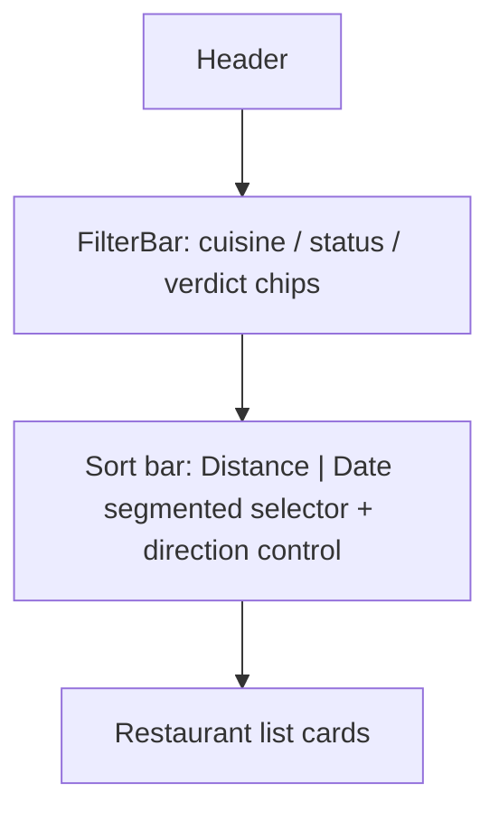

# Restaurant List Sort - Plan

## Goal Capsule

- **Objective:** The user can reorder the restaurant list to match what's most useful right now — nearest first when the device knows where they are, most relevant by date otherwise — and the app remembers that choice the next time it opens.
- **Product authority:** This plan owns adding a user-controlled sort to `src/features/RestaurantList.tsx`'s display order only. It does not touch `src/features/decide/candidates.ts`'s own nearest-first ordering, or `src/features/map/markers.ts`'s marker ordering and fallback-center logic — those are explicit non-goals (see Scope Boundaries).
- **Execution profile:** Standard software feature work; no autonomous/long-running optimization loop.
- **Stop conditions:** None beyond satisfying the Requirements below.
- **Open blockers:** None. All forks raised during brainstorming were resolved; see Key Decisions.

---

## Product Contract

**Product Contract preservation:** n/a — this is the first version of the Product Contract for this plan.

### Summary

Adds a sort control to the restaurant list: a Distance/Date criterion selector plus a direction toggle, in a dedicated bar above the list, separate from `FilterBar`. Distance is offered only once the device's position is known and defaults to nearest-first; until then, Date is the only choice and defaults to most-recent-first. Each criterion remembers its own direction, and both the chosen criterion and its direction persist across reloads.

### Problem Frame

`docs/plans/2026-08-30-1320-feat-current-position-list-distance-plan.md` added per-row distance labels to the list but deliberately kept list order untouched ("distance is added information only"), so a restaurant's distance is visible but has no effect on where it sits in the list. Restaurants also currently have no sort order at all — the list renders in whatever order the local store returns, with no way to bring the nearest or most relevant places to the top. This plan is the follow-up: now that distance is visible, giving the user control over ordering is the natural next step.

### Key Decisions

- **Manual criterion picker (Distance / Date), not a fully automatic fallback** (session-settled: user-directed — chosen over an automatic distance-or-date switch with no manual override: the user wants explicit control over which criterion is active, not just its direction). Governs R1, R2.
- **Distance is disabled/hidden in the picker until a position is known, rather than shown but non-functional** (session-settled: user-approved — chosen over leaving Distance selectable but inert: avoids a "Distance" mode that doesn't actually sort by distance). Governs R1, R2.
- **Direction is remembered independently per criterion** (session-settled: user-approved — chosen over one shared direction toggle across both criteria: nearest-first and most-recent-first are independent preferences). Governs R3, R4.
- **Both the chosen criterion and its per-criterion direction persist via `localStorage`** (session-settled: user-directed — chosen over resetting on reload like the app's existing list/map view toggle: the user wants this preference remembered). Governs R9.
- **Restaurants without resolved coordinates always trail the list under Distance, never reordered by the reversed direction** (session-settled: user-approved — chosen over moving the block to the front when direction reverses: avoids a jarring jump for restaurants that can't be placed by distance at all). Governs R6.
- **The sort control lives in its own bar above the list, not folded into `FilterBar`** (session-settled: user-directed — chosen over sharing FilterBar's header row, after a sketch comparison of both placements: sort is not a filter facet). Governs R10.
- **Control layout: a Distance/Date segmented selector plus a separate direction control whose label adapts to the active criterion** (session-settled: user-directed — chosen over a single combined dropdown and over two independent icon-only buttons, among three sketched layouts). Governs R10.
- **A restaurant with no usable date at all (no `added`, never visited) is treated as the oldest possible date** (session-settled: user-approved — surfaced as a call-out across every synthesis revision and never redirected). Governs R8.

### Requirements

**Criterion selection**
- R1. The restaurant list offers a sort criterion picker with two choices, Distance and Date. Distance is selectable only when a device position is known (`currentPosition`, per `docs/plans/2026-08-30-1320-feat-current-position-list-distance-plan.md`); otherwise only Date is selectable.
- R2. The moment a position first becomes known during a session where none was known before, Distance becomes selectable; if Distance is the persisted preference (R9), it takes effect immediately without the user reselecting it.

**Direction**
- R3. Each criterion has its own direction, remembered independently: switching from Distance to Date and back preserves each criterion's own last-chosen direction.
- R4. The default direction the first time each criterion is ever selected is nearest-first for Distance and most-recent-first for Date.

**Ordering rules**
- R5. When Distance is active, restaurants are ordered by straight-line distance from `currentPosition` (per `src/lib/geo.ts`), nearest-first or farthest-first per the current direction.
- R6. When Distance is active, a restaurant with no resolved coordinates (`lat`/`lng` null — a provisional record) cannot be placed by distance; all such restaurants render as a single trailing block after every distance-ordered restaurant, regardless of direction, ordered among themselves by the Date rule (R7).
- R7. When Date is active, or within the trailing block of R6, each restaurant is ordered by its `added` date if never visited (`visitCount === 0`), otherwise by its `latestVisitDate`; most-recent-first or oldest-first per the current direction.
- R8. A restaurant with neither a usable `added` value nor any visit has no date to order by under R7; it is treated as the oldest possible date, sorting last within the date-ordered portion in the default direction (first when reversed).

**Persistence**
- R9. The chosen criterion and each criterion's chosen direction persist across app reloads, independent of the app's existing no-persistence pattern for other transient UI state.

**UI placement**
- R10. The sort control renders in a dedicated bar above the restaurant list, visually separate from `FilterBar`'s facet chips: a Distance/Date segmented selector plus a separate direction control whose label reflects the active criterion (e.g. "nearest first" for Distance, "most recent first" for Date).

### Key Flows

- F1. Position resolves after the list first renders
  - **Trigger:** The list renders with only Date selectable (no position yet); the device's position later resolves.
  - **Steps:** Distance becomes selectable; if the persisted preference is Distance, the list immediately re-sorts by distance in its remembered direction, with no user action.
  - **Covers:** R1, R2, R9

- F2. User switches the sort criterion
  - **Trigger:** The user picks Date while Distance is active, or vice versa (only possible when Distance is selectable).
  - **Steps:** The list re-sorts under the new criterion, using that criterion's own remembered direction (or its default, the first time it's ever chosen); the choice persists.
  - **Covers:** R1, R3, R4, R9

- F3. User reverses direction
  - **Trigger:** The user taps the direction control for the active criterion.
  - **Steps:** The list re-sorts in the opposite direction for that criterion only; restaurants without resolved coordinates (under Distance) stay in their trailing block regardless. The new direction persists for that criterion.
  - **Covers:** R3, R5, R6, R7, R9

### Acceptance Examples

- AE1. **Covers R1, R2.** Given the app just launched and no position is known yet, When the restaurant list renders, Then the sort picker shows only Date as selectable and Date is active by default.
- AE2. **Covers R2, R9.** Given the persisted preference is Distance and a position resolves a few seconds after launch, When that position arrives, Then the list immediately re-sorts by distance in the persisted direction, without the user touching the picker.
- AE3. **Covers R6, R7.** Given a position is known, Distance is active, and one restaurant is a provisional record with no coordinates, When the list renders, Then that restaurant appears after every restaurant with a computed distance, in either direction.
- AE4. **Covers R7, R8.** Given Date is active and one restaurant has neither an `added` timestamp nor any visit, When the direction is most-recent-first, Then that restaurant appears last; When the direction is reversed to oldest-first, Then that restaurant appears first.
- AE5. **Covers R7.** Given Date is active, When comparing a never-visited restaurant to a visited one, Then the never-visited one is ordered by its `added` date and the visited one by its `latestVisitDate` — not by visit count or verdict.

### Scope Boundaries

- `src/features/decide/DecidePanel.tsx` / `candidates.ts`'s own nearest-first candidate ordering is untouched.
- `src/features/map/markers.ts` marker ordering and `pickMostRecentRestaurantCenter`'s fallback-center logic are untouched — this plan only reorders `RestaurantList`'s display.
- No manual override to force Distance when no position is known (R1) — Date is the only option in that state.
- No additional sort criteria beyond Distance and Date (e.g. alphabetical, cuisine) are in scope.

### Dependencies / Assumptions

- Depends on `currentPosition`, `distanceLabelFor`, and the `Restaurant.lat`/`lng`, `added`, `latestVisitDate`, `visitCount` fields already shipped by `docs/plans/2026-08-30-1320-feat-current-position-list-distance-plan.md` — confirmed present in `src/App.tsx`, `src/features/RestaurantList.tsx`, `src/lib/geo.ts`, `src/types/models.ts`.
- This plan revises R4 of `docs/plans/2026-08-30-1320-feat-current-position-list-distance-plan.md` ("List order is unchanged; distance is added information only"), which this plan's R1–R9 now supersede.
- No existing hand-rolled `localStorage` pattern exists in `src/` for a user preference; the closest existing precedent is `src/i18n/config.ts`'s i18next `LanguageDetector` caching.

### Outstanding Questions

**Deferred to Planning**
- Exact copy and iconography for the criterion and direction controls (the brainstorm's visual sketches used placeholder text/emoji only).
- The concrete `localStorage` key shape and whether to centralize a small persistence helper.

### Sources / Research

- `docs/plans/2026-08-30-1320-feat-current-position-list-distance-plan.md` — introduced `currentPosition`, `distanceLabelFor`, and the "distance is informational only" decision this plan revises.
- `src/types/models.ts` — `Restaurant.lat`/`lng`, `added`, `latestVisitDate`, `visitCount` (verified against the current codebase).
- `src/lib/geo.ts` — `haversineMeters`, `formatDistance`, `distanceLabelFor` (verified).
- `src/features/RestaurantList.tsx`, `src/features/useRestaurants.ts`, `src/App.tsx` — current list rendering and filtering; confirmed no existing sort logic.
- `CONCEPTS.md` — Status/Visit domain vocabulary underlying R7 ("never visited" = `visitCount === 0`).
