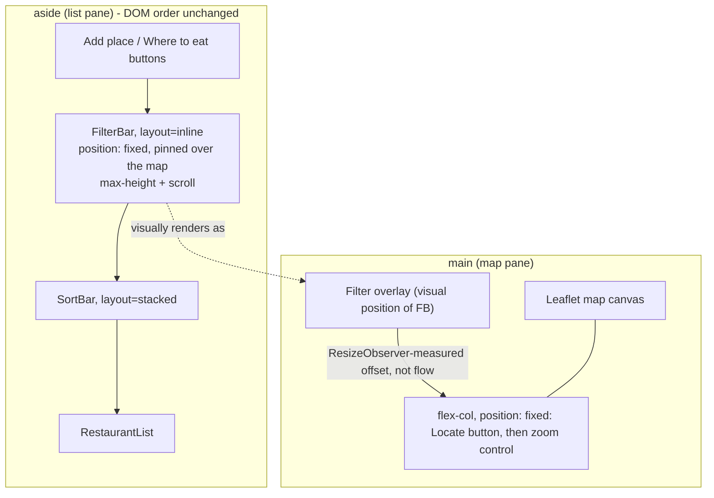
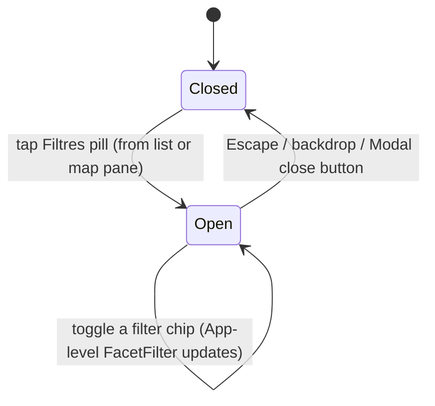

# Filter/Sort Layout Relocation - Plan

## Goal Capsule

- **Objective:** Someone browsing restaurants sees far more results at a glance, on both desktop and mobile, with no loss of filtering or sorting capability.
- **Means:** Move `FilterBar` into a floating overlay above the map on desktop and behind a floating pill + bottom sheet on mobile, per the layouts confirmed in a live prototype exploration (KTD1-KTD4).
- **Authority hierarchy:** Product Contract constrains Planning Contract; Planning Contract constrains Implementation Units. A conflict resolves in favor of the higher layer.
- **Stop conditions:** Stop and flag if the `layout` prop on `FilterBar`/`SortBar` cannot be implemented without duplicating chip-rendering logic, or if disabling Leaflet's default zoom control breaks map behavior unrelated to zoom placement.
- **Execution profile:** Standard interactive implementation; no autonomous rollout.
- **Tail ownership:** The implementer runs the Verification Contract commands and opens the PR; no autonomous shipping tail is in scope.

---

## Product Contract

### Summary

Relocate the restaurant browsing screen's filter and sort controls so the restaurant list gets far more vertical space, without changing what can be filtered, how sorting works, or the underlying `FacetFilter` state. Desktop gets a floating filter overlay above the map; mobile gets a floating "Filtres" pill opening a bottom sheet.

### Problem Frame

Today, `FilterBar` and `SortBar` stack above `RestaurantList` in the same 320px sidebar (desktop) or the same list pane (mobile, gated by the bottom Liste/Carte nav). The combined height of both bars leaves room for only 2-3 restaurant rows before scrolling.

Five desktop layouts (filters in a toolbar above the map, floating overlays at top/left/right of the map, and a sidebar accordion) and three mobile layouts (a third bottom-nav tab, an inline accordion, and a floating pill) were built as a live HTML prototype and compared directly in a browser. The desktop floating-overlay-at-top layout and the mobile floating-pill layout were chosen, then refined in a follow-up discussion: on desktop, sort stays with the list it controls rather than moving into the overlay, and the map's Locate and zoom controls move to the right, below the overlay; on mobile, the pill is visible from both the list and the map, not just the list.

### Key Decisions

- **KD1. Desktop filters move to a floating overlay pinned atop the map; sort stays above the list.** (session-settled: user-directed — chosen over a horizontal toolbar above the map, floating overlays at the map's left/right, a sidebar accordion, and over moving sort into the overlay too: sort stays "more coherent" next to the list it controls.) Governs R1, R2.
- **KD2. Desktop Locate and zoom controls stack on the right, Locate above zoom, below the filter overlay.** (session-settled: user-directed — chosen over zoom-above-Locate, for a better-looking stack order.) Governs R3.
- **KD3. Mobile filters and sort move behind a floating "Filtres · N" pill opening a bottom sheet, shown on both the list and the map panes.** (session-settled: user-directed — chosen over a third bottom-nav tab and an inline accordion, and over showing the pill on the list pane only.) Governs R4, R5.
- **KD4. No change to filter or sort logic or behavior.** (user-approved — confirmed in this plan's scoping synthesis.) Existing `FilterBar`, `SortBar`, `filter.ts`, and `sort.ts` are reused as-is, relocated and restyled only. Governs R6.

### Requirements

**Desktop layout**

- R1. On viewports 768px and wider, `FilterBar` (cuisine and status/verdict chips) renders in a floating card pinned to the top of the map area, not in the sidebar. Governs: KD1.
- R2. `SortBar` continues to render in the sidebar directly above `RestaurantList`, unchanged in position and behavior. Governs: KD1.
- R3. The map's Locate button and a zoom in/out control both render stacked on the right side of the map, Locate above zoom, positioned so neither ever visually overlaps the filter overlay, regardless of the overlay's rendered height (e.g. the cuisine row's "+N autres" expanded). The zoom in/out buttons disable at the map's zoom limits, matching the Leaflet default control they replace. Governs: KD2.

**Mobile layout**

- R4. On viewports narrower than 768px, `FilterBar` and `SortBar` no longer render inline in the list pane. A floating "Filtres · N" button (N = the count of active filters) renders on both the list pane and the map pane. Governs: KD3.
- R5. Tapping the mobile filters button opens a bottom sheet containing `FilterBar` and `SortBar`. The existing two-button Liste/Carte bottom navigation is unchanged and independent of this button. Governs: KD3.

**Preserved behavior**

- R6. Filter selection, chip-toggle, and sort criterion/direction behavior is unchanged from before this work: the same `FacetFilter` object, toggle callbacks, and sort state flow into every new rendering position with no re-derivation. Governs: KD4.
- R7. Keyboard and assistive-technology users reach the cuisine/status/verdict filter chips in the same relative order as today — immediately after the "Add a place"/"Where to eat" controls, before the restaurant list — even though `FilterBar` now renders visually over the map.

### Success Criteria

- A typical desktop viewport shows materially more restaurant rows in the list without scrolling than today (today: 2-3 rows), verified in a running dev server, once the filter overlay and `SortBar` no longer share the list's vertical space. (session-settled: user-approved — doc review found the original "at least 8 rows" figure was never measured against this app's actual card/header dimensions and could overstate what a common viewport delivers; replaced with the Verification Contract's own relative phrasing.)
- Existing `FilterBar`, `SortBar`, `filter.ts`, and `sort.ts` test suites keep asserting the same filter/sort behavior after the change (adapted only for the new `layout` prop and render context, never for new logic).

### Scope Boundaries

- **Deferred to Follow-Up Work:** dismissing or collapsing the desktop filter overlay independently of the map view; a custom open/close animation for the mobile bottom sheet beyond `Modal`'s existing transition; promoting the new desktop floating-overlay wrapper into a shared `src/features/ui/` primitive (it has one use site today).
- **Outside this change:** anything filterable or sortable, the cuisine/status/verdict taxonomy, and the `FacetFilter` data shape.

---

## Planning Contract

### Key Technical Decisions

- KTD1. `FilterBar` and `SortBar` each gain a `layout: 'stacked' | 'inline'` prop that swaps only the outer wrapper's flex classes via `cn()` — vertical stack for the sidebar and the mobile sheet, horizontal flow for the desktop overlay — mirroring `ToggleChip`'s `shape` prop (`src/features/ui/ToggleChip.tsx`), which likewise only ever swaps outer-wrapper classes, never child/slot rendering. Under `layout="inline"`, `FilterBar`'s cuisine group and status/verdict group render side-by-side (row), matching the confirmed desktop prototype. (session-settled: user-approved — chosen over forking `FilterBar`/`SortBar` into separate overlay-specific components, confirmed in this plan's scoping synthesis.) Governs R1, R2, R4.
- KTD2. The desktop `FilterBar` stays authored inside `<aside>`'s JSX, in its current position immediately after the "Add a place"/"Where to eat" buttons, and is visually pinned over the map with `position: fixed` (offsets computed from the sidebar's fixed width and the header's fixed height, both already constant values in this codebase) rather than moved into `<main>`'s tree. This keeps today's tab order intact with no portal and no JS position measurement. The overlay's wrapper carries a max-height with internal scroll (mirroring the mobile sheet's `max-h-[90vh] overflow-y-auto` from KTD4), so the cuisine row's "+N autres" expansion never grows the overlay past a bounded fraction of the map. (session-settled: user-approved — doc review found the overlay had no stated height bound, risking it covering most of the map on a short viewport when expanded.) Governs R1, R7.
- KTD3. The Locate button and a new custom zoom in/out control are two children of one `flex flex-col` wrapper, also `position: fixed` like the filter overlay (KTD2), positioned as its visual sibling inside the map pane. A `useLayoutEffect`/`ResizeObserver` on a ref to the filter overlay measures its real rendered height and writes it to a CSS custom property that the control stack's `top` offset reads, so the stack always clears the overlay as it grows (e.g. the cuisine row's "+N autres" expanded) — capped by KTD2's max-height. The zoom control is built with `useMap()` (`map.zoomIn()` / `map.zoomOut()`), mirroring the existing `useMap()`-driven pattern already used by `Recenter`, `CenterReporter`, and `LabelVisibility` in `src/features/map/MapView.tsx`; its zoom-in/zoom-out buttons disable at `map.getMaxZoom()`/`map.getMinZoom()` respectively (tracked via a `zoomend` `useMapEvent`), matching the disabled-at-limits affordance of the Leaflet default control it replaces. `MapContainer` gets `zoomControl={false}` so Leaflet's own default top-left zoom control is not also rendered. (session-settled: user-approved — doc review found the original "normal CSS flow, no measurement" claim could not work: the overlay is `position: fixed` inside `<aside>` while the control stack sits in `MapView`'s tree under `<main>` — not DOM siblings, and a fixed-position box reserves no flow space regardless of height. Revised to a fixed-position stack with a measured offset.) Governs R3.
- KTD4. The mobile filters sheet reuses the existing `Modal` + `ModalHeader` primitives (`src/features/ui/Modal.tsx`, `ModalHeader.tsx`) — already used for `SettingsPanel` — with `panelClassName="max-h-[90vh] overflow-y-auto"` and a `ModalHeader` rendering a title plus the standard close control, matching every other `Modal` caller in this codebase. Only the desktop floating overlay is new, feature-local UI; no existing primitive fits a card floating over a map, so nothing is added to `src/features/ui/` for that shape. (session-settled: user-approved — refines a call-out confirmed in this plan's scoping synthesis about keeping new UI feature-local; the mobile sheet turns out to need no new component at all.) Governs R4, R5.
- KTD5. `activeFilterCount(filter: FacetFilter): number` is added beside the existing `isEmptyFilter` in `src/features/facets/filter.ts`, summing the three Sets' sizes. It reads the same normalized, boundary-keyed Sets `isEmptyFilter` already reads (see `docs/solutions/design-patterns/normalize-filter-selection-keys-at-the-boundary.md`), so no additional normalization is needed. Governs R4.
- KTD6. Opening the mobile filters sheet is gated by its own new boolean state in `App.tsx` (a sibling of `adding`/`deciding`/`settingsOpen`), not a new `MobileView` variant — the sheet opens regardless of whether `view` is `'list'` or `'map'`. While open, it blocks the rest of the UI including the bottom nav, matching how every other `Modal`-hosted panel in this app (`AddPlace`, `DecidePanel`, `RestaurantDetail`, `SettingsPanel`) already behaves. Governs R4, R5.

### High-Level Technical Design

Desktop composition — `FilterBar` stays DOM-resident in the sidebar for tab order (KTD2), while the Locate/zoom stack is independently `position: fixed` and reads a measured offset off the overlay so it always clears it (KTD3):

Mobile filters sheet — a single boolean gates the `Modal`, independent of the Liste/Carte `view` state:

---

## Implementation Units

### U1. Add a `layout` variant to FilterBar and SortBar

- **Goal:** Let `FilterBar`/`SortBar` render either stacked (today's sidebar/sheet shape) or inline (the desktop overlay's horizontal flow) without duplicating either component.
- **Requirements:** R1, R2, R4 (KTD1)
- **Dependencies:** none
- **Files:**
  - `src/features/facets/FilterBar.tsx`
  - `src/features/facets/SortBar.tsx`
  - `src/features/facets/FilterBar.test.tsx`
  - `src/features/facets/SortBar.test.tsx`
- **Approach:**
  1. Add a `layout?: 'stacked' | 'inline'` prop to both components, defaulting to `'stacked'`.
  2. Swap only the outer wrapper's flex classes per layout via `cn()` — never the chip/button rendering underneath.
  3. Under `layout="inline"`, render `FilterBar`'s cuisine group and status/verdict group side-by-side (row), matching the confirmed desktop prototype.
- **Patterns to follow:** `src/features/ui/ToggleChip.tsx`'s `shape` prop — a `Record`-keyed class map that only ever swaps the outer wrapper, never slot content.
- **Test scenarios:**
  - Default (`layout` omitted) renders the same wrapper classes as today.
  - `layout="inline"` renders the horizontal-flow wrapper classes; cuisine and status/verdict groups sit side-by-side.
  - Chip toggle, active state, and `onChange`/`onCriterionChange`/`onDirectionToggle` callbacks behave identically under both layouts.
- **Verification:** `npm run test -- FilterBar SortBar` passes with both layouts covered.

### U2. Add `activeFilterCount` to filter.ts

- **Goal:** Provide the active-filter count the mobile pill badge needs.
- **Requirements:** R4 (KTD5)
- **Dependencies:** none
- **Files:**
  - `src/features/facets/filter.ts`
  - `src/features/facets/filter.test.ts`
- **Approach:** Add `activeFilterCount(filter: FacetFilter): number`, summing `cuisines.size + statuses.size + verdicts.size`, beside the existing `isEmptyFilter`.
- **Test scenarios:**
  - Empty filter returns 0.
  - One active cuisine returns 1.
  - A mix of cuisines, statuses, and verdicts returns their combined count.
  - The uncategorized-cuisine sentinel counts once, like any other cuisine entry.
- **Verification:** `npm run test -- filter.test` passes.

### U3. Desktop: float the filter overlay and relocate Locate/zoom

- **Goal:** Implement the desktop layout in KTD2 and KTD3.
- **Requirements:** R1, R2, R3, R7 (KTD2, KTD3)
- **Dependencies:** U1
- **Files:**
  - `src/App.tsx`
  - `src/features/map/MapView.tsx`
  - `src/features/map/MapView.test.tsx`
  - `src/App.test.tsx`
  - `src/index.css`
- **Approach:**
  1. In `App.tsx`, keep `FilterBar` authored in `<aside>` (same position as today) but give its wrapper `layout="inline"` and the `position: fixed` placement from KTD2, using a new CSS custom property alongside the existing `--safe-area-floating-offset` convention for the fixed offsets, plus a max-height with internal scroll (KTD2) so an expanded cuisine row is bounded.
  2. Remove `FilterBar` from the sidebar's visual flow (it no longer takes sidebar layout space); keep `SortBar` exactly where it is today.
  3. In `MapView.tsx`, add `zoomControl={false}` to `MapContainer`.
  4. Add a small `useMap()`-based zoom control component (mirroring `Recenter`/`CenterReporter`) rendering zoom-in/zoom-out buttons with `aria-label`s (e.g. `aria-label="Zoomer"` / `aria-label="Dézoomer"`), disabled at `map.getMaxZoom()`/`map.getMinZoom()` respectively via a `zoomend` `useMapEvent` (KTD3).
  5. Wrap the existing Locate button and the new zoom control in one `flex flex-col` container, itself `position: fixed`. Measure the filter overlay's rendered height with a `useLayoutEffect`/`ResizeObserver` on a ref to it, and write that height to a CSS custom property the control stack's `top` offset reads (KTD3), per the High-Level Technical Design diagram.
- **Patterns to follow:** `Recenter`, `CenterReporter`, `LabelVisibility` in `src/features/map/MapView.tsx` for the `useMap()`-driven custom-control style; the `--safe-area-floating-offset` CSS variable in `src/index.css` for the offset-token convention.
- **Test scenarios:**
  - `FilterBar` still appears at its current relative position in the `aside` DOM tree (R7) — tab order after the "Add a place"/"Where to eat" buttons is unchanged.
  - The zoom control's buttons call `map.zoomIn()`/`map.zoomOut()`; the existing Locate button still calls its existing handler.
  - The zoom control's buttons carry `aria-label`s and disable at `getMaxZoom()`/`getMinZoom()` (R3).
  - The control stack's measured offset updates when the filter overlay's height changes (e.g. cuisine row expanded), so it never overlaps the overlay (R3).
  - No default Leaflet zoom control renders alongside the new one.
  - The `react-leaflet` mock in `MapView.test.tsx` (and `App.test.tsx` if it mocks the map) is extended with `zoomIn`/`zoomOut`/`getMaxZoom`/`getMinZoom` on the existing module-scoped, referentially stable mocked map instance, per `docs/solutions/conventions/react-leaflet-test-mock-stability.md` — do not return a fresh mock object per call.
- **Verification:** `npm run test -- MapView App` passes; `npm run build` succeeds.

### U4. Mobile: floating "Filtres · N" pill and bottom sheet

- **Goal:** Implement the mobile layout in KTD4, KTD5, and KTD6.
- **Requirements:** R4, R5, R6 (KTD4, KTD6)
- **Dependencies:** U1, U2
- **Files:**
  - `src/App.tsx`
  - `src/App.test.tsx`
  - `src/i18n/locales/en/translation.json`
  - `src/i18n/locales/fr/translation.json`
- **Approach:**
  1. Add a `filtersOpen` boolean state in `App.tsx`, sibling to `adding`/`deciding`/`settingsOpen`.
  2. Remove `FilterBar`/`SortBar` from the mobile list pane's inline flow.
  3. Render a "Filtres · N" pill (N from `activeFilterCount`) at a fixed bottom-center position, offset above the Liste/Carte bottom nav using the existing `--safe-area-floating-offset` convention, identically on both the list pane and the map pane, mirroring `FilterBar`'s own `restaurants.length === 0` guard so it hides on an empty list.
  4. On tap, open a `Modal` (`panelClassName="max-h-[90vh] overflow-y-auto"`, matching `AddPlace`/`RestaurantDetail`/`SettingsPanel`) with a `ModalHeader` (title + close) as its first child, containing `FilterBar` (`layout="stacked"`) and `SortBar`.
  5. Add the pill's label, the sheet's `ModalHeader` title, and U3's new zoom-control `aria-label`s to both `src/i18n/locales/en/translation.json` and `src/i18n/locales/fr/translation.json`, following the existing flat-namespace convention (`filters.*`).
- **Test scenarios:**
  - The pill renders at the same position on the list pane and, independently, on the map pane.
  - The pill's count matches `activeFilterCount` for a given filter state.
  - Tapping the pill from either pane opens the sheet with `FilterBar` and `SortBar`; closing it (Escape, backdrop, or close button — existing `Modal` behavior) returns to the same pane.
  - Toggling a filter chip inside the sheet updates the restaurant list behind it after the sheet closes.
  - The pill does not render when the restaurant list is empty.
- **Verification:** `npm run test -- App` passes; manual check in a running dev server confirms the pill and sheet at a mobile viewport width.

---

## Verification Contract

| Command | Applies to | Done signal |
|---|---|---|
| `npm run test` | U1-U4 | All existing and new tests pass, including the extended `react-leaflet` mock |
| `npm run lint` | U1-U4 | `tsc --noEmit` reports no errors |
| `npm run build` | U3, U4 | Vite production build succeeds |
| Manual: `npm run dev`, resize below and above 768px | U3, U4 | Overlay/pill appear at the right breakpoint; the list shows materially more rows than before; no duplicate zoom control; tab order reaches the filter chips right after the "Add a place"/"Where to eat" buttons |
| Verify i18n keys | U4 | Both `src/i18n/locales/en/translation.json` and `fr/translation.json` contain the new `filters.*` keys (pill label, sheet title, zoom-control aria-labels); no untranslated placeholders remain |

## Definition of Done

- Requirements R1-R7 are implemented and covered by passing tests.
- `npm run lint`, `npm run test`, and `npm run build` all succeed.
- Manually verified in a running dev server at both desktop and mobile widths, per this project's frontend-change verification convention.
- New i18n keys exist in both `en` and `fr` locale files.
- No dead or experimental code remains from approaches that did not pan out.
