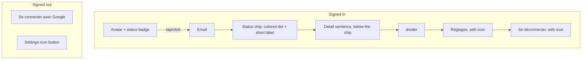
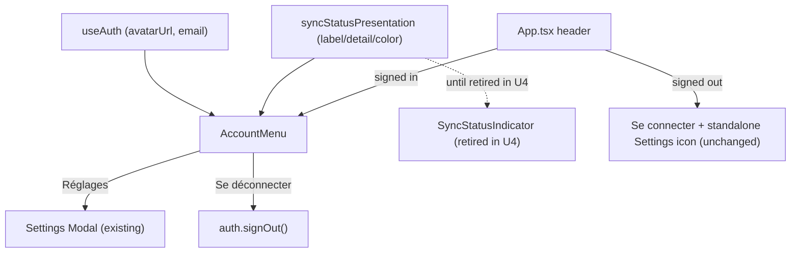

# Header Avatar Status Menu - Plan

## Goal Capsule

- **Objective:** A signed-in user can read their sync/account status at a glance without triggering a control that pushes the page layout, and can reach their identity info, sync detail, settings, and logout from one place.
- **Means:** Replace the header's signed-in cluster (sync-status pill, email label, settings button, logout button) with a single avatar-and-status-badge control that opens a dropdown; the signed-out header, including its standalone Settings icon, stays unchanged.
- **Product authority:** Decided with the user across a `ce-prototype` session comparing four avenues, confirmed in this brainstorm. No open blockers before planning.
- **Execution profile:** Standard-depth software plan, `execution: code`.
- **Product Contract preservation:** unchanged. Planning added the Planning Contract, Implementation Units, Verification Contract, and Definition of Done below; no Requirement, Key Decision, or scope boundary text was altered.

---

## Product Contract

### Summary

Consolidate the header's signed-in identity cluster (sync status, email, settings, logout) into one avatar-with-status-badge control. The badge's color communicates sync state at rest, with no text shown until opened. Opening the avatar reveals a dropdown carrying the full email, sync detail, Réglages, and Se déconnecter. The avatar shows the user's real PocketBase photo when set, otherwise an initial letter. The signed-out header is unchanged.

### Problem Frame

Today's sync-status control (`src/features/sync/SyncStatusIndicator.tsx`) is a click-to-expand pill: tapping it inserts a text block below itself, pushing the rest of the header layout. It sits alongside three other separate signed-in controls — email, a settings icon button, and a logout button — competing for header width, especially on mobile where the header must already shrink to avoid overflow (`src/App.tsx:232-238`). GrooveMark's `HeaderBar.vue`, used as a reference point during prototyping, merges identity and sync status into one profile-area control instead of stacking separate elements.

### Key Decisions

- **Avatar + status badge over pill-with-label, four separate controls, or one generic menu.** Chosen over a pill merging identity+status as always-visible text (closest to the GrooveMark reference) because it stays fully discreet at rest; also over keeping four separate controls (doesn't fix the crowding) and over one generic icon-only menu (de-emphasizes identity). Governs R1, R2, R7.
- **Real PocketBase avatar photo over initial-letter-only.** PocketBase's `users` record already carries an `avatar` field; the control shows that photo when set, falls back to the initial letter otherwise — no new backend plumbing needed. Governs R3.
- **Recolor the "synced" state from neutral gray to emerald/green (session-settled: user-approved — chosen over keeping the existing neutral gray: the badge now communicates status by color alone, and gray "synced" was visually indistinguishable from gray "offline").** Governs R2.
- **Settings stays a standalone icon when signed out (session-settled: user-directed — chosen over folding it into a new signed-out menu: preserves existing access for local-only users without inventing new UI for that state).** Governs R6.

### Requirements

**Region composition (signed-in vs signed-out):**



**Signed-in header**

- R1. When signed in, the header shows one avatar control (photo or initial letter) with a small status-colored badge on its corner, replacing the separate sync-status pill, email label, settings button, and logout button.
- R2. The badge color reflects the current sync state at rest, with no text shown until the control is opened: emerald/green for synced, brand-orange for pending, gray for offline, red for problem (session-expired or server-unreachable).
- R3. The avatar shows the signed-in user's PocketBase `avatar` photo when set; when absent, it shows an initial letter.
- R4. Opening the avatar control reveals a dropdown, top to bottom: the user's email; a status chip (colored dot + short status label, background tinted to the state's color, reusing the existing `sync.*` label strings); the matching detail sentence directly below the chip (reusing the existing `sync.*` detail strings); a divider; a Réglages entry with a settings icon; a Se déconnecter entry with a logout icon. The dropdown opens as an overlay and never pushes surrounding layout.
- R5. The dropdown is the only signed-in entry point to Réglages and Se déconnecter; the standalone Settings icon and separate logout button are removed from the signed-in header.

**Signed-out header**

- R6. When signed out, the header is unchanged from today: the "Se connecter" (with Google) button and the standalone Settings icon button both remain, independent of the signed-in avatar/dropdown control.

**Cross-cutting**

- R7. The avatar-and-badge control renders with the same markup at desktop and mobile widths, with no separate mobile fallback.

### Key Flows

- F1. Check sync status at a glance
  - **Trigger:** Signed-in user glances at the header.
  - **Actors:** Signed-in user.
  - **Steps:** User reads the avatar's badge color; no interaction is needed for a coarse read of sync state.
  - **Covers:** R1, R2.
- F2. Inspect status detail, reach settings, or sign out
  - **Trigger:** Signed-in user taps/clicks the avatar.
  - **Actors:** Signed-in user.
  - **Steps:** Dropdown opens over the page without pushing layout; user reads email and the sync detail sentence, or selects Réglages or Se déconnecter; dismissing the dropdown returns to the prior view unchanged.
  - **Covers:** R4, R5.

### Acceptance Examples

- AE1. **Covers R2.** Given a signed-in user whose data is fully backed up, when they view the header without interacting, then the avatar's badge is emerald/green, not the previous neutral gray.
- AE2. **Covers R2, R4.** Given a signed-in user in the "problem" sync state (session expired or server unreachable), when they view the header, then the badge is red at rest, and opening the dropdown shows a red-tinted status chip followed by the matching detail sentence (`sync.detailProblemSignIn` or `sync.detailProblemUnreachable`) directly below it.
- AE3. **Covers R4.** Given the dropdown is open for any sync state, when the user scans it top to bottom, then the order is: email, status chip (dot + label), detail sentence, divider, Réglages (with icon), Se déconnecter (with icon) — matching the validated sketch.
- AE4. **Covers R3.** Given a signed-in user with no `avatar` set on their PocketBase record, when the header renders, then the avatar shows their initial letter, not a broken image or empty circle.
- AE5. **Covers R6.** Given a signed-out (local-only) user, when they view the header, then the Settings icon button is present and functional exactly as today, with no avatar/dropdown control shown.

### Scope Boundaries

- Sync engine and reauth behavior are unchanged — this only changes how sync status is displayed and where the status/settings/logout controls live, not how sync, retry, or reconnect works.
- No other header elements (app title, add-place button, filter/sort bars) are in scope.

### Dependencies / Assumptions

- Assumes `src/auth/useAuth.ts` is extended to expose an avatar URL derived from `user.avatar` via `pb.files.getURL(user, user.avatar)` (from `src/sync/pocketbase`), alongside the existing `email`; `src/auth/auth.ts`'s `user` getter already returns the full PocketBase record needed for this.

### Sources / Research

- Prior prototyping and decision: `.context/compound-engineering/ce-prototype/2026-09-01-header-redesign/decisions.md` (four avenues compared; avatar+badge chosen; sketch at `.context/compound-engineering/ce-prototype/2026-09-01-header-redesign/01-header-redesign/screens/001-avenues.html`, avenue B section starting at line 183 — dropdown markup is the source of truth for R4's element order).
- Current implementation: `src/App.tsx:253-276` (signed-in/signed-out header cluster), `src/features/sync/SyncStatusIndicator.tsx` (click-to-expand pill to retire), `src/auth/useAuth.ts` and `src/auth/auth.ts` (auth state and PocketBase record access), `src/i18n/locales/{fr,en}/translation.json` under `sync.*` (label/detail strings to reuse) and `settings.openAria` / `shell.signOut`.
- Repo research (Phase 1): no dropdown/popover/click-outside primitive exists anywhere in `src/` — this plan introduces the first one. `src/features/ui/Modal.tsx` is the only overlay component (full-screen backdrop, focus trap, Escape-dismiss) and is not anchored/compact, but its Escape-listener lifecycle and `initialFocus="panel"` escape hatch are directly reusable patterns. No avatar/image-fallback pattern exists yet. `Button.tsx`'s `iconOnly`/`variant` API does not have a shape for a full-width icon+label menu row.
- Z-index scale: `src/index.css:57-69` defines `--z-nav: 1100` (above Leaflet's max 1000), `--z-modal: 1200`, `--z-modal-elevated: 1300`; the header itself is `sticky z-20` (`src/App.tsx:230`), a `sticky`+`z-index` element that creates its own stacking context — an absolutely-positioned child cannot escape it regardless of its own z-index class.
- Institutional learning: commit `e7036cf` fixed a bug where a sheet's default open-focus landed on a mutating first control; `Modal.tsx`'s `initialFocus` prop exists specifically to prevent that class of bug. Commit `fcebe71` fixed a mobile header-overflow bug via `min-w-0 flex-1 truncate` on the title group and `shrink-0` on the actions group — a dropdown that isn't taken out of document flow could reintroduce it. Neither fix has a `docs/solutions/` entry yet (only inline code comments); worth a `ce-compound` pass after this change lands.

---

## Planning Contract

### Key Technical Decisions

- KTD1. **Portal the dropdown outside the header, into a new `--z-dropdown` token.** The header's `sticky` + `z-index` creates its own stacking context, so a dropdown nested inside it cannot clear the mobile nav (`--z-nav`) or Leaflet's map controls no matter what z-index class it carries. Render it via a portal to `document.body` and add `--z-dropdown` to `src/index.css`'s existing scale, between `--z-nav` (1100) and `--z-modal` (1200) — it is a compact anchored menu, not a full-screen modal, so it does not reuse `--z-modal`. Governs R4, R7.
- KTD2. **Dismiss via a `mousedown` outside-click listener plus Escape, no backdrop.** Mirrors `Modal.tsx`'s Escape-listener lifecycle but skips its full-screen backdrop, keeping this a lightweight anchored dropdown rather than a soft-modal, consistent with R4's "never pushes layout." `mousedown` (not `click`) closes the dropdown before any underlying click handler — a list item, the "+" FAB — fires; the listener excludes the avatar trigger's own ref, so the trigger's `mousedown` never simultaneously fires the outside-close and its own open/close toggle. Governs R4.
- KTD3. **All four dismissal paths — Réglages, Escape, outside-click, and Se déconnecter — explicitly restore focus, rather than relying on `Modal`'s own focus-restore.** `Modal` captures `document.activeElement` on mount to restore it on close; that mechanism doesn't apply here since the dropdown itself isn't a `Modal`. Réglages moves focus to the avatar button explicitly, in the same handler that closes the dropdown and opens Settings, before `Modal` mounts and does its own capture — avoiding the silent focus-loss regression already fixed once in commit `e7036cf`. Escape and outside-click both return focus to the avatar trigger. Se déconnecter moves focus to the signed-out header's "Se connecter" button once it mounts, since the avatar trigger no longer exists to receive it after sign-out. U3 owns implementing and testing all four paths. Governs R4, R5.
- KTD4. **Initial-letter fallback derives from `email`'s first character, uppercased; an avatar image that fails to load falls back the same way.** `email` is the only identity field `useAuth` exposes today; this avoids widening its surface beyond the `avatarUrl` addition this plan scopes. Governs R3.
- KTD5. **The badge and the dropdown's status chip/detail both read live from `useSyncStatus()`, never a value captured at open time.** A sync-state change while the dropdown is open (e.g. pending → synced) updates both immediately. Governs R2, R4.
- KTD6. **`SyncStatusIndicator`'s `label()`, `detail()`, and state-to-color mapping are extracted into a shared module and reused, not duplicated, by the new component.** The module exports both a raw per-state color token (for the badge dot, which needs a plain color, not a tinted pill) and the existing tinted-pill class builder (for the dropdown's status chip), built from one shared state-to-color map, so the badge and the chip can never disagree on a state's color. The "synced" color changes from `bg-gray-100 text-gray-600` to an emerald treatment as part of this same extraction, instantiating the Product Contract's recolor Key Decision. Governs R2, R4, R5.
- KTD7. **The dropdown anchors to the avatar trigger via a bounding-rect read on open, right-aligned to the header's right edge, and recomputed on resize.** On open, read `avatarRef.current.getBoundingClientRect()` and derive the portaled panel's `top`/`right` from it — right-aligned, since the avatar sits at the header's right edge; a `resize` listener (same document-listener lifecycle as KTD2) recomputes it while the dropdown stays open, so a narrow viewport or an orientation change can't leave the panel clipped or floating over the wrong content. No positioning library exists in this repo, so this is first-party, not a swap-in. Governs R4, R7.
- KTD8. **The dropdown carries menu ARIA semantics: the trigger is `aria-haspopup="menu"` plus `aria-expanded`, the panel is `role="menu"`, and the Réglages/Se déconnecter rows are `role="menuitem"`.** The status badge/chip's color is never the sole signal of sync state — the existing text label from `syncStatusPresentation` (KTD6) is already read by assistive tech, so no separate visually-hidden status text is needed beyond that label. Governs R4.

### High-Level Technical Design



`AccountMenu` is the new component (U3); `syncStatusPresentation` is the extracted module (U2), used transitionally by both `SyncStatusIndicator` and `AccountMenu` between U2 and U4 so the two surfaces cannot drift while both exist. `SyncStatusIndicator` itself is retired once U4 lands — nothing renders it after that unit.

---

## Implementation Units

### U1. Expose avatar URL from `useAuth`

- **Goal:** `useAuth` exposes an `avatarUrl: string | null` alongside its existing `email`.
- **Requirements:** R3.
- **Dependencies:** none.
- **Files:** `src/auth/useAuth.ts` (add `avatarUrl`); test coverage in `src/auth/auth.test.ts` or a new `src/auth/useAuth.test.ts`.
- **Approach:**
  1. Derive `avatarUrl` from `auth.user` (`pb.authStore.record`, already returned by `auth.ts`'s `user` getter): when `user?.avatar` is set, build it via `pb.files.getURL(user, user.avatar)` (from `src/sync/pocketbase.ts`'s `pb` client); otherwise `null`.
  2. No change needed to `auth.ts` — its `user` getter already returns the full record.
- **Technical design:** directional only — `avatarUrl = user?.avatar ? pb.files.getURL(user, user.avatar) : null`, computed the same way `email` already is in `useAuth.ts`.
- **Patterns to follow:** `useAuth.ts`'s existing `email: (auth.user?.email as string | undefined) ?? null`.
- **Test scenarios:**
  - Happy path: signed-in user with `avatar` set → `avatarUrl` is a URL string built via `pb.files.getURL`.
  - Edge case: signed-in user with no `avatar` field → `avatarUrl` is `null`.
  - Edge case: signed-out → `avatarUrl` is `null`, mirroring `email`'s existing signed-out behavior.
- **Verification:** `avatarUrl` matches the derivation above across signed-in-with-avatar, signed-in-without-avatar, and signed-out states.

### U2. Extract sync-status presentation logic and recolor "synced"

- **Goal:** Move `SyncStatusIndicator`'s label, detail, and color-mapping logic into a shared module reusable by the new dropdown, and recolor the "synced" state.
- **Requirements:** R2 (KTD6).
- **Dependencies:** none.
- **Files:** new `src/features/sync/syncStatusPresentation.ts`; `src/features/sync/SyncStatusIndicator.tsx` (imports from it instead of defining locally); `src/features/sync/SyncStatusIndicator.test.tsx` (extend or split coverage for the extracted module).
- **Approach:**
  1. Extract `label()`, `detail()`, and the state-to-color mapping (today's `labelClassName`) into pure functions in the new module, taking `SyncStatus` and the `t` translator.
  2. Build the color mapping as one shared per-state map, and export it two ways: a raw color token (for U3's badge dot, which needs a plain color, not a tinted pill) and the existing tinted-pill class builder (`labelClassName`-equivalent, for `SyncStatusIndicator` and U3's status chip) — both derived from the same map so they cannot diverge (KTD6).
  3. Change the "synced" mapping from `bg-gray-100 text-gray-600` to an emerald treatment; leave pending/offline/problem as they are today.
  4. `SyncStatusIndicator.tsx` imports the extracted functions in place of its local definitions.
- **Patterns to follow:** `src/features/sync/SyncStatusIndicator.tsx:8-52`'s existing `label()`/`detail()`/`labelClassName()` — extraction preserves per-state logic exactly except the "synced" color.
- **Test scenarios:**
  - Happy path: each `SyncState` (synced, pending, offline, problem) maps to its expected label and color class, matching R2's stated colors (emerald / brand-orange / gray / red).
  - Edge case: `offline` with `pendingCount > 0` still produces the combined "offline + pending" label (existing behavior, unchanged).
  - Edge case: `problem` with `cause: 'sign-in-needed'` vs. another cause still selects the correct label/detail pair (existing behavior, unchanged).
- **Verification:** `SyncStatusIndicator`'s existing tests pass against the extracted module; a new assertion confirms the emerald "synced" color class.

### U3. Build the avatar-and-status-badge dropdown component

- **Goal:** A new component renders the avatar (photo or initial) with a corner status badge, and an anchored dropdown — email, status chip + detail, divider, Réglages, Se déconnecter — that dismisses on outside click or Escape and never pushes layout.
- **Requirements:** R1, R2, R3, R4, R7 (KTD1, KTD2, KTD3, KTD4, KTD5, KTD6, KTD7, KTD8).
- **Dependencies:** U1, U2.
- **Files:** new component, e.g. `src/features/account/AccountMenu.tsx`, co-located with `src/features/account/AccountMenu.test.tsx`; `src/index.css` (add `--z-dropdown`, per KTD1).
- **Approach:**
  1. Avatar trigger: circular element showing `avatarUrl` as an `` with an `onError` fallback to the initial letter, or the initial letter directly when `avatarUrl` is `null`; a corner badge dot colored via U2's raw color token for the live `useSyncStatus()` state; `aria-haspopup="menu"` and `aria-expanded={open}` (KTD8).
  2. Dropdown: rendered through a portal to `document.body`, `role="menu"`, on the new `--z-dropdown` tier (KTD1), positioned from a `getBoundingClientRect()` read of the trigger on open and recomputed on `resize` (KTD7). Content order: email, status chip (dot + label, via U2's pill builder), detail sentence, divider, Réglages row (icon + label, `role="menuitem"`), Se déconnecter row (icon + label, `role="menuitem"`) (KTD8).
  3. Dismissal: `mousedown` document listener on outside targets (excluding the trigger ref), plus an Escape `keydown` listener (KTD2), no backdrop element.
  4. Focus on open: lands on the dropdown panel itself, not the first row, mirroring `Modal`'s `initialFocus="panel"` escape hatch — avoids auto-focusing a mutating control.
  5. Focus on close: implement all four KTD3 paths in the same component — Réglages re-focuses the avatar trigger before `Modal` mounts; Escape and outside-click return focus to the avatar trigger; Se déconnecter hands focus to the signed-out header's "Se connecter" button once it mounts (wired with U4).
  6. Tab-trap: while open, Tab and Shift+Tab cycle within the panel's focusable rows (Réglages, Se déconnecter), wrapping last→first and first→last — reusing `Modal.tsx`'s `getFocusables`/wrap logic directly rather than reinventing it.
- **Execution note:** Implement the new dropdown's dismissal, positioning, and focus behavior test-first — it is the first primitive of its kind in the app, with no existing pattern to characterize.
- **Technical design:** directional shape, not implementation:
  ```
  <button ref={avatarRef} onClick={toggleOpen} aria-haspopup="menu" aria-expanded={open}>
    {avatarUrl ?  : <Initial />}
    <BadgeDot color={rawColorFor(status.state)} />
  </button>
  {open && createPortal(
    <div ref={panelRef} role="menu" style={anchoredPosition} className="z-[var(--z-dropdown)] ...">
      <Email /><StatusChip /><Detail /><hr />
      <MenuRow role="menuitem" onClick={onReglages} /><MenuRow role="menuitem" onClick={onLogout} tone="destructive" />
    </div>,
    document.body
  )}
  ```
- **Patterns to follow:** `Modal.tsx`'s Escape-listener lifecycle (ref-held latest callback, cleanup on unmount) and its `getFocusables`/Tab-wrap logic, reused directly for KTD's Tab-trap; `Button.tsx`'s `iconOnly`/`variant` API where it fits (the avatar trigger needs custom circular styling, likely outside `Button`'s existing variants); `cn()` (`src/lib/cn.ts`) for conditional classes.
- **Test scenarios:**
  - Happy path: clicking the avatar opens the dropdown showing email, the current status chip/label, and the detail sentence, in that order.
  - Happy path: clicking Réglages opens the Settings modal and closes the dropdown.
  - Happy path: clicking Se déconnecter calls `signOut`.
  - Edge case: `avatarUrl` set but the image fails to load → falls back to the initial letter.
  - Edge case: no `avatar` set → initial letter renders directly.
  - Edge case: sync state changes (e.g. pending → synced) while the dropdown is open → badge and chip update without closing it.
  - Interaction: clicking outside the dropdown closes it; pressing Escape closes it; clicking inside the dropdown does not close it; clicking the avatar trigger itself while open closes it without flicker (KTD2 outside-ref exclusion).
  - Interaction: Tab from the last row wraps to the first row, and Shift+Tab from the first row wraps to the last, without leaving the panel.
  - Interaction: after closing via Escape or outside-click, focus returns to the avatar trigger; after Réglages, focus lands on the avatar trigger before the Settings modal takes it (KTD3).
  - Accessibility: the trigger exposes `aria-haspopup="menu"`/`aria-expanded`; the panel exposes `role="menu"`; Réglages and Se déconnecter expose `role="menuitem"` (KTD8).
  - Integration: opening the dropdown does not change the header's rendered height or push any sibling element (regression guard for the `fcebe71` overflow fix).
  - Integration: at a narrow viewport width, the panel's computed position stays within the viewport bounds (KTD7).
- **Verification:** all scenarios above pass; the dropdown's z-index class resolves to the new `--z-dropdown` token; no existing `Button` call site regresses.

### U4. Wire the new component into `App.tsx`, retire the old cluster

- **Goal:** Replace the signed-in header's sync-status pill, email, settings button, and logout button with U3's component; leave the signed-out header untouched.
- **Requirements:** R1, R5, R6.
- **Dependencies:** U1, U2, U3.
- **Files:** `src/App.tsx` (signed-in branch of the header, currently `App.tsx:253-267`); `src/App.test.tsx` (update header assertions referencing the old cluster); delete `src/features/sync/SyncStatusIndicator.tsx` and `SyncStatusIndicator.test.tsx` — nothing renders the component after this unit.
- **Approach:**
  1. In `App.tsx`'s `signedIn ? (...)` branch, replace `<SyncStatusIndicator />`, the email `<span>`, and the sign-out `<Button>` with U3's component, passing `email`, `avatarUrl` (U1), and the Settings-open / sign-out callbacks it needs.
  2. Leave the `signedIn ? ... : (<Button>{signIn}</Button>)` structure and the standalone Settings `<Button iconOnly>` outside that conditional exactly as they are today (R6).
  3. Réglages inside U3 calls the same `setSettingsOpen(true)` `App.tsx` already uses for the standalone button, so `SettingsPanel`'s modal wiring is unchanged.
  4. Give the signed-out header's "Se connecter avec Google" button a stable ref/id so U3's sign-out handler can focus it once `signedIn` flips to `false` and that button mounts (KTD3).
  5. Delete `SyncStatusIndicator.tsx` and its test — U2 already moved its presentation logic into `syncStatusPresentation.ts`, and U3 replaced its rendering role, so the component itself is dead code once this unit lands.
- **Patterns to follow:** the existing `settingsOpen` state and `Modal`/`SettingsPanel` wiring already in `App.tsx`.
- **Test scenarios:**
  - Happy path: signed in → header shows the new avatar control, not the old pill/email/settings-button/logout-button cluster.
  - Happy path: signed out → header is unchanged, "Se connecter avec Google" and the standalone Settings icon button both present and functional.
  - Integration: opening Réglages from the new dropdown opens the same `SettingsPanel` the standalone button opens.
  - Integration: signing out from the dropdown clears `pb.authStore`, and the avatar/dropdown subtree unmounts as `signedIn` flips to `false`, mirroring today's `SyncStatusIndicator` gating.
  - Integration: after signing out from the dropdown, focus lands on the "Se connecter avec Google" button in the newly-rendered signed-out header (KTD3).
- **Verification:** `App.test.tsx`'s header assertions pass for both signed-in and signed-out states; no header-overflow regression at the ~320-375px viewport width the existing `fcebe71`-era test covers.

---

## Verification Contract

| Command | Purpose | Applies to |
|---|---|---|
| `npm run test` (`vitest run`) | Unit/component tests for all four units | U1-U4 |
| `npm run lint` (`tsc --noEmit`) | Type-checks `avatarUrl`, the new component's props, and the extracted presentation module | U1-U3 |
| `npm run build` | Confirms the production build still succeeds with the new component and portal | U3, U4 |

No new environment variables, external APIs, or migrations are introduced — no additional deployment verification is needed beyond the commands above.

---

## Definition of Done

- All four units implemented, with their test scenarios passing under `npm run test`.
- `npm run lint` and `npm run build` pass with no new errors.
- `src/features/sync/SyncStatusIndicator.tsx`'s click-to-expand pill markup no longer renders anywhere in the signed-in header; its presentation logic lives only in the U2 module.
- The signed-out header (Se connecter + standalone Settings icon) is unchanged from before this plan, verified by `App.test.tsx`.
- No dead code from abandoned approaches (e.g. an unused `Button` variant added and then not used) remains in the diff.
