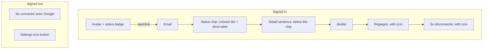

# Header Avatar Status Menu - Plan

## Goal Capsule

- **Objective:** A signed-in user can read their sync/account status at a glance without triggering a control that pushes the page layout, and can reach their identity info, sync detail, settings, and logout from one place.
- **Means:** Replace the header's signed-in cluster (sync-status pill, email label, settings button, logout button) with a single avatar-and-status-badge control that opens a dropdown; the signed-out header, including its standalone Settings icon, stays unchanged.
- **Product authority:** Decided with the user across a `ce-prototype` session comparing four avenues, confirmed in this brainstorm. No open blockers before planning.

---

## Product Contract

### Summary

Consolidate the header's signed-in identity cluster (sync status, email, settings, logout) into one avatar-with-status-badge control. The badge's color communicates sync state at rest, with no text shown until opened. Opening the avatar reveals a dropdown carrying the full email, sync detail, Réglages, and Se déconnecter. The avatar shows the user's real PocketBase photo when set, otherwise an initial letter. The signed-out header is unchanged.

### Problem Frame

Today's sync-status control (`src/features/sync/SyncStatusIndicator.tsx`) is a click-to-expand pill: tapping it inserts a text block below itself, pushing the rest of the header layout. It sits alongside three other separate signed-in controls — email, a settings icon button, and a logout button — competing for header width, especially on mobile where the header must already shrink to avoid overflow (`src/App.tsx:232-238`). GrooveMark's `HeaderBar.vue`, used as a reference point during prototyping, merges identity and sync status into one profile-area control instead of stacking separate elements.

### Key Decisions

- **Avatar + status badge over pill-with-label, four separate controls, or one generic menu.** Chosen over a pill merging identity+status as always-visible text (closest to the GrooveMark reference) because it stays fully discreet at rest; also over keeping four separate controls (doesn't fix the crowding) and over one generic icon-only menu (de-emphasizes identity). Governs R1, R2, R7.
- **Real PocketBase avatar photo over initial-letter-only.** PocketBase's `users` record already carries an `avatar` field; the control shows that photo when set, falls back to the initial letter otherwise — no new backend plumbing needed. Governs R3.
- **Recolor the "synced" state from neutral gray to emerald/green (session-settled: user-approved — chosen over keeping the existing neutral gray: the badge now communicates status by color alone, and gray "synced" was visually indistinguishable from gray "offline").** Governs R2.
- **Settings stays a standalone icon when signed out (session-settled: user-directed — chosen over folding it into a new signed-out menu: preserves existing access for local-only users without inventing new UI for that state).** Governs R6.

### Requirements

**Region composition (signed-in vs signed-out):**

**Signed-in header**

- R1. When signed in, the header shows one avatar control (photo or initial letter) with a small status-colored badge on its corner, replacing the separate sync-status pill, email label, settings button, and logout button.
- R2. The badge color reflects the current sync state at rest, with no text shown until the control is opened: emerald/green for synced, brand-orange for pending, gray for offline, red for problem (session-expired or server-unreachable).
- R3. The avatar shows the signed-in user's PocketBase `avatar` photo when set; when absent, it shows an initial letter.
- R4. Opening the avatar control reveals a dropdown, top to bottom: the user's email; a status chip (colored dot + short status label, background tinted to the state's color, reusing the existing `sync.*` label strings); the matching detail sentence directly below the chip (reusing the existing `sync.*` detail strings); a divider; a Réglages entry with a settings icon; a Se déconnecter entry with a logout icon. The dropdown opens as an overlay and never pushes surrounding layout.
- R5. The dropdown is the only signed-in entry point to Réglages and Se déconnecter; the standalone Settings icon and separate logout button are removed from the signed-in header.

**Signed-out header**

- R6. When signed out, the header is unchanged from today: the "Se connecter" (with Google) button and the standalone Settings icon button both remain, independent of the signed-in avatar/dropdown control.

**Cross-cutting**

- R7. The avatar-and-badge control renders with the same markup at desktop and mobile widths, with no separate mobile fallback.

### Key Flows

- F1. Check sync status at a glance
  - **Trigger:** Signed-in user glances at the header.
  - **Actors:** Signed-in user.
  - **Steps:** User reads the avatar's badge color; no interaction is needed for a coarse read of sync state.
  - **Covers:** R1, R2.
- F2. Inspect status detail, reach settings, or sign out
  - **Trigger:** Signed-in user taps/clicks the avatar.
  - **Actors:** Signed-in user.
  - **Steps:** Dropdown opens over the page without pushing layout; user reads email and the sync detail sentence, or selects Réglages or Se déconnecter; dismissing the dropdown returns to the prior view unchanged.
  - **Covers:** R4, R5.

### Acceptance Examples

- AE1. **Covers R2.** Given a signed-in user whose data is fully backed up, when they view the header without interacting, then the avatar's badge is emerald/green, not the previous neutral gray.
- AE2. **Covers R2, R4.** Given a signed-in user in the "problem" sync state (session expired or server unreachable), when they view the header, then the badge is red at rest, and opening the dropdown shows a red-tinted status chip followed by the matching detail sentence (`sync.detailProblemSignIn` or `sync.detailProblemUnreachable`) directly below it.
- AE3. **Covers R4.** Given the dropdown is open for any sync state, when the user scans it top to bottom, then the order is: email, status chip (dot + label), detail sentence, divider, Réglages (with icon), Se déconnecter (with icon) — matching the validated sketch.
- AE4. **Covers R3.** Given a signed-in user with no `avatar` set on their PocketBase record, when the header renders, then the avatar shows their initial letter, not a broken image or empty circle.
- AE5. **Covers R6.** Given a signed-out (local-only) user, when they view the header, then the Settings icon button is present and functional exactly as today, with no avatar/dropdown control shown.

### Scope Boundaries

- Sync engine and reauth behavior are unchanged — this only changes how sync status is displayed and where the status/settings/logout controls live, not how sync, retry, or reconnect works.
- No other header elements (app title, add-place button, filter/sort bars) are in scope.

### Dependencies / Assumptions

- Assumes `src/auth/useAuth.ts` is extended to expose an avatar URL derived from `user.avatar` via `pb.files.getURL(user, user.avatar)` (from `src/sync/pocketbase`), alongside the existing `email`; `src/auth/auth.ts`'s `user` getter already returns the full PocketBase record needed for this.

### Sources / Research

- Prior prototyping and decision: `.context/compound-engineering/ce-prototype/2026-09-01-header-redesign/decisions.md` (four avenues compared; avatar+badge chosen; sketch at `.context/compound-engineering/ce-prototype/2026-09-01-header-redesign/01-header-redesign/screens/001-avenues.html`, avenue B section starting at line 183 — dropdown markup is the source of truth for R4's element order).
- Current implementation: `src/App.tsx:253-276` (signed-in/signed-out header cluster), `src/features/sync/SyncStatusIndicator.tsx` (click-to-expand pill to retire), `src/auth/useAuth.ts` and `src/auth/auth.ts` (auth state and PocketBase record access), `src/i18n/locales/{fr,en}/translation.json` under `sync.*` (label/detail strings to reuse) and `settings.openAria` / `shell.signOut`.
