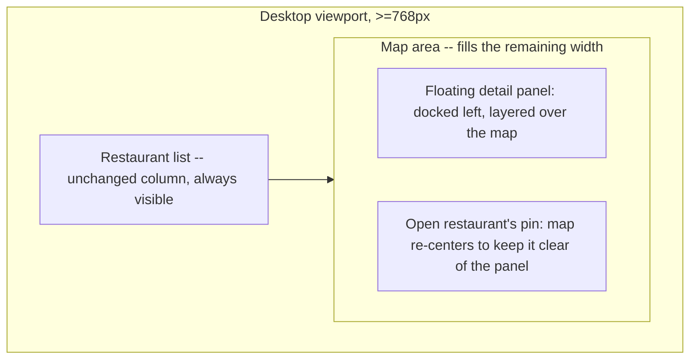

# Desktop Hover Highlight & Zoom Panel - Plan

## Goal Capsule

- **Objective:** Someone browsing restaurants on desktop can immediately see the spatial link between a restaurant in the list and its location on the map, both while scanning the list and when viewing a restaurant's details — with the mobile experience left exactly as it is today.
- **Means:** Highlight a restaurant's map pin on list hover, and replace today's full-screen restaurant-detail modal with a floating panel — docked beside the list, layered over the map — that snaps the map to a close zoom on the open restaurant and keeps it visible while reading, per the layout confirmed via visual prototyping (KD4).
- **Product authority:** This Product Contract is authoritative for scope and behavior. Planning may choose implementation but may not invent user-facing behavior, scope, or success criteria beyond what is written here.
- **Open blockers:** None — every scope question raised during brainstorming was resolved before this plan was written.

---

## Product Contract

### Summary

On desktop (≥768px), hovering a restaurant in the list highlights its pin on the map. Opening a restaurant's detail replaces today's full-screen modal with a floating panel docked beside the list, layered over the map: the map stays visible, snaps to a fixed close zoom on the restaurant, and stays there after the panel closes. Mobile is unchanged.

### Problem Frame

Today, `RestaurantList` and `MapView` already render side by side on desktop, but nothing connects them until a restaurant is actually opened — scanning the list gives no visual cue about where a restaurant sits on the map. And opening a restaurant's detail (`RestaurantDetail`, rendered through the shared `Modal` primitive) drops a full-screen dark backdrop over the whole viewport (`src/features/ui/Modal.tsx`), hiding the map entirely — so the map's spatial context around the restaurant is never visible while its details are being read, even though the restaurant's own pin is right there.

### Key Decisions

- **KD1. Hover-highlight reuses the same pin halo as an open restaurant, with no forced map pan.** (session-settled: user-directed — chosen over a visually distinct hover style and over auto-panning to reveal an off-screen pin; reconfirmed after learning the list stays interactive while a panel is open, so the two halo states can appear at once.) Governs R1, R2, R3.
- **KD2. Opening any restaurant's detail always snaps the map to one fixed, close zoom level on that point, in about 250ms, regardless of entry point.** (session-settled: user-directed — chosen over a slower swoop animation, over zooming relative to the current level, and over restricting the trigger to list-originated opens only.) Governs R4, R5.
- **KD3. The map keeps its zoomed position after the panel closes.** (session-settled: user-directed — chosen over animating back to the pre-open view, for simplicity and no state to restore.) Governs R6.
- **KD4. Desktop's restaurant detail becomes a floating panel docked beside the restaurant list, layered over the map, replacing today's full-screen modal.** (session-settled: user-directed — chosen after visually comparing a right-docked side panel, the current centered modal, a centered modal with an embedded mini-map, and a full-screen split view; refined further to dock from the left, immediately after the (unchanged) list column, with the map re-centering so the target pin stays clear of the panel.) Governs R7, R8, R9.
- **KD5. The list stays interactive while a panel is open, and closing is explicit.** (session-settled: user-directed — clicking another restaurant swaps the open panel directly rather than requiring it to close first; closing is limited to an explicit close control and Escape, rejecting a click-elsewhere-on-map affordance that risked accidental dismissal while panning.) Governs R10, R11.
- **KD6. The new desktop behavior activates at the app's existing ≥768px breakpoint.** (session-settled: user-directed — chosen over introducing a wider, dedicated breakpoint just for this panel.) Governs R7.
- **KD7. Mobile is untouched.** (session-settled: user-directed — reaffirmed explicitly as a hard constraint: the list/map toggle and the full-screen restaurant-detail sheet behave exactly as they do today below the desktop breakpoint.) Governs R3, R12.

The desktop region composition KD4 settles:

### Requirements

**Hover highlight**

- R1. On desktop (≥768px), hovering a restaurant card in the list highlights its corresponding pin on the map using the same halo styling as an open restaurant's pin. Governs: KD1.
- R2. Hovering never pans or re-centers the map, even when the hovered restaurant's pin is outside the current view. Governs: KD1.
- R3. Hover highlighting has no effect below the desktop breakpoint. Governs: KD1, KD7.

**Zoom on open**

- R4. Opening a restaurant's detail on desktop — via a list click, a map pin click, or any other existing flow that opens it — triggers a roughly 250ms map animation to a fixed, close zoom level centered on that restaurant. Governs: KD2.
- R5. The zoom always targets the same fixed level, independent of the map's zoom when the detail was opened. Governs: KD2.
- R6. After the panel closes, the map remains at its zoomed position; nothing animates it back toward the pre-open view. Governs: KD3.

**Desktop panel layout**

- R7. On desktop, opening a restaurant's detail renders a floating panel docked immediately after the restaurant list, positioned over the map rather than in its own layout column, with no full-screen dark backdrop. Governs: KD4, KD6.
- R8. While the panel is open, the map re-centers so the open restaurant's pin stays visible in the portion of the map not covered by the panel. Governs: KD4.
- R9. The restaurant list stays visible at its current width and position whether or not a panel is open. Governs: KD4.
- R10. Clicking a different restaurant in the list while a panel is already open replaces the panel's content and re-triggers the zoom onto the new restaurant, without requiring the current panel to close first. Governs: KD5.
- R11. The panel closes only via its explicit close control or the Escape key; clicking elsewhere on the map does not close it. Governs: KD5.

**Mobile (non-regression)**

- R12. Below the desktop breakpoint, the list/map toggle and the restaurant detail's current full-screen presentation are unchanged by this work. Governs: KD7.

### Key Flows

- F1. Hover preview
  - **Trigger:** The user moves the mouse over a restaurant card in the list (desktop only).
  - **Steps:** The corresponding pin gains the halo styling; moving off the card removes it; the map does not move.
  - **Covers:** R1, R2, R3.
- F2. Open a restaurant's detail
  - **Trigger:** The user clicks a restaurant in the list, clicks its pin on the map, or reaches it via another existing flow.
  - **Steps:** The floating panel opens beside the list with that restaurant's detail; the map snaps to the fixed close zoom on that point, re-centered clear of the panel.
  - **Covers:** R4, R5, R7, R8, R9.
- F3. Switch restaurants while a panel is open
  - **Trigger:** The user clicks a different restaurant in the list while a panel is already open.
  - **Steps:** The panel's content swaps to the new restaurant; the map re-runs its zoom snap on the new point.
  - **Covers:** R10.
- F4. Close the panel
  - **Trigger:** The user clicks the panel's close control or presses Escape.
  - **Steps:** The panel closes; the map stays at its current zoomed position.
  - **Covers:** R6, R11.

### Acceptance Examples

- AE1. **Covers R10.** Given a panel is open for Restaurant A, when the user clicks Restaurant B in the list, then the panel's content switches to B and the map re-zooms to B's location, with no intermediate closed state.
- AE2. **Covers R4, R5.** Given the user opens Restaurant A by clicking its pin directly on the map while already near the target zoom level, when the panel opens, then the map still runs its ~250ms snap to the fixed zoom level on that point — the behavior is uniform regardless of entry point or starting zoom.
- AE3. **Covers R6, R11.** Given a panel is open, when the user presses Escape or clicks the panel's close control, then the panel closes and the map remains at its current zoomed position; clicking an empty area of the map while the panel is open does not close it.
- AE4. **Covers R3, R12.** Given the viewport is narrower than the desktop breakpoint, when the user taps a restaurant in the list, then the existing full-screen detail sheet opens exactly as it does today, with no hover-highlight, no floating panel, and no automatic zoom.

### Success Criteria

- Manually verified in a running dev server at both a common desktop width and a common mobile width: mobile is visually and behaviorally identical to before this change (no hover effects, no floating panel, no automatic zoom), and resizing across the desktop breakpoint shows a clean cutover with no in-between visual glitch.
- The floating panel and hover halo read as one deliberate, cohesive interaction — matching the app's existing pin and card visual language rather than looking like a bolted-on overlay.

### Scope Boundaries

- Other panels built on the shared `Modal` component (Settings, Filters/Sort) keep their current full-screen presentation on every viewport; this work does not change `Modal`'s default behavior for those callers.
- Click-elsewhere-on-map-to-close and a dedicated wider breakpoint for the floating panel were both considered and rejected (KD5, KD6), not deferred for later.
- No equivalent of hover-highlight, the floating panel, or automatic zoom exists on mobile; that experience does not change at all (KD7).

### Outstanding Questions

- **Deferred to Planning:** The exact fixed zoom level and the floating panel's width/max-height are left to planning to choose, consistent with the app's existing spacing conventions (e.g. `--safe-area-floating-offset`).
- **Deferred to Planning:** Confirm the new left-docked floating panel does not visually clash with the existing right-docked Locate/zoom control stack or the top-pinned filter overlay introduced by `docs/plans/2026-09-01-0039-feat-filter-map-layout-relocation-plan.md`, since both occupy the same desktop map area.

### Sources / Research

- `src/features/ui/Modal.tsx` — the shared modal shell: full-screen backdrop, focus trap, and the `panelClassName`/`zIndexClassName`/`initialFocus` variant surface reused by every current caller.
- `src/App.tsx` — the desktop/mobile layout switch (`md` breakpoint) and the `selectedId` state that already drives both the map's "selected" pin styling and the `RestaurantDetail` modal.
- `src/features/map/MapView.tsx` — the existing per-marker "selected" halo styling (`iconForColor`/`pinHtml`) that this work's hover-highlight reuses.
- `src/features/RestaurantList.tsx` — the restaurant list cards; today's hover is a local CSS shadow change only, with no map-facing effect.
- `docs/plans/2026-09-01-0039-feat-filter-map-layout-relocation-plan.md` — a sibling plan relocating the filter overlay and Locate/zoom controls on the same desktop map area; relevant to the outstanding layout-clash question above.
